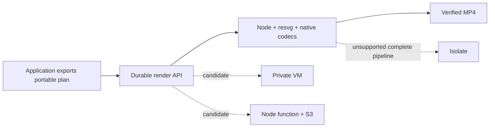

# Portable rendering: implementation evidence

**Evidence retention (2026-10-01):** Earlier `/private/tmp` benchmark evidence is unavailable. Historical measurements below are reported records, not freshly reverified results or a current public competitor claim. The [fresh October 1 study](2026-10-01-cpu-benchmarks.md) links its retained source receipts; its every-frame quality and complete cadence checks remain pending.

9 September 2026. Experimental; no production deployment qualified.

**Performance follow-up:** the [controlled local comparison](2026-09-09-portable-rendering-performance.md) adds an opt-in retained Skia backend, 45 matched-settings exports against the original renderer and Chromium Canvas/CDP, 72 passing tests and all-frame encoding-quality checks. Media-heavy speedups are 1.84–4.55× against the original implementation; the animated-shape fixture regresses by 11%, and the 512 MiB target remains unmet. The measurements below preserve the initial implementation record.

## Decision

**The browser-independent pipeline works end to end locally. Production adoption remains no-go against the RFC's current gates.** The compactness, two-host, customer coverage and economic claims are not established. This is evidence for an implementation to evaluate, not a claim that arbitrary Helios web compositions now run on tiny compute.

The new package accepts a frozen scene plan and immutable media, produces durable H.264 chunks, mixes continuous audio, verifies an MP4 and returns it through an authenticated, resumable API. CLI, browser-compatible workflow SDK, filesystem/S3 stores and VM/function deployment candidates share that boundary. The local authoring path was not redesigned.

## Observable checks

The portable suite passes 57 tests across 17 files, with TypeScript checking clean.

- Real HTTP and built-CLI service: multipart upload, submit, duplicate reattachment, conflicting-input rejection, background/step-driven execution, ranges, checksum-verified download and cancellation.
- Geometry, clipping, transforms, layout, gradients and opacity checked at known pixels. Invalid/unsupported plans, paths, media, asset identities and missing glyphs reject.
- Independent HarfBuzz oracles match glyph order and placement for Latin, Arabic, Devanagari and CJK. Additional tests cover fallback/wrapping and native/Wasm pixel equality. These are selected oracles, not full Unicode conformance.
- Three fresh preparations and thirty shuffled schedules match within/across native and Wasm for the graphics fixture. Random media seeking, exact rational PCM length and independently calculated sRGB→BT.709 luminance are tested.
- Actual SIGKILL at render, upload, manifest-commit and finalization boundaries preserves committed chunks and resumes successfully. Competing workers, expired ownership, cancellation, corrupt chunks, corrupt reused artifacts and retry exhaustion have separate checks. The RFC's ten repetitions per fault on B05/B06 have not been performed.
- Eight targeted source mutations were killed by tests: color transfer, stale-worker fencing, exclusive storage commit, Arabic direction, range position, S3 compare-and-swap, conflicting idempotency input and output frame count. This is a targeted check, not a repository-wide mutation coverage score.
- All 450 current core source tests pass. Existing renderer orchestration planning, stream-copy arguments and seek-driver determinism pass; the last used installed Chrome through a temporary test copy changing only its executable path. The default Playwright shell is absent. A broader core command also picked up stale built `dist` tests and reported seven failures there; source tests were then run independently. No unrelated core files were changed.

## Local corpus results

One exploratory native run per synthetic fixture on macOS arm64 / Node 22.12.0. These measurements precede the final Node-compatible SVG-parser pin and dependency-fingerprint hardening; the complete test suite and reduced smoke corpus are rerun after those packaging changes. FFmpeg 8.0.1. Times include local durable upload, preparation, chunk execution and finalization through persisted output. They exclude fixture generation and subsequent download/oracle inspection. Jobs ran on a shared developer machine with other testing, without pinned CPU, a Chromium baseline, controlled cold/warm repeats or billed cloud resources. Do not use these numbers as a speedup or price claim.

The table's sampled RSS includes the benchmark worker, codec descendants and post-render oracle inspection. B06 uses the improved measurement split, and a separate B01 calibration measures only the active production pipeline: **660.5 MiB**, above 512 MiB. RSS was sampled every 200 ms and can miss brief peaks. Earlier diagnostic runs before bounded codec threads and PNG/cache improvements are retained separately outside the repository.

| Case | Frames | Video duration | Submit-to-durable-output | Peak including inspection | Result |
| --- | ---: | ---: | ---: | ---: | --- |
| B01 | 450 | 15 s | 10.75 s | 784.6 MiB | Complete |
| B02 | 1800 | 60 s | 139.18 s | 717.1 MiB | Complete |
| B03 | 900 | 30 s | 20.85 s | 725.8 MiB | Complete |
| B04 | 1800 | 60 s | 153.38 s | 710.1 MiB | Complete |
| B05 | 1800 | 60 s | 225.17 s | 703.2 MiB | Complete |
| B07 | 1798 | 59.993 s | 37.04 s | 713.6 MiB | Complete |
| B08 | 900 | 30 s | 333.05 s | 746.5 MiB | Complete |
| B06 | 18,000 | 600 s | 1794.06 s | 705.1 MiB | Complete |

B01–B08 also have reduced 360p/90-frame smoke runs. B08 exercises the combined node/keyframe/depth envelope, a 16 MP still, two video layers and four tracks; it does not separately qualify every maximum media dimension or adversarial decoder input. These generated scenes are engineering probes; they are not substitutes for the owner-selected B12 customer compositions. See [the corpus registry](../../packages/portable/benchmarks/cases.json).

## Footprint and deployment evidence

The initial function candidate's pinned Linux x64 FFmpeg, ffprobe and native resvg binaries alone occupy **50.47 MiB in a gzip-9 archive**. This excludes Node, JavaScript, Wasm, the adapter, operating system and content assets. It already misses the complete ≤50 MiB target. Content fonts/media are reported separately rather than hidden in runtime accounting.

A bounded reduced-codec build from FFmpeg 8.0.1 passes all eight reduced smoke fixtures, including video, images, text, audio and finalization. The VM candidate now builds this profile from checksum-pinned source. It removes unused codecs, demuxers, network protocols and filters. Its local macOS codec binaries plus libx264 are approximately 4.6 MiB compressed, excluding graphics, Node and system libraries. That is a component measurement on a different build/platform, not a qualified complete-runtime size or cross-platform percentage reduction. See `scripts/build-codecs.sh`. Its first test detected missing PNG/JPEG demuxers; all eight fixtures passed after those were enabled. The Vercel candidate still uses its pinned full static codecs.

The final generic VM package and Vercel/S3 package install independently with strict engine compatibility checking. All exported modules load, and the standalone VM package produces a verified six-frame MP4. Rendering fingerprints include resolved dependency manifests and their transitive versions; the final smoke corpus passes after this hardening. The Vercel configuration validates against the published schema. Its remote Linux build verifies codec hashes and executes codec/native-rasterization probes. Native binaries must be built/traced for the deployment architecture; a macOS local Vercel build does not qualify Linux.

No account was provisioned. The human-run [private VM wizard](../../packages/portable/scripts/setup-private-vm.sh) and [Vercel/S3 wizard](../../packages/portable/scripts/setup-vercel-s3.sh) were syntax-checked and preserve the shared wizard library. They capture public IDs and keep authentication with provider login/OIDC. ShellCheck is not installed. Docker was requested to start but its daemon remained unresponsive to bounded checks, so no Linux image was run locally. Live S3 conditional behavior, cloud restart/timeouts, bundle execution and host memory limits still require deployed tests.

Vercel's [runtime limits](https://vercel.com/docs/functions/limitations) and [AWS OIDC integration](https://vercel.com/docs/oidc/aws) inform the function adapter and wizard. The [Flycast private-app procedure](https://fly.io/docs/blueprints/private-applications-flycast/) informs the VM example. These are candidate host instructions, not empirical support claims.

## Go/no-go matrix

| Gate | Current result | Required evidence still missing |
| --- | --- | --- |
| S1 · SaaS service | Partial | Portable API works; the existing scheduler's frozen HTML composition has not been delegated through this service |
| G1 · Coverage | Not qualified | Full required matrix, ten real B12 compositions and frozen web-route regressions |
| G2 · Fidelity | Partial | Selected pixel/text/color/media checks pass; complete independent corpus oracles and encoded quality thresholds remain |
| G3 · Determinism | Partial | Selected fresh/shuffled/native-Wasm checks pass; all corpus schedules and deployed cross-build comparisons remain |
| G4 · Timing | Partial | Rational samples/counts and chunk coverage pass; complete decoded audiovisual event measurements remain |
| G5 · Recovery | Partial | Four real kill boundaries pass on a small fixture; repeated B05/B06 fault study remains |
| G6 · Operations | Not qualified | 1,000-run study, saturation, retention, quotas, storage limits, deployed cancellation and timeout budgets |
| G7 · Integration | Not qualified | Independent application integrator trials and exporter burden measurements |
| G8 · Economics | Unmeasured | Efficient Chromium comparator, billed cost, repeated cold/warm and concurrency conditions |
| P1 · Complete execution | Local native evidence | Actual deployment runs; Wasm rasterization alone is not a complete Wasm pipeline |
| P2 · Host fit | Unmeasured remotely | VM/function resource ceilings, cold start, packaging, disk and timeout behavior |
| P3 · Two compute classes | Not qualified | Same frozen plans/assets and shared source revision on two independently deployed classes |
| P4 · Compact runtime | Target missed in initial build | Complete payload and ≤512 MiB working memory across corpus; reduced-codec candidate needs fresh accounting |

## Scope still outside the implementation

The new backend does not accept arbitrary HTML/CSS/React/Canvas compositions. It does not manage a Chromium web worker, automatically export an existing SaaS editor, ingest arbitrary unnormalized media, provide a complete Wasm codec pipeline, or run on an isolate. Existing web composition rendering remains available through the existing Helios renderer. In particular, the scheduler example currently generates HTML and embeds render commands; the new portable workflow example is not evidence that this existing integration has migrated.

The service performs chunks serially within a job. Multiple jobs can execute on separately provisioned workers, but multi-worker saturation and fleet scheduling are unqualified. Storage has no automated garbage collection, per-tenant quota or backup service. Engine upgrades require draining old jobs on their original build. These limits keep the current artifact experimental rather than production-ready.

## Reproduce and inspect

The [package guide](../../packages/portable/README.md) contains CLI/API examples, the implemented feature matrix, test and benchmark commands, deployment instructions and operational boundaries. Raw JSON, videos, screenshots and mutation logs are held outside the repository. A visual implementation report links the playable outputs and separates measured evidence from pending gates. Its local links and embedded JavaScript syntax pass static checks; the browser URL policy blocked opening the local HTML for visual layout verification.

The Vercel candidate admits at most 60 seconds and applies a 450 MiB estimated scratch budget before finalization. Longer or media-heavy jobs may receive `HOST_LIMIT`; this candidate cannot qualify the full ten-minute B06 workload. The VM profile retains the ten-minute scene limit. The scratch estimate is an admission guard, not a proof of the host’s disk ceiling.
