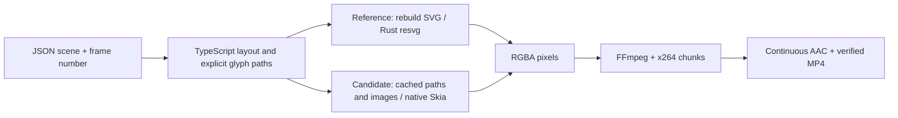

# Portable rendering: local performance work

**Evidence retention (2026-10-01):** Earlier `/private/tmp` benchmark evidence is unavailable. Historical measurements below are reported records, not freshly reverified results or a current public competitor claim. The [fresh October 1 study](2026-10-01-cpu-benchmarks.md) links its retained source receipts; its every-frame quality and complete cadence checks remain pending.

Status: local performance comparison complete; full-length follow-up complete. The retained native Skia path is opt-in. The original resvg default remains available. No production, cost or cloud gate is qualified by these local measurements.

## Architecture and important code

TypeScript/Node owns the data contract, seeking, layout, asset verification, durable jobs and API. Fontkit shapes explicit composition fonts into glyph paths. The original rasterizer is resvg, implemented in Rust. The new candidate calls native Skia (C++) through a Rust Node-API binding. Both use FFmpeg and libx264 for H.264 plus a continuous AAC audio track. A browser is not part of either native pipeline. The [pinned native binding](https://github.com/Brooooooklyn/canvas/tree/v1.0.9) exposes Skia through Node-API; its [context implementation](https://github.com/Brooooooklyn/canvas/blob/v1.0.9/src/ctx.rs) also explains why resetting the recorded frame matters.



The original hot loop reconstructs the rasterizer for each frame:

```ts
const svg = frameSvg(plan, index, prepared);
const renderer = new Resvg(svg);
for (const href of renderer.imagesToResolve()) {
  renderer.resolveImage(href, encodedImageBytes);
}
const pixels = renderer.render().pixels;
```

The candidate retains decoded assets and compiled glyph paths:

```ts
const scene = new SkiaRasterizer(plan, prepared);
await scene.prepare();              // Decode still images once.
scene.setVideo(id, rgba, width, height); // Raw decoded video pixels.
const pixels = scene.render(frame).pixels;
encoder.stdin.write(pixels);
```

Video decoding now offers `-f rawvideo -pix_fmt rgba`, avoiding the original PNG encode/decode round trip. The same color conversion, frame indices, encoder quality, verification and durable commit rules still apply. Group opacity uses an isolated surface so overlapping children are composed before opacity is applied.

The change targets repeated native drawing work. It is not a TypeScript-to-Rust rewrite: the measured bottleneck was already in native rasterization. The API and scheduler remain TypeScript.

## Profile that motivated the change

Ninety consecutive 1080p frames, one exploratory local pass, excluding final video encoding:

| Fixture | resvg rasterization | TypeScript frame evaluation + SVG parsing |
| --- | ---: | ---: |
| B01 · Typography | 0.346 s | 0.062 s |
| B02 · Product explainer | 4.859 s | 0.031 s |
| B03 · 1,000 rectangles | 0.555 s | 0.184 s |
| B05 · Two videos | 8.019 s | 0.014 s |
| B08 · Stress scene | 28.013 s | 0.360 s |

These are stage timings, not an end-to-end speedup claim. The controlled study compares saved MP4 outputs with matched software encoder settings and separate memory measurements.

## Controlled comparison contract

Five-second windows from B01/B02/B03/B05/B08, full 1080p dimensions, three fresh processes per renderer, alternating renderer order and one job at a time. Original full-duration keyframe values are preserved at the window endpoint for these linear corpus motions. Assets are identical by digest. All variants use x264 fast, CRF 18, two encoder threads, no B frames, a 90-frame GOP/chunk size, continuous AAC at 192 kbit/s, verified frame counts and durable artifact publication.

Chromium uses the same drawing interpreter and pre-shaped glyphs, browser-native video seeking and lossless CDP PNG capture. It is a controlled native-versus-browser canvas comparison, not an arbitrary HTML/React workload, the existing Helios web renderer or a WebCodecs/hardware-encoder comparison. Browser bundle setup is included in service time. Initial Node module loading is excluded; the whole-process measurement includes startup and the post-render oracles. OS caches and other host activity are not controlled.

The reference and candidate source snapshots, raw JSON, samples and MP4s are outside the repository. Different rasterizers have different edge antialiasing and byte-alpha rounding. Fidelity statistics and sample images accompany the performance results. Existing resvg native/Wasm exact-match behavior remains available.

## Results: complete five-second exports

Apple M3 Pro (11 logical CPUs), 18 GiB RAM, macOS arm64, Node 22.12.0, FFmpeg 8.0.1 and local Chrome 152.0.7977.83. All 45 exports succeeded. Values below are medians of three runs, measured through verified durable output, not frame-render-only timings.

| Workload · 150 frames at 1080p/30 | Original resvg | Retained Skia | Chromium Canvas/CDP | Skia vs original |
| --- | ---: | ---: | ---: | --- |
| B01 · Multilingual typography | 4.07 s | 3.96 s | 8.10 s | Near parity (2.6% shorter) |
| B02 · Product explainer | 13.24 s | 6.02 s | 11.78 s | 2.20× faster |
| B03 · 1,000 animated rectangles | 3.61 s | 4.00 s | 9.33 s | 11.0% slower |
| B05 · Two video layers | 19.25 s | 10.44 s | 13.84 s | 1.84× faster |
| B08 · Combined stress scene | 54.95 s | 12.07 s | 14.40 s | 4.55× faster |

The media-heavy workloads improve by **1.84–4.55×** against our original implementation. Typography is near parity. The shape workload regresses by 11%; Skia's different subpixel edges produce a 955,098-byte output versus 417,126 bytes for resvg at the same CRF. Its encoding and finalization phases take longer. This is evidence of an encoding tradeoff, not permission to claim a universal speedup. Keep resvg available and do not change the default on this evidence alone.

These are matched settings and scene semantics, not byte-identical rasterizers. Chromium has additional browser video/color/filtering differences described below. Its comparator includes browser setup, native video seeking and lossless CDP capture, and shares the portable interpreter and native encoder. It does not measure the existing Helios HTML renderer or the fastest possible Chromium export.

### Memory and size

Maximum sampled **sum of renderer/descendant RSS** across the three timed runs, excluding post-render oracle work where the IPC timing boundary is observed. RSS samples can miss brief peaks and count shared pages in multiple processes; these are not enforced memory-budget tests.

| Workload | Original | Skia | Chromium |
| --- | ---: | ---: | ---: |
| B01 | 795.6 MiB | 772.8 MiB | 1665.1 MiB |
| B02 | 729.0 MiB | 758.2 MiB | 1690.0 MiB |
| B03 | 699.3 MiB | 702.0 MiB | 1668.5 MiB |
| B05 | 719.8 MiB | 748.4 MiB | 1657.8 MiB |
| B08 | 796.3 MiB | 924.9 MiB | 1731.5 MiB |

Resetting output/video drawing history reduced B08 from ~1,967 MiB in the first Skia candidate to 925 MiB in the corrected candidate. A separate 600-frame, 640×360 drawing-history experiment, with identical event-loop yields and explicit GC in both variants, showed growth from frame 49 to 599 fall from **509.4 MiB to 18.7 MiB**. The corrected process leveled off around 228 MiB. This isolates recorded frame retention; it is not a complete pipeline memory claim.

The optimized pipeline still misses the proposed 512 MiB target, and its stress-scene memory is higher than original resvg. The macOS arm64 Skia binding alone adds **27,953,136 bytes uncompressed / 12,330,836 bytes gzip-6** (26.7 / 11.8 MiB). This excludes Node, JavaScript, resvg, codecs, assets and system libraries. No complete <=50 MiB runtime or Linux/function deployment has been qualified.

### Correctness evidence

- **72 tests pass** across rendering, geometry, explicit fonts, media, color, HTTP/SDK/CLI, persistence, tenant isolation, cancellation and recovery. Both native choices pass real process-death tests at render/upload/commit/finalization boundaries. The strengthened Skia cases contain video, a still image and shaped text, and require the recovered MP4 checksum to match a separate clean render.
- **Five targeted mutations were killed**: group-opacity isolation, caching animated content, rectangle placement, video frame selection and identity image filtering. This is selected critical-logic coverage, not a whole-package mutation score.
- All **750 decoded output frames** in the five repeated-zero videos pass the RFC's encoding-quality gates against independently regenerated uncompressed frames after the identical pinned YUV420 conversion. The worst frame has luma SSIM **0.997488** (gate 0.995), luma PSNR **45.06 dB** (gate 40) and chroma-plane PSNR **45.81 dB** (gate 35).
- Across 15 uncompressed Skia/resvg samples, mean absolute RGB error is at most **0.3374 / 255**; at least 99% of channel differences are at most **5 / 255** in each sample. Across all encoded frames, the minimum Skia/resvg luma SSIM is **0.995548**; minimum luma PSNR is **38.44 dB**. Cross-renderer differences are separate from codec-loss gates.
- Chromium comparisons expose different video color/filtering: sampled mean RGB error reaches **1.4152 / 255**, and the worst encoded cross-renderer luma PSNR is **36.66 dB**. No exact Chromium fidelity claim is made.
- A post-comparison correction disables interpolation for a provably unscaled image copy at integer coordinates. An exact-pixel test failed before the correction and passes after it. None of the five timing fixtures uses that branch; all ten sampled corpus frames remain byte-identical. The exact measured source snapshot is retained separately from the final source.
- Production source and all benchmark TypeScript checks pass. A freshly installed npm tarball renders a verified H.264/AAC clip with Skia outside the monorepo. The Vercel template includes the Linux Skia binding and a build-time pixel/reset smoke; its remote build has not been executed.

## Remaining bottlenecks and decision

The original media-heavy profiles spent 97–98% of frame-generation work in native rasterization. Caching decoded images, glyphs and a static initial layer sequence removes repeated work; raw RGBA avoids a PNG round trip. Resetting native drawing history bounds frame retention. A direct rectangle operation reduces TypeScript-to-native calls.

After those changes, full-resolution image compositing, copying/transporting RGBA, software H.264 encoding, asset preparation and final verification still cost time. An entire TypeScript-to-Rust rewrite has not been justified by the profile. Integrating the native compositor and encoder around a reusable frame buffer is a plausible further experiment, but its gain and complete portability are unmeasured.

**Go for explicit Skia evaluation on media-heavy portable scenes. Hold a default switch because of the shape regression and rasterizer differences. No-go for a compact-runtime or production-portability claim:** memory/package targets and actual host/customer/economic qualification remain open. This work improves local native execution of the production backend; it does not establish cloud pricing.

## Full-length final build

All eight full-size synthetic fixtures passed: **27,448 frames**, including the ten-minute / 200-chunk composition. This is one follow-up run per fixture with sampled process-tree RSS; it is not a paired comparison with the earlier full-corpus measurements.

| Fixture | Frames | Video duration | Complete render workflow | Sampled render RSS |
| --- | ---: | ---: | ---: | ---: |
| B01 | 450 | 15.00 s | 10.75 s | 788.8 MiB |
| B02 | 1,800 | 60.00 s | 55.35 s | 803.7 MiB |
| B03 | 900 | 30.00 s | 22.38 s | 717.6 MiB |
| B04 | 1,800 | 60.00 s | 95.74 s | 703.9 MiB |
| B05 | 1,800 | 60.00 s | 120.53 s | 770.6 MiB |
| B06 | 18,000 | 600.00 s | 903.31 s | 812.2 MiB |
| B07 | 1,798 | 59.99 s | 37.25 s | 733.3 MiB |
| B08 | 900 | 30.00 s | 66.20 s | 929.6 MiB |

B06's 903.31-second workflow includes **822.26 seconds rendering chunks** and **79.51 seconds finalizing**. The separate whole-process value of 936.41 seconds includes post-render oracle checks and must not be substituted for delivered render time.

The fractional-cadence B07 audit found all 60 flashes at their exact requested frame indices across 1,798 frames. Maximum decoded audio-impulse error against the source sample schedule was **0.167 ms**. Actual audio/video event offset reaches **16.613 ms** because integer-second flashes are rounded to the 30000/1001 fps frame grid. Do not claim blanket <=10 ms A/V alignment: the strict mutual-offset interpretation of G4 is not met by this fixture. Exact requested-frame execution and cross-media alignment are separate facts.

The strengthened media/text/image crash-recovery checks pass at all four boundaries, with recovered MP4 checksums identical to separate clean runs. All eight Skia smoke fixtures also pass using the locally reduced FFmpeg/ffprobe build. Those smoke timings ran alongside functional checks and are not performance comparisons; their sandboxed RSS measurements are unavailable.

## Further experiment: pre-resizing decoded video

A B05-only prototype moved Mitchell-style resizing and center cropping into FFmpeg, then supplied larger, unscaled RGBA surfaces to Skia. On 90 frames, drawing fell from 3.086 seconds to 0.479 seconds, but decode/handoff increased from 0.368 seconds to 1.562 seconds. Sampled RGB differences against the retained Skia path stayed within 4/255.

**Rejected for integration:** three full five-second exports had a median of **10.22 seconds**, versus **10.44 seconds** for the retained Skia candidate. Maximum sampled RSS rose from **748.4 MiB to 1,064.3 MiB** (+42%). The small end-to-end gain does not justify the portability/memory regression. The hard-coded prototype and its source/results remain outside the repository at `/private/tmp/helios-resize-experiment`, `/private/tmp/helios-resize-profile` and `/private/tmp/helios-resize-endtoend`.

The final pipeline profile (`--encode --no-samples`, 90 frames, one exploratory pass) distinguishes the remaining limits:

| Fixture | Decode / handoff | Drawing / pixels | Encoder-input wait + final drain |
| --- | ---: | ---: | ---: |
| B01 · Text | 0.001 s | 0.279 s | 1.362 s |
| B02 · Explainer | 0.176 s | 0.738 s | 1.142 s |
| B03 · Shapes | 0.004 s | 0.317 s | 1.393 s |
| B05 · Two videos | 0.368 s | 3.086 s | 1.275 s |
| B08 · Stress | 0.462 s | 3.759 s | 1.211 s |

Encoder work overlaps production of frames. Input wait measures backpressure and transport, not an isolated FFmpeg CPU sample. These profiles exclude durable workflow/audio finalization and are not interchangeable with the complete-export comparison.

## Raw evidence locations

- Controlled 45-run comparison, frame samples, MP4s and per-frame quality stats: `/private/tmp/helios-compare-final`.
- Original source: `/private/tmp/helios-perf-baseline/packages/portable`.
- First Skia source: `/private/tmp/helios-perf-skia-measured/packages/portable`.
- Exact measured final candidate before the identity-copy correction: `/private/tmp/helios-perf-final-measured/packages/portable`.
- Stage profiles: `/private/tmp/helios-portable-profile-before` and `/private/tmp/helios-portable-profile-final`.
- Critical-logic mutation logs: `/private/tmp/helios-skia-mutations`.
- Fresh package installation: `/private/tmp/helios-portable-package-smoke`.

Temporary locations are local evidence, not source-controlled verification artifacts. The accompanying visual report copies the principal JSON, images and playable outputs into the task's visualization directory.

## Reproduce

```sh
node --import tsx packages/portable/benchmarks/profile.ts --out /tmp/portable-profile
node --import tsx packages/portable/benchmarks/profile.ts --rasterizer skia --out /tmp/portable-profile-skia
node --import tsx packages/portable/benchmarks/profile.ts --rasterizer skia --encode --no-samples --out /tmp/portable-pipeline-profile
node --import tsx packages/portable/benchmarks/compare.ts --reference /absolute/baseline/packages/portable --assets /absolute/frozen/assets --frames 150 --repeats 3 --out /tmp/portable-comparison
```

For all-frame encoded quality and cross-renderer samples, run `node --import tsx packages/portable/benchmarks/quality.ts --out /tmp/portable-comparison --assets /absolute/frozen/assets`. It preserves per-frame SSIM/PSNR statistics and exits unsuccessfully if the codec-loss gates fail.

The comparison script accepts `--chrome`, `--cases`, `--variants`, `--ffmpeg` and `--ffprobe`. It requires a local Chromium executable and permission to bind an ephemeral loopback asset server. No service account is required.
