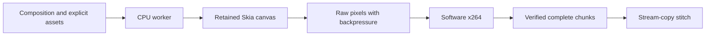

# CPU rendering benchmark goal

**Evidence retention (2026-10-01):** Earlier `/private/tmp` benchmark evidence is unavailable. Historical measurements below are reported records, not freshly reverified results or a current public competitor claim. The [fresh October 1 study](2026-10-01-cpu-benchmarks.md) links its retained source receipts; its every-frame quality and complete cadence checks remain pending.

Current goal status: **active**. The local three-engine CPU study has closed its worker ledger with 58 accepted exports, one failure and one unstarted slot, and its fresh 96-row encoder-thread screen is running with a completion watcher. The [qualification and screening records](2026-09-30-three-engine-cpu-qualification-results.md) preserve the every-frame audits, original timers and failed attempts. Fresh paired holdouts and broader workload evidence remain required before superiority claims. Remote compact-source transfer and isolated controller updates retain their destination-specific authorization gates; production scheduler rollout and existing-evidence deletion have separate pending approvals. Orbs requires actual Amp CLI sign-in. None of those gates prevents the admitted local work, and the full objective remains incomplete.

The authorized goal is to outperform fframes on CPU-only local and distributed server rendering while preserving frame completeness, deterministic seeking and output quality. This work enables V2 workers that can render without a browser or GPU.

The [published-claim audit](2026-09-30-fframes-claimed-benchmark-audit.md) establishes that existing wins apply to capped profiles, not upstream's published M4 Max configuration or its best tuned configuration. Fourteen new CPU exports show that automatic encoder threading materially improves local fframes ultrafast performance. Independent worker/encoder tuning for both engines remains required for the broader goal; those new settings audits are not paired or quality-qualified superiority evidence.

The independent local tuning sweep completed successfully under `/private/tmp/helios-fframes-goal/tuning-local-20260930`: twelve worker/thread profiles for each engine at both presets, CRF11, forty-eight timed full exports, four excluded warmups, alternating engine order and ten-second cooldowns. The actual process exit status matches the terminal record. All forty-eight exports contain 300 decoded frames, actual encoder parameters match the requested profiles, frozen source hashes remain unchanged, and temporary videos are gone. Screening does not establish codec-loss qualification or a repeated superiority claim. These completed exports will not be rerun. The goal remains active.

The holdout runner outside the repository at `tuning-local-20260930/run-finalists.py` completed successfully: twenty-four timed exports and four excluded warmups. It locked the two fastest screened fframes candidates per preset before new timings and paired each with the fastest screened Helios worker count at the same encoder-thread setting. Three fresh pairs qualify each candidate. Medium candidates use fframes/Helios worker counts of 6/4 at two encoder threads and 8/4 at four threads; ultrafast candidates use 11/4 at sixteen threads and 8/4 at four threads. Every new output hash receives an independent 300-frame oracle; byte-identical repeats reuse only that hash's verified records. Acceptance checks compare actual x264 builds and recorded parameters, enforce ordered SSIM/PSNR records and every-frame thresholds, and revalidate retained quality files and frozen source hashes. The actual process exit is zero and matches the terminal metadata; the one-shot watcher queued exactly one completion. All temporary render directories are gone. Full results are under `tuning-local-20260930/finalists` and summarized in the [rendering results](2026-09-30-cpu-rendering-results.md).

The holdout command wrapper now isolates each render or verification in its own process group. Timeout and interruption stop only that owned group, preventing leftover encoder or oracle processes from contaminating subsequent measurements. A deliberately stalled parent and descendant both emit actual macOS exit events after timeout; normal command completion remains intact. Compiled rendering inputs remain unchanged. The wrapper and checks remain outside the repository.

The independent retained-evidence audit at `tuning-local-20260930/audit-finalists.py` passes all twenty-four outputs and twelve pairs. It verifies successful actual process exit, reconstructs the locked selection from frozen screening evidence, checks recorded source/font hashes and equality of retained worker copies, reparses eight unique sets of 300-frame quality records, and recomputes both timer formulas from preserved components. These eight hashes qualify 7,200 output-frame references; no codec-loss gate is replaced by an aggregate flag. Helios wins eleven of twelve paired renders and eleven of twelve service comparisons. Ratios of median render times are 1.158× and 1.275× for the two medium profiles, 2.172× and 1.219× for ultrafast. The four-thread ultrafast profile loses one pair; substantial variation and uncontrolled load prevent a universal optimum claim. Two valid timer examples pass; six corrupt timer or frame-repair examples and an unqualified completion record are rejected. The independent audit changes no original timers and launches no exports.

A separate confirmation study has completed under `tuning-local-20260930/confirmation-20260930`, exit zero, with twenty timed exports and four excluded warmups. Selection is explicitly post-hoc: profiles with a paired loss or a smallest paired lead at most 1.02, namely medium H4/F6 with two encoder threads and ultrafast H4/F8 with four threads. Five fresh pairs each qualify; Helios wins all ten render and service pairs. Medium render medians are 15.837/20.273 seconds (ratio of medians 1.280×), ultrafast 5.023/10.109 seconds (ratio of medians 2.012×); final-decode-inclusive ratios of medians are 1.152× and 1.894×. All twenty outputs receive complete decode, strict verification and actual encoder checks. Four exact video hashes reuse copied, reparsed complete oracle records from the completed holdout, qualifying all 6,000 output-frame references. Original screening/holdout timers and frozen artifacts are preserved, and temporary render directories are gone. The strengthened independent confirmation audit binds copied oracle records and exit receipts to frozen originals, checks actual requested encoder settings and engine-specific timer boundaries, and passes all twenty rows. Seventeen deliberate corruptions are rejected in its separate preflight checks. The actual process receipt agrees with the watcher, which queues one completion. Keep this study separate because post-hoc selection and oracle reuse change untimed cache/load history; the earlier loss and substantial variation remain evidence. The goal remains active pending remote component/compact qualification and production service work.

The prospective three-engine comparison uses the median of within-pair time ratios as its primary statistic and reports absolute medians and ratios of medians separately. Historical ratios and receipts remain unchanged. The historical local manifests bind recorded renderer/scene/font/binary hashes but not every temporary adapter, timed worker wrapper or runtime dependency with prespecified hashes; equality checks on retained worker copies do not establish complete historical source closure or public fresh-build reproduction.

## Acceptance

- Given fframes commit `bacfc3c3212d3d9429468435bfdc1ae2a21c7b3b`, render its exact TextGrid workload: 3334 nodes per frame, 300 frames, 1920×1080 at 30 fps, DM Sans Regular 10px, identical labels, trigonometric positions, opacity rounding and RGB colors. All attributes must change exactly as in the original scene.
- Given identical hardware, compare software x264 medium and ultrafast using interleaved fresh processes. Measure the published CRF18 configuration first; if it fails the existing codec-loss gate, qualify a separately disclosed configuration with the same CRF for both engines. Disclose other codec settings, FFmpeg builds, rasterizers, color conversion and timing boundaries. Check decoded frame count, cadence and dimensions outside the render timer.
- Given the existing portable scenes, compare frozen old/new source on representative typography, primitives and media. Report regressions. Changes to quality, skipped frames and removed verification cannot count as speedups.
- Given translucent glyphs, preserve overlapping glyph composition, nested opacity, clips, transforms, offscreen ink and shuffled frame seeking. Cropped surfaces may differ by at most two channel levels at antialiased edges against full-frame Skia isolation; codec quality gates remain those in `packages/portable/benchmarks/PERFORMANCE.md`.
- Given chunks running concurrently or retried on a fresh server, mutable surfaces and video frames must remain independent and every frame must be derivable without replaying prior frames.
- A local result does not establish Linux or remote-server superiority. Both require measurements before the goal is complete.

## Implementation direction

Measure retained native drawing before considering a rewrite. Bound text opacity surfaces to transformed ink. Keep one reusable scene session for sequential durable chunks and independent sessions for concurrent work. Evaluate an explicit trusted Canvas2D composition API for existing drawing functions to run on CPU Skia, stream raw pixels to software FFmpeg, and expose exact half-open ranges for stateless workers. Executable callbacks must never become accepted portable JSON input.

Raw source snapshots, builds, profiles and rendered evidence live outside the repository at `/private/tmp/helios-fframes-goal`. The existing web renderer remains necessary for DOM, CSS and browser-only integrations.

## Implemented and verified

The retained Skia backend now bounds translucent-text isolation to transformed glyph ink rather than copying a full viewport for each label. It retains the existing shaping, clipping and group-opacity semantics; tests allow a maximum two-level difference at antialiased edges against full-frame Skia isolation.

The separate trusted Canvas API runs installed frame drawing functions on persistent CPU canvases. Isolated worker processes retain fonts and surfaces across assigned ranges, seek directly to each range, stream raw pixels with backpressure, and stitch ordered chunks without re-encoding. Fresh internal chunks receive packet-count checks; final delivery retains full decode verification. Both single-process and pooled exports preserve an existing destination on failure or cancellation. The JSON admission envelope and existing web renderer are unchanged.

Software encoder controls allow an explicit comparison profile. Normal exports keep their original BT.709 conversion and codec defaults. The TextGrid comparison selects direct BT.601 component conversion to match upstream and discloses the remaining SVG/Canvas rasterization and chroma-sampling differences. Native Canvas and tiny-skia output are not pixel-identical.

The harness extracts the pinned original scene into a CPU-only fframes binary, requires the exact upstream DM Sans bytes, checks decoded frame count/cadence/dimensions/duration, and checks actual x264 parameters from the encoded bitstream. It records process time excluding full decode verification and service time including one full final decode for each engine. Its optional upstream ultrafast edit-list workaround preserves the incomplete original, remuxes without re-encoding, includes that cost, and rejects any result that still fails to decode all 300 frames.

The quality oracle regenerates all 300 frames independently for each engine. Helios uses its exact production color conversion. The fframes oracle uses upstream CPU `render_frame` and its own native YUV converter, including top-left chroma sampling. CRF18 failed Helios' existing per-frame quality gate; CRF12 passed Helios but fframes narrowly missed luma SSIM (0.994967 versus 0.995). At CRF11 both engines pass both presets. These configurations must remain separate from upstream's published CRF18 table.

The portable package builds and all 94 tests pass, including real HTTP, cancellation/recovery, shuffled seeking, explicit-font lifetime, codec settings and compiled process workers. The HTTP integration test needs loopback permission; its sandbox timeout reproduced on the frozen baseline and passed with that permission. Three targeted mutants were killed: accepting the frame after the timeline, rendering every seek as frame zero, and omitting final decoded-frame-count validation. Mutation coverage is targeted rather than exhaustive.

## Qualified local measurements

The host is an Apple M3 Pro with 11 logical CPUs and 18 GiB RAM, running macOS arm64 and Node 24.19.0. Both engines use four workers and two threads per software x264 encoder, CRF11, GOP24, and matched actual x264 parameters. Measurements alternate fresh processes for five pairs per preset; compilation is excluded and OS caches are uncontrolled. Both local encoders report x264 core 165 r3222 b35605a, although their FFmpeg builds differ.

| Preset | Helios render median | fframes render median | Render ratio of medians | Helios with final verification | fframes with final verification | Ratio of medians with final verification |
| --- | ---: | ---: | ---: | ---: | ---: | ---: |
| medium | 13.48 s | 19.22 s | 1.43× | 24.39 s | 31.59 s | 1.30× |
| ultrafast | 5.52 s | 11.39 s | 2.06× | 9.06 s | 15.58 s | 1.72× |

Helios wins all five render pairs on each preset. All twenty outputs decode exactly 300 frames at 1920×1080, 30 fps and 10 seconds. The ultrafast fframes time includes its disclosed edit-list remux. Each engine passes the same all-frame codec-loss gate against its own uncompressed oracle. The quality-qualified seed files are byte-identical to the corresponding first-pair benchmark files, recorded with SHA256 in the evidence. Minimum per-frame luma SSIM is 0.996589/0.996150 for Helios medium/ultrafast and 0.995836/0.996298 for fframes; all luma/chroma PSNR gates pass. Rasterizer equivalence is a separate limit, not established by these codec-loss checks.

These results beat the pinned upstream CPU implementation on this host and workload. They do not compare against upstream's published M4 Max machine or establish an advantage at the published CRF18 setting. A subsequent one-pair medium run sampled numeric process-tree RSS every 200 ms: Helios peaked at 2402 MiB and fframes at 1247 MiB. macOS RSS sums can include shared mappings, and Helios final verification is inside its process tree while fframes external verification is outside. This is neither a repeated memory comparison nor a Linux cgroup measurement; no memory improvement is claimed. Both resulting video hashes exactly match their previously quality-qualified outputs. Evidence is in `/private/tmp/helios-fframes-goal/resource-profile/resource-summary.json`.

The existing durable-job corpus used three alternating old/new Skia runs per scene, 150 frames each, at unchanged production fast/CRF18/BT.709 settings. All thirty exports passed completeness checks. Old/new median seconds were B01 3.936/3.929, B02 5.692/5.693, B03 4.033/4.022, B05 9.588/9.566 and B08 11.087/10.996. These are effectively unchanged, with every median within 1%. Decoded PNG samples at frames 0, 75 and 149 are exact for B01/B02/B03/B05; B08 differs in twenty channels by at most one level per sample. This corpus shows no material measured regression, not a universal speedup.

The targeted drawing-only benchmark uses 200 labels over twenty frames and three alternating repetitions. Translucent text improves from 8.331 s to 0.269 s (30.98×), excluding preparation and encoding. Two full raw-frame samples differ by at most two channel levels. Opaque text is exact and measures 0.176/0.183 s (3.6% slower in this short microbenchmark); it does not benefit from the cropped-opacity optimization.

Evidence remains outside the repository:

- `/private/tmp/helios-fframes-goal/paired-qualified/results.json`: full repeated timings, codec parameters and completeness checks.
- `/private/tmp/helios-fframes-goal/paired-qualified/quality-evidence.json`: all-frame quality results and matching benchmark hashes.
- `/private/tmp/helios-fframes-goal/corpus-paired/summary.json`: existing-scene medians and decoded sample differences.
- `/private/tmp/helios-fframes-goal/opacity-paired/results.json`: targeted drawing performance and raw-frame differences.
- `/private/tmp/helios-fframes-goal/mutations/results.json`: targeted mutation results.
- `/private/tmp/helios-fframes-goal/source-manifest.json`: candidate source and benchmark hashes.

## Remote qualification

The user's subsequent direction makes the existing scheduler API the preferred remote target. Its contract, benchmark acceptance and credential-hiding access are recorded in [scheduler CPU qualification](2026-09-30-scheduler-cpu-benchmark.md). Following user sign-in, one authenticated deployed DOM workflow completed: 2 seconds queued, 70 seconds executing, with all 240 frames of its 10-second 720p output fully decoded and motion-checked. That execution includes authoring, setup and upload; it is not the matched TextGrid comparison.

One matched Linux CPU pair per preset is now independently qualified on the scheduler Sandbox: Helios/fframes render times are 69.799/108.698 seconds medium (1.557×) and 26.414/53.796 seconds ultrafast (2.037×). Including full final decode gives 1.482× and 1.848×. Both engines use two workers and one encoder thread, CRF11, matching actual x264 builds and parameters, and the exact pinned workload. All four videos and all-frame quality gates pass. Publication failed after rendering; recovery reused existing files without rerendering and verified the complete archive hash. This is an initial pair, with roughly twice the sampled Helios process-tree memory. Actual cgroup quota is unavailable. All three repeated pairs per preset now qualify through `resume-paired-qualification-20260930-04`, preserving the original render timers after the outer workflow terminated. Helios wins all six pairs. Ratios of median render times are 1.740× medium and 2.146× ultrafast; with full final decoding they are 1.584× and 1.911×. Independent streaming verifies the complete archive, all-frame quality records and all twelve output hashes against the earlier fully decoded seed videos. Temporary full archives and videos are removed after remotely verifying compact evidence bundles. GitHub-hosted Linux remains an optional independent comparison.

No user Linux server is available. A standard GitHub-hosted Ubuntu 24.04 runner is the proposed independent CPU-only Linux machine. The prepared workflow and publication plan remain outside the repository at `/private/tmp/helios-fframes-goal/cpu-render-benchmark.yml` and `REMOTE-PLAN.md`. They have not been published or run. The repository automatically readies and merges PRs from the owner's account, so the proposed benchmark uses an isolated branch without a PR. Shared test-tooling configuration requires explicit authorization under the user's AGENTS.md instructions.

The local comparison, representative-scene checks and repeated remote CPU comparison are qualified. The goal remains active while production scheduler tuning remains unfinished. Frozen DOM readiness comparison `dom-readiness-20260930-03` qualified four outputs with identical encoded bytes to the production baseline. Its two-pair median saves 4.577 seconds, but one pair is slower; a stable production timing gain remains unproven. Equal four-worker follow-up `paired-four-workers-20260930-02` is independently qualified after the first follow-up failed during preparation. Its median Helios/fframes render times are 68.288/82.105 seconds medium (ratio of medians 1.202×) and 27.166/37.369 seconds ultrafast (ratio of medians 1.376×); ratios of medians with final decoding are 1.173× and 1.298×. All twelve output hashes match four freshly fully decoded seeds, and all 300-frame quality records pass. Four workers are the fastest measured Helios remote profile, improving render medians 13.12% and 12.64% over the sequential two-worker job on identical reported resources. Host load and OS caches remain uncontrolled. Native TextGrid evidence does not establish universal DOM speedups or production service qualification. The original creative scheduler deployment remains unchanged.

After verifying all twenty repeated local videos against their independently qualified seed hashes, redundant copies in `paired-qualified/` were removed, reclaiming 3,663,614,235 bytes. Four seed videos remain at the original `quality-evidence.json` paths, with full timing, codec, quality and completeness records preserved. `local-video-deduplication.json` maps every removed output to its retained byte-identical seed. This cleanup does not change the recorded benchmark timings or remove the ability to decode the qualified bytes.

Four repeated byte-identical copies of the upstream incomplete ultrafast original were also removed after fresh hash checks, reclaiming 904,743,948 bytes. One original remains unchanged at `paired-qualified/ultrafast-0-fframes-original.mp4`; `original-video-deduplication.json` maps removed copies to it.

## Current rollout boundary

Docker Desktop was restarted and the engine responds. Production scheduler packaging, the actual generated readiness function, TypeScript and 36 targeted Cloudflare-runtime tests pass. The installed test runtime falls back to compatibility date 2026-02-10; no production runtime result is inferred. Automatic review rejected the live scheduler rollout, large four-worker evidence deletion, and instrumented source upload; explicit approvals are pending. Production remains unchanged. The four-worker compact bundle is 95,548 bytes and round-trip verified in R2; full temporary evidence is retained pending deletion approval.

Future benchmark jobs can now request an opt-in compact archive locally: the controller validates the option, rejects unsupported capsules before preparation, and requires a compact qualification attestation before publication. Packing retains selected qualification, timing, provenance and quality records byte for byte, excludes every video, and leaves source evidence untouched; omitted retention preserves legacy first-pair video archives. Four acceptance checks failed before implementation and now pass, along with legacy compatibility. Both targeted test files pass all 32 tests; two critical admission/selection mutants are killed. Python syntax and capsule contents also pass. Recovery copies the existing archive and therefore preserves its selection. The fresh instrumented compact capsule is staged only: 136,597 bytes, 68 files, SHA256 `e3dd348860fe3fc0fbfb90bb7c66a447385baef355b44148491b732714e71366`. Its dependency lock is reused only after exact package-manifest equality. No source upload, controller rollout, remote compact execution or old-artifact deletion occurred. Remote round-trip qualification and any transfer-time gain remain unverified. All six active local benchmark artifacts remain unchanged. Two staged operator requests now select four workers with one or two encoder threads, respectively, three paired rounds per preset and compact evidence. Both pass the current controller admission path in a local preflight that stops before any remote call. The frozen capsule digest and its checkpoint/compact capabilities are reverified. The plan at `scheduler-api/fixed-runner/compact-component-plan.json` keeps render, final decode and workflow components separate and requires within-pair codec/quality qualification. Separate-container profile comparisons remain descriptive because host load and cache history are uncontrolled. The controller caps encoder threads at two, so this plan cannot establish a global remote optimum. No request is submitted.

A local retained-session measurement uses three fresh processes and twenty full TextGrid frame samples per range. The retained session renders those sixty sampled frames under reverse seeking with exact raw bytes. Median explicit asset staging is 1.025 ms, initial canvas/font setup 90.182 ms, and first/retained drawing 754.135/693.955 ms. Module loading and encoding are excluded, OS caches are uncontrolled, and setup does not isolate font registration. This is a drawing/session measurement, not a remote service gain.

Another isolated frozen DOM readiness probe, `dom-readiness-20260930-04`, uses the already deployed controller without production changes or new source upload. It is independently qualified: four further videos decode all 240 frames, verify every moving-square position, and retain the original encoded bytes. Combining both trials gives fixed/readiness medians 44.618/39.433 seconds, three readiness wins in four pairs, with one 7.013-second regression. This remains isolated fixture timing, not a production service result. The new instrumented source capsule is staged but upload approval is pending.

After the confirmation process exits, the portable regression suite passes 189 tests across 33 files, with installed media tool paths and approved local HTTP loopback access. The expanded current-state audit passes all 88 qualified TextGrid output records and 44 pairs, separately revalidating the holdout and confirmation protocols, every retained quality record, codec settings and original timers. It still reports four remote/production requirements incomplete; no overall completion is claimed.
