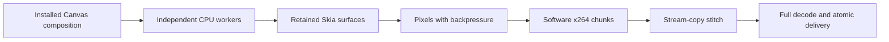

# CPU rendering results

**Evidence retention (2026-10-01):** Earlier `/private/tmp` benchmark evidence is unavailable. Historical measurements below are reported records, not freshly reverified results or a current public competitor claim. The [fresh October 1 study](2026-10-01-cpu-benchmarks.md) links its retained source receipts; its every-frame quality and complete cadence checks remain pending.

Helios has lower median CPU render times than pinned fframes on the qualified local and scheduler TextGrid comparisons below. A new local holdout also tests the strongest fframes profiles from a twelve-profile screen: Helios wins eleven of twelve pairs, with one ultrafast loss and substantial timing variation. A separate five-pair confirmation of the two weakest profiles wins all ten new pairs, with 1.280× medium and 2.012× ultrafast ratios of median render times. These results do not reproduce fframes' published M4 Max benchmark or establish a global optimum. Scheduler changes pass production packaging and targeted checks; deployment awaits explicit approval after automatic review rejected the live rollout.

The performance goal remains active. Historical local studies and regression checks are complete and preserved separately. A [new three-engine CPU comparison](2026-09-30-three-engine-cpu-qualification-results.md) includes Remotion: six CRF11 qualification exports passed all 1,800 frame gates, and a reviewed worker screen has been launched under a distinct decoder-revision authority. Its completed timing/quality audit and paired holdouts remain pending. Further instrumented scheduler source transfer and production rollout still require their separate authorization; neither local progress nor Orbs testing supplies it.

## Techniques implemented

- Render supported compositions directly on CPU Skia through an explicit, trusted Canvas API. This avoids browser capture and SVG serialization for that path; HTML/CSS compositions continue to use the browser renderer.
- Retain canvases and registered fonts inside isolated processes. Seek directly to each requested frame and distribute independent ranges across persistent workers.
- Stream raw pixels to software FFmpeg with backpressure. Stitch ordered chunks by stream copy, fully decode the final video, and atomically publish only a complete result.
- Bound translucent text isolation to transformed glyph ink instead of allocating a viewport-sized surface for every label. Preserve overlap, clips, transforms and group opacity.
- In the scheduler, replace the fixed Vite delay with bounded readiness, stage audio through one SDK write, and stream binary media through bounded R2 uploads. These source changes are tested; their production rollout is pending.

## Matched benchmark evidence

The [published-claim audit](2026-09-30-fframes-claimed-benchmark-audit.md) checks upstream's 6.80/3.15-second CPU claims and fourteen additional local exports. Giving fframes eleven workers and automatic encoder threading reduces its CRF11 complete-frame ultrafast median to 7.982 seconds, versus the earlier capped 11.385 seconds. Those sequential settings checks are not paired or quality-qualified comparisons. The subsequent screen and fresh holdout below address independent tuning within twelve sampled profiles per engine; configurations outside that search remain unproven.

The source pin is `bacfc3c3212d3d9429468435bfdc1ae2a21c7b3b`: 3334 changing labels, the exact DM Sans font, 300 frames, 1920×1080 at 30 fps. Both engines use CRF11, BT.601 and matched actual x264 parameters. Compilation and installation are excluded. Fresh processes alternate engine order.

The historical ratios below divide fframes' median elapsed time by Helios' median elapsed time. The prospective three-engine comparison uses the median of within-pair time ratios as its primary statistic, with absolute medians and ratios of medians reported separately; historical receipts retain their original statistic.

| Host and preset | Helios median | fframes median | Render ratio of medians | Ratio of medians including final decode |
| --- | ---: | ---: | ---: | ---: |
| Local M3 Pro, medium | 13.483 s | 19.222 s | 1.426× | 1.295× |
| Local M3 Pro, ultrafast | 5.524 s | 11.385 s | 2.061× | 1.720× |
| Scheduler Linux, two workers, medium | 78.597 s | 136.786 s | 1.740× | 1.584× |
| Scheduler Linux, two workers, ultrafast | 31.096 s | 66.733 s | 2.146× | 1.911× |
| Scheduler Linux, four workers, medium | 68.288 s | 82.105 s | 1.202× | 1.173× |
| Scheduler Linux, four workers, ultrafast | 27.166 s | 37.369 s | 1.376× | 1.298× |

Local comparisons use four workers and two encoder threads, with five pairs per preset. Remote comparisons test two and four workers with one encoder thread, with three pairs per preset in each profile. Helios wins every paired render. All 44 outputs pass their original 300-decoded-frame checks. Every frame passes the same codec-loss gates against its engine's independently regenerated raw oracle: SSIM Y ≥0.995, PSNR Y ≥40 dB and U/V ≥35 dB.

A later static remote audit found that the legacy quality parser could accept 300 duplicated `n:1` metric rows. The actual 24 inspected historical SSIM/PSNR logs instead contain unique ordered rows 1–300, and their minima match all 12 stored summaries; no historical row-quality failure was found. Those inspected records do not independently supply every presentation timestamp, strict decoder-error receipt and source/runtime binding required by the new three-engine protocol. Historical remote frame-count/rate/duration checks must not be presented as that stronger admission proof. Original observations remain unchanged. The audit and disabled prospective checker are retained under `remote-next-stage-audit-v1/native/` in the three-engine scratch root.

### Fresh local tuning holdout

After forty-eight screening exports, lock the two fastest fframes profiles per preset and choose the fastest screened Helios worker count at each identical encoder-thread setting. Three fresh pairs per profile produce twenty-four fully qualified outputs on the same M3 Pro. Source hashes, actual x264 versions/parameters, output hashes, all 300 quality records per unique hash and both timer formulas pass the independent audit. Screening exports are not rerun or counted as repeated evidence.

| Preset | Threads per encoder | Helios / fframes workers | Helios median | fframes median | Render ratio of medians | Ratio of medians with final decode | Paired render wins |
| --- | ---: | ---: | ---: | ---: | ---: | ---: | ---: |
| medium | 2 | 4 / 6 | 16.889 s | 19.558 s | 1.158× | 1.107× | 3 / 3 |
| medium | 4 | 4 / 8 | 16.268 s | 20.738 s | 1.275× | 1.139× | 3 / 3 |
| ultrafast | 16 | 4 / 11 | 5.100 s | 11.077 s | 2.172× | 1.829× | 3 / 3 |
| ultrafast | 4 | 4 / 8 | 7.848 s | 9.564 s | 1.219× | 1.169× | 2 / 3 |

Helios wins eleven of twelve render and service pairs. The smallest medium two-thread paired lead is only 1.010×; four-thread ultrafast loses one pair at 0.792×. Sixteen-thread ultrafast paired ratios range from 1.586× to 3.554×. Absolute timings differ substantially from screening, so these are measured profile results rather than stable global defaults. Three repeats are a small sample, OS load/caches are uncontrolled, and brief contract verification ran during this holdout. Full quality work occurs outside render timers and changes untimed load/cache history. The comparisons retain CRF11 rather than upstream's CRF18, and qualify codec loss separately for each rasterizer. All temporary holdout videos are removed. Authoritative records are `tuning-local-20260930/finalists/{results,summary,independent-audit}.json`; eight unique video hashes qualify all 7,200 output-frame references.

### Separate weak-profile confirmation

This post-hoc study selects only holdout profiles with a paired loss or a smallest paired lead at most 1.02: medium H4/F6 at two encoder threads and ultrafast H4/F8 at four threads. Five fresh pairs per profile produce twenty timed exports plus four excluded warmups. Original screening and holdout exports remain unchanged. Exact output hashes reuse four copied, independently regenerated 300-frame oracle sets; copied bytes and process-exit receipts are independently checked against their frozen originals. Every new video still receives complete decoded-frame/cadence/dimension checks, strict decode and actual encoder inspection. All 6,000 output-frame references pass every-frame SSIM/PSNR gates through those four exact hashes.

| Preset | Threads per encoder | Helios / fframes workers | Helios median | fframes median | Render ratio of medians | Ratio of medians with final decode | Paired render/service wins |
| --- | ---: | ---: | ---: | ---: | ---: | ---: | ---: |
| medium | 2 | 4 / 6 | 15.837 s | 20.273 s | 1.280× | 1.152× | 5 / 5 |
| ultrafast | 4 | 4 / 8 | 5.023 s | 10.109 s | 2.012× | 1.894× | 5 / 5 |

Medium paired render ratios range from 1.053× to 1.690×; ultrafast ranges from 1.498× to 3.048×. The ultrafast ratio of medians is 2.012×, while its median paired render ratio is 1.687×. Verified-service medians are 27.680/31.885 seconds medium and 8.478/16.055 seconds ultrafast. These results strengthen evidence for the two profiles but do not erase the earlier loss, establish stable defaults or reproduce upstream's M4 Max/CRF18 table. Keep this study separate: exact-hash oracle reuse changes untimed work/cache history, selection follows observed holdout results, and OS load is uncontrolled. Light audit/admission checks ran while it executed; no renderer throughput tests ran until it finished. The actual process exits zero and agrees with its one-shot watcher; the watcher queues one completion. The strengthened independent audit passes all twenty rows, timer formulas, actual codec settings, source/font hashes and copied-oracle provenance. All temporary render directories are gone. Records are `tuning-local-20260930/confirmation-20260930/{results,summary,independent-audit,completion-integrity}.json`.

Four workers are the fastest measured remote profile: Helios medium and ultrafast medians improve 13.12% and 12.64% versus the two-worker job. Both jobs report identical host resources, but execute sequentially with uncontrolled load and OS caches. This establishes the best measured profile, not a global optimum. Four-worker medium sampled process-tree RSS is roughly 1.84 GiB for Helios versus 1.04 GiB for fframes; ultrafast is about 1.08 versus 0.295 GiB. These values divide the sampled MiB receipts by 1024.

The targeted translucent-text drawing benchmark improves 30.98×. Five representative portable scenes show no material measured regression: all medians are within 1%, with sampled pixels exact or differing by one channel level. Those results do not establish a universal speedup.

## Scheduler API evidence and limits

The original deployed workflow baseline takes 72 seconds from queue to completion, including 70 seconds executing. It includes authoring, setup, browser rendering and upload; its 240-frame moving-square video passes complete decode and motion checks.

The isolated frozen DOM readiness comparison produces four videos identical in encoded bytes to that original baseline. A second isolated trial adds four independently decoded videos, all byte-identical to the original deployed baseline. Across four interleaved pairs in two sequential containers, readiness wins three; the combined fixed/readiness medians are 44.618/39.433 seconds. One readiness pair is 7.013 seconds slower. These measurements exclude authoring, upload and container staging, retain uncontrolled load/cache limits, and do not establish stable production service speedup.

The native CPU comparison has material limits: CRF11 differs from upstream's published CRF18 table; Canvas/Skia and upstream tiny-skia are not pixel-identical; sampled Helios process-tree memory is roughly twice fframes' medium memory and higher for ultrafast. Actual remote cgroup quota is unavailable. OS caches are uncontrolled. Native results do not apply automatically to arbitrary DOM scenes.

New component counters separate rasterization, pixel extraction and process setup while preserving the historical combined draw timer. Both instrumented local presets retain their qualified video bytes. Cold/warm service distributions and remote instrumented measurements remain unverified. A separate local retained-session check uses three fresh processes: sixty sampled full TextGrid frames retain exact raw bytes under reverse seeking, initial canvas/font setup is 90.182 ms, and first/retained drawing medians are 754.135/693.955 ms. Encoding and module loading are excluded; this is not a service timing claim.

The independent local tuning sweep keeps its measured inputs frozen while testing twelve worker/thread profiles per engine and preset. A small installed-binding probe investigates native pixel extraction without changing that renderer: native `Canvas.data()` matches an opaque RGBA sample but returns premultiplied RGB for transparent samples, whereas `getImageData()` returns straight RGB. The sampled native buffers remain stable after redraw. An unconditional replacement would change output and is rejected; an opacity-safe candidate needs complete pixel-parity and performance checks. This probe is retained outside the repository and is not a rendering speedup claim.

A subsequent 16×16 semantic probe checks an alpha guard: inspect native bytes and fall back to straight-RGB extraction whenever any pixel is nonopaque. All twenty-four samples match existing extraction byte for byte, including erasure, destination-out compositing, translucent copy and antialiased paths; all retained buffers survive thirty-two redraws. Nine samples use native bytes and fifteen require fallback. An opaque initial background alone is insufficient because composition code can erase it. These small samples establish a candidate guard, not a production guarantee or speedup: full TextGrid parity, scan overhead, larger buffer lifetime and repeated end-to-end measurements remain required. The six frozen finalist artifacts remain unchanged, and no renderer changes or throughput tests were made during the holdout.

After the holdout completed, the full 300-frame TextGrid diagnostic preserves exact pixels and native-buffer stability across successive renders, with no transparency fallbacks. However, the proposed alpha guard's median extraction is 9.094 ms versus 0.946 ms for existing extraction, approximately 9.62× slower. This is one alternating same-surface diagnostic, not an end-to-end benchmark. The current guard is rejected and no renderer change is applied; exact pixels alone do not justify a performance optimization. Records are in `tuning-local-20260930/full-readback-parity.json`.

The scheduler benchmark harness now implements an opt-in compact archive to avoid publishing another large video bundle on future runs. Local contract checks preserve timing/provenance/quality records byte for byte, omit all videos, reject unsupported capsules and require retention attestation before publication; full archives remain the default. All 32 targeted tests pass and two critical mutants are killed. The fresh 136,597-byte capsule is staged outside the repository, without upload or deployment. Remote round-trip verification and transfer-time improvement are unproven, and existing large artifacts remain unchanged pending deletion approval. Brief contract checks ran during the holdout; OS load remains uncontrolled, with rendering inputs frozen.

## Reproduction and retention

The [goal specification](2026-09-29-cpu-rendering-benchmark-goal.md), [scheduler protocol and measurements](2026-09-30-scheduler-cpu-benchmark.md), and [operator runner protocol](../../packages/portable/benchmarks/cloudflare/PROTOCOL.md) record settings, source pins, timing boundaries and commands. After the confirmation terminal, the full portable suite passes all 189 tests across 33 files, including the compact-retention contract, real HTTP boundary, process recovery and frame completion. The first attempt lacked the media tool paths and local loopback access; the successful run uses constant installed tool paths and approved loopback permission, with no source changes to repair those setup failures. These regression renders run only after benchmark timing completes. Earlier TypeScript builds also pass. Targeted mutation checks cover important failure boundaries, without claiming exhaustive coverage.

Evidence lives outside the repository under `/private/tmp/helios-fframes-goal`. `completion-audit.py` now rechecks all 88 qualified TextGrid outputs across 44 pairs, retaining separate local screening/holdout/confirmation boundaries. It validates both new studies' original timer components, actual encoders, frozen sources and per-frame quality records without rewriting their receipts; it also checks retained local seed hashes, compact archive hashes and every retained remote quality record. Its overall status remains incomplete for four remote/production requirements. Large remote archives and duplicate local videos were removed after verification. The two earlier retained remote compact bundles total 10,358,361 bytes. The new four-worker compact bundle is 95,548 bytes and round-trip verified in R2. Its temporary 956,076,414-byte remote archive and 958,477,973-byte local video copies await explicit deletion approval after automatic review rejected cleanup. Another full decode of the earlier cleaned profiles requires rerendering. One unchanged upstream incomplete ultrafast original remains, and its stream-copy repair cost is included in fframes timings.

Docker was restarted and its engine responds. Production packaging, the actual generated readiness helper, TypeScript and 36 targeted scheduler tests now pass. The installed local Cloudflare test runtime falls back from the requested 2026-09-30 compatibility date to 2026-02-10; production service verification remains necessary. The rollback version is recorded outside the repository.

The historical local manifests do not bind the temporary TextGrid adapter, timed worker wrapper or all runtime dependencies with prespecified hashes; retained audits compare current worker copies. Recorded renderer/scene/font/binary hashes and output qualification pass, but complete historical source closure and public fresh-build reproduction remain limitations.

The next required checks are remote component/cold-warm measurements and compact publication qualification after source-transfer approval, plus production scheduler rollout and service verification after rollout approval. The local tuning holdout and separate weak-profile confirmation are qualified; global optimality and a stable production speed improvement remain unproven. No completed production rollout is claimed.
