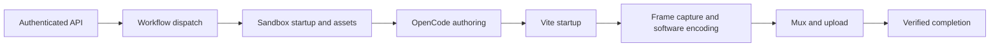

# Scheduler CPU rendering qualification

**Evidence retention (2026-10-01):** Earlier `/private/tmp` benchmark evidence is unavailable. Historical measurements below are reported records, not freshly reverified results or a current public competitor claim. The [fresh October 1 study](2026-10-01-cpu-benchmarks.md) links its retained source receipts; its every-frame quality and complete cadence checks remain pending.

The user explicitly authorizes benchmarking and optimizing the CPU-only render API in `/Users/gavinbintz/Developer/durable-objects-requests-scheduler`. This is the preferred remote target for the existing fframes performance goal. GitHub-hosted Linux remains an optional independent comparator.

## Observed contract

The deployed Worker is `https://swirlbot.me-00f.workers.dev`. A read-only `/health` request returned `status: ok` on 2026-09-30, with all reported bindings healthy. This establishes reachability, not render performance.

The existing authenticated `POST /api/internal/test-render` accepts a duration and brief, creates a MakeVideo workflow with `skipToRender: true`, and selects 720p. The core workflow renders at 24 fps. Status comes from `GET /api/workflows/make-video/:id`; artifacts come from authenticated `/api/internal/media?key=...`.

The current deployed test endpoint still invokes OpenCode authoring. The deployed Sandbox helper transfers audio through sequential base64 shell commands, writes a Vite configuration and render scripts, sleeps five seconds for Vite startup, invokes the installed browser renderer in DOM mode, optionally stream-copy muxes audio, uploads through an authenticated request, and destroys the sandbox. Its image pins Helios core 5.13.1, renderer 1.78.1 and CLI 0.32.0; it does not install the experimental native portable package used in the qualified local comparison. No remote superiority follows from the local Canvas numbers.

The checked-in container configuration selects `standard-4` and permits five instances. Cloudflare documents that instance type as 4 vCPU, 12 GiB memory and 20 GB disk. These are configured resources, not a measurement of the active deployment's CPU quota or memory consumption. The local benchmark's four render workers and two encoder threads per worker need a separate tuning sweep on this four-vCPU target. [Container limits](https://developers.cloudflare.com/containers/platform/limits/).

The workflow can also deliver notifications to the owner's phone. Automated benchmark requests need delivery suppressed explicitly. The current test endpoint does not pass a caller-supplied recipient field through to the workflow, so supplying an empty field today would not suppress that behavior.

## Acceptance before a remote performance claim

- Given an authenticated request, use a connector or credential-hiding request broker. Never retrieve API_TOKEN, inspect environment variables, or persist authorization headers in benchmark artifacts. Health checks do not supply render authorization.
- Given a benchmark request, suppress messaging and authoring retries where measuring the renderer. Preserve the ordinary creative workflow's behavior.
- Given the current deployed workflow, first record its end-to-end baseline with authoring, setup and delivery boundaries disclosed. Do not call its total duration a rasterizer benchmark.
- Given a fair fframes comparison, execute the pinned TextGrid scene with the exact DM Sans font, all 3334 changing labels, 300 frames, 1920×1080 at 30 fps, matched actual software x264 parameters and quality-qualified CRF11. Run both engines on the same CPU-only container resources; compile and install outside the render timer.
- Given cold and warm runs, report container startup, dependency/asset staging, queue delay, font preparation, drawing, pixel extraction, encoder backpressure, stitching, full final decode verification and R2 upload separately. Record actual CPU quota, available parallelism, architecture, memory limit, software builds and source hashes without inspecting environment variables.
- Given tuning, interleave baseline/candidate repetitions and vary one resource setting at a time: worker count, per-encoder thread count, chunk size or safe session reuse. Keep stateless random seeking and fresh-worker retries valid.
- Given every output, decode all requested frames and verify dimensions, cadence, duration and all-frame codec-loss gates. Preserve the original incomplete fframes ultrafast artifact and include its disclosed edit-list repair cost.
- Given representative HTML/CSS, media and typography compositions, retain the browser path. A native Canvas improvement cannot be reported as an automatic speedup for arbitrary DOM scenes.
- Given a remote job, prefer a completion stream or supported blocking wait. Do not repeatedly poll unchanged status from the model or claim that a wakeup is armed without a verified runtime primitive.

## Measurement status

After the user signed in and explicitly requested resuming the baseline, the project's installed Wrangler 4.64.0 successfully authenticated. The account's deployed `make-video-workflow` targets the `swirlbot` Worker and `MakeVideoWorkflow` class, version `cbf0159a-922a-4dd3-b0b1-e7a4e7aa0a10`. One authenticated workflow render has now completed. No API token was retrieved and no deployment was changed. Wrangler's operator workflow API avoids exposing credentials; it does not measure public HTTP submission latency.

### First deployed baseline

Instance `helios-cpu-baseline-20260930-01` was queued at 2026-09-30 06:11:33 America/New_York, started at 06:11:35 and completed at 06:12:45. The request selected `skipToRender: true`, 10 seconds, 720p and an explicitly empty `recipientPhone`. No delivery or notification step appears in the completed workflow. The brief requested a deterministic HTML/CSS moving square and frame counter without external assets, audio, WebGL or WebGPU. Authoring remains part of this workflow despite `skipToRender`.

| Boundary | Measured result |
| --- | --- |
| Queue delay | 2 seconds |
| Workflow execution | 70 seconds |
| Queued to completed | 72 seconds |
| Output | H.264, YUV420p, 1280×720, 24 fps, 10.000 seconds |
| Complete decode | 240 of 240 requested frames; decoder exit 0 |
| Motion verification | Expected square position passes in every decoded frame |
| Artifact size | 61,308 bytes |

Workflow timestamps have one-second resolution. The 70-second execution measurement includes container and asset setup, OpenCode authoring, Vite startup, capture, encoding and upload. The workflow combines these in `generate-and-render-video`, so individual phase durations are unavailable. Actual container CPU quota, cold/warm state and peak memory were not measured. This is one successful service baseline, not a repeated timing distribution or a paired fframes comparison.

The completed workflow's render-success flag was checked separately from workflow success. Its artifact `videos/video-muny3zr2-yxr6/output.mp4` was retrieved from `swirlbot-memory` using Wrangler's remote R2 operation and fully decoded locally. Every frame's orange square span matches `x = 80 + 90 * frame / 24` within two pixels. Video SHA256 is `320dafd23ff9741b609e146b90f910f3c1ccec4f74f941b910239b15a1b349ac`; the authored HTML SHA256 is `e24332e35e5e10e1e2f37f23a010226a3dc047e44274164c6e17064e3779b58e`.

Request, sanitized status metadata, artifact identifiers, verification results and preview remain outside the repository at `/private/tmp/helios-fframes-goal/scheduler-api/remote-baseline`. Arbitrary workflow logs, error messages and other step outputs were excluded from saved evidence. The local transfer improvements below were not deployed for this baseline. The matched TextGrid comparison is now qualified for one remote pair per preset, as recorded below; repeated remote qualification and production service tuning remain unfinished.

A local source change in the scheduler replaces the audio staging loop with `sandbox.writeFile('/workspace/audio.mp3', audioBase64, { encoding: 'base64' })`. For 2 MiB of audio the prior code performed 43 append commands plus removal and decode; the new code performs one file-write operation. The SDK still transfers base64 over its file protocol; this removes repeated shell requests rather than claiming zero-copy transfer. The installed SDK forwards the encoding option to its file-write API.

Four regression tests cover zero bytes, all byte values, a 2 MiB input and aborting before authoring/rendering on transfer failure. All four fail against the frozen source and pass with the change, including in the project's Cloudflare test runtime. The package TypeScript check passes. One targeted encoding mutant (`base64` changed to `utf8`) is killed by two tests; these are local contract checks, not proof of real remote file-server behavior or a measured wall-time speedup.

The local media API change streams R2 downloads directly into the response. Uploads with a known length use `FixedLengthStream`; uploads without a known length use sequential multipart writes with one retained 8 MiB part buffer. This avoids whole-video buffering in the Worker. The installed R2 runtime rejects unknown-length streams in ordinary `put`, so the multipart fallback is required. Failed or truncated uploads preserve the previous completed destination object, and failures abort the multipart upload. Locked streams fail before an upload is allocated. Existing buffered memory APIs remain available.

Ten media regression tests exercise actual local R2 storage, known and unknown upload lengths, ordered multipart bytes, empty input, missing downloads, authentication, cancellation and publication failure. A 140 MiB download passes with a bounded producer and consumer, without materializing the whole file in the Worker. Together with the 16 existing memory tests and four audio tests, the targeted Cloudflare run passes all 30 tests. TypeScript and `git diff --check` pass. The encoding mutant result above applies only to audio staging; no streaming mutation coverage is claimed. These tests establish local transfer behavior, not deployed throughput or remote render speed.

Streaming does not bypass Cloudflare's plan-dependent request-body limit. Cloudflare documents 100 MB for Free/Pro and 200 MB for Business; several qualified benchmark videos exceed those limits. The account plan and artifact delivery method must be established before a remote comparison. Direct R2 delivery or an explicitly chunked upload may be needed. [Workers limits](https://developers.cloudflare.com/workers/platform/limits/), [R2 Workers API](https://developers.cloudflare.com/r2/api/workers/workers-api-reference/).

The changed scheduler files are `src/index.ts`, `src/tools/memory.ts`, `src/tools/sandbox.ts`, `test/media-streaming.test.ts` and `test/sandbox-audio.test.ts`. Baseline snapshots, temporary validation configurations and detailed acceptance evidence remain outside both repositories at `/private/tmp/helios-fframes-goal/scheduler-api`. No commit or push has occurred. These creative scheduler source changes remain undeployed; the isolated benchmark workflow described below is deployed separately.

The first opportunities to measure are removal of authoring from fixed-scene benchmark requests, readiness-based Vite startup instead of the fixed sleep, binary asset transfer instead of many shell RPCs, and reuse of prepared renderer sessions within an isolated job. These are hypotheses until measured on the deployment; none may replace a correctness or final decode check.

### Readiness acceptance

Given Vite serves the composition successfully, begin rendering immediately rather than spending a fixed five seconds waiting. Given connection failures or non-200 responses, retry within a fixed 30-second deadline; never begin rendering before readiness. Given a stalled request or a server that never becomes ready, fail within the deadline and stop the temporary Vite process. Readiness requests must cancel their response bodies, use only the fixed loopback composition URL, and never receive credentials. This change needs executable fast-ready, late-ready, failure and stalled-request checks plus a real HTTP boundary measurement; deployed service speed remains a separate check.

Given the scheduler's frozen baseline HTML, an isolated CPU-only probe compares two interleaved fixed-delay/readiness pairs on one container without authoring or notification. The baseline HTML digest, dimensions, frame rate, duration and CLI settings are fixed. Every output must fully decode 240 frames; every decoded frame hash must match the frozen-delay comparison outputs. Record render/startup time separately from final decoding and archive publication. Reject incomplete or changed pixels, publish artifacts before cleanup and final success, and retain only this small fixture's videos. This is a startup optimization check for the browser renderer, separate from the fframes TextGrid comparison.

The local scheduler implementation now stages a credential-free Node readiness helper instead of sleeping five seconds. Five readiness cases cover immediate success, late startup, non-200 responses, connection failure, deadline abort and body cancellation; a consumer case verifies the generated render script's failure exit and Vite cleanup. Together with audio staging and media/memory checks, all 36 targeted tests pass in a local Cloudflare runtime with explicit R2 bindings and no Wrangler configuration or secret-file loading. Three readiness mutants (accepting empty success, omitting body cancellation, omitting request abort) fail their intended assertions. Scheduler TypeScript passes. These changes remain undeployed in the creative Worker.

Four alternating local fresh-Vite starts on a minimal HTML fixture average 5093.202 ms with the fixed delay and 172.145 ms with readiness (4921.057 ms saved). A stalled real HTTP request exits in 153.776 ms with a 120 ms test deadline, and a streamed response is canceled. This small local startup fixture excludes dependency-heavy compositions, authoring and rendering; it does not establish a deployed end-to-end speedup. Evidence is in `scheduler-api/readiness/boundary-results.json` beneath the scratch root.

The isolated `CpuReadinessProbe` stages the exact frozen baseline HTML, uses the installed production CLI and unchanged dimensions/cadence, and requires all 240 frames' expected square positions plus exact decoded pixel equality across both pairs. Its publication is bounded to 32 MiB and each video to 8 MiB. Six orchestration/qualification tests pass; targeted frame-count and pixel-equality mutants are killed. The real decoder verifies all 240 original baseline frames locally. It chooses the available FFmpeg passthrough option to support both the older container build and the current local build. The full portable suite passes 162 tests across 30 files with one test worker; the existing 5-second media test can time out under parallel FFmpeg contention, so its timeout remains unchanged. The probe is deployed on the isolated benchmark Worker, and submission is deferred until the repeated fframes render finishes to avoid benchmark load overlap.

## Fixed-scene remote runner specification

Given an operator-authenticated benchmark request, run an isolated benchmark workflow bound to the scheduler's existing `Sandbox` class and R2 bucket. Its HTTP handler must reject execution requests; submission uses the platform workflow API. Restrict all bundle and output keys to a benchmark-specific prefix. No creative authoring, music generation, phone delivery, credentials in the container, or changes to the creative workflow are involved.

Given a staged capsule, validate its size and SHA256 before creating a sandbox. Extract only the explicitly packaged portable renderer, benchmark harness, locked compiler source and pinned font. Reject invalid resource counts, paths, run identifiers and hashes before storage or container work. Compilation and dependency installation occur outside render timers. Persist separate staging, preparation, paired rendering, quality qualification and artifact-transfer timings.

Given paired rendering, reuse the existing qualified TextGrid harness: 3334 changing labels, 300 frames, 1920×1080 at 30 fps, software x264, matched actual parameters, interleaved fresh processes and full final decoding. Begin with two workers and one encoder thread on the configured four-vCPU resource, then measure alternatives. Qualify both engines and both presets against their own uncompressed drawings before claiming speed superiority. Retain sampled memory accounting and actual cgroup resource limits without inspecting environment variables.

Given any failure, reject qualification, retain a bounded phase-only failure report, and destroy the benchmark sandbox. Never persist arbitrary SDK exceptions or credential-bearing logs. Given success, retain the verified videos and reports in R2 before destroying the sandbox. Tests must demonstrate digest and input rejection before I/O, no publication after a failed phase, bounded artifact transfer and cleanup on success and failure.

The installed Wrangler 4.64.0 remote-binding probe did not establish a usable Sandbox connection: the Durable Object `remote` field is unsupported and the platform rejected preview-session creation. No sandbox command or deployment ran through that probe. The fixed runner therefore uses a deployed isolated workflow and an external Durable Object binding, supported by the installed configuration schema, rather than depending on that development proxy.

### Isolated workflow deployment and first qualification attempts

The operator-only `helios-cpu-benchmark` Worker and `CpuBenchmarkWorkflow` are deployed with the existing scheduler Sandbox Durable Object and `swirlbot-memory` R2 bindings. The creative `swirlbot` deployment is unchanged. The benchmark HTTP handler rejects submissions; no credentials or secret bindings enter the benchmark container.

The staged capsule is 118,881 bytes, SHA256 `555e7a63ecb231dc06b6a16f0cad49eb84cd0943fd9cc75fda3efdd2c3d71e82`. Public npm and compiler dependency locks are included. Local validation passed the staged portable TypeScript build, a full native TextGrid frame, the four-method HTTP rejection check, and 22 workflow acceptance tests. Targeted mutants for capsule integrity, frame completeness, failed-process handling and missing interpreter setup were killed. These checks do not establish remote performance.

Instances `paired-qualification-20260930-01` and `paired-qualification-20260930-02` failed during staging, before compilation or rendering. The second bounded failure report identifies the Python bootstrap command with exit status 127. The runner now installs Python explicitly before extraction and supplies a fixed, non-secret executable search path. No arbitrary SDK errors or process environment values are retained.

Worker version `b8cb7d2a-50ea-4b2d-8c6b-ec074006b556` contains that correction. Instance `paired-qualification-20260930-03` queued at 07:30:33 and started at 07:30:34 America/New_York on September 30. Its budget was two renderer workers, one encoder thread each, one paired repetition per preset. Rendering and quality qualification completed, but artifact publication failed. Recovery and independent verification are recorded below. The CLI's running-duration display is not a reliable elapsed measurement and is excluded from timing evidence.

Remote evidence belongs under `benchmarks/helios-cpu/paired-qualification-20260930-03/` in R2, with bounded `phase.json`, terminal `result.json` or `failure.json`, and `evidence.tar.gz` on successful qualification. Local request and sanitized status evidence is at `/private/tmp/helios-fframes-goal/scheduler-api/fixed-runner`. No completion-triggered messaging primitive was verified in this runtime; no automatic wakeup is armed. Inspect the terminal report once when returning to the task, retrieve successful artifacts, and verify them before claiming a remote advantage.

### Evidence-gate hardening and completion stream

The original run advanced into preparation at 11:30:54 UTC, establishing that its capsule was transferred and extracted before compilation. This historical staging observation preceded the recovered qualification below.

A new pure evidence validator rejects missing or duplicate engine/preset/round combinations, unequal resource budgets, altered workloads, encoder-build or parameter mismatches, failed processes, invalid timings and cadence, and quality flags that contradict the numerical thresholds. Twelve focused Python-boundary acceptance cases pass. The validator also accepts all 20 existing qualified local results and four local codec oracles. Three targeted mutants for duplicate-output checks, paired encoder equality and numerical quality thresholds fail their intended assertions. Video hashing now reads bounded 1 MiB chunks instead of allocating a whole video. The running instance keeps its original immutable capsule; its eventual report will receive the stronger local gate before a remote speed claim.

The missing-interpreter mutant was re-run using the native Vitest config loader after a sandbox filesystem restriction prevented the first scratch config from loading. The corrected run reaches the test and fails its expected bootstrap assertion. Startup failures are not counted as killed mutants.

Cloudflare's documented `WorkflowInstance.subscribe()` now supplies a blocking terminal-event primitive. Worker version `fdff5c95-272a-494b-8f4c-51287ee489d3` adds a separate operator-only `CpuBenchmarkObserver`, without changing the original running instance or exposing HTTP submission. Observer `observe-paired-qualification-20260930-03` is verified running. It waits on terminal lifecycle events, saves only validated instance/type/event/timestamp fields to `terminal-event.json`, disposes the RPC subscription, and emits a controlled marker. Eight observer tests pass; payload-copy and missing-disposal mutants fail their intended assertions. The combined remote-runner suite passes 42 tests. These are targeted mutations, not exhaustive mutation coverage.

A sanitized local Wrangler tail reader waits on that marker and saves it to `terminal-stream-03.json` outside the repository. It does not poll workflow status. This is a live completion stream, not an automatic thread wakeup: no current-thread queue primitive is available. The remote observer receipt remains in R2 if the local stream ends. A next-run capsule with the stronger qualification gate is staged separately, SHA256 `49dc9bea4902e53c5e909be211e17c0cf87a011ed97935671d643ad98a5eca2c`, 124,507 bytes; it is not the capsule used by the currently running render.

A deployed retained-event integration probe also passes: observer `observe-retained-qualification-20260930-01` subscribed to the known failed instance, saved its `workflow_errored` receipt in R2, and delivered the identical bounded metadata through the sanitized Wrangler stream. This establishes the completion path beyond the mocked subscription tests. The live run's reader remains separate and accepts only its own instance ID.

### Recovered CPU comparison and binary publication

The original instance entered artifact transfer at 11:58:02 UTC and emitted a terminal error at 12:00:07.998 UTC. The preparation-to-transfer interval includes compilation, rendering and quality checks; it is not a preparation-only measurement. Workflow replay reset closure-local diagnostic fields, so its first failure report mislabeled the phase. The persisted phase evidence establishes publication failure, but does not establish its underlying transport or runtime cause.

Recovery `recover-qualification-20260930-03` completed at 08:42:10 America/New_York. It reused the original healthy container's files without rerendering, validated the comparison and every video hash, repacked selected evidence without raw logs, streamed it to R2, and destroyed the original container before publishing success. Original render timers are preserved; recovery time is separate.

| Preset | Helios render | fframes render | Render time ratio | Helios with final decode | fframes with final decode | Time ratio with final decode |
| --- | ---: | ---: | ---: | ---: | ---: | ---: |
| medium | 69.799 s | 108.698 s | 1.557× | 87.963 s | 130.324 s | 1.482× |
| ultrafast | 26.414 s | 53.796 s | 2.037× | 33.015 s | 61.002 s | 1.848× |

The measured host is Linux x86_64, AMD EPYC, with four visible logical CPUs, available parallelism four, 11.935 GiB visible memory and Node 20.20.0. GPU device detection is false. Both engines use two workers, one encoder thread, CRF11, BT.601, and equal actual x264 builds and parameters. The available cgroup-v2 quota and memory-limit files returned no values; configured resources must not be substituted for measured quotas. These are one-pair measurements, not a stable timing distribution or the published upstream CRF18 configuration.

All four downloaded videos independently decode 300/300 frames at 1920×1080, 30 fps and 10 seconds. Every video has 300 SSIM and PSNR records; independent local parsing confirms SSIM Y ≥0.995, PSNR Y ≥40 dB and U/V ≥35 dB in every frame. Minimum SSIM Y is 0.996564/0.996119 for Helios medium/ultrafast and 0.995885/0.996283 for fframes. Each codec oracle uses its own uncompressed rasterizer output; this does not establish pixel identity between engines. Frame 120 previews from both engines were presented to the user.

Sampled process-tree RSS every 200 ms peaks at 1080.281 MiB for Helios and 536.410 MiB for fframes medium; ultrafast peaks at 689.176/282.883 MiB. This roughly twofold memory cost is a material tradeoff, not a measured memory improvement or cgroup peak.

The private binary path uses the stable Sandbox `containerFetch` API with a private HTTP server and validated Content-Length, then streams through `FixedLengthStream` into R2. A separate 64 MiB probe transfers in 3.602 seconds, excluding startup, generation, cleanup and local download; downloaded bytes and SHA256 match. The recovered 954,733,862-byte archive also matches SHA256 `61dfe44d8086f7fd3373661eed036f06b3025e34bfb205c6ee54fc8dadafaf4c`. This qualifies the replacement publication path without asserting a measured speedup over the failed original transport.

Recovered objects live under `benchmarks/helios-cpu/recover-qualification-20260930-03/`. Local evidence is in `fixed-runner/recovered-result-03.json`, `recovered-integrity-03.json`, `recovered-output-verification-03.json`, `remote-ratios-03.json` and `binary-probe-verification.json` beneath the scratch root above. The recovery terminal marker was also captured by the sanitized local reader.

Full videos are temporary qualification artifacts. The original archive contains five MP4s, including the preserved incomplete upstream ultrafast original; non-video archive contents total 377,286 bytes. After independent verification, a 5,176,400-byte compact bundle retains reports, all-frame quality records, dependency locks, hash receipts and two PNG previews. Its SHA256 is `4f62c2d8f0a7e61a56c66db857cd4695653ea1e9e74fda5c66b4bd2aefaee063`. The redundant local 954,733,862-byte archive was removed first. After repeated qualification passed, both full R2 archives, the extracted videos and the transfer probe were removed. Compact retention cannot reproduce a full decode without rerendering the pinned workload.

The runner now persists candidate metadata before large transfers, recovers controlled diagnostics across replay, and stops its temporary file server on success or failure. New sandboxes disable indefinite keepalive and use finite idle limits (90 minutes for comparisons, 15 minutes for transfer probes), in addition to normal explicit cleanup. Sixty-two targeted acceptance tests pass. Four publication mutants are killed by intended assertions: omitted candidate publication, discarded persisted diagnostics, missing length validation and omitted server cleanup. Mutation coverage remains targeted.

The full portable suite passes 156 tests across 29 files with four test workers, explicit Node/FFmpeg executable paths and loopback permission. A prior highly concurrent run hit one existing media-test timeout; that file passed independently and in the bounded full run. An intervening invocation lacked the media executable path and is not counted as a product regression. No test timeout or assertion was weakened. The portable TypeScript build and tracked diff whitespace check also pass.

### Repeated remote qualification

Worker version `a20306c7-e98c-4674-ac4d-bf5068caa85b` includes the qualified publication path and finite idle lifecycle. Instance `paired-qualification-20260930-04` and observer `observe-paired-qualification-20260930-04` are submitted for three interleaved pairs per preset, with the same two-worker/one-thread budgets. Its capsule is 128,921 bytes, SHA256 `672952677f199332b5f384fa1037d063a4234444d556901111a2d4f4a534ef6b`. This immutable capsule includes the stronger numerical validator and excludes raw logs from exported evidence. The original workflow and observer terminated during paired rendering; the container process completed all twelve outputs. Checkpointed continuation `resume-paired-qualification-20260930-04` qualified and published those existing outputs without rerendering. Original paired render timers are unchanged; continuation cost is separate. No automatic thread wakeup is armed.

The repeated comparison passes independent archive and output qualification. Streaming verification read the entire 954,774,211-byte archive without storing it locally, confirmed SHA256 `25714562a408bf99d517fa1dd4ee66042514f847d7be96248fc36e04954533b9`, and independently parsed all 300 records in each of eight SSIM/PSNR files. All twelve output hashes match the four earlier videos independently decoded in full. There are three interleaved pairs per preset, and Helios wins all six pairs.

Repeated CPU ratios in this report divide fframes' median elapsed time by Helios' median elapsed time; one-pair ratios divide that pair's elapsed times. The prospective comparison's primary median of within-pair time ratios is a separate statistic.

| Preset | Helios median render | fframes median render | Render ratio of medians | Helios median with final decode | fframes median with final decode | Ratio of medians with final decode |
| --- | ---: | ---: | ---: | ---: | ---: | ---: |
| medium | 78.597 s | 136.786 s | 1.740× | 100.131 s | 158.615 s | 1.584× |
| ultrafast | 31.096 s | 66.733 s | 2.146× | 38.679 s | 73.920 s | 1.911× |

The resource and encoding settings remain those of the initial qualified pair. Median sampled peak process-tree RSS is 1070.953/536.492 MiB for Helios/fframes medium and 704.000/276.348 MiB for ultrafast. This is a speed advantage for the specified CPU TextGrid workload with a material memory cost; it does not establish an advantage for DOM scenes or every encoding setting.

Repeated compact evidence is 5,181,961 bytes, SHA256 `034796b5a46b03fc33e4cebdf9e4ae8ce83e6150b7ffeb80018209ab13e51ef6`. Its R2 round trip matches size and hash. It retains source pins, timing records, every-frame quality records, independent verification receipts and two previously shown preview images, with no full videos. Cleanup receipts record the subsequent removal of temporary full archives and videos; full decoding after removal requires rerendering the pinned workload.

Artifact cleanup completed: successful scoped R2 deletes reclaim 1,976,616,937 bytes; local extracted-video and transfer-probe removal reclaims another 1,024,235,151 bytes, in addition to the previously removed 954,733,862-byte archive. Both remotely verified compact bundles remain. The exact object/file manifest is in `fixed-runner/retention-cleanup-20260930.json`.

### Frozen DOM readiness probe

`dom-readiness-20260930-01` queued at 10:36:26, started at 10:36:28 and errored at 10:37:53 America/New_York on September 30. Its fixed container command failed before qualification; the original wrapper exposes only a generic controlled failure and cannot establish a precise cause. No timing improvement is claimed from that attempt. A second probe adds bounded stage/mode/round/exit-code diagnostics retained before container cleanup; arbitrary SDK errors and raw logs remain excluded.

The checkpointed round merger's executable boundary tests initially exposed acceptance of a duplicate pair and missing hardware provenance. Both now fail before subsequent rounds; successful merging preserves all twelve original timings and sums execution receipts. Forty-three targeted tests passed across benchmark orchestration, resume, readiness and round merging. The full portable suite passed 176 tests across 32 files with one test worker, before three additional diagnostic tests were added. All nine readiness tests subsequently pass, including the actual container program's failed-command path. Portable type checking and Python parsing pass. Fresh checkpointed capsule execution is not yet remotely qualified; earlier repeated timings remain those from the original capsule and bounded continuation.

Two targeted round-merger mutants, accepting duplicate pairs and omitting provenance equality, are killed by their intended assertions. The diagnostic probe `dom-readiness-20260930-02` queued and started at 10:44:20 America/New_York and was confirmed running once. Its completion stream waits on a controlled terminal marker; no automatic thread wakeup is armed.

The second DOM probe's bounded failure report identifies round 0 readiness rendering, exit code 1; the preceding fixed-delay render passed complete metadata, motion and decode verification. A local check of Wrangler's actual generated bundle reproduces `ReferenceError`: its keep-names transform injects `__name` into arrow-function defaults, which is missing when the function is serialized into a separate Node helper. Changing the default dependency callbacks to object methods removes that external dependency. The repaired helper passes in an isolated Node context after actual Wrangler bundling, with one readiness request and body cancellation. All 36 scheduler regression tests and scheduler type checking pass after the fix. The corrected probe `dom-readiness-20260930-03` is submitted separately; no DOM timing improvement is inferred until it qualifies.

The serialization fix has a permanent scheduler Node regression test at `test-node/render-readiness-bundle.check.mjs`, executable with `node --test test-node/render-readiness-bundle.check.mjs`. It bundles the actual TypeScript source with keep-names enabled and executes the generated helper in a separate context without injected bundler globals. The test passes; restoring the old arrow defaults fails its intended readiness assertion. No dependency or test-tooling configuration changes were made.

The corrected DOM probe qualifies all four videos. Independent local archive verification confirms 233,343 bytes and SHA256 `746b89ac4c44f20a8aa446899683d9a5ea6864532087c7cfa625b71e80d28877`. Every video independently decodes 240 frames, passes the expected square positions in every frame and matches every local decoded frame across modes. All four MP4 hashes exactly match the original production baseline: `320dafd23ff9741b609e146b90f910f3c1ccec4f74f941b910239b15a1b349ac`. Local macOS FFmpeg 9 RGB hashes differ from the remote Linux decode records; comparisons remain exact within each decoder, and identical encoded bytes provide a stronger cross-mode invariant. No cross-decoder RGB identity is claimed.

| Round | Fixed delay startup + render | Readiness startup + render | Readiness saving |
| --- | ---: | ---: | ---: |
| 0 | 61.725 s | 45.559 s | 16.166 s |
| 1 | 37.654 s | 44.667 s | −7.013 s |
| Median | 49.690 s | 45.113 s | 4.577 s |

This is a 1.101× ratio of fixed-delay/readiness median render times on two interleaved pairs, with substantial timing variation and one slower readiness pair. It does not establish a stable production service gain. Authoring, final decoding and upload are excluded from these render timers. Visible logical CPUs are four; Node is 20.20.0, core 5.13.1, renderer 1.78.1 and Vite 8.3.1. The creative Worker is still unchanged. Detailed records are in `fixed-runner/dom-result-03.json` and `dom-integrity-03.json`; four small videos are in `dom-evidence-03/` outside the repository.

### Equal four-worker follow-up

The first remaining concurrency comparison was submitted as `paired-four-workers-20260930-01`: both engines use four workers and one encoder thread, with three interleaved pairs per preset. Capsule `337bdc1cb3bc5bd45cb51e0e66d851e2db52d7f8b517ba0a7104ae58a73f7dfa` is 138,201 bytes, 67 files, declares checkpointed rounds and reuses the unchanged public dependency lock after exact package-manifest equality. Worker deployment `5f6cbefd-9304-42d2-8b9b-42c5dab29bef` has the direct persisted completion marker. Twenty-eight orchestration and six round-merger tests pass; qualified completion occurs only after publication and cleanup, and replay does not emit another completion.

The workflow queued at 11:04:10 and started at 11:04:15 America/New_York. Capsule validation and staging independently completed; preparation started at 11:04:41 and was confirmed running once. Workflow version is `e1c2c65c-7ce6-4c25-a48f-537daf18ba95`. Results will be under `benchmarks/helios-cpu/paired-four-workers-20260930-01/`. A sanitized local completion reader saves `four-workers-stream-01.json` and its exit receipt outside the repository. No current-thread message primitive is available and no automatic wakeup is armed. No performance or full checkpointed-run qualification is claimed until its result and output quality are independently verified.

Production packaging generated the Worker bundle, and its actual readiness function passes the isolated Node boundary check. The first packaging dry run returned exit status 1 without retaining raw output. A retry supplies explicit Node/Docker executable paths and value-free error classification; it and a read-only Docker server-version check are waiting for the local engine. Docker Desktop was opened, and the user was asked to finish startup if needed. No production deployment occurred. Configuration values and deployment logs are withheld; existing variables will be preserved with `--keep-vars` during any approved-in-scope rollout.

The equal four-worker follow-up failed before any paired render. Persisted `phase.json` identifies preparation; its terminal detail was overwritten by replay defaults and cleanup replaced the operation journal. The native terminal error does not expose a precise underlying cause through the retained fixed diagnostic categories. No four-worker timing or quality result is claimed, and this failure cannot establish that four workers are slower or infeasible.

New executable tests expose and fix both journal precedence and carrying opaque clients across durable-step scopes. The latter is a boundary hardening change, not a proven diagnosis of the failed preparation. Each executing step now reacquires its Sandbox client without restarting an existing container. Command failure records persist immediately, abort preserves existing evidence, and cleanup has a separate journal. Failed preparation captures only bounded numeric stage receipts before destroying a healthy container; stopped containers are never restarted for diagnostics. These changes preserve the existing qualified two-worker evidence.

Native step outcomes confirm capsule and staging succeeded, preparation failed, and cleanup succeeded. The latest targeted orchestration, diagnostics, round, resume and readiness run passes 55 tests across five files. The isolated diagnostic controller passes Wrangler packaging; production Docker packaging remains unavailable. A separate four-worker retry reuses the exact same pinned source capsule and resource budgets, with stage receipts retained on failure.

Retry `paired-four-workers-20260930-02` is confirmed running under workflow version `0a47445f-0234-484a-b33a-4ecb1a92fa8a`; isolated Worker version is `ffe610c2-d549-43c0-afc2-dc9a794f81ae`. The same source capsule, four workers, one encoder thread and three pairs per preset are retained. Three new targeted mutants (replay defaults, cross-step client reuse and omitted failure snapshots) fail their intended assertions. The sanitized completion reader saves `four-workers-stream-02.json` and its exit receipt outside the repository. No automatic thread wakeup is available.

After the diagnostic changes, the full portable suite passes 185 tests across 32 files with one test worker and explicit executable paths. Portable TypeScript checking passes. Mutation coverage remains targeted; the four-worker runtime result and production deployment remain unverified.

A current-state completion audit revalidates all 20 local and 12 remote paired result records, matched actual encoder metadata, four retained local seed hashes, both compact archive hashes and all 2,400 retained remote quality records. It remains incomplete: equal four-worker qualification is running; production rollout is blocked by local Docker; stable DOM service timing and detailed cold/warm component measurements remain unproven. The combined drawing timer includes pixel extraction, and compiler preparation is not font preparation. The audit does not infer unavailable cgroup quota. Files are `completion-audit.py` and `completion-audit.json` beneath the scratch root. Docker Desktop UI inspection also timed out, so it supplies no evidence about an actionable startup prompt.

Component timing acceptance is now executable: Canvas rasterization and pixel extraction have separate counters while the historical combined draw timer keeps its meaning. Process module/canvas/font setup is reported only for the first completed range, with zero initialization time on reused ranges. Three assertions first failed on the previous implementation; after implementation and rebuilding the actual process worker, all 22 Canvas and pool tests pass. Drawing and encoding overlap; worker sums do not represent service elapsed time. Existing benchmark capsules and timings are unchanged.

The instrumented local TextGrid renders decode all 300 frames and match the previously all-frame-qualified Helios seed bytes under both medium and ultrafast presets. Temporary videos were removed immediately after hash qualification; only `instrumented-component-check/results.json` remains. Two timing mutants (omitted pixel extraction and initialization counted again on a reused range) are killed by intended assertions. The first reused-range mutant invocation lacked the FFmpeg executable path and is not counted; its corrected invocation reaches the intended assertion. These single instrumented runs validate pixels and counters, not a new timing distribution or remote instrumented result.

The full portable suite after component instrumentation passes 187 tests across 32 files. TypeScript build and whitespace checks pass. The active remote follow-up still uses its frozen pre-instrumentation capsule.

The instrumented source capsule is staged only, 135,829 bytes, SHA256 `da5fc7035bd5a8361b31304cbf24aad508acda60903867e43cadb63318b2ffb5`. Exact public package-manifest equality allows reuse of the unchanged npm lock. It has not been uploaded or rendered remotely.

A bounded native duration read reports that the first failed preparation step lasted approximately five minutes and exposes no timeout diagnostic. It does not support attributing that failure to the 29-minute Workflow step bound. The current retry is inspected for actual compiler/render step outcomes before any preparation orchestration change; no background compiler launcher has been implemented or deployed.

The retry now independently confirms capsule, staging and preparation success, with preparation approximately 21 minutes, and its first paired round running. No background compiler redesign is justified by this result. The installed CLI incorrectly strips UTC before parsing its current-time value for running-step durations; those displayed elapsed durations are excluded from retained timing evidence. Completed-step durations and eventual benchmark timers remain separate evidence.

## Qualified four-worker result and current approvals

`paired-four-workers-20260930-02` is now natively completed and independently qualified. Every one of twelve timed outputs matches one of four independently fully decoded seeds. The complete streamed 956,076,414-byte archive matches SHA256 `530d806a4e25599903dddddaa4ad3f12d92b1a85273b10ea969c5fb25b794a4f`; it is not materialized locally. Eight retained quality files each contain all 300 passing records.

| Preset | Helios render median | fframes render median | Render ratio of medians | Ratio of medians including final decode |
| --- | ---: | ---: | ---: | ---: |
| medium | 68.288 s | 82.105 s | 1.202× | 1.173× |
| ultrafast | 27.166 s | 37.369 s | 1.376× | 1.298× |

Both engines use four workers and one encoder thread, three alternating pairs per preset, and the unchanged qualified workload and software codec settings. Helios wins every paired render. Four workers are the fastest measured Helios remote profile, improving medians 13.12% medium and 12.64% ultrafast over the two-worker job. The two jobs report identical hardware; different sequential executions retain uncontrolled load and OS-cache limits. Sampled medium process-tree RSS is approximately 1.84 GiB for Helios versus 1.04 GiB for fframes, ultrafast 1.08 versus 0.295 GiB. These values divide the sampled MiB receipts by 1024. Memory superiority is not claimed.

`compact-evidence-four-02.tar.gz` is 95,548 bytes, SHA256 `fa04bec95bffc117c97f6ea0dcddee5d57e63c6c5a87506bf0a8534b01f62b07`, and round-trip verified in R2. Automatic review rejected deleting the full remote archive and 958,477,973 bytes of local video copies without explicit approval. Those files remain available; cleanup is pending approval.

Docker Desktop was restarted and version 27.4.0 responds. Production packaging now passes, as do the actual generated readiness function, TypeScript and all 36 targeted scheduler tests. Local Cloudflare tests use the installed runtime's explicit compatibility fallback to 2026-02-10. Rollback version `9914709f-1ae3-48c3-bd36-d15a5887221a` is recorded. Automatic review rejected production deployment without explicit rollout approval. The live scheduler remains unchanged.

The current audit revalidates 44 paired output records, eight independently qualified local/remote seed videos where retained, three compact archives, and 4,800 retained remote quality records. Production rollout/service qualification, stable DOM timing and detailed remote component/cold-warm measurements remain unfinished. Automatic review separately rejected instrumented-source upload without specific transfer authorization; approval is pending. No instrumented remote run has been submitted.

Additional frozen DOM trial `dom-readiness-20260930-04` was submitted through the already deployed isolated controller. It creates two interleaved pairs without new source upload, creative authoring or notifications. Its completion reader waits on the sanitized terminal stream; no automatic thread wakeup is available. Do not infer its result while it remains running.

The additional DOM trial is independently qualified and its completion reader exits successfully. All four outputs retain the original baseline MP4 SHA256, decode every one of 240 frames with correct motion, and have identical decoded RGB frames within the local decoder host. The 233,339-byte archive is hash-verified. Across four interleaved pairs in the two sequential trials, readiness wins three; fixed/readiness medians are 44.618/39.433 seconds, with paired mean saving 7.594 seconds and median saving 10.612 seconds. The different summaries reflect substantial timing variability. One earlier readiness pair remains 7.013 seconds slower. This is the frozen isolated fixture; authoring, container staging and upload are excluded, and production service improvement remains unproven. No automatic wakeup or remaining DOM process is claimed.
