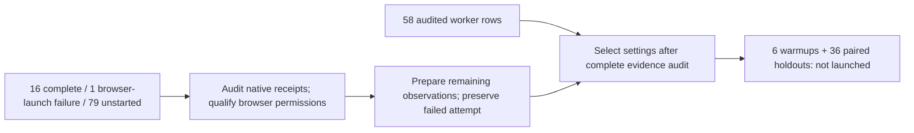
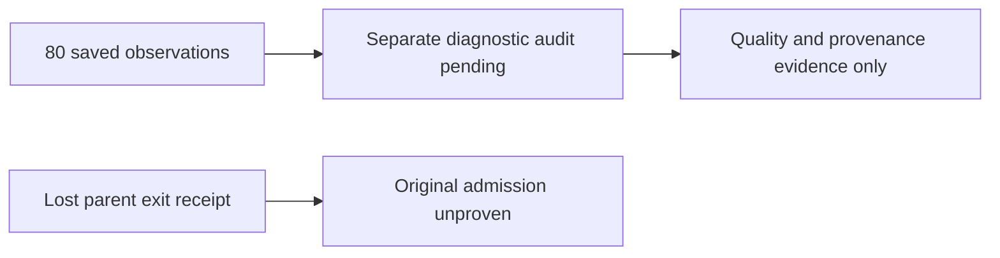

# Three-engine CPU quality qualification

**Evidence retention (2026-10-01):** Earlier `/private/tmp` benchmark evidence is unavailable. Historical measurements below are reported records, not freshly reverified results or a current public competitor claim. The [fresh October 1 study](2026-10-01-cpu-benchmarks.md) links its retained source receipts; its every-frame quality and complete cadence checks remain pending.

Status: all six CRF11 qualification exports passed independent receipt review. No three-engine rendering-speed result is established. Three timed executions remain separately preserved: the first aborted before rendering, the recovery stopped on an invalid decoder argument, and the decoder-revision screen stopped after 19 completed observations when fframes ultrafast at 11 workers produced only 299 of 300 required frames. The original 60-row screen remains failed and ineligible for statistics.

The workload was the pinned TextGrid scene: 3,334 labels, 1920×1080, 300 frames at 30fps, software rendering and software libx264 encoding. Each preset used one worker and automatic encoder threading. Current Remotion used version 4.0.531 and PNG capture. CRF candidates were preregistered as 11, 8, 5, 0; all three engines passed 11 separately for medium and ultrafast, so no later candidate was needed.

| Engine | Preset | Frames | Minimum SSIM Y | Minimum PSNR Y/U/V, dB |
| --- | --- | ---: | ---: | --- |
| fframes | medium | 300 | 0.995716 | 46.00 / 46.56 / 46.59 |
| Helios | medium | 300 | 0.996532 | 45.88 / 45.95 / 46.02 |
| Remotion | medium | 300 | 0.996315 | 45.34 / 45.60 / 45.57 |
| fframes | ultrafast | 300 | 0.996283 | 47.16 / 46.29 / 46.30 |
| Helios | ultrafast | 300 | 0.996113 | 47.10 / 46.08 / 46.07 |
| Remotion | ultrafast | 300 | 0.995958 | 46.14 / 45.49 / 45.38 |

Every frame had to pass SSIM Y≥0.995 and PSNR Y≥40/U≥35/V≥35dB against that engine's independently generated lossless oracle. This is codec fidelity, not cross-engine pixel equality. The independent review checked all 1,800 ordered records against raw metric logs, complete cadence starting at zero, retained video/oracle bytes,74 frozen source/tool/config pointers and 60 timer/quality receipt identities. No render or decoder was launched by the review.

The native pipelines retain different encoder defaults. Helios/fframes had keyint24, medium lookahead24 and quantizer bounds15..60; Remotion had keyint250, medium lookahead40 and bounds0..69. Common preset, CRF and fidelity gates must not be described as identical values for every encoder parameter. Native conversion/build differences and the original backend/provenance limitations also remain disclosed. The normalized external-encoder diagnostic is a separate study.

Qualification clocks remain original observations. They include different guard boundaries and are not paired superiority statistics. No failed export was replaced, no historical screening/finalist/confirmation export was rerun, and no source/runtime receipt was retroactively repaired. A review-script lookup error was corrected while preserving its diagnostic; it was not an export failure.

Local evidence root: `/private/tmp/helios-three-engine-20260930/qualification-result-review-v1/`. The independent report is `native-independent/report.md`; machine-readable review is `native-independent/audit-result.json`, SHA256 `52845818044ae06bd06b33123d0a1f6da1ff24a963bff541d1a28298cb2b5715`. Common-fidelity selection is `common-fidelity-selection-v1.json`, SHA256 `390786e4e6a1aa80319c632040ed6b966547d15ed3d65f62a37de187fd60d938`.

The original qualification plan remains SHA256 `52ac44bce1b615861c2ec57b2eec6f6cd638115d4016c76ee460e5aeb963f067`; admitted coordinator remains `465488b77e3396818d2f5740d70093b20cd264377f20d2030b41184b458d2f5b`. All six original MP4s and independent lossless references are retained. Evidence is currently local, not a published reproducibility bundle.

The first60 timed worker-screen release has independently checked source/runtime, original process-wall/RSS boundaries, host C11 and common CRF11, exact compiler order,140 configuration bindings and300 fresh output paths. Its immutable main is SHA256 `1e007e278b3ae0c7deb9f0213b089a4c7eed54b3351a8ab706034695b8b38469`; runmanifest is `f182288f95575885bfb16867e70b5c4e4186d28b7804fd83585596678d93ccf9`. The independent review receipt is `/private/tmp/helios-three-engine-20260930/timed-stage-preparation-v1/independent-first60-draft-v3-review.json`. Completed qualification and preparation drafts remain unchanged. Screening selects settings; it is not a paired superiority result.

The first launch stopped because the native receipt parent directory was absent. No renderer, native source-check subprocess, observer, oracle or decoder started. The failed bridge's129.570125ms is infrastructure evidence, not rendering performance. Its consumed slot, original clocks and all receipts remain unchanged; diagnosis is `/private/tmp/helios-three-engine-20260930/timed-failure-diagnosis-v1/native/report.md`.

A one-use recovery study prepares only the native parent containers outside comparative clocks, retains the immutable settings main, and binds a distinct authority and new output/config paths. Authority SHA256 is `805717ed563082f539845e8dbf3628716b04e683020bfb7bedbe619a4960bd9e`; admitted recovery runmanifest is `c4cf64963d27e00ecca995c251baa4f0ba7c6e2b3b34fb996103437a14603b71`. Its claim identities include the authority, so arbitrary run IDs cannot reopen consumed recovery slots. All three real source-only preflights passed without creating frames. The recovery preserves the60-row settings/order, timers, fidelity gates, cooldown and stop-on-failure policy. It is a disclosed new study, not continuation of the aborted attempt.

The recovery coordinator exited1 after one attempted row, `screen-workers-0000` (fframes, medium, W1, automatic encoder threads). Its preflight and postflight both passed294 file identities. The renderer itself exited0 after33,772.603333ms, retaining a167,665,138-byte MP4. The sole strict final decoder then exited1 after82.446583ms because ffprobe rejected `-codec h264` without a media specifier; the corrected option is `-codec:v h264`. The rejection happened before media reading. No completed service, oracle or quality audit followed, so the successful worker clock is not an eligible performance result. The render bridge's37,104.529083ms is a whole supervisor observation. Its10,002.272667ms cooldown remained outside all service clocks. No retry, replacement, ranking or headline claim occurred.

Terminal and partial results are retained under `/private/tmp/helios-three-engine-20260930/timed-coordinator-recovery-v1/runs/timed-screen-workers-c11-crf11-recovery-v1/`. Independent native diagnosis is `/private/tmp/helios-three-engine-20260930/timed-recovery-failure-diagnosis-v1/native/report.md`, with evidence SHA256 `d7b017a72bd1f9edce78e4c5fd4c1080acf721f2662741f770ccbf967ff74beb`. Independent coordinator diagnosis is `/private/tmp/helios-three-engine-20260930/timed-recovery-failure-diagnosis-v1/coordinator/diagnosis.json`, SHA256 `36202d6a5a0b78e3f9f673445adb18d13df547afb8c9faf595b6b42302ca7d8e`. All19 coordinator checks passed, including original timers, exactly one consumed slot, completed cleanup and one accepted completion-message enqueue. Cancellation was not exercised.

The completed qualification used a different verifier without the defective decoder option and remains valid. The prospective correction changes the strict-decoder command and its exact-command validator, the later audit decoder, minimal auxiliary routing and failed-decoder receipt labeling. The fixed protocol path also requires copied native and Remotion control helpers and minimal entry-point import routing. Rendering/encoding kernels, oracle generation, settings, quality metrics and thresholds remain unchanged. These control changes must be included in the new source bindings.

One separately authorized diagnostic used the corrected exact command on the retained failed MP4. It exited0 with empty stderr and passed all300 ordered frames,1920×1080, yuv420p, limited BT601 and30fps cadence checks. Its11,227.792625ms diagnostic observation remains separate; it does not repair the failed row's original service clock or establish an every-frame fidelity verdict. A further timed study requires a distinct reviewed decoder revision, the complete60-row settings/order and fresh authority-bound paths; the pre-render recovery authority is spent.

A separately disclosed decoder-revision worker screen has passed independent native, Remotion and combined controller review. The final review caught and corrected a coordinator container check that incorrectly derived the output owner from the copied module's parent. The actual published contract and parent-readiness check passed before any claim or rendering clock. The new study preserves all60 ordered requests, uses140 fresh configuration files, and locks577 direct source/runtime/provenance identities including the final review/grant receipts. Final main SHA256 is `a00234cca42e4105588f4c64634288d1962b56b486e619ceba06901d64a0764b`; authority is `074a49a59de696a373eb52931a9be05ca7b133c247a4210d49097ff9c8f8efa8`; runmanifest is `8072813849b478a84a5c7e53f9d1fa3350dead6314f3ad2333e1ef59ad8b51d7`. Publication receipt is `/private/tmp/helios-three-engine-20260930/timed-decoder-study-v1/release-terminal.json`. This is a new complete study under a reviewed harness revision, not a continuation or repair of either failed timing attempt.

The decoder-revision coordinator terminated with exit1 after20 of60 scheduled attempts. Rows0–18 completed their original render, oracle, quality, resource and retention steps; row19 (`screen-workers-0019`, fframes ultrafast W11 with automatic encoder threads) failed during final output validation. This is not another decoder-argument defect. The renderer and corrected strict decoder both exited0, but the retained decode record contains299 presentation frames and duration9.966667 seconds. Its timestamps run from0 through152576 in512-tick steps at timebase1/15360; the expected final timestamp153088 is absent. The completeness validator exited1. No verified service, oracle or quality record was created for that failed observation. Successful worker exit does not make incomplete output eligible.

The actual coordinator's preflight and postflight both passed592 identities. Watcher terminal SHA256 is `c642da46edba7604d62f06e93764e5cb10c5bb809092071c85d4d9ec89c88c95`; coordinator terminal is `46a46cc6ae83babbae54e21dfe3702abc0456d07cf769cdf5127d547c2724038`; results are `c7bc3bc8e04ae75f475934d1a4550d86615281fb51b0f5b09bc9d84dc5e2745c`. They are retained under `/private/tmp/helios-three-engine-20260930/timed-coordinator-decoder-v1/runs/timed-screen-workers-c11-crf11-decoder-v1/`. The reviewed once-use evidence runner returned a failed-stage diagnostic with zero row callbacks and no statistics, as required by its contract. Its report is `/private/tmp/helios-three-engine-20260930/worker-screen-independent-audit-v1/runner/audit-result-v1/report.json`. Separate diagnostic consumers must verify the completed rows without changing their original complete-stage-ineligible labels.

Independent saved-evidence diagnostics subsequently admitted all19 completed observations:9fframes,5Helios and5Remotion, totaling5,700 ordered frames with every-frame fidelity and complete cadence. Original source/runtime/config and process-clock bindings remained unchanged. Native report is `/private/tmp/helios-three-engine-20260930/decoder-terminal-diagnosis-v1/native-batch-v3/actual-diagnostic-v1/report.json`, SHA256 `7f000fc69305f35cf298af8e68269aff4d2da23b640c1a9aec25f3020424ede7`. Combined admission is `decoder-terminal-diagnosis-v1/completed19-admission-v1.json`, SHA256 `8834cd5bea7460b19c306ef31746e9dddbb46828626b43357914ffea16fd524c`. This grants diagnostic evidence validity only: every original whole-stage eligibility flag stays false.

Two additional failed evidence-auditor attempts are preserved separately. They stopped before row callbacks because generic recursive JSON traversal confused historical proposal snapshots and temporary proof-media paths with active dependencies. The reviewed V3 consumer follows the native and Remotion producers' actual dependency semantics, retains592 run identities and selected-media checks, and verified17,152 declared current files before/finally after auditing. It also verified47 archived source references and the retained copy of a moved boundary MP4. Eighteen older snapshot byte proofs remain unavailable and disclosed. Declared source/runtime bytes are not independent host attestation; compressed-native-oracle and removed-derived-Remotion-raw limitations remain. No export, oracle or decoder was rerun by these diagnostics.

A prospective one-use continuation admits only39 previously unstarted requests, original indices20–59 excluding44. Row44 is observation1 of the already ineligible fframes ultrafast W11 profile; index49 is Remotion and remains included. The exclusion follows completeness failure, not measured speed. No consumed row is reopened, replaced or relabeled. Rendering kernels, main, settings, all15 artifacts and original unstarted configs stay fixed. A distinct reviewed controller owns new claims and terminals, retains stop-on-any-failure and10-second cooldown, and passed real source-only preflight for688 identities before any new render. Final manifest SHA256 is `d7610765d6366226178812720ee15b69f4ae814b46c7ad029ec54383918200c7`; authority is `f8c39d20d1dac93385df8cfdac6ba0d74da1b6af83c78ae77a8ee4d10e874727`.

The39-request continuation finished with exit0 after all39 scheduled requests. Preflight and postflight each passed688 identities. No consumed historical slot was reopened and no completed export was rerun. Original whole-coordinator diagnostic duration remains7,575,604.781875ms; it is not an engine rendering-speed observation. Actual results are `/private/tmp/helios-three-engine-20260930/worker-screen-continuation-v1/controller/runs/timed-screen-workers-c11-crf11-continuation-v1/results.json`, SHA256 `4ebd88403b88153fe2b1a6883a866ab4f75f5dd2f54a625d2078017b77e9b3ef`.

The separate saved-evidence consumer passed all39 new observations and rebound the original19 admissions, without invoking a renderer or decoder. It verified every-frame fidelity, complete cadence, declared source/runtime/config identities and original service-clock bindings. The closed ledger contains58 successes, one failure and one explicitly unrun slot:18fframes,20Helios and20Remotion accepted outputs, totaling17,400 frames and29 complete profile pairs. The original60-row study remains failed; whole-stage statistics and superiority claims remain prohibited. Actual audit report is `/private/tmp/helios-three-engine-20260930/continuation-evidence-consumer-v1/actual-audit-v1/report.json`, SHA256 `c0d714e90eef91e330eecab0beb6446c8e23237e17cd5784c3ba0166a5b3a860`. Its15 prepared synthetic caller/wrapper checks also passed before this audit. Audit duration is not a performance observation.

The unchanged preregistered within-cohort median-service selection and1% anchor-band/RSS tie rule retained these automatic-thread worker candidates:

| Engine | Medium workers | Ultrafast workers |
| --- | --- | --- |
| fframes | 11, 6 | 6, 4 |
| Helios | 2, 4 | 4, 6 |
| Remotion | 4, 6 | 4, 6 |

Independent selection review passed1,089 checks, binding all58 original rows and their service/quality receipts. Report is `/private/tmp/helios-three-engine-20260930/worker-screen-selection-v2/independent-review-v1.json`, SHA256 `78361e242fb9d2536eaf3ff2481219452cb404f0fd764bd18ec1c15040d51c14`. A failed metadata-selection attempt (`KeyError: profile`) remains separately preserved; it launched no exports. The corrected selection was run once under a new output namespace.

Next delta: admit the disabled96-row draft testing explicit encoder threads1,2,4,8 at the two retained worker counts per cohort. Completed automatic-thread observations are reused, not rerendered. Capacity/retention, fresh source/runtime/config registrations and once-use execution authority must be resolved first. Screening still does not establish superiority; six-round paired holdouts remain pending. Declared provenance is not complete host attestation, and native encoder defaults/build differences remain disclosed. Orbs and scheduler are distinct host studies; neither source-transfer nor production authorization follows from this admission. Evidence remains local, not a public reproducibility bundle.

The fresh 96-row encoder-thread screen subsequently passed source review, all 224 configuration checks, four native runtime guards and one Remotion runtime guard. A current disk observation found 49,193,373,696 bytes available against a conditional estimate of 31,872,505,851 bytes including reserve; future deduplication and completion are not guaranteed. The final manifest is `b17ca70fd6d1a8d6b07fc37f7f14f8ed48408d2c78f5e80047d26e7d6993dc28`. The coordinator and completion watcher were verified running with their actual parent-child relationship, after 1,065 input identities passed. Results will be retained under `/private/tmp/helios-three-engine-20260930/thread-stage-preparation-v1/controller/runs/timed-screen-encoder-threads-c11-crf11-v1/`; startup receipt is `/private/tmp/helios-three-engine-20260930/thread-screen-watch-v3/startup-verified-v1.json`. No new result is admitted yet. Watcher lifecycle checks are synthetic, and external completion-message delivery remains pending. Original failed studies, timers and completed exports remain preserved; this screen does not authorize superiority or publication claims.

A repeated completion notification matched the existing continuation audit. A small reconciliation rebound all58 original row hashes against the two saved attempt snapshots, all39 new report bindings and all29 complete profile pairs. It did not repeat quality callbacks, media reads, rendering or decoding. Receipt: `/private/tmp/helios-three-engine-20260930/continuation-evidence-consumer-v1/notification-proof-reconciliation-v2.json`, SHA256 `4ed799e7aa6f8900ec982e6470cd48262a4b5b0b4cc78f70ba5449ee8e1e0ad9`. The previously bound all-frame audit remains authoritative.

Separate subagents prepared the new screen's native and Remotion evidence verifiers. Static review accepted the native source and the repaired Remotion facade; a rejected facade version remains archived. The fix gives callbacks a deep copy so a failed check cannot mutate the caller's in-memory original row. Independent source reviews also found no blocking issues in the settings selector, six-round paired-statistics helper and common evidence caller. Tests were deferred during the timed screen; all58 prepared synthetic methods passed after its actual termination. These checks grant no new result admission, settings selection, export authority or speed claim. Actual saved-evidence integration remains pending.

The encoder-thread screen subsequently stopped with exit1 after17 attempts:16 native observations completed and the first Remotion observation, medium W4/T1, failed during browser launch. Original preflight and postflight each passed1,065 identities. Chromium reported a denied Mach `bootstrap_check_in` registration before launching its browser; the render output directory contains only its failure terminal, with no MP4, details record or frames directory. This is a host-permission infrastructure failure, not evidence that the Remotion profile fails fidelity or performs poorly. The original96-row study stays failed, all16 successful rows retain their original complete-stage eligibility false, and79 requests remain unstarted. A separate diagnostic consumer must audit those16 native outputs without promoting the failed study. Completion-message delivery also failed; termination was verified through the original process handle, not inferred from silence. No completed export was rerun. Diagnosis: `/private/tmp/helios-three-engine-20260930/thread-screen-terminal-diagnosis-v1/report.json`, SHA256 `804337137b926e0b65d4faee441fa7e0ee175b0a7129285a6b4561922e14967d`.

The separate completed16 saved-file diagnostic stopped at its first native row. Its current source/runtime preflight and final stability checks passed, binding18,110 references; that row's300 raw quality records and300-frame presentation cadence also passed. Overall admission remains false because the verifier compared oracle and render `perf_counter` readings from different supervisor processes. The retained Python runtime is3.9.6; [CPython3.9.6's macOS implementation](https://github.com/python/cpython/blob/v3.9.6/Python/pytime.c#L771) subtracts a process-local time origin, so those readings do not establish absolute cross-process order. Original within-process duration differences remain unchanged. The failed diagnostic report remains `/private/tmp/helios-three-engine-20260930/thread-screen-completed16-diagnostic-preparation-v1/actual-diagnostic-v1/report.json`, SHA256 `4d95595729f058bda2151724e8a499919601f044bb3552c66b33ead4d5ca5316`.

A separate source revision checks the byte-bound synchronous coordinator and each original waited/reaped render, oracle and audit bridge record. It explicitly discloses that absolute historical sequence timestamps were not retained; it does not reconstruct them or alter service timers. Six focused synthetic sequence checks and14 existing diagnostic checks passed. Independent review and actual evidence admission remain pending. A zero-frame browser permission diagnostic is also under source repair after review found incomplete owned-descendant cleanup. No new benchmark export, browser probe, parameter selection or superiority result follows from these preparations. All12 goal requirements remain retained in the immutable phase ledger `/private/tmp/helios-three-engine-20260930/goal-evidence-audit-v1/evidence-ledger-v24.json`.

That clock-aware revision subsequently passed independent source review and one actual saved-file audit of all16 native observations. All4,800 frame-quality records and presentation frames passed, with1,065 declared identities and18,110 stable references. Independent result review rebound each canonical original row, all768 callback references and each unchanged service receipt. Original complete-stage eligibility remains false; this is diagnostic evidence for future profile selection, not a complete-grid selection or speed result. The prior failed diagnostic remains preserved. Actual revised report: `/private/tmp/helios-three-engine-20260930/thread-screen-completed16-clock-revision-v1/actual-diagnostic-v1/report.json`, SHA256 `f63ad1798de154b43f6d6bddd7dcfbc874c634ff69eb3a4fc347a78befa19ef1`. Independent result review SHA256: `f36864bd2f59cb70929c6e43515d1a0b3c825de1e0eef7d10f275c1775a3b7bb`.

The repaired zero-frame browser diagnostic also passed under supported platform `require_escalated` execution. The pinned Remotion browser opened and closed with SwiftShader/GraphiteDawnVulkan interpretation;15,112 declared source/runtime identities,31 symlinks and83 resolved paths remained unchanged. Owned-process cleanup was proven, with exit0 and no errors. No composition, frame export, oracle, decoder or service timer ran. This verifies the supported permission path for that diagnostic and does not attest the whole host or authorize production changes. Result: `/private/tmp/helios-three-engine-20260930/thread-screen-infrastructure-completion-plan-v1/browser-probe-proof-v1/probe-result.json`, SHA256 `1588f4b576d4dfef295bf2e8e919d762d88941b2e25e545746cfa645460a0373`.

The separately named80-observation continuation is source-prepared only:79 previously unstarted settings and one fresh observation for the infrastructure-failed Remotion setting, preserving the failed physical attempt. Its13 Python and88 pure Node checks,192 config bindings and26 AST checks passed. Independent source review, registration of actual diagnostic/probe bindings, fresh capacity/runtime admission and a completion watcher remain required before launch. No new export was started. Current immutable ledger: `/private/tmp/helios-three-engine-20260930/goal-evidence-audit-v1/evidence-ledger-v25.json`.

The80-observation continuation subsequently passed revised independent source review. The initial source was rejected because it could accept a cooldown shorter than10 seconds; the repaired source requires a completed, finite same-coordinator-clock cooldown of at least10,000ms before advancing or admitting a row. The rejected source and failing check remain archived. Numerical settings, raw service timer formulas and192 config bytes were preserved.

The first guard-only admission helper failed after16 successful native preflights because it referenced a nonexistent Remotion preflight filename; no export started. A separately reviewed helper reused those native receipts and passed eight pure Remotion request/artifact validators, installed Remotion closure guards and1,391 declared source/config bindings. Actual capacity was11 available CPUs,18GiB RAM and43,839,463,424 free disk bytes against a conservative31,872,505,851-byte requirement. Available CPUs do not attest exclusive host ownership. Guard durations are diagnostics, not rendering measurements. Actual admission report SHA256: `d803288ca9816b68ac8414916fd3c6a73d663a86a0c1619b6b16d8715be43e24`.

The finite80 continuation and reviewed blocking completion watcher are now started through supported platform escalation, tool session50656. Startup receipt confirms watcher29253 owns coordinator29254; one sanitized completion queue attempt is armed after actual child reap. Delivery has not yet occurred or been proven. Results will be saved under `/private/tmp/helios-three-engine-20260930/thread-screen-infrastructure-continuation-preparation-v1/controller/runs/timed-screen-encoder-threads-infrastructure-completion-c11-crf11-v1`. These80 observations cover79 previously unstarted settings plus a separately named fresh observation of the infrastructure-failed Remotion setting. The16 completed observations are reused as saved diagnostic evidence. Original studies remain failed, original timers and failed attempts are preserved, and no completed export is rerun. Separate every-frame saved-evidence admission and a typed physical/logical ledger remain necessary before profile selection; six warmups and36 holdouts remain unstarted. No superiority claim, Amp sign-in, R2 or production authorization follows. Immutable phase ledger: `/private/tmp/helios-three-engine-20260930/goal-evidence-audit-v1/evidence-ledger-v26.json`.

While the80-observation job remains live on its original supported process handle, a disabled saved-evidence packet now contains five prospective native/Remotion verifier/facade/sequence modules and a typed16+80+old58 consumer plan. No live result or media inspection, fixture execution or audit callback occurred during preparation. Packet SHA256: `421386d81fd1d933c7afcfc7b655ea280589af3360a871e02e059e143ee8e820`; independent source review and common caller/ledger implementation remain pending.

An independent small-source interface review confirms that the old successor cannot directly accept the new physical/logical ledger because it expects a single full96 audit and original96 saved attempts. A separate adapter is required, with every raw physical row/receipt bound independently to its logical slot, retaining the failed physical Remotion attempt and79 original unstarted declarations. Final selection must compare all30 automatic plus48 explicit candidates, yielding77 eligible profile pairs conditionally on full admission; retaining only the12 automatic worker winners would change the frozen policy. Missing RSS staysnull and blocks any multicandidate anchored1% timing band, including later bands; no substitute metric or candidate removal is admitted. Independent interface review SHA256: `6774f263cbb540c36d45524cb392c7b68fb50da4e057936c1ca93f6049b9783b`. No selector ran, no timing result was added, and no superiority claim follows. Current immutable ledger: `/private/tmp/helios-three-engine-20260930/goal-evidence-audit-v1/evidence-ledger-v27.json`.

Prospective audit source review subsequently identified an inner native callback-copy stability gap: ordinary Python equality treats integer1 and booleantrue as equal, while the future caller cannot see that inner copy. A separately named `native/thread_wrapper_v2.py` tightens both row checks to canonical JSON equality; originalV1 bytes remain preserved. Revised facade SHA256: `83b25f2ba71611ff294f8919ee9de12dccba2044f82e7c58ce91562fa64c9688`. AST parsing passed; independent revision review and post-terminal mutation fixtures remain pending. No actual audit callback, live result inspection, benchmark or timing change occurred. New common caller/typed-ledger implementation is assigned to this revised facade binding, with all admission and publication gates still disabled. Current immutable ledger: `/private/tmp/helios-three-engine-20260930/goal-evidence-audit-v1/evidence-ledger-v28.json`.

Phase ledger v30: audit source and private claims preparation

The separate native V2 facade passed independent source review after replacing ordinary equality with canonical JSON checks. This closes the prospective integer/boolean mutation gap in source; its actual mutation fixtures remain deferred until the finite timed job terminates. Source review does not admit new rendering evidence.

The prospective common caller and typed ledger now have a frozen implementation. Independent source review found two bounded defects: callback reference records need exact key/type checks, and the deferred fixture loader cannot resolve nested sequence modules with `Path.with_name`. The original implementation and rejection are preserved; a minimal V2 repair is assigned. Nine AST checks passed and 33 fixture methods were prepared, but none was executed during the timed study. Independent review: `/private/tmp/helios-three-engine-20260930/thread-screen-infrastructure-common-independent-review-v1/review.json`, SHA256 `717fe0597d530da85d7c29d086e00c4493f8a75a2db0a0a5191ceb54531c207a`.

The future selector uses a pure byte-input adapter and a separate independent result receipt plus root admission. Its source contract explicitly binds the executed caller and proposal outside the parent audit's reference list; it does not fabricate references or let the audit admit itself. No actual independent result receipt or selector admission exists yet. All 30 automatic and 48 explicit candidates remain in the frozen pool, conditionally yielding 77 eligible pairs after complete evidence admission. Original failed attempts, unstarted declarations, service timers and unavailable RSS remain preserved. No settings selection, warmup or holdout ran in this phase.

A private claims-sheet revision passed independent editorial review while preserving every historical number and the original draft prefix. It distinguishes qualification, screening, diagnostic audits and pending holdouts, and discloses native encoding/rasterization, host, memory and provenance limits. Draft: `/private/tmp/helios-three-engine-20260930/marketing-claim-sheet-v2/CLAIMS.md`. Review SHA256: `00b4bf367a20c2fb0c6c4b35d2932692fe9a2203abc16e5a26c10f07e43f336f`. Publication remains disabled; this is not a new speed result or a public reproduction bundle.

The finite80 study retains its original blocking watcher. No live results, media or runtime were read in this phase; completion and actual admission have not been consumed. No completed export was rerun or timer changed. Orbs still needs actual Amp CLI sign-in, and no R2 or production authorization follows. All12 original goal requirements remain intact and incomplete in `/private/tmp/helios-three-engine-20260930/goal-evidence-audit-v1/evidence-ledger-v30.json`, SHA256 `7fbdf0a3c3aaee4e047fb2386e8446746f92c1abfb01d651efdbc4c720dafc56`.

Phase ledger v31: bounded common audit repair

The common V2 repair is frozen with rejected V1 source bytes archived and verified. It enforces exact callback reference shapes and types, preserves valid two-field references and zero-byte files, and resolves nested fixture module paths under the fixture directory. Only `check_callback` changed in the caller; support, ledger, service timers and output schemas remain unchanged. Four AST checks passed; 41 meaningful fixtures are prepared and none was executed. Proposal: `/private/tmp/helios-three-engine-20260930/thread-screen-infrastructure-evidence-preparation-v1/common-source-proposal-prepared-v2.json`, SHA256 `40e6057cda2047f42ef21858f7d8425c80f62c4fb74b1d0628d0e994cdfeb510`. Independent delta review remains pending.

The interface gained an append-only revision note. A separate source-only root authority V3 binds that new interface identity; V2 remains unchanged and fails closed for the changed live path. Only interface and predecessor metadata changed, with no ranking or admission policy change and no actual receipt or admission created. Contract: `/private/tmp/helios-three-engine-20260930/thread-screen-typed-selection-authority-contract-v3/contract.json`, SHA256 `39897c2618190f0c7fe7f578f4df825bc5b2409b92567b67df88d7d762fedcff`. Its independent metadata delta review remains pending.

One bounded wait on the original supported process handle returned live session50656 without output. The study and completion watcher were not restarted, and no live results, timers or media were inspected. Tests, audit callbacks, compiler/ranking and fresh holdouts remain deferred. The pure selector implementation is being frozen separately for review. Immutable phase ledger: `/private/tmp/helios-three-engine-20260930/goal-evidence-audit-v1/evidence-ledger-v31.json`, SHA256 `6842981d5d28a0cc431599fe2588739f6bb2673e1b8da08747be0ac5c095aa77`. All12 requirements and the active goal remain unchanged.

The bounded common V2 source repair and separate authority V3 metadata delta subsequently passed independent review with no new blockers. Six archived copies, ten small source identities and nine AST parses were checked. The caller definition delta remains only `check_callback`; all33 original test definitions were preserved and eight meaningful cases added. All41 tests remain unexecuted. Review: `/private/tmp/helios-three-engine-20260930/thread-screen-infrastructure-common-independent-review-v2/review.json`, SHA256 `1db26bd666117a527da2ee8b6c80456d824a0683d2bc3472e6f7719fc35ef9f4`. This grants no execution, actual-audit, selection or speed authority.

The pure typed selector packet is also frozen and was handed directly to the existing independent subagent reviewer. Five source ASTs and ten contract/source equality checks passed;22 test methods are prepared and unrun. Proposal: `/private/tmp/helios-three-engine-20260930/thread-screen-typed-successor-preparation-v1/SOURCE-PROPOSAL.json`, SHA256 `47bdc07e96f8501f7324a54ffce29d646de55b4f6b84346cc3ba1b51ca2db88b`. No compiler, ranking, admission or holdout executed. Current benchmark and watcher remain unchanged. Latest immutable ledger: `/private/tmp/helios-three-engine-20260930/goal-evidence-audit-v1/evidence-ledger-v32.json`.

During finite selector source review, the reviewer identified one integration mismatch: the selector requires a full three-field callback reference to equal the parent lock, although the accepted common caller preserves legitimate two-field Remotion references. No actual selector ran. The frozen packet remains preserved pending the formal report. If this is the sole blocker, the existing source owner and reviewer are authorized to archive it, make the bounded schema/canonical supplied-field repair, add a mixed-reference deferred acceptance case and review the separate V2 delta. Additional nontrivial blockers return to the root. This source-only fanout permits no tests, imports, compiler/ranking, media/runtime reads, actual admission or timing changes while the benchmark runs. Latest immutable ledger: `/private/tmp/helios-three-engine-20260930/goal-evidence-audit-v1/evidence-ledger-v33.json`.

Phase ledger v34: typed selector repair and disabled actual-audit preparation

The typed selector V2 repair passed independent source review. It accepts exact two- or three-field callback references when supplied fields match the parent lock, preserving native/Remotion semantics and zero-byte records. Only `thread_proofs` changed and a bounded reference validator was added;26 other function bodies and all frozen policy statements remain unchanged. Fifteen rejected V1 files remain archived. The updated24 synthetic tests are prepared and unrun; no compiler, ranking or actual selector ran. Review: `/private/tmp/helios-three-engine-20260930/thread-screen-typed-successor-independent-review-v2/review.json`, SHA256 `bff6ef35b2f560b437d436a7ef56825413f0464e172e00b0b995ec9e89f228a8`. Proposal SHA256: `479d145fed1057a44106275fdc9d2ca88087416764e831652cbccf98cb2da737`.

A separate five-file, non-executable preparation packet resolves the accepted common caller's seven-key actual-admission shape and exact CLI. It keeps execution and post-terminal approval false and unknown historical registry hashes null. Its ordered gates require authoritative child success before current-result reads, source-pinned fixtures, actual historical parent/pointer/archive registry relationships and review, external root admission, one saved-file audit, independent actual result review and separate selector admission. The caller does not validate external fixture proofs itself; root admission must supply that independent authority. The plan neither treats old report hashes as current guards nor invents a full64-current-native or successful original96 stage. Plan: `/private/tmp/helios-three-engine-20260930/thread-screen-infrastructure-postterminal-audit-admission-preparation-v1/admission-plan-v1.json`. Source proposal SHA256: `bcc3a2bccca2707906a1a484acc3b9fdcf7e05d8c6dd6dd90927ab41ff6eab33`; independent preparation review is pending. Actual fixture, registry, terminal and result receipts remain absent.

One bounded original-handle observation confirmed live session50656 without output after this source work. The benchmark, watcher and timers remain unchanged; no live results/media/runtime were inspected or completed exports rerun. Latest immutable ledger: `/private/tmp/helios-three-engine-20260930/goal-evidence-audit-v1/evidence-ledger-v34.json`. All12 goal requirements remain retained and the goal remains active.

Phase ledger v35: disabled admission review and exact fixture inventory

The disabled actual-audit admission plan passed independent contract review:11 finite checks and26 small source identities, without imports, tests or operational evidence reads. No source contract blockers remain; actual terminals, source-pinned fixture results, historical registry relationships and separate root/result/selector admission are still required. Review: `/private/tmp/helios-three-engine-20260930/thread-screen-infrastructure-postterminal-audit-admission-independent-review-v1/review.json`, SHA256 `0a9e412b6b00a21937451089d2d96d805924243347ea0de06f05ddf8b6c782ad`.

A separate mechanical source inventory established that the current common41 harness exercises the nativeV2 facade with an injected fake kernel and four current sequence-helper cases. It does not load the current native kernel, and no exact current Remotion kernel/facade harness was found in the allowed source namespaces. Older completed16 and legacy thread fixtures are not acceptance evidence for these current modules; archived commonV1 relative paths are not a runnable entrypoint. Inventory: `/private/tmp/helios-three-engine-20260930/thread-screen-infrastructure-test-harness-inventory-v1/inventory.md`, SHA256 `0220f0b09d0ccde51f737582330d1aecc1707dc8bafe08c2752ecea65ae22c1f`. A bounded source-only fanout is preparing the missing current-kernel/Remotion checks and exact target pins, while reusing already prepared common/typed tests. All tests remain deferred until actual terminal verification.

One bounded original-handle wait confirmed live session50656 without output. The benchmark and watcher remain unchanged; no current result, service, attempt, runtime or media was inspected, no export was restarted and no original timer was changed. Latest immutable ledger: `/private/tmp/helios-three-engine-20260930/goal-evidence-audit-v1/evidence-ledger-v35.json`. All12 requirements and the full active goal remain intact.

The missing current-module fixture packet is now frozen separately with25 deferred checks:7native,14Remotion and4helper checks, plus a loader pinned to all five exact current verifier sources. Four source ASTs parsed; no module imports, tests or full audit callbacks ran. It covers pure kernel validators and current facade/path/sequence behavior with injected fake callbacks; the existing41 common and24 typed-selector tests remain separately required. Proposal: `/private/tmp/helios-three-engine-20260930/thread-screen-infrastructure-postterminal-fixture-preparation-v1/SOURCE-PROPOSAL.json`, SHA256 `159b64bd4a65ff6d2b0dc4d227d7dc9f139bd6d7016ab95adb5a291f79b0f7c8`. Independent source review is dispatched. This supplies prepared checks, not actual acceptance or every-frame evidence. Latest immutable ledger: `/private/tmp/helios-three-engine-20260930/goal-evidence-audit-v1/evidence-ledger-v36.json`.

Phase ledger v37: all current acceptance sources reviewed, actual execution pending

Independent review accepted the focused25-check current native/Remotion fixture packet with no source blockers. It verified21 small source identities and nine AST parses; the loader binds current source snapshots, and fake cases reach the intended API guards. No actual imports, tests, full audit callbacks or runtime evidence were consumed. Review: `/private/tmp/helios-three-engine-20260930/thread-screen-infrastructure-postterminal-fixture-independent-review-v1/review.json`, SHA256 `4b843dd5072dd264054f1e066a76d8ab5160be57fc1f5e1285a473dfedef2e14`. Together with the separate41 common and24 typed-selector methods,90 current-source checks are prepared and independently reviewed; zero have executed. Source review remains distinct from actual acceptance and every-frame admission.

After this review, one60-second supported wait returned original live session50656 without terminal output. No log or current result was read, and neither job nor watcher was restarted. The existing one-shot watcher remains responsible for actual terminal save and completion-message delivery; delivery has not yet been proven. Terminal success must precede current result inspection, actual fixtures, historical registry/root admission, once-use saved-evidence audit, independent actual-result review and separate selector admission. Profile selection and six warmups/36 fresh holdouts remain unstarted; all failed studies and timers are preserved. Latest immutable ledger: `/private/tmp/helios-three-engine-20260930/goal-evidence-audit-v1/evidence-ledger-v37.json`. All12 original requirements and the goal remain active and incomplete.

Phase ledger v38: consumed notification and finite remote source review

The continuation-audit notification was already consumed. Its small saved reconciliation still matches the watcher identity and preserves the accepted39 new every-frame proofs,58 successful worker rows,29 pairs and17400 frames. No historical audit callback, export or original timer was rerun or changed; original failed studies remain failed.

Remote header reconciliation proves68 regular files,51 matching source-manifest entries and17 unmanifested regular files, with zero directories. This is a genuine manifest-membership gap; archive bodies and the supplied archive hash were not re-read. A bounded packaging-producer inventory is pending. Static review of the confirmed local Worker/adapter establishes that both staged compact request shapes are already accepted: two jobs,12 timed exports each,24 total. No controller deployment is demonstrated necessary. Actual deployed version/isolated bindings, warmup count, whole-job lifecycle cap and full source closure remain unverified. This is an older two-engine component plan and cannot establish current three-engine or Remotion superiority. Review: `/private/tmp/helios-three-engine-20260930/remote-compact-scope-review-v2/review.md`.

One60-second supported wait returned original live session50656 without output. Current rows, attempt/service records, runtime and media were not inspected; the existing completion watcher remains unchanged. No tests, selection or holdouts ran. Amp CLI sign-in remains unverified, with a value-free user confirmation pending. Prior automatic approval rejection for destination-specific R2 source transfer remains unresolved; no upload, remote job, deployment, deletion or production authorization is inferred. All12 requirements and the active incomplete goal remain preserved in `/private/tmp/helios-three-engine-20260930/goal-evidence-audit-v1/evidence-ledger-v38.json`.

The bounded packaging lookup subsequently finished: the source build-capsule.py staging route explains how additional files can enter the archive, but the manifest producer/schema remains unknown, so the17-file closure gap is unresolved. The source inventory records and discards an initial capsule-* exclusion-glob miss; it did not use those hits as evidence. Completion receipt: `/private/tmp/helios-three-engine-20260930/goal-evidence-audit-v1/remote-phase-completion-v38.json`. No external action or benchmark ran.

Phase ledger v39: actual source closure and compact execution scope

A source-only audit hashed all68 safe regular members of the staged136597-byte archive without extraction or execution. Root verified its actual SHA256 matches e3dd348860fe3fc0fbfb90bb7c66a447385baef355b44148491b732714e71366 and checked exact header names/sizes plus the complete sidecar. The old51-entry manifest is stale:37 hashes match,14 differ and17 members are undeclared. No path is absent. The staged Worker/adapter actually match the current reviewed local sources; the old manifest entries do not. Neither archive nor legacy manifest was rewritten, and the new sidecar does not retroactively validate old runs.

A bounded ten-source static review establishes24 top-level timed exports and zero explicit warmup exports in the selected branch; qualification adds8–24 driver invocations, whose internal render/encode work remains unverified. The90m setting is inactivity, not a hard whole-job/cost cap. Confirmed retention code archives the stale source manifest; visible aggregate/scalar checks and compact retention do not establish current every-frame PTS/raw-record bindings. These are prospective two-engine component-study limits, not new rendering measurements. Review: `/private/tmp/helios-three-engine-20260930/remote-compact-execution-scope-v1/README.md`.

Existing sanitized receipts name helios-cpu-benchmark/version ffe610c2-d549-43c0-afc2-dc9a794f81ae but do not establish active deployed or namespace/artifact bindings. Project Wrangler4.64.0 help verified the read-only deployments-list syntax; actual default and supported-platform attempts failed, and a final known-phrase classifier found non-interactive rejection without printing/persisting raw diagnostics. A value-free CLI login confirmation is pending; no credentials or process environment were inspected. No source upload, render job, deployment or production authorization occurred.

One original-handle60second wait returned live session50656 with no output; the exact watcher terminal was absent at one earlier check. Existing watcher remains unchanged. No current rendering records, runtime/media hashes, module imports, tests, ranking or holdouts ran, and no historical export or timer changed. All12 requirements remain unchanged and the goal is active and incomplete in `/private/tmp/helios-three-engine-20260930/goal-evidence-audit-v1/evidence-ledger-v39.json`.

Phase ledger v40: private remote qualification repair, source review only

The duplicate continuation audit remains reconciled to39new proofs,58accepted rows,29pairs and17400frames. No original export, quality callback or timer was rerun; failed studies remain failed.

Correction to v39: the original68-member capsule has no packaged source-manifest.json. Its stale51-entry manifest is external metadata, while publication unconditionally requires the missing file. The historical capsule/metadata remain unchanged. A separately staged private candidate now materializes a complete70-entry source closure (original9changed/59unchanged,2added source members, separate manifest). Qualification source adds strict300ordered raw metric records, every-frame timestamps, dedicated inf PSNR handling, artifact/oracle bindings and sealed cache checks, preserving native timers and the24-export plan.

Independent V1 review rejected source-domain omission, missing strict overflow status and a cache-alias final mutation guard. All79V1 source/packet files are archived. The focused V2 delta closes all3findings and passed independent SOURCE-only review; exactly4source members changed versusV1, with66unchanged. Review: /private/tmp/helios-three-engine-20260930/remote-compact-candidate-v2/independent-source-review-v2/report.json, SHA256 ee468d367ddb6eda22a0ee867b81a872d5b4b1c808f1478bc615e32d8a0e9bc5. Proposal SHA256 c07f87a0a7ff9b3f63abe0182347dc00d4ee503731a5fb01b3c00fb5e71167f2. All14Python methods and4Node blocks remain UNRUN. This is no runtime qualification or speed result.

One temporary raw oracle per active qualification call has source-level peak budgets2488320000B forHelios and933120000B forfframes, two free-space checks and cleanup after independent verification/persisted sealing. Actual storage, cost, process integration, CPU backend and deployed provenance remain unverified; compact retention continues to omit large raw files. No tar-for-transfer, upload, new export/job, deployment or Orbs launch occurred. Existing login and destination-specific authorization gates remain unchanged.

One supported60second wait returned original session50656 without output (actual60.002151708s). No current attempts/results/service/runtime/media were inspected and no watcher was restarted. Existing actual-terminal,90local-fixture, registry, audit, selection and holdout gates remain in place. All12requirements and the active incomplete goal are preserved in /private/tmp/helios-three-engine-20260930/goal-evidence-audit-v1/evidence-ledger-v40.json.

Phase ledger v41: bounded deferred-acceptance source safety

A mechanical static inventory left five explicit project import/evaluation paths unresolved. Focused independent source review resolved all five, binding17small source files. The compiler fixture verifies its frozen compiler SHA before dynamic evaluation; the remote preparation fixture injects a synthetic common namespace; the pure JavaScript quality helper has no imports or IO; the Remotion fallback is auditor-SHA-pinned and current fixtures inject auditors; the actual common41-method entrypoint resolves its pinned caller/ledger/helper/native facade and fake callbacks. No prohibited direct environment access/enumeration or global credential-config read was found on this bounded project call graph. Stdlib/vendor/runtime internals and arbitrary future inputs are outside this conclusion.

Review: /private/tmp/helios-three-engine-20260930/postterminal-acceptance-secret-safety-source-check-v2/report.json, SHA256 2fe3b82e9a501aa91c4adc44bf17163524e5c72540f4fb1a968b5ee33ab68608. This is source evidence only: all90local and18remote-candidate checks remain UNRUN, and no execution admission is granted while the timed study is live. No source was changed, no module/fixture/engine ran, no credential/environment values or current attempt/result/service/runtime/media were read.

One supported300-second wait returned original live session50656 with no output (actual300.007667s). The earlier one-shot process metadata observation proves intact watcher/coordinator ownership and active CPU descendants at its snapshot; it is not a render timer, memory result, CPU-backend proof or current performance estimate. No watcher, export, timer or failed-study record was restarted or rewritten. All12requirements and the active incomplete goal remain preserved in /private/tmp/helios-three-engine-20260930/goal-evidence-audit-v1/evidence-ledger-v41.json.

### October 1: producer completion, lost supervisor, and actual fixture acceptance

The infrastructure continuation's saved coordinator terminal reports success, 80/80 attempts, and 1,391 before/final source identities. Its original whole-coordinator diagnostic remains 18,014,713.399959 ms; this includes coordinator work and is not a render-speed or superiority result. The terminal was written before `SystemExit`. The original parent watcher and tool handle were lost after interruption, so actual parent reap, OS exit status, cleanup and delivery remain unproven. No replacement watcher receipt was fabricated. Two separate adoption attempts were preserved; neither registered or sent a notification.

All 108 prepared synthetic checks now have passing captured evidence: 41 common, 24 typed, 25 kernel/helper, and 18 compact remote candidate checks. The first local capture was lost and its statuses remain unknown; only the repeated synthetic checks have usable results. No historical exports were repeated. Root verified all 21 local and six remote bound acceptance artifacts. These checks support source contracts only; real remote producer/tee/storage integration remains unverified.

A distinct saved80 diagnostic caller/facade revision is being prepared. It must preserve quality, cadence, source/runtime, original timers, claims, retention, cooldown and sequence checks, record unknown actual exit status, and leave profile/statistical/public eligibility false. It omits frozen ledger adjudication rather than constructing privately eligible copies. The original stage remains unadmitted; fresh performance holdouts have not started.

Full twelve-requirement state and exact receipt bindings: `/private/tmp/helios-three-engine-20260930/goal-evidence-audit-v1/evidence-ledger-v43.json`. Orbs CLI sign-in remains unconfirmed. No R2 transfer, production deployment or broad speed claim is authorized by these receipts.

### October 1: diagnostic source accepted; launch watcher repair pending

The separate diagnostic V2 source passed independent review and all 10 captured regression checks. Root verified the saved producer metadata: 24 Helios, 24 fframes and 32 Remotion observations, with original attempts and timers unchanged. This metadata check is not an every-frame audit.

The historical provenance registry independently passed its finite coverage review: 72 unique references, 19 producer documents, 54 verified archive files and 18 explicitly unproven historical snapshots. Root published a distinct diagnostic-only packet. It preserves the missing original OS exit and denies profile, statistical, ranking and public admission. No saved-media audit has started.

The new detached watcher passed six toy-process tests, but independent source review rejected two uncovered failure cases: reopening helper code after verifying its bytes, and force-killing the watcher before its separate-session audit child is proven reaped. V1 and its passing tests remain preserved; a bounded V2 repair and regression checks are underway. No real queue notification, export, decoder or remote job ran in this phase.

Current full-scope receipt: `/private/tmp/helios-three-engine-20260930/goal-evidence-audit-v1/evidence-ledger-v44.json`. Orbs browser sign-in remains pending; no R2 or production authorization is inferred.
