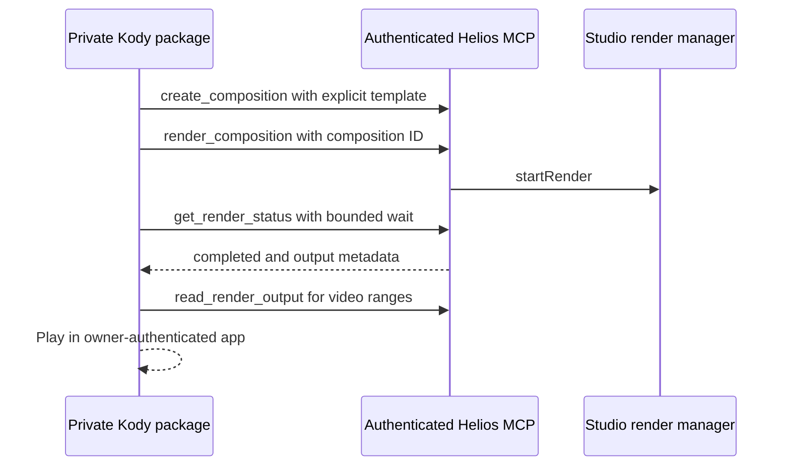

# Brief to playable video with Kody

The Helios integration includes a complete template workflow: create a title
composition, render with Studio's existing render manager, inspect progress,
and play the completed MP4 in a private Kody package app. Chromium, FFmpeg,
project files, and rendering stay on the Helios machine.



## Build and start

This workflow is currently source-distributed on the linked draft integration
branch. Do not assume an older npm release has these tools or flags. From a
checkout containing this change:

```sh
npm ci
npm run build -w packages/core
npm run build -w packages/player
npm run build -w packages/renderer
npm run build -w packages/infrastructure
npm run build -w packages/studio
npm run build -w packages/cli
npx playwright install chromium --only-shell
```

Install the built packages in your Helios project using your normal local
package workflow. From that project launch the built CLI's `bin/helios.js` (or
`npx helios` after a release containing this change):

```sh
helios studio --port 5173 --mcp-port 5174 \
  --mcp-public-url https://video.example.com \
  --mcp-secret-service helios-video-owner
```

Use a dedicated random credential of at least 32 characters stored by the
owner directly in the OS secret store and Kody's MCP account form. No agent
needs to see it. On macOS create a Generic Password in Keychain Access with
service `helios-video-owner` and account `helios-mcp`. On Linux use the desktop
Secret Service (with `secret-tool` available), attributes `service` and
`account` with those same values. Provision it using the secret manager UI;
do not pass the value as a shell argument. Allow the Studio process to read
that entry when the OS prompts. Missing or inaccessible entries fail closed.

The gateway reads the dedicated entry for each request, so credential changes
apply to the next request. Update Kody's saved credential when rotating it.
Use one process, root, and credential per owner. Studio is not a multitenant
render service; sharing its credential grants access to the whole project.

The separate listener binds only `127.0.0.1:5174`. Publish that listener using
the maintained [Caddy configuration](../../../integrations/kody/Caddyfile.example)
with your DNS name. Caddy supplies HTTPS and streaming proxying; authentication
and the route allowlist live in Helios. Keep port 5173 private. Do not publish
Vite, the file editor, REST APIs, or the local MCP route. A tunnel may forward
the gateway port if it preserves the configured Host, paths, query strings,
and streams, but never forward the unauthenticated Studio port.

## Connect and install the package

1. In Kody's MCP servers page, name the connection `helios`, set the URL to
   `https://video.example.com/mcp`, and enter the dedicated credential in its
   account form. Streamable HTTP is preferred; `/mcp/sse` and `/mcp/messages`
   remain supported for legacy clients. Every method on these routes and
   `/mcp/outputs/:jobId` requires authentication. Unknown routes fail closed.
2. Confirm `mcpServerList` is ready. Search `mcp:helios` for `list_compositions`,
   `create_composition`, `render_composition`, `get_render_status`,
   `cancel_render`, `get_render_output`, and `read_render_output`.
3. Create a private saved package via `packageGetGitRemote` with `create: true`
   and `kody_id: 'helios-video'`. Use its returned setup commands in your own
   coding environment. Copy the files from
   [integrations/kody/package](../../../integrations/kody/package) to that
   package root, changing `@owner` to your Kody username. Commit and push using
   the identity supplied by Kody. This is maintained source, not an existing
   community listing or an arbitrary GitHub-URL installer.
4. Run the supported package checks and use `packagePublishExternalPush` when
   you authorize publication in your own account. If it returns an approval
   URL, the owner promotes that commit. Keep visibility private. Set the
   configure export's `appUrl` to the returned `hosted_app_url`, or open the
   app once so it can save its own mount URL.
5. Grant the connector to this package using **Specific packages only**. Calls
   must execute in the package context: use the private app's POST /start and
   POST /cancel via `packageAppFetch`, or an existing package job/workflow.
   Static imports from ad hoc execute do not enter the package context.

The package README contains the brief and export contracts. On success, open
`playbackUrl` to see progress and play the actual result. Polling stops after
two minutes in the app; refresh to continue. `waitMs` expiry leaves the job
running, and status never submits another render. An interrupted start is
reported for inspection rather than silently creating duplicate work.

## Output and failure contracts

`get_render_output` returns MIME type, byte length, an authenticated relative
output path, and the maximum chunk size. No filesystem path or credential is
needed by Kody. `read_render_output` transfers up to 256 KiB per call; the
package requests 64 KiB chunks and supports Range/HEAD playback up to 64 MiB.
The provider's direct output route also supports Range and HEAD, with the same
authentication as MCP. It is not a public sharing URL.

Unknown jobs, incomplete output, missing files, empty output, invalid byte
ranges, and unsafe paths have distinct errors. Output is resolved only from a
completed manager job and its managed filename; symlinks and paths outside
the render directory are rejected. Sessions expire, are capped, and belong
to their authenticated identity. Authentication is rechecked on each request.

## Verify locally

The decoded-video check also requires `ffmpeg` and `ffprobe` on the command
path. The renderer itself uses its bundled FFmpeg.

```sh
node --test integrations/kody/workflow.test.mjs
npx tsx integrations/kody/verify-local.mts /tmp/helios-kody-demo.mp4
```

The local demo creates a temporary project and runs the package workflow
through the actual SDK transport, renderer, browser, encoder, MCP output
reads, and HTTP output route. It compares actual bytes and saves an MP4 outside
the repository, decodes frames to reject black/frozen output, and verifies
browser playback/seeking through the package app. It also exercises an actual
browser error and cancellation. Its loopback fixture identity does not validate production
secret-store pairing, public TLS, or a signed-in Kody account. Those remain
installation smoke tests, not claims made by fixture coverage.
