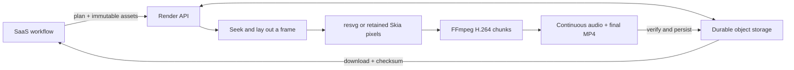

# Helios portable rendering — experimental

**Evidence retention (2026-10-01):** Earlier `/private/tmp` benchmark evidence is unavailable. Historical measurements below are reported records, not freshly reverified results or a current public competitor claim. The [fresh October 1 study](../../docs/rfcs/2026-10-01-cpu-benchmarks.md) links its retained source receipts; its every-frame quality and complete cadence checks remain pending.

An HTTP render service and browser-independent renderer for applications that can export a `portable-v1` scene plan. It turns JSON, explicit fonts and prepared media into a verified MP4. Existing HTML/React/Canvas Helios compositions use the existing renderer; this package does not convert them automatically.



The native pipeline runs on Node 22 with FFmpeg/ffprobe. The Wasm option replaces rasterization; decode, encode, audio and filesystem access still use native Node facilities. Cloud isolates are unsupported. VM and Vercel templates are deployment candidates, not qualified deployments. See the [measured evidence and RFC gates](../../docs/rfcs/2026-09-09-portable-rendering-evidence.md).

The opt-in `skia` backend keeps TypeScript for seeking, layout and jobs, and uses native C++ Skia through a pinned Rust Node-API binding for drawing. It caches decoded images and glyph paths, avoids per-frame SVG parsing, streams raw video pixels and resets native drawing history between frames. It retains explicit fontkit shaping; no browser or system font lookup is used. It is a native performance option, with different edge antialiasing from resvg. See the [controlled performance comparison and important code](../../docs/rfcs/2026-09-09-portable-rendering-performance.md).

This is an unpublished workspace package. For another application, build it and use `npm pack --workspace=@helios-project/portable --pack-destination /tmp`, then install that local tarball. The deployment preparer copies the built service and declares its dependencies directly.

## Run a video

From the repository root, with Node 22+, FFmpeg and ffprobe installed:

```sh
npm run build --workspace=@helios-project/portable
node packages/portable/dist/cli.js --help
```

Save this as `plan.json` in a scratch directory:

```json
{
  "version": "portable-v1",
  "width": 640,
  "height": 360,
  "fps": { "num": 30, "den": 1 },
  "frameCount": 90,
  "background": "#10242d",
  "nodes": [{
    "id": "box", "type": "rect", "y": 120,
    "x": { "keyframes": [{ "frame": 0, "value": 0 }, { "frame": 89, "value": 500 }] },
    "width": 120, "height": 120, "radius": 20, "fill": "#dfff83"
  }]
}
```

```sh
node packages/portable/dist/cli.js render /tmp/plan.json --output /tmp/video.mp4
node packages/portable/dist/cli.js frame /tmp/plan.json --frame 45 --output /tmp/frame.png
# Opt into the retained native drawing backend:
node packages/portable/dist/cli.js render /tmp/plan.json --rasterizer skia --output /tmp/video-skia.mp4
```

For assets, declare `{ "sha256": "…", "bytes": 1234, "type": "font" }` under an asset ID in `plan.assets`. Put each file at `ASSET_DIRECTORY/SHA256` and pass `--assets ASSET_DIRECTORY`. The renderer verifies bytes against the declared identity. It uses no system fonts and fetches no asset URLs.

## Render a trusted Canvas composition on CPU

The experimental Canvas API runs installed drawing code on native CPU Skia and software x264. It supports direct frame seeking and exact half-open ranges. It does not execute callbacks supplied through the JSON HTTP API. Canvas fonts are explicit byte buffers; use the family aliases passed into `draw` to avoid relying on machine fonts. A frame must depend on its index and declared assets, and drawing code must balance its `save`/`restore` calls.

Save an installed ESM module such as `composition.mjs`:

```js
export default {
  width: 1920, height: 1080, fps: { num: 30, den: 1 }, frameCount: 300,
  background: '#0b1020',
  draw(ctx, frame) {
    ctx.fillStyle = '#dfff83';
    ctx.fillRect(50 + frame.index * 3, 100, 100, 100);
  }
};
```

Render it from a Node script:

```js
import { renderCanvasModule } from '@helios-project/portable';

await renderCanvasModule('/absolute/path/composition.mjs', '/tmp/video.mp4', {
  concurrency: 4, chunkFrames: 90,
  encoder: { preset: 'fast', crf: 18, threads: 2 }
});
```

Workers use separate processes and retain their canvas and fonts across assigned chunks. Each chunk seeks directly to its requested start. Chunk boundaries are stitched with stream copy. Freshly encoded chunks receive packet-count checks; the completed video is fully decoded to verify frame count before it replaces the destination. Failure and cancellation preserve an existing destination. Set `start` and `end` for an exact range, or use `renderCanvasVideo(composition, output, options)` for a drawing function already loaded in one process.

`encoder.colorConversion` defaults to `srgb-bt709`. The explicit `rgb-bt601` mode is for matching pipelines that convert RGB component values directly to BT.601 YUV; it does not perform the sRGB-to-BT.709 transfer conversion. These modes have different pixel semantics and must be disclosed in comparisons. Native Canvas uses Skia text rasterization, which differs at edges from SVG/fontkit paths. The Canvas API exports video only; the portable JSON service remains the complete prepared-media/audio job path. Local execution is tested; Linux and remote performance require separate qualification.

## Opt into native GPU rendering

The optional GPU helper uses native Skia Metal rasterization and a required VideoToolbox H.264 encoder on macOS arm64. Build it from this checkout with Rust/Cargo and Apple Command Line Tools:

```sh
npm run build:gpu --workspace=packages/portable
```

Use the retained Plan API with `{ rasterizer: 'gpu', gpu: { bitrate: 100_000_000 } }`, or opt into GPU encoding for a trusted Canvas composition:

```js
import { renderCanvasVideo } from '@helios-project/portable';

await renderCanvasVideo(composition, '/tmp/video-gpu.mp4', {
  gpu: { backend: 'metal', codec: 'h264', bitrate: 100_000_000 }
});
```

The hardware lane converts sRGB to limited-range BT.709 NV12 on Metal, writes encoder-pool IOSurface planes, waits for GPU completion, and retains each surface through the encoder callback. Only compressed H.264 packets cross into CPU output code. Full decoded verification precedes atomic publication; failure or cancellation preserves an existing destination. Selecting GPU never silently falls back to software. Omitting GPU selection preserves the existing CPU/Wasm paths. `renderFrame` still returns pixels/PNG/SVG and therefore explicitly reads GPU pixels back to the CPU.

| Path | Current support |
|---|---|
| macOS arm64 Metal + VideoToolbox H.264 | Tested on M3 Pro; even dimensions up to 4096 per axis |
| macOS Intel, Linux/Vulkan, Windows | Unsupported; explicit GPU requests reject |
| HEVC or other GPU codecs | Unsupported |
| Vector/text Plan | Supported through Skia SVG; prepared text uses glyph paths |
| Plan image/video layers | Unsupported; choose a retained CPU backend |
| Canvas | `fillRect`, `fillText`, full-circle `beginPath`/`arc`/`closePath`/`fill`, save/restore, translate/scale/rotate; explicit RGB colors, alpha and byte-buffer font aliases |
| Partial arcs, multiple path contours, stroke/clip/Path2D/images, max-width text, other baselines/styles | Unsupported; reject explicitly |
| CPU Canvas module pool | GPU selection rejected; use `renderCanvasVideo` |

Canvas GPU text accepts a single shaped run; paragraph bidi layout, fallback fonts and browser text parity are not qualified. The default helper runs one frame at a time with one retained surface. Bitrate is a codec target, not a quality guarantee; dense TextGrid needed substantially more bitrate than an ordinary scene.

Each circle path accepts one full-turn arc, with an optional `closePath`; `fill('nonzero')` and `fill('evenodd')` have the same result for this single contour. Paths retain the transform at construction and use color/alpha at fill time. Nonuniform scaling produces ellipses. `save`/`restore` preserve drawing state independently of the current path. GPU Canvas frames are limited to 120,000 emitted commands, 32 MiB serialized messages, 64 saved states and 20,000 aggregate text characters. The independent font header is limited to 48 MiB encoded/32 MiB decoded bytes; Plan limits remain unchanged.

Set `gpu.gop` to an integer from 1 to 300 to control the maximum keyframe interval. The default is 90; an explicit `gop: 30` is required when replicating a scene configured for GOP30. Native protocol 3 receipts record this requested setting. The encoder may insert additional keyframes; the requested interval is a maximum, not a guarantee of exact placement. Rebuild the optional helper when updating its protocol; mismatched receipts reject.

Opt into encoder overlap with `gpu.encoderPool: 3`; the default `1` preserves serial submission. The three-buffer path retains GPU conversion completion, keeps an application reference through callback completion, and acquires/recycles through VideoToolbox's CoreVideo pool under a fixed allocation threshold. At capacity, it drains through the oldest pending timestamp and retries once, without polling or growing the pool. EOF drains and checks every ordered callback. Duplicate, unknown, out-of-order, dropped or failed callbacks reject the export. Compressed output is synchronized independently of GPU work. Reference/readback modes remain synchronous. No speed improvement or total zero-copy follows from enabling overlap alone.

Profiling establishes no application-level raw-frame download in the measured hardware path. System IOSurface pointer queries and opaque driver/encoder operations remain observable limitations, so total end-to-end zero-copy is **not proved**. Metal captures snapshot resources and are excluded from timings. See [the GPU contract](GPU-SPEC.md) and [benchmark protocol](benchmarks/GPU-PROTOCOL.md) for the precise transfer boundaries and quality gates. The helper is an optional source build; a packaged native binary and remote GPU deployment are not qualified.

## Run the backend

```sh
node packages/portable/dist/cli.js serve --data /tmp/helios-render-data --port 8787
```

This binds to loopback and runs the durable worker automatically. The data directory must survive restarts. A non-loopback listener requires `--auth-module PATH` or an explicit `--trusted-network` boundary. An auth module exports `authorize(request)`, returning the authenticated tenant ID or `null`. `oidcAuthorizer` provides signature, expiry, issuer, audience and exact subject validation; it takes public configuration and a subject-to-tenant allowlist. A trusted private listener is one shared tenant, accessible to every allowed network client.

`serve` also accepts `--rasterizer skia`. Programmatic hosts select `new NativeBackend({ rasterizer: 'skia' })`; the Vercel candidate accepts `"rasterizer": "skia"` in its public `portable-config.json`. The deployment build includes and smoke-tests the native binding. Selecting a backend changes the engine fingerprint; finish existing jobs with their original build.

```ts
import { RenderClient } from '@helios-project/portable/client';

const renderer = new RenderClient('http://127.0.0.1:8787');
// Upload bytes first; use the returned sha256/bytes in the frozen plan.
const job = await renderer.submit(plan, 'stable-workflow-job-key');
const completed = await renderer.wait(job.id);
const response = await renderer.download(completed.id);
// Consume through EOF: the streaming SDK verifies the final SHA-256 checksum.
```

`wait()` drives one durable step per request by default. Use `{ drive: false }` when a VM worker loop already drives execution. A caller timeout stops waiting; it does not cancel the durable job. Resume with the same job ID or call `cancel()` explicitly. A durable application workflow must reuse the original idempotency key on every retry. Failed jobs require a new key after correcting the cause; a succeeded or failed key never silently starts a different render.

The SDK uploads assets in 2 MiB parts when needed and downloads with bounded range requests. S3 range reads are passed to the store, avoiding repeated downloads from byte zero. Transient HTTP failures retry twice. Custom request authentication comes from a caller-supplied header provider; no static API credential is embedded in the package. [Workflow example](examples/workflow.ts), [Vercel workload identity example](examples/vercel-caller.mjs).

| API | Behavior |
| --- | --- |
| `PUT /v1/assets/:sha256` | Verify and store immutable bytes in the authenticated tenant |
| `POST /v1/assets/:sha256/compose` | Reassemble verified parts; check the complete identity |
| `POST /v1/renders` | `{ plan, idempotencyKey }` → durable job; mismatched reuse returns 409 |
| `GET /v1/renders/:id` | State, progress, chunk counts, engine build and output identity |
| `POST /v1/renders/:id/advance` | Claim and execute at most one durable step |
| `POST /v1/renders/:id/cancel` | Persist cancellation and fence the former owner |
| `GET /v1/renders/:id/artifact` | Completed MP4; byte ranges supported |
| `GET /health` | Process health and experimental status; does not qualify codecs/storage |

## Implemented profile

| Area | Accepted behavior | Boundary |
| --- | --- | --- |
| Timeline | Integer frame indexing; 24, 25, 30 or 30000/1001 fps; random seeking | Even dimensions through 1080p area, including portrait; ten minutes maximum |
| Geometry | Rectangles, ellipses, validated vector paths, linear gradients, strokes | No arbitrary SVG document imports, CSS filters, mesh or 3D |
| Composition | Groups, nested transforms, opacity, rectangular/path clips, row/column layout, percentages | Explicit sizes and layout; no DOM/CSS layout engine |
| Motion | Numeric keyframes; linear, hold and three polynomial easings | Absolute frame coordinates; no JavaScript, springs or browser animation APIs |
| Text | Explicit static TTF/OTF, grapheme fallback, bidi runs, shaping, wrapping and alignment | Missing glyphs reject; no system/variable/color fonts; full Unicode conformance is not claimed |
| Images | Prepared PNG/JPEG, contain/cover/fill and clipping | Inputs use sRGB; normalize orientation/color profiles before upload |
| Source video | Prepared MP4/H.264, 8-bit YUV420, CFR, normal-speed seek/trim/crop | Normalize rotation, cadence and SDR BT.709 color before upload; source audio is separate |
| Audio | Prepared 48 kHz mono/stereo PCM WAV, up to four active tracks, gain and linear fades | Sample count uses rational timeline rounding; no compressed-audio ingestion |
| Export | sRGB → limited-range BT.709 H.264; continuous stereo AAC; frame-count verification | Opaque MP4, software encoding; no HDR, alpha export or hardware-codec qualification |
| Recovery | Conditional state writes, expiring leases, fencing, immutable chunks and bounded retries | One serial chunk per job; cross-job concurrency is a host capacity decision |
| Stores | Local filesystem and S3 adapter | Local store requires atomic hard links/fsync; S3 adapter has contract tests, not live-cloud qualification |

The admission envelope is 2,000 nodes, 5,000 keyframes, depth 16, 20,000 text characters, 256 declared assets, 256 MiB aggregate asset bytes, 32 MiB of font files, 16 MP per image/video frame, and 32 MP aggregate still-image pixels. Up to two video layers and four audio tracks may overlap. A scene within those input bounds is **not guaranteed to fit 512 MiB**. Render work uses one active step per service instance, a 240-second step deadline and at most three attempts by default. Hosts still need CPU/memory/disk limits and per-tenant admission/rate controls.

## Storage and operations

Each worker materializes and checks the assets it needs, produces a chunk, stores it immutably, and conditionally updates the job manifest. A replaced or canceled lease owner cannot publish its result. Finalization verifies complete ordered coverage, concatenates video without re-encoding, mixes continuous audio, encodes AAC and verifies the final file before publishing success.

Local state uses immutable numbered revisions committed through an exclusive hard link. Use a real local filesystem, not an object-store mount. Sharing one store permits multiple processes; independent VM volumes do not share a queue. S3 uses conditional PUT and pinned object revisions. Engine fingerprints include core source, Node/platform/architecture and codec build output; drain old jobs on the original build before changing it. Runtime upgrades do not silently mix codec builds within a job.

No automatic garbage collection or retention policy is installed. Old revisions and orphan uploads from terminated attempts consume storage. Use a dedicated experimental data directory/bucket, monitor capacity, and retain all live job dependencies. Do not apply a blind object-age rule to active jobs. Production qualification includes retention, backups, tenant quotas, saturation and failure-rate evidence.

## Deploy with the setup wizards

Run from the repository root in your own terminal. The wizards open provider instructions and keep credentials with provider login/OIDC. They may create paid resources after their runtime confirmation steps.

```sh
bash packages/portable/scripts/setup-private-vm.sh
# Or, to test a distinct compute class:
bash packages/portable/scripts/setup-vercel-s3.sh
```

The VM wizard creates a private Fly app, a persistent volume and one Machine. Its Docker build compiles a reduced FFmpeg 8.0.1 profile from checksum-pinned source; `Dockerfile.full` retains the stock-codec comparison build. Fly is an example host for the generic Docker deployment. The Vercel wizard prepares public configuration, an S3 bucket/IAM trust policy and a function deployment using workload identity. Its remote build checks pinned Linux x64 codec bytes and native graphics. Both wizards include explicit remote qualification steps. Neither was executed against an account during implementation.

For another VM provider, build the generic deployment independently:

```sh
node packages/portable/scripts/prepare-deployment.mjs vm /tmp/helios-vm
cd /tmp/helios-vm
npm install --package-lock-only --ignore-scripts
docker build -t helios-portable .
docker run --rm -p 127.0.0.1:8787:8787 --mount type=bind,source=/absolute/writable/data,target=/data helios-portable
```

The mounted directory must be writable by UID 1000. This is a single trusted tenant behind a loopback binding. Retain third-party notices and the codec distribution's license/source information when distributing a runtime image; package wrapper licenses do not replace the codec binary's license.

## Test and measure

```sh
npm run check --workspace=@helios-project/portable
npm run test --workspace=@helios-project/portable
npm run bench --workspace=@helios-project/portable -- --out /tmp/portable-smoke
npm run bench --workspace=@helios-project/portable -- --full --out /tmp/portable-full
node packages/portable/scripts/qualify-service.mjs http://127.0.0.1:8787
```

`bench` also accepts `--rasterizer wasm`, `--rasterizer skia`, `--ffmpeg PATH` and `--ffprobe PATH`. The reduced codec builder is `scripts/build-codecs.sh SOURCE_DIRECTORY INSTALL_DIRECTORY [BUILD_JOBS]`; it needs a C compiler, pkg-config, x264 and zlib development libraries. Its local component footprint excludes Node, graphics and system libraries. Linux packaging remains a deployment test.

Tests require FFmpeg/ffprobe and permission to open a temporary loopback port. Corpus output stays in the requested scratch directory. Default benchmarks are reduced smoke fixtures. `--full` preserves the synthetic RFC dimensions/durations, including B06's ten minutes; it is still one exploratory run, not the RFC's repeated cold/warm/concurrency study. JSON records failures, stage times, engine fingerprints, frame identities and sampled process-tree memory. Missing memory measurements are `null`. Timing on a shared development machine is not a cloud price or fair Chromium comparison.

HarfBuzz-generated oracles independently check four scripts. Real process-death tests exercise render/upload/commit/finalization recovery. Native/Wasm comparisons cover multilingual text and thirty shuffled schedules across three fresh preparations of a graphics fixture. The source-core regression suite and selected existing renderer checks are separate from portable qualification.

The Vercel candidate admits at most 60 seconds and applies a 450 MiB estimated scratch budget before finalization. Longer or media-heavy jobs may receive `HOST_LIMIT`; this candidate cannot qualify the full ten-minute B06 workload. The VM profile retains the ten-minute scene limit. The scratch estimate is an admission guard, not a proof of the host’s disk ceiling.
