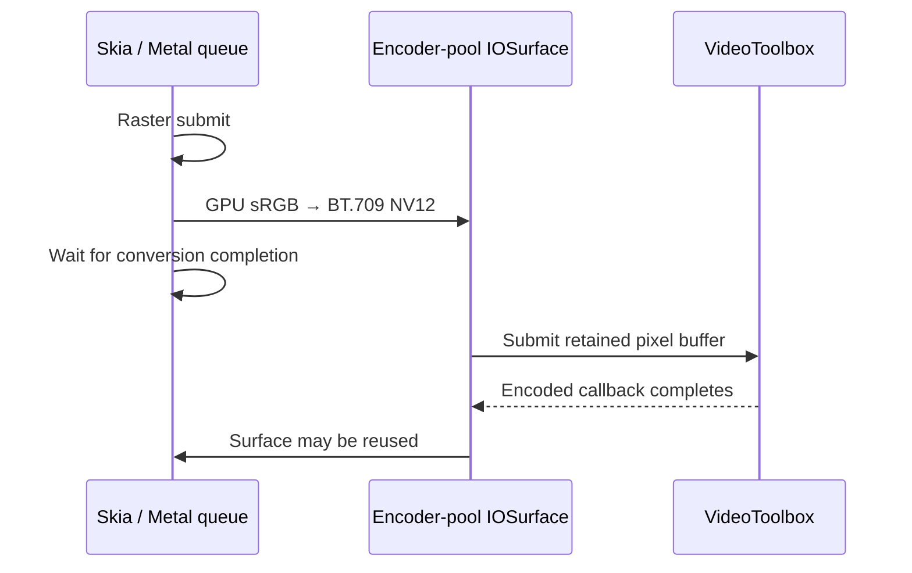

# Native GPU comparison protocol

This adapter compares complete capture-to-video pipelines, not isolated GPU
shader throughput. Chromium uses Canvas/Graphite plus lossless PNG/CDP capture;
native Skia uses Metal plus raw RGBA readback for the matched software lane.
Both feed the same FFmpeg x264 settings: medium, CRF 11, two encoder threads,
GOP 90, no B frames, no scene-cut keys, sRGB transfer converted to limited-range
BT.709 YUV420. Capture transport costs are included and disclosed.

The full native hardware lane is reported separately. It converts on Metal to
NV12 in a VideoToolbox encoder-pool IOSurface and requires hardware H.264.
Software and hardware codec parameters are not equivalent; passing the same
quality floors does not make those timing lanes interchangeable.

## Fixture and qualification

Continuity TextGrid contains 3,334 changing labels at 1920×1080, 300 frames at
30/1 fps, no audio. It uses `fframes-textgrid.mjs` and the explicit 72,000-byte
DM Sans font with SHA-256
`9ae2da663d64342031e59b5fa680dd355171d021b7ebf83774efc7c0330ae7b5`.
The current fframes 4K/99,000-circle/1,000-digit scene is a separate workload.

Each engine/lane creates its own lossless FFV1 reference after the intended
delivery color conversion. Every candidate must have exactly 300 decoded
frames, matching dimensions/rational cadence, and no audio. Compare by decoded
frame index, normalizing the container time base; Matroska's millisecond
timestamps otherwise cause spurious framesync repeats. Required floors on
**every** frame are SSIM-Y ≥ 0.995, PSNR-Y ≥ 40 dB, PSNR-U/V ≥ 35 dB.
Reference agreement measures encoding damage; it does not establish identical
text edges between independent rasterizers.

Run from a source checkout with the optional native release helper built,
Node/tsx, Playwright, Chrome, FFmpeg and ffprobe installed. Use an external
output directory and pass executable/font paths explicitly:

```sh
tsx packages/portable/benchmarks/gpu.ts --mode reference-software --purpose reference --out /tmp/gpu-ref --font /absolute/path/DM-Sans.ttf
tsx packages/portable/benchmarks/gpu.ts --mode software --purpose screen --out /tmp/gpu-screen --font /absolute/path/DM-Sans.ttf --crf 11
tsx packages/portable/benchmarks/gpu-quality.ts --attempt /tmp/gpu-screen --reference /tmp/gpu-ref
tsx packages/portable/benchmarks/gpu.ts --mode software --purpose timed --out /tmp/gpu-round-1 --font /absolute/path/DM-Sans.ttf --qualification /tmp/gpu-screen/quality.json
```

For hardware use `reference-hardware`, then `hardware`, and pass the screened
bitrate explicitly. For Chromium use `gpu-chromium.ts`, `reference-software`
and `software`, and `--chrome /absolute/path/to/Chrome`. Both adapters accept
`--ffmpeg` and `--ffprobe`. A timed attempt refuses a mismatched native/Chrome
binary, font, mode or encoder qualification. Output directories are never
reused; failed, slow and interrupted receipts remain evidence.

Exclude reference exports, quality screens, warmups, profiles and interrupted
exports from timing summaries. Warm each lane, then run at least four fresh
sequential pairs in AB/BA/BA/AB order. Never run timed engines concurrently.
Qualify each timed output again before including its result. Hardware repeats
have their own lane and summary. Record native/Chrome/FFmpeg/source hashes,
host/device/OS, command arguments, wall time, stdout/stderr, exit status and
resource-use receipts. `renderingMs` includes startup, scene/font preparation,
raster/capture, encoding and muxing; it excludes decoded verification. Hardware
receipts separately expose preflight, native process, mux and API verification.
The adapter's additional decoded checks are reported under `verificationMs`.
Stages overlap and are not a GPU-only stopwatch. Report all repetitions,
median and spread; do not select the fastest attempt as the headline.

## Actual GPU and transfer proof

Use a separate `--purpose profile` Chromium run. Preserve `chrome-trace.json`;
actual Canvas finalizations, Graphite queue submissions and full-size
`asyncReadPixels` events distinguish GPU work/readback from capability flags.
The trace is a separate execution, so it does not attest every timed frame.
Per-attempt capability data is supporting inventory only.

Metal capture uses the native helper's optional capture path, with capture
enabled through Apple's supported runtime. Preserve the actual `.gputrace`,
private raster texture, glyph/geometry resources, conversion commands and NV12
plane resources. Capturing snapshots raw resources to disk and is excluded
from timing and from the no-download proof run.

Compile `profile-gpu.mm` separately with an explicit external
`HELIOS_PROFILE_PATH`. Inject it only into the task-owned native helper. It
instruments CPU pixel/IOSurface locks and getters, texture downloads, blit
texture-to-buffer/buffer-to-texture transfers and buffer contents access.
Require `profiler-hooks-installed`. Run **both** positive controls: native
`reference` must observe NV12 CPU locks/plane access, and native `raster` must
observe full RGBA texture-to-buffer downloads. An instrumentation run without
positive controls is insufficient proof. Never link the interposer or fault
driver into the production helper.

Hardware `transfer.jsonl` checks the same IOSurface plane identities, actual
GPU conversion timestamps, and per-frame order:



Disclose font/scene command uploads, glyph atlas/geometry uploads, compressed
packet CPU copies, GPU-frame readback in software/reference/frame-returning
lanes, and capture-only snapshots. A pointer getter or buffer contents access
reports a resource extent and unknown access intent, **not copied byte count**.
The current proof is bounded to application-level transfers observed by these
hooks and surface identities. Driver/encoder internal transfers remain opaque;
system IOSurface pointer queries occur even in the hardware lane. Consequently
`zeroCopyProved` remains false and total end-to-end zero-copy is not claimed.

## Support boundary

macOS arm64 Metal/H.264 is the implemented hardware cell. Vulkan hardware
surface interop, macOS Intel, Windows, HEVC, GPU media layers and broad Canvas
parity are unsupported. These are refused explicitly, not benchmarked as a
software fallback. Remote GPU execution and other devices require separate
qualification. Current fframes hardware API and the old Metal-raster/x264
TextGrid are distinct source pins; neither is treated as a measured hardware
win without a working matched adapter and raw qualified runs.
