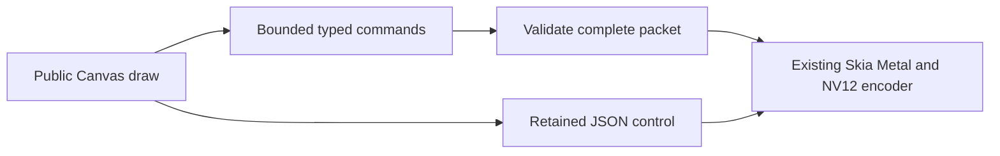
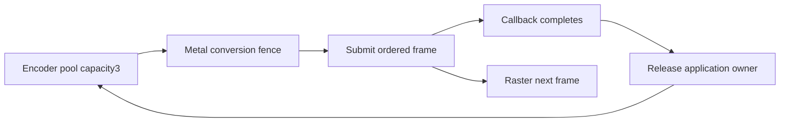
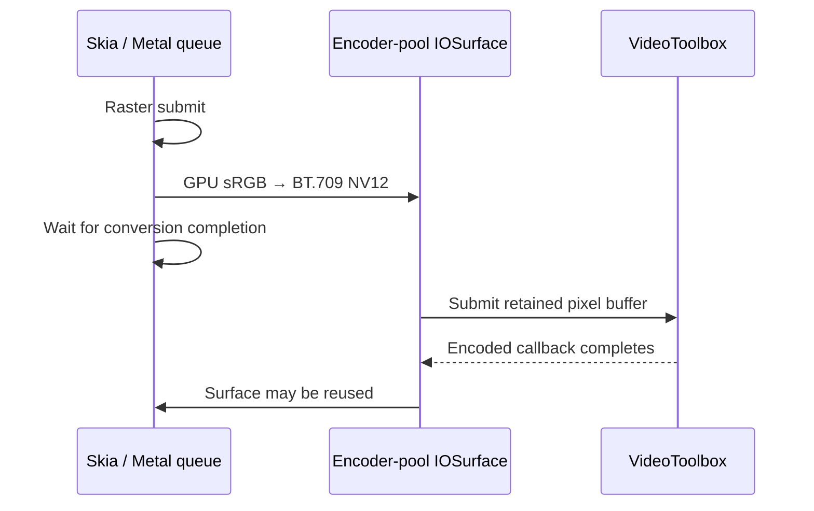

# Native GPU comparison protocol

## Separate HEVC functional qualification

`gpu.codec: 'hevc'` selects required hardware VideoToolbox HEVC Main with the existing 8-bit BT.709 limited NV12 surface path. It needs a newly built helper: `probe hevc`, JSON protocol6 or binary protocol7 receipts, HEVC parameter-set extraction and HEVC/hvc1 remuxing. H.264 keeps its default and protocol4/5; historical H.264 helpers, clocks, references and invalidated receipts are unchanged.

The native positional codec is the optional final argument after encoder pool: `encode-binary WIDTH HEIGHT FPS_NUM FPS_DEN BITRATE ELEMENTARY_PATH TRACE CAPTURE GOP ENCODER_POOL hevc`. Reference modes accept the same argument and explicitly read NV12 pixels back. Binary frame packets remain HGF5; protocol7 binds the HEVC completion contract rather than changing command layout.

[HEVC qualification](GPU-HEVC-RESULTS.md) binds its independent helper and sources, all300 directly split NV12/lossless frames, decoded codec/cadence/color, unchanged per-frame floors and actual hardware/GPU transfer receipts. Its 256×128 functional scene is separate from TextGrid and 4K timing lanes. Neither these checks nor codec enablement establish a fully enabled production comparison win.

Canvas exports default to compact binary commands (native protocol5); explicit
`transport: 'json'` retains the independently replayed protocol4 control. Plan
SVG exports retain JSON. The continuity adapter accepts `--transport binary|json`
and binds transport into attempts, own-reference qualification and timing gates.
Binary modes are `encode-binary`, `raster-binary` and `reference-binary`, with
the same positional arguments and bounded JSON font header as their JSON modes.
The Metal surface/encoder trace configuration remains protocol4; the completion
receipt binds the command transport separately. Frozen helpers remain unchanged.



Binary frames are little-endian and four-byte aligned. The32-byte header stores
magic `HGF5`, total bytes, command count, reserved zero and opaque RGBA background.
Tags1/2 encode rect/circle,3/4/5 translate/scale/rotate,6/7 save/restore and8 text.
Rect stores4 coordinates plusRGBA; circle stores3 coordinates,6 captured affine
coefficients andRGBA. Transform tags store2/2/1 coordinates. Text stores x/y/size,
RGBA, font/text UTF-8 byte lengths, then independently zero-padded strings. All
numbers usef32, matching the previous JSON-to-native cast. Native validates
length/count/finite fields/colors/stack/known font/UTF-8/text budget and padding
before drawing. Readers bound the declared envelope before payload allocation;
truncation or malformed packets fail without a success receipt. The recorder
avoids per-circle objects/arrays, caches bounded RGB values and retains path
construction transforms and fill-time paint. Binary and JSON RGBA/NV12 equality
checks are separate from output compression quality. Changed source/helper pins
require new full300-frame references and qualification before balanced timing;
packet size or recorder probes alone establish no export-speed result.

Bitrate targets are bounded
to100,000..1,000,000,000bps in TS/native/adapter. The hardware encoder's configured
AverageBitRate must equal the requested target; receipts bind both and TS
verifies them. Parameter acceptance is not a quality or actual coded-rate claim.
Failed low-bitrate screens remain retained; unchanged full-frame floors apply
before separately pinned timing. The appended positional GOP
argument accepts1..300 and defaults90 when omitted; a following encoder-pool
argument accepts1 or3 and defaults1. Receipts record `protocol`, requested `gop`
and `encoderPool`. TS exports require matching protocol/GOP/pool receipts. The
continuity adapter accepts `--gop`/`--encoder-pool` and binds both into hardware
qualification. Frozen protocol1/2/3 results remain unchanged historical evidence.

The three-buffer lane retains conversion completion and an application buffer
reference through callback completion. CoreVideo controls recycling after all
remaining encoder references are released. At allocation pressure it drains
through the oldest pending PTS, flushes plane-cache holds and retries once. EOF
drains and verifies all ordered callbacks. Trace each frame's acquisition,
IOSurface plane identity, GPU conversion, submit, callback and owner release;
verify no same surface is acquired before its previous callback owner release.
Profile this lane independently, with actual GPU capture and raw-download
positive controls. Capacity/overlap alone proves no speed gain or zero-copy.



Canvas full-circle paths emit one compact circle command containing the affine
transform captured at path construction. Frame messages are independently
bounded in TS/Rust to32 MiB/120,000 commands; font headers are bounded separately
to48 MiB encoded/32 MiB decoded. Plan resource limits remain unchanged.

The separate public4K99,000-circle/1,000-digit scene requires source frames3..302,
the1000x1000 viewBox's nonuniform3840x2160 scale and explicitGOP30. The original
claimed measured renderer commit does not contain the documented scene/source
hash. Reproducing the current public scene is labeled scene replication, not an
exact-byte reproduction of the originalM5Max7.225018333s single run. New helper
source/build pins, direct per-engine references, actual GPU profiling, all300
quality/cadence/color checks and separate balanced timings are required before
any new performance claim.

This adapter compares complete capture-to-video pipelines, not isolated GPU
shader throughput. Chromium uses Canvas/Graphite plus lossless PNG/CDP capture;
native Skia uses Metal plus raw RGBA readback for the matched software lane.
Both feed the same FFmpeg x264 settings: medium, CRF 11, two encoder threads,
GOP 90, no B frames, no scene-cut keys, sRGB transfer converted to limited-range
BT.709 YUV420. Capture transport costs are included and disclosed.

The full native hardware lane is reported separately. It converts on Metal to
NV12 in a VideoToolbox encoder-pool IOSurface and requires hardware H.264.
Software and hardware codec parameters are not equivalent; passing the same
quality floors does not make those timing lanes interchangeable.

## Fixture and qualification

Continuity TextGrid contains 3,334 changing labels at 1920×1080, 300 frames at
30/1 fps, no audio. It uses `fframes-textgrid.mjs` and the explicit 72,000-byte
DM Sans font with SHA-256
`9ae2da663d64342031e59b5fa680dd355171d021b7ebf83774efc7c0330ae7b5`.
The current fframes 4K/99,000-circle/1,000-digit scene is a separate workload.

Each engine/lane creates its own lossless FFV1 reference after the intended
delivery color conversion. Every candidate must have exactly 300 decoded
frames, matching dimensions/rational cadence, and no audio. Compare by decoded
frame index, normalizing the container time base; Matroska's millisecond
timestamps otherwise cause spurious framesync repeats. Required floors on
**every** frame are SSIM-Y ≥ 0.995, PSNR-Y ≥ 40 dB, PSNR-U/V ≥ 35 dB.
Reference agreement measures encoding damage; it does not establish identical
text edges between independent rasterizers.

GPU NV12 is already limited-range BT.709. Set its input frame metadata before
FFmpeg's planar layout conversion; output codec tags alone are insufficient.
Without `NV12_REFERENCE_FILTER`, a known red sample `[63,63,63,63,102,240]`
changed to `[58,58,58,58,105,229]` in the FFV1 oracle. The regression checks
pixel identity and decoded tags independently. For full-scene qualification,
split directly exported NV12 into planar Y/U/V without color arithmetic and
compare every decoded reference frame hash. A changed oracle invalidates old
quality receipts; preserve completed videos and original clocks, then attach
new qualification receipts. Do not represent a pixel-changing correction as a
metadata-only retag.

Run from a source checkout with the optional native release helper built,
Node/tsx, Playwright, Chrome, FFmpeg and ffprobe installed. Use an external
output directory and pass executable/font paths explicitly:

```sh
tsx packages/portable/benchmarks/gpu.ts --mode reference-software --purpose reference --out /tmp/gpu-ref --font /absolute/path/DM-Sans.ttf
tsx packages/portable/benchmarks/gpu.ts --mode software --purpose screen --out /tmp/gpu-screen --font /absolute/path/DM-Sans.ttf --crf 11
tsx packages/portable/benchmarks/gpu-quality.ts --attempt /tmp/gpu-screen --reference /tmp/gpu-ref
tsx packages/portable/benchmarks/gpu.ts --mode software --purpose timed --out /tmp/gpu-round-1 --font /absolute/path/DM-Sans.ttf --qualification /tmp/gpu-screen/quality.json
```

For hardware use `reference-hardware`, then `hardware`, and pass the screened
bitrate explicitly. For Chromium use `gpu-chromium.ts`, `reference-software`
and `software`, and `--chrome /absolute/path/to/Chrome`. Both adapters accept
`--ffmpeg` and `--ffprobe`. A timed attempt refuses a mismatched native/Chrome
binary, font, mode or encoder qualification. Output directories are never
reused; failed, slow and interrupted receipts remain evidence.

Exclude reference exports, quality screens, warmups, profiles and interrupted
exports from timing summaries. Warm each lane, then run at least four fresh
sequential pairs in AB/BA/BA/AB order. Never run timed engines concurrently.
Qualify each timed output again before including its result. Hardware repeats
have their own lane and summary. Record native/Chrome/FFmpeg/source hashes,
host/device/OS, command arguments, wall time, stdout/stderr, exit status and
resource-use receipts. `renderingMs` includes startup, scene/font preparation,
raster/capture, encoding and muxing; it excludes decoded verification. Hardware
receipts separately expose preflight, native process, mux and API verification.
The adapter's additional decoded checks are reported under `verificationMs`.
Stages overlap and are not a GPU-only stopwatch. Report all repetitions,
median and spread; do not select the fastest attempt as the headline.

## Actual GPU and transfer proof

Use a separate `--purpose profile` Chromium run. Preserve `chrome-trace.json`;
actual Canvas finalizations, Graphite queue submissions and full-size
`asyncReadPixels` events distinguish GPU work/readback from capability flags.
The trace is a separate execution, so it does not attest every timed frame.
Per-attempt capability data is supporting inventory only.

Metal capture uses the native helper's optional capture path, with capture
enabled through Apple's supported runtime. Preserve the actual `.gputrace`,
private raster texture, glyph/geometry resources, conversion commands and NV12
plane resources. Capturing snapshots raw resources to disk and is excluded
from timing and from the no-download proof run.

Compile `profile-gpu.mm` separately with an explicit external
`HELIOS_PROFILE_PATH`. Inject it only into the task-owned native helper. It
instruments CPU pixel/IOSurface locks and getters, texture downloads, blit
texture-to-buffer/buffer-to-texture transfers and buffer contents access.
Require `profiler-hooks-installed`. Run **both** positive controls: native
`reference` must observe NV12 CPU locks/plane access, and native `raster` must
observe full RGBA texture-to-buffer downloads. An instrumentation run without
positive controls is insufficient proof. Never link the interposer or fault
driver into the production helper.

Hardware `transfer.jsonl` checks the same IOSurface plane identities, actual
GPU conversion timestamps, and per-frame order:



Disclose font/scene command uploads, glyph atlas/geometry uploads, compressed
packet CPU copies, GPU-frame readback in software/reference/frame-returning
lanes, and capture-only snapshots. A pointer getter or buffer contents access
reports a resource extent and unknown access intent, **not copied byte count**.
The current proof is bounded to application-level transfers observed by these
hooks and surface identities. Driver/encoder internal transfers remain opaque;
system IOSurface pointer queries occur even in the hardware lane. Consequently
`zeroCopyProved` remains false and total end-to-end zero-copy is not claimed.

## Support boundary

macOS arm64 Metal/H.264 is the implemented hardware cell. Vulkan hardware
surface interop, macOS Intel, Windows, HEVC, GPU media layers and broad Canvas
parity are unsupported. These are refused explicitly, not benchmarked as a
software fallback. Remote GPU execution and other devices require separate
qualification. Current fframes hardware API and the old Metal-raster/x264
TextGrid are distinct source pins; neither is treated as a measured hardware
win without a working matched adapter and raw qualified runs.

The measured TextGrid study and exact current limits are recorded in
[GPU-RESULTS.md](GPU-RESULTS.md). Those export intervals exclude decode checks;
the retained process clocks include adapter verification overhead. They do not
establish isolated GPU throughput or superiority over a different host/scene.
