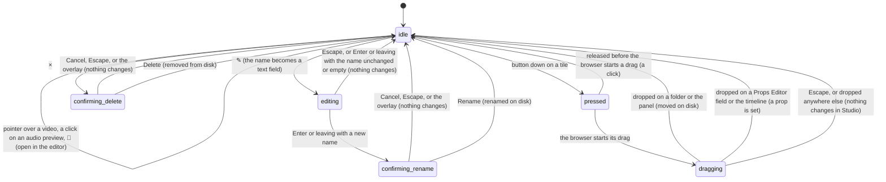

# Asset actions

## Summary

Asset actions are what the user can do to one [asset](../glossary.md#compositions-and-files) listed in [the Assets panel](the-assets-panel.md): preview it in its tile, open it in the code editor, rename it, delete it, move it into another folder by dragging it, and drag it out of the panel onto the Props Editor or the timeline to give it to the composition. They live on the [asset tiles](../glossary.md#compositions-and-files). The preview is always there; three small round buttons, 📝 (Open in Editor), ✎ (Rename Asset), and × (Delete Asset), appear at a file tile's top right while the pointer is over it; and every tile can be dragged. A folder tile has only ✎ and ×, and is also where a dragged asset can be dropped. Renaming, deleting, and moving change files on disk at once through the Studio server and need no open composition and no connected player; dropping onto the Props Editor or the timeline needs the player to be [connected](../glossary.md#the-preview).

## What each tile shows and does

| Asset type | Preview (60 pixels tall, on black) | Pointing at it or clicking it |
| --- | --- | --- |
| Image | The image itself, cropped to fill the preview | Nothing. |
| Video | The video, muted | While the pointer is over the tile, the video plays from its start, muted and looping; when the pointer leaves, it stops and goes back to its start. A click does nothing. |
| Audio | 🎵, tooltip "Click to Play/Pause" | A click on the preview plays the whole file once (the note becomes 🔊, blue and slowly pulsing); another click pauses it, and the next click resumes from there. It keeps playing when the pointer leaves, and goes back to 🎵 at the end. |
| Font | "Aa" drawn in the font | Nothing. A font that cannot be loaded shows "Aa" in the ordinary sans-serif. |
| Model | 📦, tooltip "3D Model" | Nothing. |
| JSON | {}, tooltip "JSON Data" | Nothing. |
| Shader | ⚡, tooltip "Shader" | Nothing. |
| Folder, in a search result | 📄 | Nothing (see [Edge cases](#edge-cases)). |

A click anywhere else on a file tile does nothing. A click on a folder tile opens the folder (see [the Assets panel](the-assets-panel.md#ending-at-once)).

An audio preview plays at full volume, independently of the composition and of Studio's volume and mute. Several can play at once. One stops only when it ends, when it is clicked again, or when its tile leaves the list: another folder is opened, a search hides it, the panel is hidden, or the asset is renamed, moved, or deleted.

**Open in Editor** (📝, file tiles only) asks the server to open the file in the user's code editor, and does nothing else in Studio: no toast, no change in the panel, and no message if no editor opens. Images and fonts go to the code editor too, which shows them however it can.

> Technical note: the request goes to the project's development server at `/__open-in-editor`, which Vite answers by launching an editor it finds running on the machine, or the one named in the `LAUNCH_EDITOR` environment variable of the `helios studio` process. When it finds none, the only message is in the terminal running `helios studio`. Studio never looks at the answer.

## The simple case

The user points at `logo.png`; the three buttons appear. Clicking ✎ turns the name into a text field holding "logo.png". The user types "brand" in place of the name and presses Enter. A "Rename Asset" confirmation appears: "Renaming this asset will change its file path. Any compositions referencing it will need to be updated manually. Are you sure you want to proceed?" The user clicks Rename. The file becomes `brand.png` in the same folder (the extension is kept because none was typed), and its tile shows the new name in its new sorted place. No toast appears.

Clicking × on `old.png` opens "Delete Asset": "Are you sure you want to delete "old.png"? This action cannot be undone and may break compositions referencing this file." Delete removes the file from disk at once, an "Asset deleted" toast appears, and the tile disappears.

Dragging `brand.png` onto the `images` folder's tile gives that tile a blue border; dropping moves the file into `images/`, an "Asset moved" toast appears, and the tile leaves the current view. Dragging a video tile instead onto a video [asset field](../glossary.md#the-preview) in the Props Editor puts the asset's address into the field, and the composition shows the video at once.

## The interaction, event by event

Three interactions are narrated together: **renaming** (an inline field, then a confirmation), **deleting** (a confirmation), and **dragging** a tile (the browser's own drag and drop; see [the input model](../foundations/input-model.md#drag-and-drop)). Previewing and Open in Editor end at once.

### Starting

**Renaming.** ✎ on a file tile, or on a folder tile (titled "Rename"), turns the name into a text field holding the full current name, extension included, and gives it keyboard focus. The tile's buttons disappear while the field is open. Nothing on disk changes. Because focus is in a [text field](../glossary.md#interactions), Studio's shortcuts are ignored until the field closes (see [keyboard focus](../foundations/input-model.md#keyboard-focus-and-who-receives-a-key)).

**Deleting.** × on a file tile opens the "Delete Asset" confirmation over a dark overlay, with Cancel focused. × on a folder tile (titled "Delete") opens "Delete Folder": "Are you sure you want to delete folder "{name}"? This will delete all files inside it." Nothing has been deleted yet.

**Dragging.** The mouse button goes down anywhere on a tile, including on its preview or one of its buttons. Nothing changes yet.

### Ending at once

- **Renaming.** Escape closes the field and puts the old name back. Enter, or anything that takes focus out of the field, with the name unchanged or emptied, closes it the same way. No confirmation appears and nothing is recorded.
- **Deleting.** Cancel, Escape, or a click on the overlay closes the confirmation; nothing is deleted. Pressing Delete finishes it at once (see [Finishing](#finishing)); a delete never becomes ongoing.
- **Dragging.** A release before the browser has started a drag is an ordinary click on whatever was pressed: nothing on a file tile, opening on a folder tile, play or pause on an audio preview, or the button's own action.
- **Previewing and Open in Editor** happen at once, as described above. Neither records anything.

### Becoming ongoing

**Renaming** becomes ongoing at the first keystroke that changes the field. From then on, leaving the field no longer just closes it: it asks for confirmation (see [Finishing](#finishing)).

**Dragging** becomes ongoing when the browser starts its drag, after the pointer has moved a few pixels with the button held. That threshold is the browser's; Studio adds none of its own. At that instant the drag's contents are fixed: for a file, its details (name, type, and address), its absolute path on disk, and its address as plain text; for a folder, the first two only. A translucent picture of the tile follows the pointer. Whatever happens to the asset afterwards, the drag carries it as it was at this moment.

### While ongoing

**Renaming.** The user types; nothing is checked while typing, and no error shows until the server answers.

**Dragging.** Possible [drop targets](../glossary.md#interactions) highlight as the pointer passes over them: the Assets panel's blue overlay, which says "Drop files to upload to …" although a drop there moves the asset; a folder tile's blue border, which replaces the overlay while the pointer is on it; a Props Editor field; the timeline's dashed outline (see [timeline tracks](../playback/timeline-tracks.md#starting)). Read from the code and the browser's usual behavior, the page receives no other input during the drag except Escape, which cancels it. Playback continues.

### Finishing

**Renaming.** Enter, Tab, or anything that takes focus out of the field with a changed name closes the field and opens the "Rename Asset" confirmation (for a folder, "Rename Folder": "Renaming this folder will change file paths for all contents. Compositions referencing these files may break. Are you sure?"), with Rename focused. Cancel, Escape, or a click on the overlay discards the new name. Rename closes the confirmation at once and asks the server to rename the file or folder where it is:

- If the new name has no extension, the old one is kept: "brand" makes `brand.png`. If it has one, that one is used: "brand.jpg" renames `brand.png` to `brand.jpg` without converting it, and "notes.txt" turns it into a file the panel no longer lists.
- A name already taken in that folder is refused.
- The rename is [saved](../glossary.md#persistence) on disk at once and cannot be undone from Studio. Nothing that refers to the old path is updated: not the composition's code, not its default props, not a Props Editor field. The confirmation says so.

On success no toast appears: the list is re-read, and the tile reappears under its new name in its sorted place. On failure, for any reason, a "Failed to rename asset" toast appears ("Failed to rename folder" for a folder), the server's reason is not shown, and the old name stays.

**Deleting.** Delete closes the confirmation at once and asks the server to delete. A file is removed. A folder is removed with everything inside it, including files the panel does not list. There is no trash. An "Asset deleted" toast appears, for a folder too, and the list is re-read. Studio does not look at the server's answer: a delete the server refused still shows "Asset deleted", and the tile simply stays after the re-read; only a server that cannot be reached shows "Failed to delete asset" (see [when a request fails](../foundations/project-and-compositions.md#when-a-request-fails)).

**Dragging.** What the drop does depends on where the button is released:

| Released over | What happens |
| --- | --- |
| A folder tile | The asset is moved into that folder. |
| Anywhere else in the Assets panel: the empty area, another tile, the buttons, the search box, the breadcrumbs | The asset is moved into the [current folder](../glossary.md#compositions-and-files). If it is already there, the move is refused (see below). |
| An [asset field](../glossary.md#the-preview) in the Props Editor (the prop field for an image, video, audio, font, model, JSON, or shader prop) | An asset of the same type sets the field to its address. A folder or an asset of another type does nothing. See [prop fields](../props/prop-fields.md). |
| A [prop field](../glossary.md#the-preview) that is a text box | The field's value is replaced with the asset's address. A folder does nothing. |
| The timeline's track area | A video or audio asset is given to the composition's first prop of that type. See [timeline tracks](../playback/timeline-tracks.md#ending-at-once). |
| Any other text field on the page, including a Props Editor JSON box | The browser types the asset's address into it where it is dropped, as it does with any dragged text. |
| Anywhere else, or outside the window | Nothing in Studio. Another application receives the address as text. |

A move asks the server to move the file or folder, with everything in it, into the target folder under the same name. It is refused with a red toast giving the server's reason when the target already has something of that name (`Asset "logo.png" already exists in target folder`), or when a folder would go into itself or into one of its own folders (`Cannot move folder "{absolute path}" into itself "{absolute path}"`). On success an "Asset moved" toast appears, for a folder too, the list is re-read, and the tile leaves the current view. The move is saved on disk at once, with no undo, and, unlike a rename, it gives no warning that references to the old path will break.

A drop on the Props Editor or the timeline changes input props, not files; [the Props Editor](../props/the-props-editor.md)'s auto-save then writes them into `composition.json` once its wait is over (a second or more while the composition is paused; see [the Props Editor](../props/the-props-editor.md#while-ongoing)).

## Modifiers

| Modifier | Set at the start | Changed while ongoing |
| --- | --- | --- |
| Shift | Renaming: types capitals. Deleting, dragging, previews: no effect. | Renaming: types capitals. Dragging: Studio does not read it; the browser may change the badge on the drag pointer. |
| Ctrl/Cmd | Renaming: the field's own editing keys (select all, copy, paste, undo typing) work. Ctrl/Cmd+K opens the Omnibar, which takes focus away from the field (see [Cancel and interrupt](#cancel-and-interrupt)). Deleting, dragging, previews: no effect. | Renaming: as at the start. Dragging: Studio does not read it; the browser may show a copy badge on the drag pointer. |
| Alt/Option | No effect. | No effect. |
| Keyboard focus | ✎ moves focus into the rename field. The Rename Asset confirmation focuses Rename; Delete Asset focuses Cancel. Neither Enter nor Space presses the focused button: Studio cancels both, and Space toggles playback instead (see [keys Studio cancels everywhere](../foundations/input-model.md#keys-studio-cancels-everywhere)). Escape is the only key that answers a confirmation, as Cancel. A press on a tile takes focus out of any other text field, as on any web page. | Renaming: shortcuts stay ignored while the field has focus. Dragging: the browser passes no key presses to the page except Escape. |
| Playback | No effect. Playback continues through every action, and an audio preview plays on top of the composition's own sound. | No effect. |
| Player connection | Previews, renaming, deleting, moving, and Open in Editor work with no composition open and before the player connects. A drop on the Props Editor or the timeline needs the player connected; before that, the Props Editor says "No active controller" and the timeline ignores the drop. | A drop goes to whatever composition is connected when the button is released. |

None of these actions reads a modifier key itself, so pressing or releasing one mid-way changes only what the rename field or the browser does with it.

## Cancel and interrupt

"Before it is ongoing" means: the rename field is open with the name unchanged, the delete confirmation is open, or the button is down on a tile and the browser has not started a drag. "While ongoing" means: the rename field holds a changed name, or its confirmation is open, or its request is on its way; or the browser's drag is in progress. A delete never becomes ongoing, so it appears only in the first column.

| Event | Before it is ongoing | While ongoing |
| --- | --- | --- |
| Escape | Rename: the field closes; nothing changes. Delete: the confirmation closes; nothing is deleted. Press on a tile: no effect. | Rename: in the field, Escape closes it and drops the typed name; in the confirmation, Escape cancels; once Rename has been pressed, no effect. Drag: the browser cancels it; nothing moves and nothing is set. |
| Another shortcut, click, or command | Rename: shortcuts are ignored while the field has focus, except Ctrl/Cmd+K; a click elsewhere that takes focus closes the field. Delete: shortcuts act behind the confirmation (see [dialogs](../foundations/the-workspace.md#dialogs)); a click on the overlay cancels. Press on a tile: no effect. | Rename: Ctrl/Cmd+K opens the Omnibar, which takes focus, so the field is left and the Rename Asset confirmation opens above the Omnibar. A click elsewhere that takes focus does the same, and, read from the code, the confirmation's overlay covers the page before the button is released, so the click does not reach what was clicked. A press on the timeline's track area does not take focus, so the field stays open. Drag: no other input reaches the page until the drop. |
| Composition switched | No effect; assets belong to the project, not the composition. A switch from the Omnibar while the field is open behaves as in the row above. | No effect on a rename. A drag dropped on the Props Editor or the timeline acts on whichever composition is open at the drop. |
| Window loses focus | Rename: the field loses focus and closes unchanged. Delete: the confirmation stays open. Press on a tile: Studio does not notice. | Rename: the field loses focus with a changed name, so the Rename Asset confirmation opens and waits for the user's return. Drag: Studio does not notice; the drag continues or ends as the operating system decides. |
| Pointer leaves the window | Leaving a tile hides its buttons and stops its video preview. The field and the confirmation are unaffected. | Rename: no effect. Drag: the browser's drag continues outside the window; a drop in another application gives it the asset's address as text (a folder carries none); coming back continues the drag. |
| Server request fails or server stops | Delete: "Asset deleted" appears even when the server refused; only an unreachable server shows "Failed to delete asset". Open in Editor fails silently. | Rename: "Failed to rename asset" ("Failed to rename folder"); the name stays. Move: a red toast with the server's reason, or "Failed to fetch" if the server cannot be reached; nothing moves. A drop on the Props Editor or the timeline makes no request. |
| Reload or tab closed | Nothing to lose; nothing has changed. | The typed name and an open confirmation are lost. A rename or move already sent completes on the server, and the reloaded page lists the result. A drag has nothing to lose. |
| Hot reload | No effect. | No effect on a rename or on a drag within the panel. A drop on the Props Editor or the timeline while the composition reloads is handled as those documents say. Renaming, moving, or deleting a file the composition's code imports can itself cause a [hot reload](../foundations/the-preview-player.md#hot-reload). |
| Project changed on disk | The panel can still list a file that is gone: deleting it shows "Asset deleted", renaming it shows "Failed to rename asset", and the re-read after either drops its tile. | A drag carries the asset as it was when the drag started: moving one that has since been moved or deleted on disk is refused with `Source asset "{absolute path}" not found`, and dropping it on a prop sets an address that no longer exists. |

After any of these the user is back in the Assets panel with the tile as it was, unless the server already made the change. Nothing typed or chosen is kept. Previews and Open in Editor end at once and are touched by none of the rows except "Another shortcut, click, or command" (a click that takes a tile out of the list, such as opening another folder or sidebar tab, stops its audio preview), "Pointer leaves the window" (a video preview stops), and "Reload or tab closed" (an audio preview stops).

## Interactions with other systems

**Files on disk.** Renaming renames the file or folder in place; deleting removes it, a folder with all its contents; moving moves it into another folder under `public/` or the project root. Each is saved at once, and the panel then re-reads the whole asset list. None of them updates anything that refers to the old path. See [the project and compositions](../foundations/project-and-compositions.md#assets).

**Browser storage.** Nothing is remembered.

**Undo.** None. A deleted file or folder is gone from disk; a rename or move can only be reversed by renaming or moving it back.

**Playback range and loop.** No interaction.

**Input props.** Dropping a tile on the Props Editor or the timeline sets an input prop to the asset's address, which applies to the preview at once and is then auto-saved into the composition's [default props](../glossary.md#compositions-and-files). Renaming, moving, or deleting an asset does not touch input props or default props that hold its old address; the composition keeps asking for the old address, which no longer exists.

**Rendering and export.** None directly. Renders and exports use the props as they are, so one started after an asset was renamed, moved, or deleted asks for an address that no longer exists. In a project without `public/`, a render's MP4 in the [renders folder](../glossary.md#compositions-and-files) can be renamed, moved, or deleted from the Assets panel; the Renders panel still lists the job (see [server renders](../output/server-renders.md)).

**Notifications.** "Asset deleted" (also for folders), "Failed to delete asset", "Failed to rename asset", "Failed to rename folder", "Asset moved" (also for folders), and a red toast with the server's reason when a move is refused. A successful rename and Open in Editor show nothing. See [toasts](../foundations/the-workspace.md#toasts).

**Other tabs and agents.** Each tab has its own copy of the asset list. A file renamed, moved, or deleted in one tab stays under its old name in another until that tab reloads or makes an asset change of its own; acting on the stale tile there fails as described in the "Project changed on disk" row. See [changes from outside Studio](../cross-cutting/changes-from-outside-studio.md).

**Keyboard and accessibility.** None of these actions can be reached from the keyboard. The tile buttons appear only while the pointer is over a tile, and neither the tiles nor their buttons can take focus; previews and drags are mouse-only. The buttons are labeled only by their tooltips ("Open in Editor", "Rename Asset", "Delete Asset"; "Rename" and "Delete" on folders). In the rename field, Enter asks for confirmation and Escape cancels; in the confirmations, Escape cancels, and nothing confirms from the keyboard.

## Edge cases

- **Dropping a tile back where it was.** Dropping a tile on the panel's empty area, or on another tile in the same folder, asks the server to move it into the folder it is already in, which is refused with a red `Asset "{name}" already exists in target folder` toast. A small accidental drag inside the panel therefore shows an error.
- **Moving up a level.** The breadcrumbs are not drop targets, and the parent folder's tile is not visible from inside a folder, so a tile cannot be dragged to the folder above. The only way is to go to that folder, search for the asset, and drop the search result on the panel.
- **Similar folder names.** Read from the code, moving a folder into a sibling whose name starts with the same characters (`icons` into `icons-old`) is refused as if it were a move into itself.
- **Folders with a dot in the name.** The extension rule applies to folders too: renaming a folder `v1.5` to "v2" makes `v2.5`.
- **Changing the type by renaming.** Renaming `clip.mp4` to "clip.webm" keeps the same contents under a new extension, so the panel lists it as a video it may not be able to play. A name ending in "." or with an unknown extension makes the file disappear from the panel.
- **Slashes in a new name.** A new name such as "../logo" or "sub/logo" renames the file into another folder, if that folder exists and is inside Home; otherwise the rename fails with the generic toast.
- **Holding Enter.** Enter in the field opens the confirmation with Rename focused. Holding Enter does not go on to press Rename, because Studio cancels Enter on buttons; the rename still needs a click.
- **Folders in search results.** A matching folder appears as a file tile with a 📄 preview and all three file buttons. 📝 asks the editor to open the folder. × asks "Are you sure you want to delete "{name}"? This action cannot be undone and may break compositions referencing this file." and then deletes the whole folder with its contents.
- **Compositions as assets.** In a project without `public/` (the verification project is one), every composition folder is an asset folder. Deleting one from the Assets panel deletes the composition; renaming or moving one, or moving its `composition.json`, changes it on disk while the Compositions panel keeps listing it under its old ID until the page is reloaded (see [when the project changes underneath Studio](../foundations/project-and-compositions.md#when-the-project-changes-underneath-studio)). Deleting a composition's `src` folder deletes its code.
- **Dragging by an image preview.** Pressing on an image's preview may make the browser drag the picture alone rather than the whole tile; the drop works the same way.
- **The stale drop message.** While a tile is dragged over the panel the overlay says "Drop files to upload to …", but the drop moves the asset; nothing is uploaded.
- **Audio that keeps playing.** An audio preview keeps playing after the pointer leaves and while the user works elsewhere in the panel; only another click, its end, or its tile leaving the list stops it.

## Open questions and verification

- Confirm that dropping a tile on the panel inside its own folder shows the "already exists in target folder" error toast. Studio sends the move without checking whether the target is the folder the asset is already in (`AssetsPanel.tsx`, the drop handler). This may be worth treating as a bug.
- Confirm that moving `icons` into a sibling `icons-old` is refused. The server checks whether the target's path begins with the source's path as text (`server/discovery.ts`, `moveAsset`). If confirmed, this is a bug.
- A failed rename always shows "Failed to rename asset" (or "Failed to rename folder"); the server's reason (the name is taken, the path is outside the project) is dropped (`AssetItem.tsx`, `FolderItem.tsx`). A move failure, by contrast, shows the server's reason. This may be worth treating as a bug.
- Deleting reports "Asset deleted" whatever the server answers, and says "Asset" for a folder too; the folder's own "Failed to delete folder" message can never appear (`FolderItem.tsx`). Owned, for the first part, by [when a request fails](../foundations/project-and-compositions.md#when-a-request-fails).
- A successful rename shows no toast while a move and a delete do. This may be a product call.
- Confirm what Open in Editor does in the `helios studio` setup with and without an editor running, and that nothing appears in Studio either way.
- Confirm that Escape in the rename field really cancels. It closes the field by removing it while it still has keyboard focus, and Chromium has been known to report a removed focused field as left; the field's leave handler would then run with the typed name and open the Rename Asset confirmation anyway (`AssetItem.tsx` and `FolderItem.tsx`, the rename field's handlers). The timeline's timecode field has the same open question.
- Confirm that a click elsewhere while the rename field holds a new name opens the confirmation before the release, so that the click is lost; and that switching to another application does the same.
- Confirm that during the browser's drag Studio receives no key presses except Escape, and the size of Chromium's drag threshold.
- Confirm whether pressing on an image preview drags the picture alone, and what another application receives when a tile is dropped on it.
- Confirm that an audio preview ignores Studio's mute and volume, and that several can play at once.
- Read from `FolderItem.tsx` (lines 24 to 29), a dragged folder carries only its details and its path, not its address as plain text, so dropping it on a text field or in another application gives nothing. Confirm.
- The user guide (`docs/site/guides/using-studio.md`) says Studio "will attempt to update references" when an asset is renamed; it does not, and the Rename Asset confirmation says references must be updated by hand.
- Read from `components/AssetsPanel/AssetItem.tsx`, `AssetItem.css`, `AssetItem.test.tsx`, `FolderItem.tsx`, `FolderItem.css`, `AssetsPanel.tsx`, `AssetsPanel.test.tsx`, `ConfirmationModal/ConfirmationModal.tsx`, the asset functions and `openInEditor` in `context/StudioContext.tsx`, the `/api/assets` routes in `server/plugin.ts`, `moveAsset`, `renameAsset`, and `deleteAsset` in `server/discovery.ts` and `server/discovery.test.ts`, the drop handlers in `SchemaInputs.tsx`, `PropsEditor.tsx`, and `Timeline.tsx`, and `scripts/verify-asset-move.ts`; not yet confirmed by hand.

Verified against helios commit `c2bfddb`
