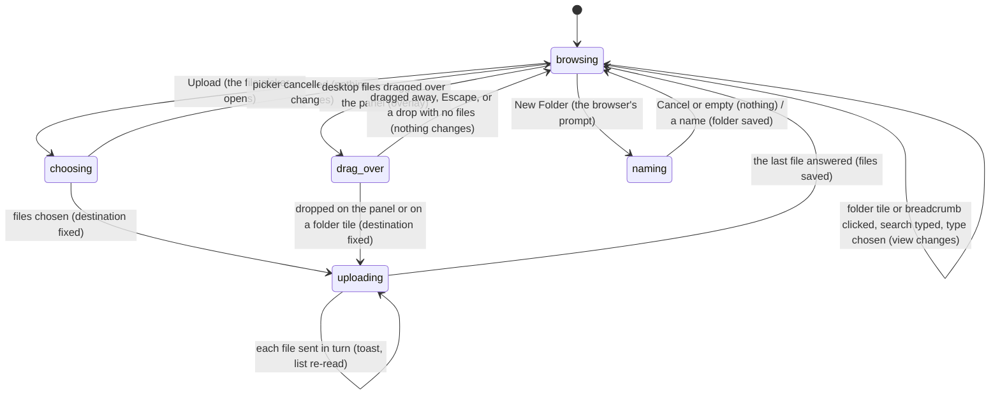

# The Assets panel

## Summary

The Assets panel is where the user sees the files a composition can use (images, video, audio, fonts, 3D models, JSON, and shaders) and brings new ones into the project. It lists the project's [assets](../glossary.md#compositions-and-files) one folder at a time, filters them by type, searches them by name, uploads files from the computer, and makes new folders. It is the Assets tab of the [sidebar](../foundations/the-workspace.md#the-sidebar), second from the left, and shows when that tab is clicked; the tab stays highlighted while it does. It lists the project, not the active composition, so it works with no composition open and before the player is [connected](../glossary.md#the-preview). What can be done to one listed asset (previewing it, renaming, deleting, moving, opening it in an editor, and dragging it out to the Props Editor or the timeline) is described in [asset actions](asset-actions.md).

## What the panel shows

From top to bottom:

- **Upload** and **New Folder**, two buttons sharing the panel's width.
- A search box, "Search assets...", and a type menu, at most 100 pixels wide: All (the default), Image, Video, Audio, Font, Model, JSON, Shader, Other.
- The breadcrumb row, which names the [current folder](../glossary.md#compositions-and-files): "Home", then one entry per folder level, separated by "/", with the current folder in bold white. It is hidden while the search box has text.
- The list: [asset tiles](../glossary.md#compositions-and-files) that wrap into rows and scroll on their own. The current folder's folders come first, sorted by name in character-code order (digits, then capitals, then lowercase: "10" before "2", "Zebra" before "apple"), then its files, in the order the server lists them (on macOS and Linux that is the same character-code order).

Which files appear is decided on disk: the assets are everything under the project's `public/` folder if it has one, otherwise everything under the project root; every folder is listed, even an empty one, and a file only if its extension is one Studio recognizes. The [project and compositions](../foundations/project-and-compositions.md#assets) document owns the rules and the list of extensions. A folder tile is 100 pixels square with 📁 above its name (wrapped to at most two lines), and its tooltip is its name. A file tile is 100 pixels wide, with a 60-pixel-tall preview above the file name (one line, cut short with "…"), and its tooltip is the file's path from Home. What each preview shows and what the buttons on a tile do belong to [asset actions](asset-actions.md#what-each-tile-shows-and-does).

When there is nothing to show, the list says "Folder is empty." and "Drag & drop to upload." (the current folder has no folders and no files of the chosen type), or "No matching assets found." (a search found nothing).

In the verification project (`examples/`, which has no `public/`), Home shows the seventeen example folders and no files, because the only file at the top, `README.md`, is not a recognized type. Inside `simple-canvas-animation` are a `src` folder and three JSON assets: `package-lock.json`, `package.json`, and `tsconfig.json`.

## The simple case

The user clicks the Assets tab. The panel opens at Home. Clicking the `images` folder's tile shows its contents, and the breadcrumb row reads "Home / images"; clicking "Home" goes back. Typing "logo" in the search box replaces the folder view with a flat list of every asset in the project whose name contains "logo", whatever folder it is in; clearing the box returns to `images`. Choosing Video in the type menu leaves only the video files (and the folders) in view.

To add a file, the user drags a PNG from the desktop onto the panel. A blue overlay covers the panel with "Drop files to upload to images". On the drop, the file is written to `images/` under `public/` (or under the project root), an "Asset uploaded successfully" toast appears, and the new tile appears in the list a moment later. The Upload button does the same through the browser's file picker, which takes several files at once.

To make a folder, the user clicks New Folder, types "icons" into the browser's prompt, and presses OK. The folder is created inside the current folder, a "Folder created" toast appears, and its tile joins the folders in the list. Studio does not open the new folder.

The panel stays where the user left it until it is hidden. Switching to another sidebar tab, or reloading the page, forgets the current folder, the search, and the type filter; the panel always reopens at Home with All.

## The interaction, event by event

Uploading is narrated in full. Browsing (opening a folder, a breadcrumb, a search, a type) and New Folder end at once.

### Starting

**Upload** opens the browser's file picker. It accepts any kind of file and several at once. The Studio page keeps running behind it; nothing else changes.

**Files dragged in from the desktop** show the overlay as soon as they cross the panel: a blue tint, a dashed blue border, and a slight blur over the whole panel, including its buttons and search box, with "Drop files to upload to Root" at Home or "Drop files to upload to images/icons" in a folder. The overlay appears for anything dragged over the panel, including text from another application and a tile dragged from the panel itself (which moves rather than uploads; see [asset actions](asset-actions.md#finishing)). While the pointer is over a folder tile the overlay gives way to that tile's own highlight, a blue border, because a drop there goes into that folder.

**A folder tile, a breadcrumb, the search box, or the type menu** each start an interaction that ends at once. **New Folder** opens the browser's own prompt box, "Enter folder name:", which freezes the whole page, composition included, until it is answered (see [dialogs](../foundations/the-workspace.md#dialogs)).

### Ending at once

- **The picker is cancelled**, or **the drag leaves the panel or is cancelled with Escape**, or **something other than files is dropped**: the overlay disappears and nothing is uploaded or recorded.
- **A folder tile is clicked**: it becomes the current folder; the breadcrumb row gains an entry and the list shows that folder. **A breadcrumb is clicked**: that folder becomes current ("Home" goes to the top). Clicking the bold last entry changes nothing. There is no back button and no double-click behavior.
- **The search box changes**: every keystroke recomputes the list. A search matches the asset's name, not its path, ignoring case, anywhere in the name, across every folder of the project regardless of the current folder. Folder tiles and the breadcrumb row are hidden, and the matching assets are shown as one flat list in the order the server listed them (grouped roughly folder by folder, not sorted as a whole). A folder whose name matches is shown as a file tile (see [Edge cases](#edge-cases)). Emptying the box returns to the current folder.
- **A type is chosen**: in the folder view, files of other types are hidden and folders always stay. In a search, folders are dropped as well unless the type is All. "Other" never shows a file, because Studio lists no file of another type.
- **New Folder is answered.** Cancel, Escape, or an empty name does nothing. A name creates that folder inside the current folder, under `public/` or the project root, with a "Folder created" toast; the list is re-read and the new tile appears among the folders in its sorted place. A name containing "/" makes nested folders ("a/b" makes `a` with `b` inside). A name that already exists there is refused with an error toast such as `Directory "images/icons" already exists`; ".." at Home is refused with "Access denied: Cannot create directory outside project/public root". The new folder is [saved](../glossary.md#persistence) on disk at once and cannot be undone from Studio.

Nothing about browsing is [remembered](../glossary.md#persistence) (see [what Studio remembers](../foundations/the-workspace.md#what-studio-remembers)).

### Becoming ongoing

The upload becomes ongoing when files are chosen in the picker (Open) or dropped on the panel. Two things are fixed at that instant for the rest of the upload: the destination, which is the current folder (or, for a drop on a folder tile, that folder), and the list of files. Opening another folder, searching, or hiding the panel afterwards does not change where the files go. The overlay disappears and the first file is sent to the server. Nothing in the panel shows that an upload is in progress.

Read from the code, a drop of several desktop files at once uploads only the first of them, while the picker uploads all it was given (see [Open questions](#open-questions-and-verification)).

### While ongoing

Files are sent one at a time, in the order the picker or the drop gave them, each waiting for the previous one. When the server answers for a file, an "Asset uploaded successfully" toast appears and the panel re-reads the whole asset list, so the new tile appears a moment after the toast, if its type is one Studio lists. Several files give several toasts, stacked at the bottom right.

There is no progress bar, no count, and no way to cancel. Everything else stays live: the user can browse, search, play the composition, and switch sidebar tabs. Uploads continue after the panel is hidden, and their toasts still appear.

### Finishing

The upload finishes when the server has answered for the last file. Each file has been written into the destination folder under `public/` or the project root, and any folder on the way that did not exist has been created. The files are saved; there is no undo. The panel stays on whatever folder and search the user left it at.

Two results are easy to miss:

- **A file with the same name is replaced.** The server writes over an existing file of that name in that folder without asking, and the toast is the same as for a new file.
- **A file of a type Studio does not list** (a `.txt`, a `.pdf`, a `.psd`) is written to disk with the same success toast, but no tile appears for it, here or after a reload.

When a request fails, Studio does not look at the server's answer: a file the server refused still shows "Asset uploaded successfully", and only a server that cannot be reached shows "Failed to upload asset", for that file, after which the next file is tried. See [when a request fails](../foundations/project-and-compositions.md#when-a-request-fails). Read from the code, a file whose name contains a character outside the Latin-1 range (Japanese text, an emoji, "ő") also fails with "Failed to upload asset", because the name travels in a request header that cannot carry it.

## Modifiers

| Modifier | Set at the start | Changed while ongoing |
| --- | --- | --- |
| Shift | No effect in Studio. In the file picker, Shift selects a range of files, as the operating system decides. | No effect. |
| Ctrl/Cmd | No effect in Studio. In the file picker, it adds a file to the selection. Ctrl/Cmd+K opens the Omnibar even from the search box. | No effect. |
| Alt/Option | No effect. | No effect. |
| Keyboard focus | The search box and the type menu are [text fields](../glossary.md#interactions): while either has focus, Studio's shortcuts are ignored except Ctrl/Cmd+K, and the arrow keys change the type menu's choice. After Upload or New Folder is clicked, focus stays on that button, so Enter presses it again (reopening the picker or the prompt), and Space may both press it and toggle playback (see [the input model](../foundations/input-model.md#open-questions-and-verification)). Folder tiles and breadcrumbs never take focus. | No effect; uploads continue wherever focus goes. |
| Playback | No effect. Playback continues while the picker is open. The New Folder prompt freezes the page, so the composition stops drawing until the prompt is answered. | No effect; playback continues during an upload. |
| Player connection | No effect. The panel lists, uploads, and makes folders with no composition open and before the player connects. | No effect. |

The panel reads no modifier key, so pressing or releasing one in the middle of an interaction changes nothing in Studio.

## Cancel and interrupt

"Before it is ongoing" is while the file picker is open or desktop files are being dragged over the panel; "while ongoing" is while the chosen or dropped files are being sent.

| Event | Before it is ongoing | While ongoing |
| --- | --- | --- |
| Escape | Closes the picker as Cancel does, or cancels the desktop drag; the overlay disappears and nothing is uploaded. | No effect. The remaining files are still sent; there is no way to stop them. |
| Another shortcut, click, or command | While the picker is open it has the keyboard. During a desktop drag the browser passes no other input to the page until the drop. | Shortcuts and clicks act as usual. Opening another folder, searching, or switching sidebar tab does not change where the remaining files go, and their toasts still appear. |
| Composition switched | No effect; the panel lists the project, not the composition. | No effect. |
| Window loses focus | No effect; the picker is itself another window. | No effect; the files keep being sent. |
| Pointer leaves the window | A desktop drag that leaves the panel loses the overlay. Dropped outside any [drop target](../glossary.md#interactions), the file is left to the browser (suspected: the browser opens it in place of Studio; see [the input model](../foundations/input-model.md#drag-and-drop)). | No effect. |
| Server request fails or server stops | No effect; nothing has been sent. | Each file that cannot be sent shows "Failed to upload asset" and the next is tried; a file the server refused shows success. The re-read after each file fails silently, so the list stays as it was. |
| Reload or tab closed | Nothing to lose. | The file being sent is cut off and the rest are never sent. Read from the code, the server may leave the cut-off file on disk, partly written, under its name. Nothing asks for confirmation. |
| Hot reload | No effect. | No effect on the upload. Replacing a file that the composition's code imports may itself cause a [hot reload](../foundations/the-preview-player.md#hot-reload). |
| Project changed on disk | No effect; the list shows what was read last. | Each re-read after a file also picks up whatever else changed on disk. |

After any of these the user is still in the Assets panel, at the folder they were in. Nothing is kept of an unfinished upload except what reached the disk.

Browsing ends at once, so most rows do not touch it. Reloading or hiding the panel brings it back at Home with no search and All. Browsing makes no requests, so a stopped server changes nothing until the next upload or folder. A project changed on disk leaves the list stale until the page is reloaded or the next asset change made in Studio. The New Folder prompt freezes the page, so no other row can happen while it is open except the server stopping; a folder requested from a stopped server shows a "Failed to fetch" error toast.

## Interactions with other systems

**Files on disk.** The list is read from the server when the page loads, whichever sidebar tab is showing, and again after every upload, new folder, rename, move, and delete made in this tab. Uploads write into the current folder under `public/` or the project root, creating missing folders and replacing same-named files; New Folder creates a folder and any missing parents. See [the project and compositions](../foundations/project-and-compositions.md#assets).

**Browser storage.** Nothing. The current folder, the search, and the type filter are forgotten when the panel is hidden or the page reloads (see [what Studio remembers](../foundations/the-workspace.md#what-studio-remembers)).

**Undo.** None. An upload that replaced a file cannot be taken back from Studio, and the old file is gone.

**Playback range and loop.** No interaction.

**Input props.** None directly. The same asset list feeds the [asset fields](../glossary.md#the-preview) in [the Props Editor](../props/the-props-editor.md), so an uploaded file is offered there as soon as the list is re-read (see `props/prop-fields.md`), and a tile can be dragged onto a field (see [asset actions](asset-actions.md)).

**Rendering and export.** None directly. In a project without `public/`, the [renders folder](../glossary.md#compositions-and-files) and its MP4 files and every composition's `thumbnail.png` appear in the panel like any other folder and files.

**Notifications.** "Asset uploaded successfully" for each file (green), "Failed to upload asset" (red), "Folder created" (green), and a red toast with the server's message when a folder cannot be made. See [toasts](../foundations/the-workspace.md#toasts).

**Other tabs and agents.** Each Studio tab has its own list, read when it loads and after its own asset changes. A file uploaded by another tab, or written by an agent through Studio's MCP server, appears here only after a reload or after the next asset change made in this tab. Two tabs uploading the same name to the same folder: the last one wins. See `cross-cutting/changes-from-outside-studio.md`.

**Keyboard and accessibility.** Upload, New Folder, the search box, and the type menu can be reached with Tab. Folder tiles and breadcrumbs cannot: they are not focusable and do not respond to Enter, so folders can only be opened with the mouse (a search reaches any file without opening folders). The overlay is the only sign that a drop will be accepted; nothing announces an upload in progress.

## Edge cases

- **Several files dropped at once.** Read from the code, only the first of several desktop files dropped together is uploaded; the others are silently skipped. The Upload button's picker uploads them all.
- **Replacing by accident.** Uploading `logo.png` into a folder that has one replaces it without a warning, with the same success toast.
- **Uploads that never appear.** A file of an unrecognized type is written to disk and reported as uploaded, but never listed.
- **Folders in search results.** A folder whose name matches the search appears as a file tile with a plain 📄 preview and the file buttons, not as a folder tile; clicking it does not open it, and its Delete Asset and Rename Asset buttons act on the whole folder (see [asset actions](asset-actions.md#edge-cases)).
- **Same name, different folders.** A search can show several tiles with the same name; only their tooltips (the path from Home) tell them apart.
- **The "Other" type.** Choosing Other leaves only folders in the folder view and nothing in a search.
- **The breadcrumb row at Home.** Read from the code, at the top level the row shows "Home", a "/", and an empty bold entry after it, as if there were a folder with no name. This looks like a display bug.
- **"Home" and "Root".** The breadcrumb row calls the top level "Home"; the drop overlay calls it "Root".
- **Uploading during a search.** The search hides the breadcrumb row, but uploads and new folders still go into the current folder, which the user cannot see at that moment.
- **A current folder that no longer exists.** If the open folder is deleted or renamed (on disk, or from a search result), the panel keeps showing its breadcrumbs and "Folder is empty."; an upload or a new folder there creates it again.
- **Projects without `public/`.** Every composition folder, the renders folder, and every `package.json` and `tsconfig.json` are assets. Uploads land in the project root, next to the compositions. What the tile buttons can then do to a composition is in [asset actions](asset-actions.md#edge-cases).
- **A desktop file dropped on an asset confirmation.** The Delete Asset and Rename Asset confirmations belong to the panel, so, read from the code, a desktop file dropped anywhere on one of them is uploaded into the current folder.
- **New folder names.** Spaces are kept, a leading "../" is removed, and slashes nest. A name that is only spaces makes a folder with that name.
- **Big files.** Studio sets no size limit and shows no progress; a large video simply takes a while before its toast.

## Open questions and verification

- Confirm that dropping several desktop files on the panel uploads only the first. The drop handler reads the dropped files again after each upload finishes, and Chromium empties a drop's file list once the drop event is over (`AssetsPanel.tsx`, the upload loop in the drop handler). The unit test passes because it uses a plain object. If confirmed, this is a bug.
- Confirm the breadcrumb row at Home ("Home /" followed by an empty entry). It comes from splitting an empty path (`AssetsPanel.tsx`, the breadcrumb map). This looks like a bug.
- Confirm that uploading a file with the name of an existing one replaces it without a prompt (`server/plugin.ts`, the upload route). This may be worth treating as a bug, or at least a product call.
- Confirm that a file name with characters outside Latin-1 fails to upload with "Failed to upload asset" (the name is sent in the `x-filename` header, `context/StudioContext.tsx`). If confirmed, this is a bug.
- The upload route writes the file with a stream that has no error handler of its own. Read from the code, a file that cannot be written (no permission, a full disk, a folder with the same name) may make the `helios studio` process exit with an uncaught error rather than answer with an error. Confirm with a read-only folder; if confirmed, this is a high-severity bug.
- Confirm what is left on disk when the page is reloaded in the middle of a large upload.
- Confirm that the drop overlay gives way to a folder tile's border while the pointer is over the tile, and whether it flickers when the pointer crosses other tiles.
- Confirm the order of files in the list on each platform; the character-code order is Node's directory listing on macOS and Linux, and was not checked on Windows.
- Confirm that the New Folder prompt stops the composition's playback while it is open, and whether playback jumps ahead when it closes.
- The user guide (`docs/site/guides/using-studio.md`) says the panel lists the project's `assets/` directory; the code lists `public/` or the whole project.
- The success toast for a refused upload, and the silent failure of the list re-read, are owned by [when a request fails](../foundations/project-and-compositions.md#when-a-request-fails).
- Read from `components/AssetsPanel/AssetsPanel.tsx`, `AssetsPanel.css`, `AssetsPanel.test.tsx`, `FolderItem.tsx`, `FolderItem.css`, the asset functions in `context/StudioContext.tsx`, the `/api/assets` routes in `server/plugin.ts`, `findAssets` and `createDirectory` in `server/discovery.ts` and `server/discovery.test.ts`, and `scripts/verify-asset-move.ts`; not yet confirmed by hand.

Verified against helios commit `c2bfddb`
