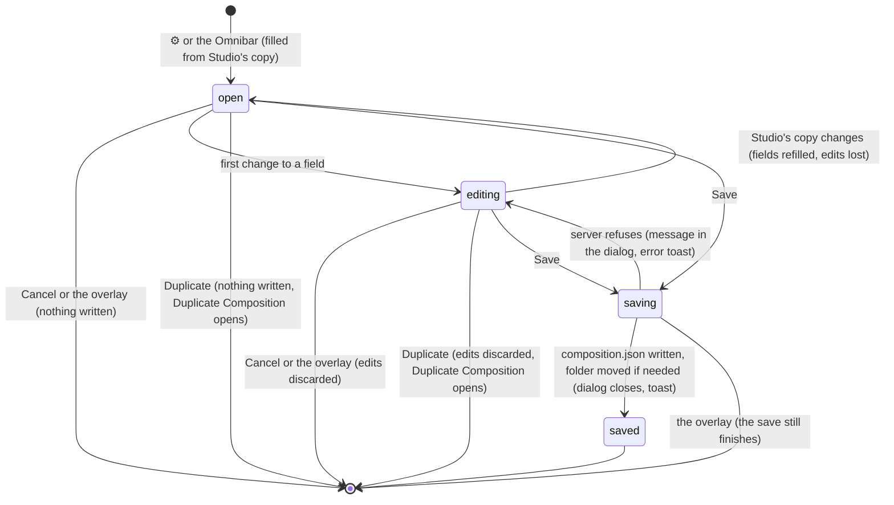
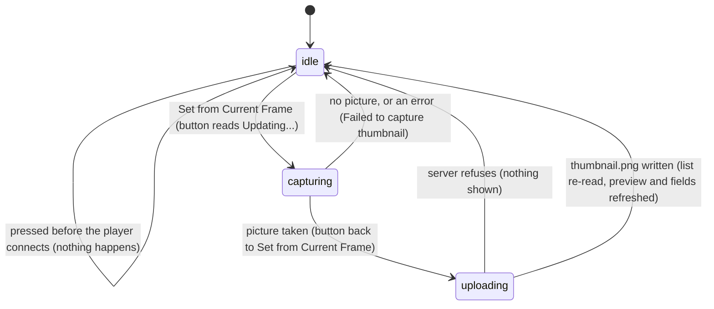

# Composition settings

## Summary

Composition Settings is the [dialog](../glossary.md#the-workspace) for changing what Studio stores about the [active composition](../glossary.md#compositions-and-files): its name, which is its folder's name, so changing it renames the folder; its width and height; the frame rate and duration recorded in its [composition metadata](../glossary.md#compositions-and-files); and its [thumbnail](../glossary.md#compositions-and-files). It also leads to Duplicate Composition. It is opened by ⚙️ on the [stage toolbar](../stage/the-stage-toolbar.md) and by the Omnibar's "Composition Settings" (described there as "Edit width, height, FPS, duration"), and always acts on the active composition. Save writes `composition.json` and, when the name calls for a different folder, moves the composition's folder; "Set from Current Frame" writes `thumbnail.png` at once, whether or not the dialog is then saved. Everything works before the player is [connected](../glossary.md#the-preview) except "Set from Current Frame". With no composition open nothing appears, but the dialog opens by itself as soon as one is opened (see [the workspace](../foundations/the-workspace.md#edge-cases)).

## The simple case

The user presses ⚙️. The dialog appears over a dark overlay, showing the composition's thumbnail (or a grey box reading "No Thumbnail"), its name, and its width, height, FPS, and duration. They change Width to 1280 and Height to 720 and press Save. The button reads "Saving..." for a moment; the dialog closes, a green "Composition updated" toast appears, and the composition is laid out at 1280 by 720 in the stage. Whether the picture itself is redrawn at the new size depends on the composition's code (see [Edge cases](#edge-cases)).

Changing the name to "Teaser" and saving renames the composition's folder to `teaser`. The composition is shown as "Teaser" in the header, the Compositions panel, and the Omnibar, and the player reloads it from its new folder at the same frame. Its in and out points and loop are forgotten.

To set a thumbnail, the user moves the playhead to a good frame and, with the dialog open, presses "Set from Current Frame". The button reads "Updating..." briefly; a moment later the small preview shows the new picture, and so do the Compositions panel and the Omnibar. No toast appears, and the thumbnail is kept whether the dialog is then saved or cancelled.

## The dialog

| Part | Shows | Notes |
| --- | --- | --- |
| Thumbnail | The composition's `thumbnail.png` in a 120 by 68 pixel box, cropped to fill it, or a grey box reading "No Thumbnail"; beside it the "Set from Current Frame" button | See [Setting the thumbnail](#setting-the-thumbnail). |
| Name | The composition's [name](../glossary.md#compositions-and-files) as Studio shows it | A text box. |
| Width, Height | `width` and `height` from Studio's copy of `composition.json` | Number boxes, in composition pixels. No limits. |
| FPS, Duration (sec) | `fps` and `duration` from Studio's copy of `composition.json` | Number boxes. No limits. Neither changes how the composition plays. |
| Duplicate | A button at the left of the bottom row | Closes this dialog without saving and opens [Duplicate Composition](creating-and-duplicating.md) for the active composition. |
| Cancel, Save | Buttons at the right of the bottom row | Save is blue and reads "Saving..." while it waits. |

The dialog is 400 pixels wide, or 90% of the window if that is narrower, over an overlay darker than the other dialogs'. Unlike New Composition and Duplicate Composition, it puts keyboard focus nowhere when it opens.

The values are Studio's copy of the composition, not the file as it is now: `composition.json` as Studio last read it when it listed the compositions, or as the server returned it after the last save or auto-save of this composition. An edit made to the file on disk since then is not shown (see [when the project changes underneath Studio](../foundations/project-and-compositions.md#when-the-project-changes-underneath-studio)). For a composition with no `composition.json`, the four number boxes keep whatever they last held in this page: 1920, 1080, 30, and 5 the first time, otherwise the previous composition's values, or numbers typed there and then cancelled.

## The interaction, event by event

### Starting

The dialog opens centered over the overlay (see [dialogs](../foundations/the-workspace.md#dialogs)) and fills itself from the active composition: Name from its name, the four numbers from Studio's copy of its metadata. Any earlier error is cleared and every control is enabled. Opening it from the Omnibar closes the Omnibar first.

Keyboard focus is not moved by the dialog, so it stays where the opening left it: on ⚙️ after a click there, or on the page after the Omnibar's command (the Omnibar's search had focus, and closing the Omnibar leaves it on the page). It is never on the [player](../glossary.md#the-preview): both ways of opening the dialog take focus away from it first. Studio's shortcuts therefore keep acting behind the dialog until a field is clicked: Space plays and pauses, and ← and → step the playhead, which is the way to choose the thumbnail's frame without closing the dialog. The overlay covers the stage and the timeline, so the mouse cannot reach them. Playback continues.

### Ending at once

Cancel, or a click on the overlay, closes the dialog and writes nothing. A thumbnail set while the dialog was open stays. Duplicate closes the dialog without saving and opens Duplicate Composition for the active composition. Escape does nothing.

### Becoming ongoing

The first change to a field makes the dialog ongoing. Nothing is decided at that moment: the dialog does not mark itself as changed, and Cancel, the overlay, or Duplicate discards the edits without asking.

### While ongoing

Nothing is checked while typing: the number boxes take zero, negative numbers, and fractions, a cleared number box holds 0, and the name is not compared with the folders on disk until Save.

The dialog fills itself in again, from scratch, whenever Studio's copy of the active composition changes while it is open, and the edits are lost. That happens when "Set from Current Frame" finishes (see [Setting the thumbnail](#setting-the-thumbnail)), when the Props Editor's [auto-save](../glossary.md#the-preview) writes the input props (a second or more after they change, while the composition is paused and only if it is not [clock-bound](../glossary.md#the-preview), so typically just after such a composition with props has been opened or edited), and when another composition is chosen in the Omnibar over the dialog. In the last case the dialog then shows the other composition, and Save, "Set from Current Frame", and Duplicate act on that one.

### Finishing

The user saves by pressing Save. Read from the code, Enter in a field does nothing and Enter or Space on a focused button does not press it, as in [New Composition](creating-and-duplicating.md#finishing). While waiting, the fields, Duplicate, Cancel, and "Set from Current Frame" are disabled and Save reads "Saving...". The overlay still closes the dialog.

Save sends the four numbers, and the name unless the Name box is empty. The Studio server then:

1. **Renames, if a name was sent.** It makes a folder name from the name by the rule in [where new compositions go](../foundations/project-and-compositions.md#where-new-compositions-go). If that is the composition's own folder at the top of the project, nothing moves. Otherwise it refuses the name if it leaves nothing ("Invalid composition name") or if a file or folder of that name exists at the top of the project (`Composition "{name}" (directory: {folder}) already exists`), and otherwise moves the composition's folder, with everything in it, to the top of the project under that name. This happens whether or not the user changed the name: a composition in a subfolder, or one whose folder name the rule would change (capitals, underscores, spaces), is moved or renamed by any Save with a name in the box.
2. **Writes the numbers.** It reads `composition.json` as it is now, replaces `width`, `height`, `fps`, and `duration`, keeps `defaultProps` and every other field, and writes it back. A composition without the file gets one.

When the server answers, Studio updates the composition in its list in place, without reading the project again, closes the dialog, and shows "Composition updated". The [canvas size](../glossary.md#the-preview) becomes the saved width and height at once, replacing any size typed in the [stage toolbar](../stage/the-stage-toolbar.md). The name shown is made from the folder: "Teaser!" saves as `teaser` and shows as "Teaser"; a name that leads to the same folder ("simple canvas animation") changes nothing that is shown.

If the folder moved, the composition has a new [ID](../glossary.md#compositions-and-files) and a new address, which is a [switch](../glossary.md#events-that-end-or-interrupt-an-interaction) to the same composition: the player loads it from the new folder and, because Studio takes the reconnection for a [hot reload](../glossary.md#the-preview), puts back the playhead position, the playing state, and the input props. Its [timeline state](../glossary.md#the-preview) starts afresh under the new ID. If the folder did not move, the player is not reloaded and playback is not interrupted.

If the server refuses, the dialog stays open with its values, a red box with the server's reason appears above the buttons, and the same message appears as an error toast. A refused rename writes nothing. If the folder was moved but `composition.json` could not be written, the error shows although the folder has already moved, and Studio still knows the composition by its old ID until the page is reloaded.

## Setting the thumbnail

"Set from Current Frame" is an interaction of its own inside the dialog. It does nothing until the player is connected. Once it is, pressing it:

1. Disables the button, which reads "Updating...".
2. Asks the composition for a picture of the [current frame](../glossary.md#the-preview) as it was at the press, moving the composition to that frame first. The picture is taken the way the [render mode](../glossary.md#rendering-and-output) says: in canvas mode (the default) from the composition's first `<canvas>`, in DOM mode from its whole page. Playback is not paused.
3. Scales the picture down to at most 320 pixels wide, keeping its proportions, and turns the button back to "Set from Current Frame".
4. Sends it to the server, which writes it as `thumbnail.png` in the composition's folder, replacing any earlier one.
5. Reads the list of compositions from the project again. The new picture appears in the dialog's preview, the Compositions panel, and the Omnibar.

The re-read in step 5 replaces Studio's copy of every composition with what is on disk. For the active composition this resets the canvas size to `composition.json`'s width and height and fills this dialog in again from the file, discarding any edits not yet saved. Set the thumbnail before editing the other fields, or save first.

Failures are mostly silent. A capture that raises an error shows the red toast "Failed to capture thumbnail". A capture that produces nothing (canvas mode on a composition that draws without a `<canvas>`) does nothing. An upload the server refuses, or that cannot reach the server, shows nothing; the old thumbnail stays (see [when a request fails](../foundations/project-and-compositions.md#when-a-request-fails)). Save stays enabled during "Updating...".

## Modifiers

| Modifier | Set at the start | Changed while ongoing |
| --- | --- | --- |
| Shift | No effect on the dialog. While focus is outside its fields, Shift+← and Shift+→ step the playhead ten frames behind the dialog. | No effect. |
| Ctrl/Cmd | Ctrl/Cmd+K opens the Omnibar, possibly hidden behind this dialog (see [Open questions](#open-questions-and-verification)); choosing a composition there refills the dialog with it. | Same; refilling discards the edits. |
| Alt/Option | No effect. | No effect. |
| Keyboard focus | Focus stays where the opening left it (on ⚙️, or on the page), so Studio's shortcuts act behind the dialog until a field is clicked. The player never has focus at this moment, because both ways of opening the dialog take focus off it, so the player's own keys do not act (see [the input model](../foundations/input-model.md#keyboard-focus-and-who-receives-a-key)). | In a field, shortcuts are ignored except Ctrl/Cmd+K. ↑ and ↓ do not step the number boxes and Enter does not save (see [Finishing](#finishing)). |
| Playback | Opening does not pause. "Set from Current Frame" captures the frame current at the press, playing or not. | A Save that does not move the folder leaves playback alone. One that moves it reloads the player, which resumes at the same frame, playing if it was. |
| Player connection | Everything except "Set from Current Frame" works before the player connects, and for a composition that never connects. "Set from Current Frame" does nothing until it does. | A Save that moves the folder makes the player connect again. |

Studio reads no modifier key in this dialog itself; the rows are the general rules of the [input model](../foundations/input-model.md#modifier-keys) applied to a dialog that leaves focus outside its fields.

## Cancel and interrupt

| Event | Before it is ongoing | While ongoing |
| --- | --- | --- |
| Escape | No effect; the dialog stays open. | No effect, including during "Saving..." and "Updating...". |
| Another shortcut, click, or command | A click on the overlay closes the dialog; a thumbnail already set stays. Shortcuts act behind the dialog while focus is outside its fields. Ctrl/Cmd+K opens the Omnibar. | A click on the overlay discards the edits. During "Saving..." it closes the dialog, but the save finishes: the file is written, the folder moved, the toast shown. Closing during "Updating..." does not stop the thumbnail. |
| Composition switched | Possible only through the Omnibar (Ctrl/Cmd+K). The dialog fills in from the new active composition and acts on it. | Same; the edits are lost. A Save that moves the folder is itself a switch, to the same composition at its new address. |
| Window loses focus | No effect. | No effect on Save. A capture waits for the composition to draw a frame, which a hidden tab does not do, so "Updating..." may last until the tab is shown again. |
| Pointer leaves the window | No effect. | No effect. |
| Server request fails or server stops | No effect; the dialog opens and fills without the server. | Save: the reason in the dialog and an error toast, the dialog kept open. A thumbnail upload that fails shows nothing. |
| Reload or tab closed | Nothing to lose. | The edits are lost without a warning. A save the server had already received is still written. If it moved the folder, the remembered active composition is still the old ID, which no longer exists, so after the reload the first composition in the list opens. |
| Hot reload | No effect; the dialog keeps its values. | No effect on the fields or on Save. A hot reload during "Updating..." may leave the capture unfinished (see [Open questions](#open-questions-and-verification)). |
| Project changed on disk | The dialog shows Studio's copy: a `composition.json` edited on disk shows its old values. | Save writes Studio's four numbers over an edit made on disk, and keeps the file's other fields as they are now. A composition deleted or moved on disk makes Save fail with `Composition "{ID}" not found` and the thumbnail upload fail silently. A folder made on disk with the new name makes a rename fail as "already exists". |

After any interrupt the user is either still in the dialog, with its values unless it refilled itself, or back in the workspace with the dialog closed.

## Interactions with other systems

**Files on disk.** Save writes `width`, `height`, `fps`, and `duration` into `composition.json`, creating the file if there was none, and may move the composition's whole folder to the top of the project under a new name. "Set from Current Frame" writes `thumbnail.png`. Save does not make Studio read the project again; "Set from Current Frame" does, which also lists compositions added on disk since the page loaded. See [what is saved where](../foundations/project-and-compositions.md#what-is-saved-where).

**Browser storage.** A Save that does not move the folder changes nothing remembered. One that does makes the new ID the [remembered](../glossary.md#persistence) active composition and starts a fresh timeline state under it. The timeline state under the old ID stays in the browser, unused: Studio does not write the record of a composition it is leaving (see [how the range is remembered](../playback/the-playback-range.md#how-the-range-is-remembered)). Any composition that later gets the old ID inherits it, such as a new composition given the old name, or this composition renamed back. Renaming back gives the old ID again only for a composition that was at the top of the project under a folder name the naming rule leaves as it is (a subfolder composition comes back to the top level, under a different ID); when it does, the composition reopens under the old ID, Studio reads the old record before writing anything there, and the old in point, out point, loop, and playhead position come back. The thumbnail is not remembered in the browser.

**Undo.** None. The previous values in `composition.json` are gone once saved, and an overwritten thumbnail cannot be brought back. Renaming back moves the folder again; when it gives the composition its old ID, the old in point, out point, and loop come back with it, as described under Browser storage, and the timeline state made under the other name is left behind, unused.

**Playback range and loop.** A rename forgets them: the in point goes to 0, loop off, and the out point to the composition's total frames. Changing FPS or Duration here changes neither the total frames, the timeline's length, nor the range; the composition's code decides those (see [composition metadata](../foundations/project-and-compositions.md#composition-metadata)).

**Input props.** Save keeps `defaultProps` in `composition.json` as they are in the file. A rename carries the current input props over through the reconnection. The Props Editor's auto-save refills the dialog when it writes (see [While ongoing](#while-ongoing)).

**Rendering and export.** Width and height become the canvas size, which [server-side renders](../output/server-renders.md), [client-side exports](../output/client-side-export.md), and job specs use. FPS and Duration do not affect any of them. The thumbnail is captured with the render mode, and is a file in the project, so in a project without `public/` it also appears in the Assets panel as an image once the assets are next read. Render jobs already in the Renders panel keep showing the composition's old location after a rename.

**Notifications.** "Composition updated" (green) when Save succeeds; the same toast also follows the Props Editor's auto-save, so it can appear without the user having saved. The server's message as a red toast, and in the dialog, when Save fails. "Failed to capture thumbnail" (red) when a capture raises an error. No toast for a thumbnail set or for a failed upload.

**Other tabs and agents.** Another tab keeps showing the old values and, after a rename here, the old ID: its Save, its thumbnail, its Duplicate, its delete, and its Props Editor's auto-save fail as not found, and its player cannot reload the moved composition, until that tab is reloaded. Two tabs saving the same composition: the last Save wins for the four numbers. An [agent](../glossary.md#compositions-and-files) that edits `composition.json` loses its width, height, fps, and duration to the next Save here. See [changes from outside Studio](../cross-cutting/changes-from-outside-studio.md).

**Keyboard and accessibility.** The dialog takes no keyboard focus when it opens. Tab reaches its fields and buttons, but read from the code neither Enter nor Space presses a button, so it cannot be saved from the keyboard. Escape does not close it, and it neither traps focus nor is marked as a dialog. The field labels are plain text not tied to their fields; the thumbnail picture's text alternative is "Thumbnail".

## Edge cases

- **Saving moves subfolder compositions.** A composition in `scenes/intro` moves to `intro` at the top of the project on any Save, even with the name untouched. Clearing the Name box before saving keeps it where it is, because no rename is asked for; the name shown is then built from its whole ID ("Scenes/intro") until the page is reloaded.
- **The name after an auto-save.** After the Props Editor's auto-save, a composition in a subfolder is shown, and prefilled here, as "Scenes/intro Card", so Save moves it to `scenes-intro-card` rather than `intro-card`.
- **Folder names the rule changes.** A top-level folder `My_Comp` is shown as "My_Comp"; any Save renames it to `my-comp`, shown as "My Comp".
- **Case-insensitive disks.** On a disk that ignores case (the default on macOS and Windows), a top-level folder with a capital letter, such as `Intro`, cannot be saved with its own name: the target `intro` is the same folder, which the server finds already exists, so Save is refused as "already exists". Clearing or changing the name gets round it. Read from the code.
- **No `composition.json`.** The number boxes show leftovers from the last use of the dialog, and Save writes them into a new file.
- **Zero and negative sizes.** Accepted and written. The player is laid out at the canvas size, so a width or height of 0 leaves nothing visible in the stage.
- **The picture at a new size.** A Title explainer composition draws at the width and height baked into its code when it was created, so a new size stretches its picture to the new shape. The Vanilla JS, React, and Three.js templates draw at whatever size the player has.
- **FPS and Duration do nothing visible.** They are written to `composition.json` and shown here, and nowhere else changes.
- **A composition at the project root.** Its ID is empty: Save fails with "ID is required", "Set from Current Frame" does nothing, and Duplicate does nothing.
- **Save during "Updating...".** Save is not disabled while the thumbnail is captured. If a Save moves the folder before the upload arrives, the upload goes to the old folder, which no longer exists, and the thumbnail is lost without a message.
- **Portrait thumbnails.** A composition drawn at 1080 by 1920 gives a 320 by 568 thumbnail, which the dialog's 16:9 preview crops to its middle.
- **Opened with nothing open.** ⚙️ with no composition open shows nothing, and the dialog then appears by itself over the first composition opened.

## Open questions and verification

- **Enter does not save.** Read from the code, the Omnibar's always-active Enter, ↑, and ↓ listener cancels those keys' default actions everywhere (see the technical note in [creating and duplicating](creating-and-duplicating.md#finishing)), so Enter does not save and does not press a focused button ([keys Studio cancels everywhere](../foundations/input-model.md#keys-studio-cancels-everywhere) owns the rule). Confirm; if confirmed, this may be worth treating as a bug.
- **The Omnibar behind the dialog.** This dialog comes after the Omnibar in the page at the same stacking level, so Ctrl/Cmd+K may open the Omnibar hidden behind it, with keyboard focus in its search (see the stacking order in [the workspace](../foundations/the-workspace.md#dialogs)). Confirm.
- **Edits lost when the dialog refills.** "Set from Current Frame" and the Props Editor's auto-save each refill the dialog from Studio's copy and discard unsaved edits. This looks like a bug.
- **Leftover numbers.** For a composition without `composition.json`, the number boxes show the previous use's values, including numbers typed and cancelled, and Save writes them. This looks like a bug.
- Confirm the case-insensitive refusal on macOS with a top-level folder that has a capital letter, and that on Linux the same Save renames the folder to lowercase.
- Confirm that any Save moves a composition in a subfolder to the top level (also raised in [the project and compositions](../foundations/project-and-compositions.md#edge-cases)), and whether that is intended.
- What the number boxes show, and what Save writes, when `composition.json` lacks one of the four fields.
- Whether "Updating..." can stay forever after a hot reload or with a hidden tab: the capture waits for two animation frames of the composition's page, and the button's state survives closing and reopening the dialog.
- What happens to a server-side render of a composition that is renamed while the render is queued or running.
- Whether a thumbnail of a [clock-bound composition](../glossary.md#the-preview) shows the frame asked for or the clock's frame (see [the preview player](../foundations/the-preview-player.md#open-questions-and-verification)).
- What a width or height of 0 or below does to renders and exports.
- Read from `CompositionSettingsModal.tsx` and its CSS, `Stage/Stage.tsx`, `Stage/StageToolbar.tsx`, `Omnibar.tsx`, `PropsEditor.tsx`, `hooks/useKeyboardShortcut.ts`, `context/StudioContext.tsx` (`updateCompositionMetadata`, `updateThumbnail`, the timeline state effects), `server/plugin.ts` (the PATCH and thumbnail routes), `server/discovery.ts` (`renameComposition`, `updateCompositionMetadata`) with `discovery.test.ts` (rename, rename onto an existing folder, rename of a missing composition), `server/templates/`, and the player's `captureFrame` in `packages/player/src/controllers.ts`. No test covers the dialog, the PATCH route, or the thumbnail route; nothing here is confirmed by hand.

Verified against helios commit `c2bfddb`
