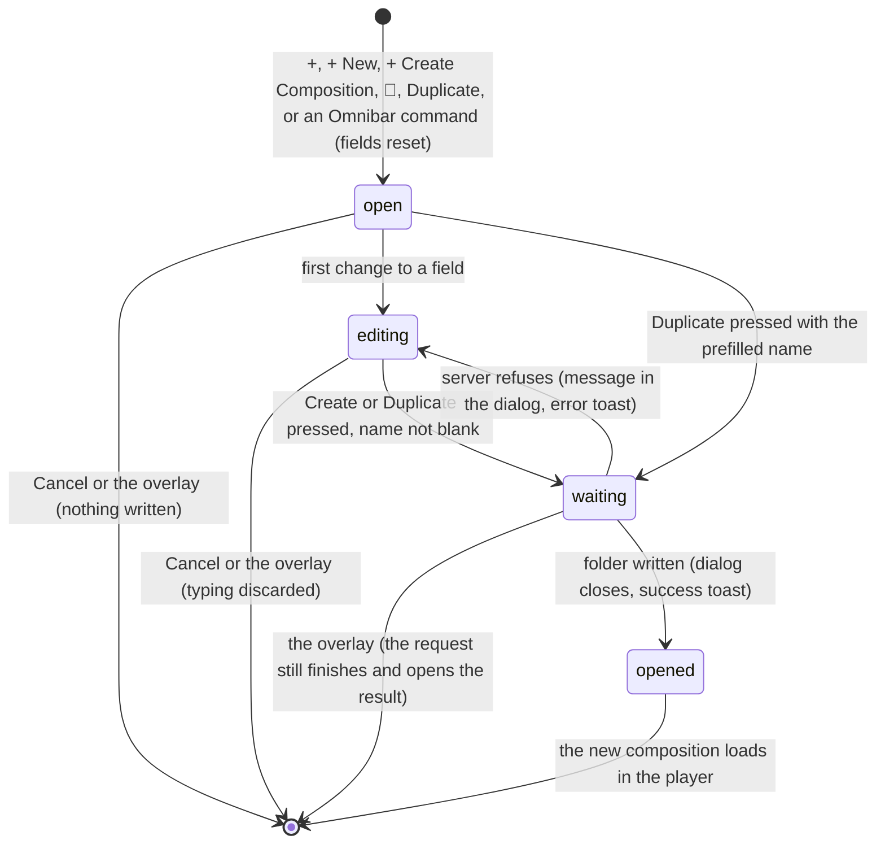

# Creating and duplicating compositions

## Summary

Creating and duplicating add a [composition](../glossary.md#compositions-and-files) to the project without leaving Studio. The New Composition dialog writes a new composition folder from one of Studio's [templates](../glossary.md#compositions-and-files), at the width, height, frame rate, and duration the user types; the Duplicate Composition dialog copies an existing composition's folder, with everything in it, under a new name. Both are [dialogs](../glossary.md#the-workspace) with a name field, a Cancel button, and a primary button; both write a new folder at the top level of the [project](../glossary.md#compositions-and-files); and both end by opening the new composition, which [switches](../glossary.md#events-that-end-or-interrupt-an-interaction) away from the composition that was open. New Composition is opened by the header's "+" button, the Compositions panel's "+ New", the empty stage's "+ Create Composition", and the Omnibar's "Create Composition". Duplicate Composition is opened by 📑 on a composition in the Compositions panel (shown while the pointer is over its thumbnail), by "Duplicate" in [Composition Settings](composition-settings.md), and by the Omnibar's "Duplicate Composition". Neither needs the player to be [connected](../glossary.md#the-preview), and New Composition works in a project with no compositions at all.

## The simple case

The user presses "+" in the header. The New Composition dialog appears over a dark overlay with the text cursor in "Composition Name". They type "Launch Video", choose "Title explainer" in the Template menu, leave the size at 1920 by 1080, FPS at 30, and the duration at 5 seconds, and press Create. The button reads "Creating..." for a moment. Then the dialog closes, a green "Composition created" toast appears, and "Launch Video" opens in the stage at 1920 by 1080, from a new folder `launch-video` at the top of the project. Its title reads "Launch Video", because the Title explainer template uses the typed name as its title.

To copy it, the user points at its thumbnail in the Compositions panel and presses 📑. The Duplicate Composition dialog appears with "New Name" filled in as "Copy of Launch Video", all of it selected. Pressing Duplicate copies the folder to `copy-of-launch-video`, opens the copy, which Studio names "Copy Of Launch Video" after its folder, and shows "Composition duplicated".

Neither dialog stays open after it succeeds, and neither keeps what was typed: the next time one opens, its fields are back to their defaults or to a fresh "Copy of" name.

## The dialogs

| Dialog | Field | When it opens | Notes |
| --- | --- | --- | --- |
| New Composition | Composition Name | Empty, with keyboard focus; placeholder "e.g. My Amazing Video" | Create is disabled while it is empty or only spaces. |
| New Composition | Template | Vanilla JS | A drop-down menu: Title explainer, Vanilla JS, React, Vue, Svelte, Solid, Three.js, in that order. |
| New Composition | Width, Height | 1920, 1080 | Number boxes, in composition pixels. No limits. |
| New Composition | FPS | 30 | Number box. No limits; fractions are accepted. |
| New Composition | Duration (sec) | 5 | Number box, in seconds. No limits. |
| Duplicate Composition | New Name | "Copy of" and the name of the composition being copied, all selected, with keyboard focus; placeholder "e.g. My Video V2" | Duplicate is disabled while it is empty or only spaces. |

Both dialogs are 400 pixels wide and dark grey, with Cancel on the left of a white primary button. Which composition Duplicate Composition copies depends on how it was opened: 📑 copies the composition it was pressed on; Composition Settings and the Omnibar copy the [active composition](../glossary.md#compositions-and-files).

The name typed is used twice. The new folder is named from it by the rule in [where new compositions go](../foundations/project-and-compositions.md#where-new-compositions-go) (lowercase, every run of other characters turned into one hyphen), and the composition's [name](../glossary.md#compositions-and-files) is then made from that folder, so "TikTok Ad!" becomes the folder `tiktok-ad`, shown as "Tiktok Ad". Nothing in the dialog shows the folder name before the user submits.

## The templates

The template decides which files are written into the new folder; [templates](../foundations/project-and-compositions.md#templates) lists them and says which templates connect to the player. The dialog's numbers are written twice: into `composition.json`, which Studio reads, and into the template's own code, which decides how the composition plays.

| Template | The name typed becomes | Baked into the code |
| --- | --- | --- |
| Title explainer | The default of its `title` input prop, drawn as the title (its first 100 characters). The page's own title is always "Helios title explainer". | Width and height (the resolution it draws at), frame rate, duration |
| Vanilla JS, React, Vue, Svelte, Solid, Three.js | The page's title, exactly as typed. | Frame rate and duration; the drawing follows the size of the player |

Because the code holds its own copy, changing the frame rate or duration later in [Composition Settings](composition-settings.md) does not change how the composition plays (see [composition metadata](../foundations/project-and-compositions.md#composition-metadata)). The Solid template adds `-solid` to the folder name unless it already contains "solid": "Intro" with Solid becomes `intro-solid`, shown as "Intro Solid".

In the verification project only a Title explainer composition is known to connect; one made from another template opens and, 5 seconds later, shows "Connection Failed..." (see [connecting](../foundations/the-preview-player.md#connecting) and [Open questions](#open-questions-and-verification)).

## The interaction, event by event

### Starting

The dialog opens centered over a dark overlay that covers the whole page (see [dialogs](../foundations/the-workspace.md#dialogs)). Every opening starts from scratch:

- **New Composition** clears the name, sets the template to Vanilla JS, puts back 1920, 1080, 30, and 5, clears any earlier error, and puts keyboard focus in the name field a moment later.
- **Duplicate Composition** looks up the composition to copy (the one 📑 was pressed on, otherwise the active composition) in Studio's list, fills "New Name" with "Copy of" and that composition's name, selects it all, and puts keyboard focus there. If there is no such composition (no composition is open and the dialog came from the Omnibar), nothing is filled in: the field keeps whatever it held the last time the dialog was used.

Nothing else changes. Playback continues behind the dialog, the stage and the timeline keep updating, and no request is made: the list of templates was read when the page loaded (see [when the page loads](../foundations/the-workspace.md#when-the-page-loads)). If that list failed to load, the Template menu is empty and the composition is made from Vanilla JS.

### Ending at once

Cancel, or a click on the overlay, closes the dialog without writing anything. Escape does not close either dialog. Nothing is remembered, and the next opening starts from scratch. Closing Duplicate Composition also forgets which composition 📑 was pressed on.

### Becoming ongoing

The first change to any field makes the dialog ongoing. Nothing is decided at that moment: the dialog does not mark itself as changed, and closing it afterwards discards the typing without asking. In Duplicate Composition the prefilled name is selected, so the first character typed replaces all of it.

### While ongoing

The primary button is enabled whenever the name has a character other than a space. Nothing else is checked while typing: the number boxes take zero, negative numbers, and fractions, and the name is not compared with the folders on disk until it is submitted. A number box that is cleared holds 0.

Duplicate Composition fills its name in again whenever Studio's list of compositions or the active composition changes while it is open, as happens when the Props Editor's [auto-save](../glossary.md#the-preview) writes the input props. The typed name is then replaced by "Copy of" and the name, selected, with keyboard focus back in the field.

Keyboard focus starts in the name field, so Studio's shortcuts are ignored while the user types, except Ctrl/Cmd+K (see [the input model](../foundations/input-model.md#keyboard-focus-and-who-receives-a-key)). A click on the dialog outside its fields takes focus out of them, and from then on Space, the arrows, and the other shortcuts act on the composition behind the dialog.

### Finishing

The user submits by pressing the primary button. Read from the code, the keyboard cannot submit: Enter in a field does nothing, and Enter or Space on a focused button does not press it (see [Open questions](#open-questions-and-verification)).

> Technical note: the Omnibar listens for Enter, ↑, and ↓ on the whole page at all times, even while it is closed, and cancels the browser's default action for those keys. The browser's default action for Enter is what submits a form from its fields and presses a focused button. Studio's own Space shortcut likewise cancels Space on a focused button.

On submit, every field and both buttons are disabled and the primary button reads "Creating..." or "Duplicating...". The overlay still closes the dialog. The Studio server then does the work (see [the project and compositions](../foundations/project-and-compositions.md)):

- **New Composition** names the folder; refuses the name if it leaves nothing ("Invalid composition name") or if a file or folder of that name already exists at the top of the project (`Composition "{name}" (directory: {folder}) already exists`); and writes the template's files and `composition.json` with the width, height, frame rate, and duration. If any of the four numbers is 0, the server ignores all four and uses 1920 by 1080, 30 frames per second, and 5 seconds, in `composition.json` and in the code.
- **Duplicate Composition** names the folder by the same rule, with the same two refusals, and copies the source's whole folder into it: `composition.html`, `composition.json` with its default props, `thumbnail.png`, and every other file and folder inside. The code is copied unchanged, so the copy's page title, and a Title explainer's default title, are still the source's. A source folder that has gone is refused with `Source composition "{ID}" not found`.

When the folder is written, Studio reads the list of compositions from the project again (which also picks up compositions added on disk since the page loaded), opens the new composition, closes the dialog, and shows a success [toast](../glossary.md#the-workspace): "Composition created" or "Composition duplicated". The new composition is now the active composition, highlighted in the Compositions panel and remembered for the next page load. Opening it is a [switch](../foundations/the-preview-player.md#switching-compositions): the [canvas size](../glossary.md#the-preview) is set from the new `composition.json` (a copy without one keeps the previous canvas size), and the player loads the new page. What the switch carries over from the composition that was open is under [Input props](#interactions-with-other-systems) below.

If the server refuses, the dialog stays open with its fields enabled and its values kept, a red message with the server's reason appears above the buttons, and the same message appears as an error toast. Nothing is written. If the server cannot be reached, the message is the browser's own ("Failed to fetch" in Chromium).

## Modifiers

| Modifier | Set at the start | Changed while ongoing |
| --- | --- | --- |
| Shift | No effect on either dialog. A Shift+letter pressed while focus is outside the fields fires that letter's shortcut behind the dialog. | No effect. |
| Ctrl/Cmd | Ctrl/Cmd+K opens the Omnibar, even from the name field, and it may open hidden behind the dialog (see [Open questions](#open-questions-and-verification)). A Ctrl/Cmd+click on an opening button opens the dialog as usual. | Same as at the start. |
| Alt/Option | No effect. | No effect. |
| Keyboard focus | Opening puts focus in the name field, so Studio's shortcuts are ignored until focus leaves it. | A click on the dialog outside its fields takes focus out of them; Studio's shortcuts then act behind the dialog. ↑ and ↓ do not step the number boxes or move through the Template menu (see the technical note in [Finishing](#finishing)). |
| Playback | Opening does not pause; the composition keeps playing behind the dialog. | No effect while editing. Finishing switches compositions: the old composition's playback stops, and read from the code the new one starts playing if the old one was playing (see [switching compositions](../foundations/the-preview-player.md#switching-compositions)). |
| Player connection | Both dialogs work with no composition open and before the player connects. Duplicate Composition needs a composition to copy; with none, Duplicate does nothing. | No effect. The new composition connects, or fails to, after the dialog has closed. |

Studio reads no modifier key in these dialogs; the rows above are the general rules of the [input model](../foundations/input-model.md#modifier-keys) applied to a dialog with fields.

## Cancel and interrupt

| Event | Before it is ongoing | While ongoing |
| --- | --- | --- |
| Escape | No effect; the dialog stays open. | No effect, including while waiting for the server. |
| Another shortcut, click, or command | A click on the overlay closes the dialog. Shortcuts are ignored while focus is in a field; Ctrl/Cmd+K opens the Omnibar, hidden behind the dialog but holding keyboard focus (see [dialogs](../foundations/the-workspace.md#dialogs)). | A click on the overlay discards the typing. While waiting for the server it closes the dialog, but the request finishes: the composition is still written, opened, and announced, or a refusal shows only as an error toast. |
| Composition switched | Possible only through the Omnibar (Ctrl/Cmd+K). New Composition is unaffected. Duplicate Composition opened for the active composition fills in the new active composition's name and will copy that one; opened with 📑 it keeps its composition. | Same; filling in again replaces the typed name. Finishing is itself a switch, to the new composition. |
| Window loses focus | No effect. | No effect; a request in progress finishes. |
| Pointer leaves the window | No effect. | No effect. |
| Server request fails or server stops | No effect; the dialog makes no request until it is submitted. | The reason in the dialog and an error toast; the dialog stays open (see [when a request fails](../foundations/project-and-compositions.md#when-a-request-fails)). If the folder was written but reading the list afterwards failed, the error shows although the composition exists, and submitting again is refused as "already exists". |
| Reload or tab closed | The dialog and its contents are gone; nothing was written. | The typing is lost without a warning. A request the server had already received still writes the folder; after the reload the new composition is listed, but the remembered active composition opens instead of it. |
| Hot reload | No effect; the composition behind the dialog reloads. | No effect. |
| Project changed on disk | No effect until the dialog is submitted. | A folder made on disk with the same name makes the submit fail as "already exists". A source composition deleted or moved on disk makes Duplicate fail as not found. |

After any of these the user is either still in the dialog with their values, or back in the workspace with the dialog closed. Nothing is left half-written on disk except in the "Server request fails" case above, where the folder exists and Studio has not opened it.

## Interactions with other systems

**Files on disk.** New Composition writes a new top-level folder with the template's files and `composition.json` (width, height, fps, and duration; no default props). Duplicate Composition writes a new top-level folder holding a complete copy of the source folder, wherever the source was. Neither ever overwrites: an existing file or folder of the same name is a refusal. Both make Studio read the list of compositions from the project again. See [what is saved where](../foundations/project-and-compositions.md#what-is-saved-where).

**Browser storage.** The new composition becomes the [remembered](../glossary.md#persistence) active composition. It starts with no [timeline state](../glossary.md#the-preview), unless a composition with the same ID was used before in this browser, in which case it inherits that one's in point, out point, loop, and playhead position (see [the project and compositions](../foundations/project-and-compositions.md#edge-cases)). A copy does not get its source's timeline state. Nothing typed in either dialog is remembered.

**Undo.** None. The only way back is deleting the new composition in [the Compositions panel](the-compositions-panel.md), which removes its folder.

**Playback range and loop.** The new composition starts with the in point at 0 and loop off. Its out point is set from the length Studio still holds for the composition that was open, not from its own: the stale out point described in [the playback range](../playback/the-playback-range.md#edge-cases).

**Input props.** New Composition writes no default props; a Title explainer composition's code supplies `title` (the typed name) and `subtitle` itself. Duplicate Composition copies the source's default props. Read from the code, neither is applied when the new composition opens after a connected one: Studio treats the new composition's first connection as a [hot reload](../glossary.md#the-preview) and carries the previous composition's input props, playhead position, and playing state into it (see [switching compositions](../foundations/the-preview-player.md#switching-compositions)). If the previous composition had input props, the new one is drawn with those; if it had none, the new one shows its code's own defaults, and a copy's saved default props are ignored. What happens next depends on whether the new composition is [clock-bound](../glossary.md#the-preview). Every template is, so read from the code a new composition as the dialog makes it is never auto-saved: what it shows is written nowhere, and "Composition updated" does not appear. A copy of a composition that is not clock-bound (one whose `helios.bindToDocumentTimeline();` line has been removed) is different: once it has connected and the auto-save's wait is over (a second or more, while it is paused), the Props Editor's [auto-save](../glossary.md#the-preview) writes what it shows into the new `composition.json`, with a "Composition updated" toast.

**Rendering and export.** The width and height become the canvas size at once, which is the size [server-side renders](../output/server-renders.md), [client-side exports](../output/client-side-export.md), and job specs use. The frame rate and duration typed in New Composition are baked into the template's code, so they are the composition's own frame rate and duration, which renders and exports use. A copy renders as its source would.

**Notifications.** "Composition created" or "Composition duplicated" (green) on success; the server's message as a red toast on failure, together with the same message in the dialog. A copy of a composition that has input props and is not clock-bound is usually followed, a second or more after it connects and while it is paused, by "Composition updated" from the auto-save. A new composition from a template, Title explainer included, is not, because every template is clock-bound and the auto-save never comes for those.

**Other tabs and agents.** Another Studio tab does not list the new composition until it is reloaded or itself creates, duplicates, or sets a thumbnail. If two tabs create the same name, the second is refused as "already exists". An [agent](../glossary.md#compositions-and-files) can create compositions through Studio's MCP server, with limits the dialog does not have (width 16 to 3840, height 16 to 2160, 1 to 60 frames per second, up to 300 seconds); those appear in this tab once it reads the list again, which the next New Composition or Duplicate here does (see [changes from outside Studio](../cross-cutting/changes-from-outside-studio.md)).

**Keyboard and accessibility.** Both dialogs put keyboard focus in the name field. Read from the code, neither can be submitted from the keyboard (see [Finishing](#finishing)). Neither closes on Escape, traps focus, or is marked as a dialog; Tab can move focus to the page behind. The field labels are plain text not tied to their fields, so a screen reader announces the fields without their names.

## Edge cases

- **Names that vanish.** "Build" and "Dist" make the folders `build` and `dist`, which Studio never looks inside. The composition is written and opened, but it is not in the Compositions panel or the Omnibar, and after a reload Studio no longer shows it although its folder is on disk.
- **Names taken by other folders.** "Public", "Renders", or the name of any other file or folder at the top of the project is refused as "already exists".
- **Solid and a name with no letters or digits.** The Solid template adds `-solid` before the name is checked, so "!!!" with Solid is not refused: it writes a folder named `-solid`, shown as " Solid" with a leading space.
- **One zero discards all four numbers.** Clearing the Width box (it then holds 0) and creating gives 1920 by 1080, 30 FPS, and 5 seconds, whatever the other three boxes said. A negative width or a frame rate of 0.5 is written as typed.
- **Same name as a composition in a subfolder.** "Intro" beside an existing `scenes/intro` writes `intro` at the top level; both are shown as "Intro".
- **A reused ID.** Creating "Intro" after deleting an earlier "Intro" gives the new one the old one's remembered in and out points, loop, and playhead position.
- **Copying from a subfolder.** The copy is written at the top level, higher than its source. A composition that loads files from outside its own folder by relative paths (`../shared/logo.png`) is likely to break in the copy.
- **Copying a large folder.** The server makes the copy in one step and answers nothing else until it is done, so "Duplicating..." stays and the Renders panel stops updating meanwhile.
- **The "Copy of" name.** It is built from the composition's name as Studio shows it. After an auto-save, a composition in a subfolder is shown with its folder path ("Scenes/intro Card"), so the prefill is "Copy of Scenes/intro Card" and the copy's folder `copy-of-scenes-intro-card`.
- **A composition at the project root.** Its ID is empty. 📑 on it duplicates the active composition instead, prefilled with that one's name; when it is itself the active composition, Duplicate does nothing at all, with no request and no message.
- **Reopening during a request.** Closing the dialog with the overlay while it waits and opening it again shows a fresh dialog, which then closes by itself when the earlier request finishes.
- **The typed name in the page.** Except for Title explainer, the templates put the name into the page's `<title>` exactly as typed, so a name containing `</title>` breaks the page's markup. Title explainer escapes it.

## Open questions and verification

- **Enter does not submit.** Read from the code, the Omnibar's always-active Enter, ↑, and ↓ listener cancels the browser's default action for those keys everywhere, so Enter in a field does not submit either dialog, Enter on a focused button does not press it, and ↑ and ↓ do not step the number boxes or the Template menu ([keys Studio cancels everywhere](../foundations/input-model.md#keys-studio-cancels-everywhere) owns the rule). Confirm first; if confirmed it affects every form and button in Studio and may be worth treating as a high-severity bug.
- **The Omnibar behind the dialog.** The Omnibar's overlay is styled to sit below both dialogs' overlays, so Ctrl/Cmd+K from the name field may open the Omnibar hidden behind the dialog, with keyboard focus in its search: typing filters it unseen and Enter runs its highlighted item. The stacking order is owned by [the workspace](../foundations/the-workspace.md#dialogs); [shortcuts and diagnostics](../help/shortcuts-and-diagnostics.md) reports the same hidden Omnibar for its dialogs. Confirm.
- **Which templates connect.** Read from the template code, Title explainer, Vue, Svelte, and Solid make their Helios instance available to the player, and Vanilla JS (the dialog's default), React, and Three.js never do; Vue, Svelte, and Solid also need a project whose Vite configuration compiles their framework, which the verification project lacks, so there they probably fail to load at all (see [templates](../foundations/project-and-compositions.md#templates)). Confirm each template in the verification project, and Vue, Svelte, and Solid in a project set up for them. That the default template never connects may be worth treating as a bug.
- **The carry-over into a new composition.** Confirm that a new or copied composition opened after a connected one receives that one's input props, playhead position, and playing state, and that a copy's saved default props are not applied; test by creating a Title explainer while another Title explainer is open and playing. Confirm too that the auto-save then writes what is shown into the new `composition.json` when the new composition is not clock-bound (test by duplicating a Title explainer whose `helios.bindToDocumentTimeline();` line has been removed while another such composition is open), and that it writes nothing for a new Title explainer, which is clock-bound.
- **Likely bugs to confirm:** "Build" and "Dist" making compositions Studio cannot list; the `-solid` folder for a name with no letters or digits; one zero replacing all four numbers; 📑 on the root composition copying the active one.
- Confirm that a cleared number box shows 0, and whether "Duplicating..." for a large folder holds up the Renders panel's polling.
- Read from `CreateCompositionModal.tsx`, `DuplicateCompositionModal.tsx` and their CSS, `CompositionsPanel/CompositionsPanel.tsx`, `CompositionsPanel/CompositionItem.tsx`, `Omnibar.tsx` and `Omnibar.css`, `App.tsx`, `Stage/Stage.tsx`, `PropsEditor.tsx`, `hooks/useKeyboardShortcut.ts`, `context/StudioContext.tsx`, `server/plugin.ts`, `server/discovery.ts` with `discovery.test.ts` (the Solid suffix), `server/mcp.ts`, and `server/templates/` with their tests. No test covers either dialog; nothing here is confirmed by hand.

Verified against helios commit `c2bfddb`
