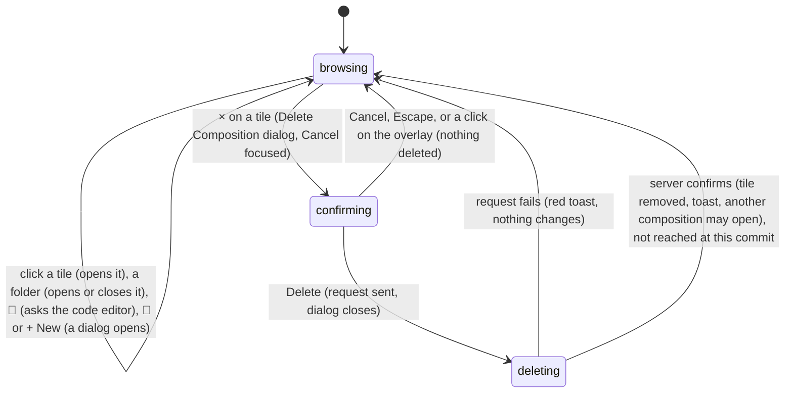

# The Compositions panel

## Summary

The Compositions panel lists every composition in the project so that the user can find one, open it, see which one is open, and act on one: open its folder in a code editor, duplicate it, or delete it. It is the first tab of the [sidebar](../glossary.md#the-workspace), "Compositions", shown by default (see [the sidebar](../foundations/the-workspace.md#the-sidebar)), and it is reached only by clicking that tab; it has no shortcut. It shows a search box, collapsible folders that mirror the folders on disk, and one [composition tile](../glossary.md#compositions-and-files) per composition, with a blue border around the [active composition](../glossary.md#compositions-and-files). It works with no composition open and whether or not the player is [connected](../glossary.md#the-preview). Like every sidebar panel it is discarded when another tab is shown, which forgets its search and which folders were open.

## What the panel shows

From top to bottom:

- **The title row**: "Compositions" and a blue "+ New" button (tooltip "New Composition"), which opens the New Composition dialog (see [creating and duplicating](creating-and-duplicating.md)).
- **The search box**, placeholder "Search...", across the panel's width (see [Searching](#searching)).
- **The list**, which scrolls on its own:
  - **Folders** first, each a row with 📁 (closed) or 📂 (open) and the folder's name. A folder appears for every folder on the way to a composition and for no other: compositions with the IDs `scenes/intro` and `scenes/outro/end` give a "Scenes" folder that holds an "Outro" folder and the "Intro" tile. Folder names are made like [composition names](../glossary.md#compositions-and-files): split at hyphens, each part capitalized. Every folder is closed when the panel appears. An open folder shows its contents indented, with a thin line down their left side: its own folders first, then its tiles.
  - **Composition tiles** after the folders, side by side in rows that wrap. Each tile is 140 pixels wide: the [thumbnail](../glossary.md#compositions-and-files) on top, cropped to fill a 16:9 frame, or 🎬 on gray when the composition has none; the composition name underneath, cut off with "…" when it is too long, with the full name as its tooltip. The active composition's tile has a blue border and a brighter name. At the default sidebar width of 250 pixels the tiles stand in a single column; two fit side by side once the sidebar is a little over 300 pixels wide.
- **The empty states** in place of the list: "No compositions yet." when the project has no compositions, "No matches found." when the search matches nothing.

Within each level, folders and tiles are each sorted by the name shown, in the browser's alphabetical order, which ignores case and compares digits as text ("Scene 10" comes before "Scene 2"). This is not the order the Studio server reports, which decides which composition opens first (see [when the page loads](../foundations/the-workspace.md#when-the-page-loads)).

Moving the pointer over a tile draws a gray border around it. Moving it over the thumbnail darkens the picture and shows three buttons across it: 📝 (tooltip "Open in Editor"), 📑 ("Duplicate"), and × ("Delete"), which turns red under the pointer. The buttons disappear when the pointer leaves the thumbnail.

In the verification project (the `examples/` folder) the panel shows 17 tiles at the top level, no folders, and no thumbnails: at the default sidebar width, a single column of 🎬 tiles from "Audio Visualization" to "Web Component Animation".

## The simple case

The user clicks the "Simple Canvas Animation" tile. Its tile gets the blue border, the header's composition button shows its name, and the stage replaces the previous composition with this one, showing "Loading..." until the player connects (see [switching compositions](../foundations/the-preview-player.md#switching-compositions)). Studio [remembers](../glossary.md#persistence) it as the active composition, so a reload reopens it. Nothing else in the panel changes, and the panel stays as it was for the next click.

To find a composition in a large project, the user types part of its name in the search box. On each keystroke the list narrows to the tiles whose names contain the text and the folders on the way to them, which open by themselves. Emptying the box shows everything again.

To delete a composition, the user moves the pointer over its thumbnail, clicks ×, and confirms with "Delete" in the "Delete Composition" dialog. Read from the code, at this commit the request never reaches the part of the Studio server that deletes: the dialog closes, a red toast reports an error, and the composition stays (see [Finishing](#finishing)).

## The interaction, event by event

The interaction narrated here is acting on a tile: a click that ends at once, or a delete that becomes ongoing when it is confirmed. Searching has its own section below.

### Starting

The interaction starts with a left click on a tile, a folder row, one of a tile's three buttons, or "+ New". What is acted on is the element under the pointer when the button went down and came up; a press on one tile released on another is not a click and does nothing. A right-button press opens the browser's context menu and does nothing in Studio.

A click on a tile or a folder row takes keyboard focus out of any text field that had it, which commits a field that commits when left (the [timecode field](../playback/the-timeline.md#the-timecode-field), a Props Editor text box). Tiles and folder rows cannot hold focus themselves, so focus is left on the page, and a player that had focus loses it. A click on one of the buttons focuses that button (see [presses and keyboard focus](../foundations/input-model.md#presses-and-keyboard-focus)).

Nothing visible happens on the press. The panel marks a tile only once its composition has been opened.

### Ending at once

Every click except a confirmed delete ends at once:

- **A tile.** The composition opens. It becomes the active composition: its tile gets the blue border and the previous one loses it, the header shows its name, and Studio remembers it. The stage loads it into a new player and restores its [timeline state](../glossary.md#the-preview); what happens from there, including what is carried over from the previous composition, is owned by [switching compositions](../foundations/the-preview-player.md#switching-compositions). Nothing is written to the project. Clicking the tile of the composition that is already active does nothing: the player is not reloaded and the timeline state is not restored again.
- **A folder row.** The folder opens or closes. Nothing else changes and nothing is remembered; the folder is closed again the next time the panel appears.
- **📝 "Open in Editor".** Studio asks the Studio server to open the composition in the user's [code editor](../glossary.md#compositions-and-files). What it sends is the composition ID, which names the composition's folder, so the editor is asked to open the folder, not `composition.html`. Studio shows nothing either way: no toast, no error, and the tile is not opened. If no editor is found, the only message is in the terminal running `helios studio`.
- **📑 "Duplicate".** The Duplicate Composition dialog opens for this tile's composition, whether or not it is the active one; the tile is not opened first. The dialog, and the copy opening when it is made, are described in [creating and duplicating](creating-and-duplicating.md).
- **"+ New".** The New Composition dialog opens (same document).
- **× "Delete".** The "Delete Composition" confirmation dialog opens over the whole page: "Are you sure you want to delete "{name}"? This action cannot be undone.", with Cancel and a red Delete button, and keyboard focus on Cancel. The tile is not opened. Cancel, Escape, or a click on the dark overlay closes the dialog; nothing is deleted and nothing is recorded.

### Becoming ongoing

A delete becomes ongoing when Delete is pressed in the confirmation dialog. At that instant the dialog closes, before the server has answered, and the request to delete is sent. Two things are fixed at that moment: which composition is deleted (the one whose × was pressed), and which composition Studio will treat as active when the answer comes (the one active at the press, even if the user opens another meanwhile). Nothing changes in the panel: the tile stays, with no progress indicator.

### While ongoing

Studio waits for the server's answer. Everything stays live: the user can open other compositions, search, open folders, or start another delete, including of the same composition. There is no way to withdraw the request.

### Finishing

**What happens at this commit, read from the code.** The request never reaches the server's code that deletes a composition. The server answers "not found" with an empty reply, Studio cannot read an error message from it, and a red [toast](../foundations/the-workspace.md#toasts) shows the browser's own complaint about the empty reply (in Chromium, "Failed to execute 'json' on 'Response': Unexpected end of JSON input"). Nothing is deleted: the folder stays on disk, the tile stays in the list, and the active composition stays open. If the server cannot be reached at all, the toast says "Failed to fetch" instead.

> Technical note: the server's `/api/compositions` route (`server/plugin.ts`) handles a DELETE only when the rest of the address after `/api/compositions` is exactly `/` or empty. The page sends the composition ID in the query (`/api/compositions?id=...`), so the rest of the address is `/?id=...`, the check fails, and the request falls through to the development server's empty "not found" reply. The Assets panel's delete removes the query before making the same check and is not affected.

**What Studio does when the server does delete.** If verification shows that the request does reach the server, this is what the code does next. The server removes the composition's folder and everything in it at once, with no trash (see [what is saved where](../foundations/project-and-compositions.md#what-is-saved-where)). The tile disappears and a green toast says "Composition deleted". If the deleted composition was the active one at the press, Studio opens the first composition in the server's list, which sorts folder names by character code (capitals before lowercase) rather than as the panel does, so it is not necessarily the first tile in the panel (see [how Studio finds compositions](../foundations/project-and-compositions.md#how-studio-finds-compositions)); if none is left, the stage shows "Welcome to Helios Studio" and the panel shows "No compositions yet." If the server refuses ("Composition "{id}" not found", or "Directory "{id}" is not a valid composition (missing composition.html)"), a red toast shows that message and nothing changes.

## Searching

**Starting.** A click in the search box gives it keyboard focus. While it has focus, Studio's shortcuts are ignored except Ctrl/Cmd+K (see [keyboard focus and who receives a key](../foundations/input-model.md#keyboard-focus-and-who-receives-a-key)).

**Ending at once.** Leaving the box without typing changes nothing.

**Becoming ongoing.** The first keystroke. There is nothing to submit: the list is filtered from that keystroke on, and Enter does nothing.

**While ongoing.** On every keystroke the list is rebuilt from scratch from the text, ignoring case and any spaces at either end:

- A tile is kept if its name contains the text anywhere: "anim" keeps "Simple Canvas Animation". Only the name shown is searched, not the composition ID: "simple-canvas" matches nothing, because the name has spaces where the folder has hyphens.
- A folder is kept if anything inside it is kept. It is then shown open, holding only what matched.
- A folder whose own name contains the text but holds nothing that matches is kept closed, with everything inside it; opening it shows all of its contents.
- When nothing is kept, the list says "No matches found."

**Finishing.** There is no commit. The filter stays as long as the box holds text, including while the user opens compositions from the filtered list and while focus is elsewhere. Emptying the box shows the whole list again. Folders that the search opened stay open afterwards; folders that the search hid come back closed, even if they were open before. The search is forgotten when the panel is discarded (another sidebar tab is shown) or the page reloads, and it is not remembered (see [what Studio remembers](../foundations/the-workspace.md#what-studio-remembers)).

For the search box, "before it is ongoing" means the box has focus and is empty, and "while ongoing" means it holds text.

| Event | Before it is ongoing | While ongoing |
| --- | --- | --- |
| Escape | No effect. | No effect; Escape does not clear the box. |
| Another shortcut, click, or command | Shortcuts are ignored while the box has focus, except Ctrl/Cmd+K, which opens the Omnibar and takes focus. A click elsewhere takes focus away; nothing changes. | Same; the filter stays while focus is elsewhere, and a click on a tile in the filtered list opens it. |
| Composition switched | No effect on the box. | The filter stays. The new active composition's tile gets the blue border if the filter shows it. When Studio re-reads the list after creating or duplicating, the filter applies to the new list. |
| Window loses focus | No effect. | No effect; the text stays. |
| Pointer leaves the window | No effect. | No effect. |
| Server request fails or server stops | No effect; searching makes no request. | No effect. |
| Reload or tab closed | Nothing to lose. | The text is lost; the panel comes back unfiltered with every folder closed. |
| Hot reload | No effect. | No effect. |
| Project changed on disk | No effect; the search runs over the list Studio last read. | Same. |

## Modifiers

| Modifier | Set at the start | Changed while ongoing |
| --- | --- | --- |
| Shift | No effect on tiles, folders, or buttons. In the search box Shift types capitals, and the search ignores case. | No effect. |
| Ctrl/Cmd | A Ctrl/Cmd+click on a tile, a folder, or a button acts as a plain click: there is no multiple selection and no opening in a new tab. In the search box, Ctrl/Cmd+K opens the Omnibar. | No effect. |
| Alt/Option | No effect. | No effect. |
| Keyboard focus | A click on a tile or folder leaves focus on the page: a text field loses it (the timecode field commits) and so does the player. In the search box, Studio's shortcuts are ignored. The confirmation dialog opens with focus on Cancel; shortcuts still act behind it. | No effect; the request does not depend on focus. |
| Playback | Opening another composition discards the one playing (its sound stops); whether the new one plays is described in [switching compositions](../foundations/the-preview-player.md#switching-compositions). A folder click, 📝, 📑, ×, and the search do not touch playback. | No effect. A delete that removed the active composition would replace it, playing or not. |
| Player connection | Everything in the panel works before the player connects and after "Connection Failed...". Opening a composition starts a new connection. | No effect. |

Studio reads no modifier from a click in this panel, so pressing or releasing one changes nothing at any point.

## Cancel and interrupt

These rows are for acting on a tile: "before it is ongoing" covers a click and the open confirmation dialog, "while ongoing" the delete request after Delete is pressed. The search box has its own rows in [Searching](#searching).

| Event | Before it is ongoing | While ongoing |
| --- | --- | --- |
| Escape | A click has already acted; Escape does not undo it. With the confirmation open, Escape closes it as Cancel would, and nothing is deleted. | No effect; the request is not withdrawn. |
| Another shortcut, click, or command | With the confirmation open, a click on the overlay closes it as Cancel would and reaches nothing underneath. Shortcuts act behind it whenever focus is not in a text field (Space toggles playback, even with Cancel focused). Ctrl/Cmd+K opens the Omnibar underneath the confirmation, hidden but holding keyboard focus (see [the Omnibar](the-omnibar.md#edge-cases)). | Everything acts and the request continues. Another delete can be started, for the same composition or another. |
| Composition switched | A click on a tile is itself a switch. With the confirmation open, a switch (possible only through the hidden Omnibar) leaves the confirmation open for the composition it was opened for. | The request continues. Studio decides whether to open another composition from the composition that was active when Delete was pressed, not from the one active when the answer comes. |
| Window loses focus | No effect; the confirmation stays open. | No effect; the answer is handled when it arrives. |
| Pointer leaves the window | A press released outside the element it started on is not a click, so nothing happens. | No effect. |
| Server request fails or server stops | Opening a composition makes no request of its own; if the server has stopped, the composition's page cannot load and the player shows "Connection Failed..." after 5 seconds. 📝 fails silently. The confirmation makes no request until Delete. | The delete fails: a red toast ("Failed to fetch" when the server cannot be reached) and nothing changes. See [when a request fails](../foundations/project-and-compositions.md#when-a-request-fails). |
| Reload or tab closed | The confirmation, the search, and the open folders are lost; nothing is deleted. A composition just opened is remembered and reopens. | The answer is lost with the page. After the reload the list shows what is on disk. |
| Hot reload | No effect on the panel; the confirmation stays open. | No effect. |
| Project changed on disk | The list does not change. A composition deleted or renamed on disk keeps its tile; clicking it loads a missing page, which fails after 5 seconds. One added on disk has no tile until the page is reloaded or Studio creates or duplicates a composition. See [when the project changes underneath Studio](../foundations/project-and-compositions.md#when-the-project-changes-underneath-studio). | No effect on the request, which fails as described in [Finishing](#finishing). |

After any interrupt the panel is as it was, except that a reload, or showing another sidebar tab, forgets the search and the open folders. A delete that failed is never retried.

## Interactions with other systems

**Files on disk.** The panel shows the list Studio read when the page loaded, or after Studio's own create, duplicate, or thumbnail change (see [how Studio finds compositions](../foundations/project-and-compositions.md#how-studio-finds-compositions)); it never re-reads by itself. The thumbnails are the compositions' `thumbnail.png` files. Opening a composition and 📝 write nothing. Delete is meant to remove the composition's folder and everything in it; at this commit the request does not reach that code (see [Finishing](#finishing)).

**Browser storage.** Opening a composition remembers it as the active composition. The search text and the open folders are not remembered (see [what Studio remembers](../foundations/the-workspace.md#what-studio-remembers)). Deleting would not remove the composition's remembered timeline state, so a composition created later with the same folder name inherits its in and out points, loop, and playhead position (see [project and compositions](../foundations/project-and-compositions.md#edge-cases)).

**Undo.** None. Opening a composition is reversed only by opening the previous one again. A delete, had it happened, could not be undone from Studio.

**Playback range and loop.** Opening a composition restores its own in point, out point, and loop (see [how the range is remembered](../playback/the-playback-range.md#how-the-range-is-remembered)).

**Input props.** Opening a composition applies its default props when it connects, subject to the suspected bug in [switching compositions](../foundations/the-preview-player.md#switching-compositions) that carries the previous composition's input props over and auto-saves them into the new one.

**Rendering and export.** None directly. Deleting a composition would leave its render jobs in the Renders panel and their files in the [renders folder](../glossary.md#compositions-and-files).

**Notifications.** "Composition deleted" (green) when the server deletes; a red toast with the server's message or the browser's error when it does not. Opening a composition, a folder click, and 📝 show no toast.

**Other tabs and agents.** Each Studio tab has its own list. A composition created, renamed, or deleted by another tab, by the user's editor, or by an [agent](../glossary.md#compositions-and-files) does not appear, change, or disappear in this tab until it is reloaded or creates or duplicates a composition itself. Every tab writes the same remembered active composition, so a reload opens the one last opened in any tab served at the same address.

**Keyboard and accessibility.** Tiles and folder rows cannot be reached with Tab and do not respond to keys, so opening a composition or a folder from the panel needs the mouse; [the Omnibar](the-omnibar.md) is the keyboard way to open a composition. The three buttons on each tile can be reached with Tab but stay invisible while they have focus, because they show only while the pointer is over the thumbnail, and they cannot be pressed with Enter or Space (see [keys Studio cancels everywhere](../foundations/input-model.md#keys-studio-cancels-everywhere)); they are labeled only by their tooltips. "+ New" cannot be pressed from the keyboard either. A thumbnail's alternative text is the composition name. In the confirmation dialog, focus starts on Cancel and Escape closes it; read from the code, neither Enter nor Space presses Cancel or Delete (see [Open questions](#open-questions-and-verification)).

## Edge cases

- **The active composition inside a closed folder.** The panel does not open the folder or scroll to the tile, so no visible tile has the blue border until the user opens the folder.
- **Two compositions with the same name.** Compositions whose folders have the same name in different parent folders show identical tiles, sorted in the server's order. The confirmation names the composition, not its folder, so it does not say which one would be deleted.
- **A composition at the project root.** Its ID is empty. Its tile sits at the top level, named after the project folder. 📝 sends no path and nothing happens; 📑 duplicates the active composition instead (see [creating and duplicating](creating-and-duplicating.md#edge-cases)); a delete that reached the server would be refused with "Missing composition ID".
- **Names after an auto-save.** After the Props Editor's auto-save, a composition in a subfolder is named from its whole ID ("Scenes/intro Card") until the page is reloaded (see [project and compositions](../foundations/project-and-compositions.md#edge-cases)). Its tile stays in its folder but shows that name, sorts by it, and is now found by a search for the folder's name.
- **Numbers sort as text.** "Scene 10" sorts before "Scene 2", so numbered compositions appear out of order unless their numbers are padded ("Scene 02").
- **Nested compositions.** A composition inside another composition's folder is never listed (see [how Studio finds compositions](../foundations/project-and-compositions.md#how-studio-finds-compositions)), so it has no tile, and its folder does not appear as a folder row either.
- **Deleting from the Assets panel.** In a project without `public/`, such as the verification project, every composition folder is also an asset folder, and deleting it from the Assets panel does delete it (see [asset actions](../assets/asset-actions.md)). Its tile stays in the Compositions panel until the page is reloaded; clicking it loads a missing page.
- **Dragging from a tile.** Pressing on a tile and moving selects the names' text, as on any page. Pressing on a thumbnail picture and moving drags a copy of the picture with the browser's own drag and drop; the panel does not use it, and the release does not open the composition. What a drop target does with it depends on what the browser puts in the drag (see [drag and drop](../foundations/input-model.md#drag-and-drop) and [Open questions](#open-questions-and-verification)).
- **A new thumbnail.** After "Set from Current Frame" in Composition Settings, the tile shows the new picture at once, because Studio re-reads the list.
- **A long list.** Every tile is drawn; there is no paging and no count.
- **Deleting the last composition** (if the delete reached the server) would leave "No compositions yet." in the panel and "Welcome to Helios Studio" in the stage. Studio would keep the deleted composition's ID as the remembered active composition; on reload it is not found and the first composition opens.
- **A second confirmation.** While a delete request is in flight, × on the same tile opens the confirmation again; a second Delete sends a second request.

## Open questions and verification

- **First to verify: deleting a composition.** Read from the code, every delete request from this panel falls through the server's route (see the technical note in [Finishing](#finishing)), so Delete never deletes and always shows a red toast with a parsing error. If confirmed, this is a high-severity bug: the panel's delete button does not work at all. If it does work, verify the behavior described under "What Studio does when the server does delete".
- If deleting works: confirm that deleting the active composition opens the first composition in the server's order rather than the first tile, and that the decision uses the composition active when Delete was pressed. The latter may be worth treating as a bug if the user opens another composition while the request is in flight.
- Confirm what 📝 opens: read from the code, the composition's folder (its ID), not `composition.html`, in the editor the development server picks. An editor such as VS Code may open the folder as a new workspace window. Opening the folder rather than the file may be worth treating as a bug. Confirm that nothing appears in Studio when no editor is found.
- Confirm the confirmation dialog's keyboard behavior. Read from the code, Studio cancels Enter's browser action on every key press and Space's outside text fields, and Space toggles playback instead (see [keys Studio cancels everywhere](../foundations/input-model.md#keys-studio-cancels-everywhere)); so neither key presses the focused Cancel or Delete, and Escape is the only keyboard way out.
- The tile buttons can take keyboard focus while invisible, and tiles and folders cannot take it at all. This may be worth treating as an accessibility bug.
- A search that matches only a folder's name shows that folder closed, with all its contents inside. This is a product call (the test calls it correct), but it hides the result one click away.
- Folders opened by a search stay open after it is cleared, while folders it hid come back closed. Confirm.
- Confirm that a Control+click on a Mac opens the context menu without opening the composition.
- Confirm what dragging a thumbnail picture does when dropped on the Props Editor, the timeline, or the Assets panel; the panel itself attaches nothing to the drag.
- Confirm the column count at the default sidebar width, and that the active tile's blue border and the hover gray border are as described.
- Read from `components/CompositionsPanel/CompositionsPanel.tsx`, `CompositionTree.tsx`, `CompositionItem.tsx`, their CSS, `CompositionsPanel.test.tsx`, `CompositionItem.test.tsx`, `utils/tree.ts`, `utils/tree.test.ts`, `components/ConfirmationModal/ConfirmationModal.tsx` and its CSS, `deleteComposition`, `openInEditor`, and the active composition in `context/StudioContext.tsx`, the `/api/compositions` route in `server/plugin.ts`, `findCompositions` and `deleteComposition` in `server/discovery.ts` with `server/discovery.test.ts`; not yet confirmed by hand.

Verified against helios commit `c2bfddb`
