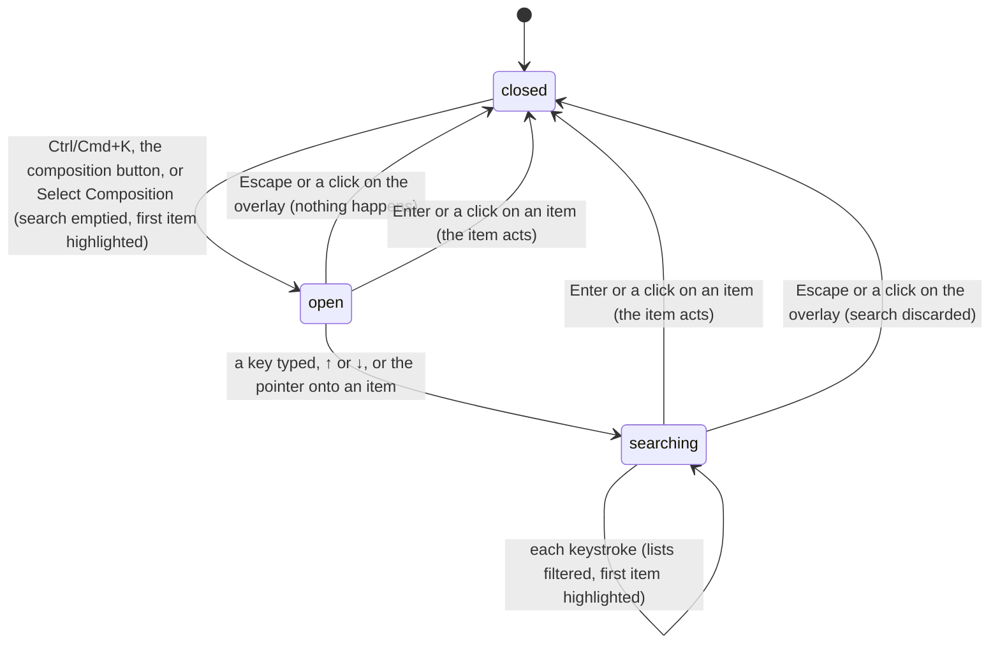

# The Omnibar

## Summary

The Omnibar is Studio's command palette: one search box over three lists, so that the user can run a command, switch to another composition, or copy an asset's path without reaching for the mouse. It is a [dialog](../glossary.md#the-workspace), a box 600 pixels wide near the top of the page over a dark overlay. It opens on Ctrl/Cmd+K from anywhere, even from a text field, on a click on the composition button in the [header](../foundations/the-workspace.md#the-header), and on "Select Composition (⌘K)" in the stage's empty state; its search box then has keyboard focus. It closes when an item is chosen, on Escape, and on a click on the overlay. It works with no composition open and before the player is [connected](../glossary.md#the-preview), though some of its commands then do nothing. Nothing about it is remembered.

## What the Omnibar shows

- **The search box** at the top, in a large font, with the placeholder "Search commands, compositions, and assets...". It is empty on every opening.
- **The list**, at most 400 pixels tall and scrolling on its own, in up to three groups under gray capitalized headers: COMMANDS, COMPOSITIONS, ASSETS. A group with no matching item is left out; with none at all the list says "No results found".
- **The footer**: "↑↓ to navigate" on the left and "Esc to close" on the right.

Each item is a row with an icon, a label, and a smaller gray description under the label. One item at a time is highlighted with a gray background; the highlighted item shows ↵ at its right unless it has a key hint.

The commands, always all listed and always in this order:

| Command | Description | Hint | What choosing it does |
| --- | --- | --- | --- |
| Create Composition | Create a new video composition | N | Opens the New Composition dialog (see [creating and duplicating](creating-and-duplicating.md)). |
| Duplicate Composition | Duplicate the current composition | | Opens the Duplicate Composition dialog for the [active composition](../glossary.md#compositions-and-files) (same document). With no composition open, the dialog has nothing to duplicate. |
| Composition Settings | Edit width, height, FPS, duration | | Opens Composition Settings for the active composition (see [composition settings](composition-settings.md)). With none open, nothing appears until a composition is opened (see [the workspace](../foundations/the-workspace.md#edge-cases)). |
| Toggle Loop | Toggle playback loop | L | Turns [loop](../glossary.md#the-preview) on or off, as the 🔁 button and Shift+L do (see [the transport controls](../playback/the-transport-controls.md)). |
| Take Snapshot | Save current frame as PNG | S | Saves a [snapshot](../glossary.md#rendering-and-output) of the current frame (see [snapshots and job specs](../output/snapshots-and-job-specs.md)). Before the player is connected it does nothing at all. |
| Start Render | Render current composition to video | | Starts a server-side [render job](../glossary.md#rendering-and-output) of the active composition's whole length, ignoring the [playback range](../glossary.md#the-preview) (see [server-side renders](../output/server-renders.md#finishing)). With no composition open it does nothing. |
| Keyboard Shortcuts | View list of keyboard shortcuts | ? | Opens the Keyboard Shortcuts dialog (see [shortcuts and diagnostics](../help/shortcuts-and-diagnostics.md)). |
| Diagnostics | View system capabilities and performance | | Opens System Diagnostics (same document). |
| Helios Assistant | Ask AI for help | | Opens the Helios Assistant (see [the assistant](../help/the-assistant.md)). |

The hints are labels only; the Omnibar does not act on N, S, L, or ? itself. ? is Studio's real shortcut for Keyboard Shortcuts, but N and S do nothing, and L plays forward rather than toggling loop (see [the shortcut map](../foundations/input-model.md#the-shortcut-map)).

**Compositions** follow, one per composition Studio has listed, in the order the Studio server reported them, which is not the order of the [Compositions panel](the-compositions-panel.md): folder by folder, with names in character-code order on macOS and Linux, so capitals come before lowercase (see [how Studio finds compositions](../foundations/project-and-compositions.md#how-studio-finds-compositions)). Each shows its [thumbnail](../glossary.md#compositions-and-files) as a small 32 by 18 picture, or a gray block when it has none, its [composition name](../glossary.md#compositions-and-files), and as its description its [composition ID](../glossary.md#compositions-and-files). After the composition's settings are saved or its input props are auto-saved, the description becomes "Example: {name}" until the page is reloaded (see [composition IDs and names](../foundations/project-and-compositions.md#composition-ids-and-names)).

**Assets** come last, one per [asset](../glossary.md#compositions-and-files) Studio has listed, folders included, in the order the server reported them. Each shows an icon for its type (🖼️ image, 🎥 video, 🔊 audio, 🔤 font, 🧊 model, {} JSON, 🔮 shader, 📄 folder), its file or folder name, and as its description its path relative to `public/`, or to the project root when the project has no `public/` folder (see [assets](../foundations/project-and-compositions.md#assets)).

Every list is shown in full. With an empty search the Omnibar lists every command, every composition, and every asset. In the verification project (the `examples/` folder, which has no `public/`), that is 9 commands, 17 compositions, and about 72 assets: some 40 folders and 32 JSON files (`package.json`, `package-lock.json`, `tsconfig.json`, and one `animation.json`).

## The simple case

The user presses Ctrl/Cmd+K. The Omnibar appears with everything listed and "Create Composition" highlighted, and playback pauses if it was playing (unless keyboard focus was in a text field). The user types "title". On each keystroke the lists narrow to the items whose label or description contains the text, and the first remaining item is highlighted. The user presses ↓ until the composition they want is highlighted and presses Enter. The Omnibar closes and the composition opens, exactly as a click on its tile in the Compositions panel would open it.

Choosing a command runs it and closes the Omnibar; a command that opens a dialog replaces the Omnibar with that dialog. Choosing an asset copies its path to the clipboard and shows "Path copied to clipboard". Clicking an item does the same as highlighting it and pressing Enter. Escape, or a click on the dark overlay, closes the Omnibar without doing anything.

## The interaction, event by event

### Starting

The Omnibar opens on Ctrl/Cmd+K (Control or Command on every platform, wherever keyboard focus is), on a click on the composition button in the header, and on a click on "Select Composition (⌘K)" in the stage's [empty state](../foundations/the-workspace.md#the-stage). At that instant:

- The search text is emptied and the first item, "Create Composition", is highlighted, whatever was typed or highlighted the last time.
- Ctrl/Cmd+K also pauses playback, unless focus was in a text field (see [modifier keys](../foundations/input-model.md#modifier-keys)). The two buttons do not pause.
- About 10 milliseconds later the search box takes keyboard focus. Whatever had focus loses it: a field that commits when left commits (the [timecode field](../playback/the-timeline.md#the-timecode-field), a Props Editor text box), and the player stops receiving keys.
- The lists are made from what Studio already holds: the compositions and assets it last read from the Studio server. Opening makes no request.

If the Omnibar is already open, Ctrl/Cmd+K does nothing more; the search is not cleared. The composition button cannot be pressed again: the Omnibar's overlay covers the whole page, header included, so a click on the button lands on the overlay and closes the Omnibar (see [Ending at once](#ending-at-once)).

The Omnibar is drawn beneath every other dialog. Opened while another dialog is open (Ctrl/Cmd+K works in any dialog's text field, and anywhere else while a dialog is open), it appears behind that dialog's overlay, dimmed and out of reach of the mouse, while its search box still takes keyboard focus (see [Edge cases](#edge-cases)).

### Ending at once

Escape, or a click on the dark overlay around the box, closes the Omnibar before anything has been typed or highlighted. Nothing happens and nothing is recorded. The click on the overlay does nothing else: it does not reach what is underneath. Keyboard focus is left on the page, not returned to where it was before the Omnibar opened.

Choosing an item straight away, with Enter or a click, is the same as choosing it after a search; it is described under [Finishing](#finishing).

### Becoming ongoing

The Omnibar becomes ongoing at the first change: a character typed into or deleted from the search box, ↑ or ↓, or the pointer moving onto an item, which highlights it. Nothing is captured or fixed at that moment. The lists keep following Studio's state: if Studio re-reads the compositions or the assets while the Omnibar is open, the lists change under the search.

### While ongoing

- **Typing** rebuilds all three lists from scratch on each keystroke. An item stays if its label or its description contains the search text, ignoring case. Spaces count, including at the ends: "loop " with a trailing space matches nothing. Each keystroke moves the highlight back to the first remaining item. Commands match on their descriptions too: "png" finds Take Snapshot, and "width" finds Composition Settings. Compositions match on their ID, so "simple-canvas" finds "Simple Canvas Animation". Assets match on their path, so a folder's name finds the folder and everything listed inside it. The key hints are not searched: "?" finds nothing.
- **↑ and ↓** move the highlight one item up or down, across the groups, stopping at the first and the last item; they do not wrap. Holding either key repeats it. The list does not scroll to follow the highlight, which can move below the visible part of the list.
- **The pointer** highlights whatever item it moves onto, including an item that scrolls under a still pointer when the list is scrolled with the wheel. The highlight stays when the pointer leaves the list.
- **Other keys** go to the search box while it has focus: letters, Space, ← and →, Home, and Delete edit the text, and Studio's shortcuts ignore them.

The rest of Studio keeps running behind the overlay: playback continues if it was not paused, render jobs are polled, and toasts appear above the overlay.

### Finishing

Enter, or a click on an item, chooses it: the item acts and the Omnibar closes in the same moment. Enter with nothing listed does nothing, and the Omnibar stays open. Keyboard focus is left on the page; a dialog opened by a command then puts focus in its own field if it has one.

What each kind of item does:

- **A command** does what the table above says. The Omnibar itself writes nothing; each command's own document says what it writes and what it reports.
- **A composition** opens, exactly as a click on its tile in [the Compositions panel](the-compositions-panel.md#ending-at-once) does: it becomes the active composition, is remembered, and is loaded into a new player, with the effects described in [switching compositions](../foundations/the-preview-player.md#switching-compositions). Choosing the composition that is already active does nothing.
- **An asset** puts the path shown as its description on the clipboard, and a green [toast](../foundations/the-workspace.md#toasts) says "Path copied to clipboard". The toast appears even if the browser refused to write the clipboard. The path has no leading slash and is relative to `public/` or the project root, so it is not always the address a composition would load the asset from.

Nothing done from the Omnibar can be undone from it. It keeps no history of recent items; the next opening starts again from "Create Composition".

## Modifiers

| Modifier | Set at the start | Changed while ongoing |
| --- | --- | --- |
| Shift | Ctrl/Cmd+Shift+K opens the Omnibar too. Shift has no effect on the buttons that open it. | Shift with ↑, ↓, or Enter acts as without it. Shift types capitals in the search box, and the search ignores case. |
| Ctrl/Cmd | Ctrl/Cmd+K opens the Omnibar; pressed again while it is open, it does nothing more and keeps the search. | Ctrl/Cmd with ↑, ↓, or Enter acts as without it. A Ctrl/Cmd+click on an item acts as a click. In the search box the browser's own editing combinations (select all, copy, paste) work. |
| Alt/Option | No effect. | Alt/Option with ↑, ↓, or Enter acts as without it. |
| Keyboard focus | From a text field, Ctrl/Cmd+K opens the Omnibar without pausing. With focus elsewhere it also pauses. With the player focused, the player toggles playback and Studio pauses, so playback ends paused (see [keys the player adds](../foundations/input-model.md#keys-the-player-adds-when-it-has-keyboard-focus)). The search box then takes focus; when the Omnibar closes, focus is left on the page. | If focus leaves the search box (a click inside the box that is not on an item, or Tab), typing no longer filters and Studio's letter shortcuts act behind the Omnibar, but ↑, ↓, Enter, and Escape still act on the Omnibar. |
| Playback | Ctrl/Cmd+K pauses unless focus is in a text field; the composition button and "Select Composition (⌘K)" do not. | Playback continues behind the Omnibar if it is playing. Choosing a composition discards the one playing; Toggle Loop changes what happens at the end of the range from then on. |
| Player connection | The Omnibar opens and searches whether or not the player is connected. | No effect on the lists. Before connection, Take Snapshot does nothing, and Start Render uses whatever length Studio last knew (see [what works before the player is connected](../foundations/the-preview-player.md#what-works-before-the-player-is-connected)). |

The Omnibar reads no modifier from its own keys and clicks, so pressing or releasing one while it is open changes nothing except the characters typed.

## Cancel and interrupt

"Before it is ongoing" is the Omnibar open with nothing typed or highlighted by the user; "while ongoing" is after the first change.

| Event | Before it is ongoing | While ongoing |
| --- | --- | --- |
| Escape | Closes the Omnibar; nothing happens. It also closes Keyboard Shortcuts or a confirmation dialog if one is open, since Escape closes all of them at once. | Closes it and discards the search, as before it is ongoing. |
| Another shortcut, click, or command | While the search box has focus, Studio's shortcuts are ignored except Ctrl/Cmd+K (which does nothing more) and ↑, ↓, Enter, and Escape. A click on the overlay closes the Omnibar and reaches nothing underneath. A click inside the box that is not on an item takes focus out of the search box, after which Studio's letter shortcuts act behind the Omnibar. | Same. |
| Composition switched | Only the Omnibar itself can switch while its overlay covers the page, or a create or duplicate still finishing from a dialog closed earlier, whose new composition opens behind the Omnibar and appears in its list. | Same; the search stays and filters the new list. |
| Window loses focus | The Omnibar stays open. When the window comes back, the search box has focus again. | Same; the search and the highlight stay. |
| Pointer leaves the window | No effect; the item last under the pointer stays highlighted. | Same. |
| Server request fails or server stops | No effect; opening and searching make no request, and the lists are those Studio last loaded. | No effect until an item is chosen; then that item's own failure applies: Start Render reports "Failed to start render" if the server cannot be reached and "Render started" even if it refuses (see [when a request fails](../foundations/project-and-compositions.md#when-a-request-fails)); a composition whose page cannot load shows "Connection Failed..." after 5 seconds. |
| Reload or tab closed | The Omnibar is gone; nothing happens. | The search is lost; nothing happens. |
| Hot reload | No effect; the Omnibar stays open and its lists do not change. | Same. |
| Project changed on disk | The lists are those Studio last read: a composition or asset added on disk is missing, and one deleted or renamed on disk is still listed. | Same. Choosing a composition deleted on disk loads a missing page; choosing a deleted asset still copies its old path. |

After any interrupt the user is back in the workspace with the Omnibar closed, or still open with its search if nothing closed it. Nothing typed is kept for the next opening.

## Interactions with other systems

**Files on disk.** The Omnibar reads nothing and writes nothing itself. Start Render makes the server write into the [renders folder](../glossary.md#compositions-and-files); the dialogs it opens write what their own documents say.

**Browser storage.** Nothing about the Omnibar is remembered: not the search, not the highlighted item. Choosing a composition remembers it as the active composition; Toggle Loop changes loop, which is remembered with the composition's [timeline state](../glossary.md#the-preview) (see [what Studio remembers](../foundations/the-workspace.md#what-studio-remembers)).

**Undo.** None. Toggle Loop can be chosen again to turn loop back; a render can be cancelled from the Renders panel; nothing else can be reversed from the Omnibar.

**Playback range and loop.** Toggle Loop changes loop for the active composition. Start Render ignores the playback range and renders the whole length, unlike a render started from the Renders panel (see [how the range limits playback, renders, and exports](../playback/the-playback-range.md#how-the-range-limits-playback-renders-and-exports)).

**Input props.** Start Render renders with the input props the composition has at that moment. Choosing a composition switches, with the suspected carry-over of input props described in [switching compositions](../foundations/the-preview-player.md#switching-compositions).

**Rendering and export.** Start Render and Take Snapshot; their documents own what they do. There is no Omnibar command for client-side export or for a job spec.

**Notifications.** "Path copied to clipboard" (green) when an asset is chosen. The commands show their own toasts, such as "Render started", "Snapshot saved", or "Failed to take snapshot". Opening, searching, and closing show none.

**Other tabs and agents.** Each tab has its own Omnibar, listing what that tab last loaded. A composition or asset added by another tab, the user's editor, or an [agent](../glossary.md#compositions-and-files) appears only after a reload, or, for assets, after any asset change made in this tab.

**Keyboard and accessibility.** The Omnibar is the keyboard way to open a composition and to reach most dialogs: Ctrl/Cmd+K, typing, ↑, ↓, Enter, and Escape cover everything in it. Its items cannot be reached with Tab; Tab moves focus out of the search box to the page behind, and the Omnibar stays open. The highlight is shown only by a background color, and the list does not scroll to it. The box is not announced as a dialog. Read from the code, the way the Omnibar listens for ↑, ↓, and Enter also cancels the browser's own action for those keys on the whole page, whether or not the Omnibar is open (see [Open questions](#open-questions-and-verification)).

## Edge cases

- **Beneath other dialogs.** The Omnibar is drawn below New Composition, Duplicate Composition, Keyboard Shortcuts, System Diagnostics, Render Preview, and the confirmation dialogs, and, because those two come later in the page, below Composition Settings and the Helios Assistant too. Opened over any of them, it sits behind that dialog's overlay: the search box takes focus, so typing filters a list the user can barely see; Enter chooses the highlighted item, which is "Create Composition" if nothing was typed; Escape closes the Omnibar and, if the dialog above is Keyboard Shortcuts or a confirmation, that dialog too. A click anywhere lands on the upper dialog's overlay and closes that dialog, uncovering the Omnibar.
- **Opening a dialog from a hidden Omnibar.** A command chosen from an Omnibar hidden behind another dialog opens its dialog over or under that one according to the same order, so a dialog can open hidden behind the one already shown.
- **Two rows highlighted.** With the pointer resting on one item, ↑ and ↓ highlight another while the item under the pointer keeps its hover background, so two rows look highlighted. Enter chooses the one ↑ and ↓ moved to.
- **Commands that cannot act** are listed and highlighted like the others: Start Render with no composition open, Take Snapshot before the player connects, Duplicate Composition with no composition open. Each closes the Omnibar and nothing visible happens. Composition Settings with no composition open closes the Omnibar and appears later, when a composition is opened.
- **A composition at the project root.** Its ID is empty, so its description falls back to its size and frame rate from `composition.json` ("1920x1080 @ 30fps"); without `composition.json` it reads "undefinedxundefined @ undefinedfps".
- **Same names.** Two compositions whose folders have the same name show the same label and are told apart by their IDs. The verification project has twelve assets named `package.json`, told apart by their paths.
- **In fullscreen.** While the player is in fullscreen only the composition is drawn, so an Omnibar opened with Ctrl/Cmd+K cannot be seen; it is there when fullscreen ends.
- **Long lists.** Every item is drawn. In a large project without `public/`, the asset group holds every folder of the project and every recognized file, and choosing among them by ↓ alone is impractical because the list does not scroll to the highlight.
- **Reopening.** Closing and reopening clears the search; pressing Ctrl/Cmd+K while the Omnibar is open keeps it.
- **Choosing during playback.** Toggle Loop and Start Render act on the frame and state at the moment of choosing; Start Render's length and props are those Studio holds then.

## Open questions and verification

- **First to verify: ↑, ↓, and Enter on the whole page.** Read from the code, the Omnibar listens for ↑, ↓, and Enter on the whole page for as long as Studio is open, and cancels the browser's own action for each such key press before checking whether it is open. If confirmed, then at all times: Enter does not submit the New Composition, Duplicate Composition, or Composition Settings dialog from a text field, does not press a focused button (the confirmation dialogs' Cancel and Delete, the toolbar buttons, the transport buttons), and does not start a new line in a text area (the Props Editor's text areas, caption text in the Captions panel); ↑ and ↓ do not step number fields, change a drop-down menu, move a slider, move the caret between the lines of a text area, or scroll a list or panel. Enter handled by Studio's own code (the timecode field, the asset rename fields, the Helios Assistant's question box) still works. [The input model](../foundations/input-model.md#keys-studio-cancels-everywhere) owns the consequences for the rest of Studio. It may be worth treating as a high-severity bug.
- **Drawn beneath other dialogs.** The Omnibar's overlay is styled at a lower level than every other dialog (`Omnibar.css` line 12) and comes first in the page (`App.tsx` line 122), as described in [Edge cases](#edge-cases) and in the stacking order owned by [the workspace](../foundations/the-workspace.md#dialogs). Confirm by pressing Ctrl/Cmd+K in the New Composition dialog's name field: the Omnibar should open hidden, with focus in its search, and Escape should close it alone (New Composition does not close on Escape). If confirmed, this may be worth treating as a bug.
- The highlight does not scroll into view. Confirm in the verification project, whose full list is far longer than 400 pixels.
- The "N", "S", and "L" hints do not match the code (see [the shortcut map](../foundations/input-model.md#the-shortcut-map)); "?" does. This may be worth treating as a bug.
- "Path copied to clipboard" appears without checking that the clipboard was written. Confirm in a browser profile that denies clipboard access.
- The Omnibar lists compositions in the server's order (`Omnibar.tsx` line 130), unlike the Compositions panel, which sorts its tiles. Confirm on the verification project, whose folder names are all lowercase, so the two orders agree there; a folder name starting with a capital shows the difference.
- The root composition's "undefinedxundefined @ undefinedfps" description looks like a bug. Confirm with a `composition.html` at the project root and no `composition.json`.
- Confirm that the Omnibar cannot be seen in fullscreen, and whether Escape there both leaves fullscreen and reaches the Omnibar.
- Confirm that Ctrl/Cmd+K never also triggers the browser's own Ctrl+K action (Studio asks the browser not to act on it).
- While a composition plays, Studio rebuilds the Omnibar's lists on every frame the composition reports. Confirm that the Omnibar stays responsive in a project with hundreds of assets while playing.
- Read from `components/Omnibar.tsx`, `Omnibar.css`, `Omnibar.test.tsx`, `components/GlobalShortcuts.tsx`, `hooks/useKeyboardShortcut.ts` and its test, `App.tsx`, `Stage/EmptyState.tsx`, the overlay styles of every dialog, `context/StudioContext.tsx` (`setActiveComposition`, `toggleLoop`, `takeSnapshot`, `startRender`, the compositions and assets lists), `server/discovery.ts` (`findCompositions`, `findAssets`, `updateCompositionMetadata`), and `components/DuplicateCompositionModal.tsx`; not yet confirmed by hand.

Verified against helios commit `c2bfddb`
