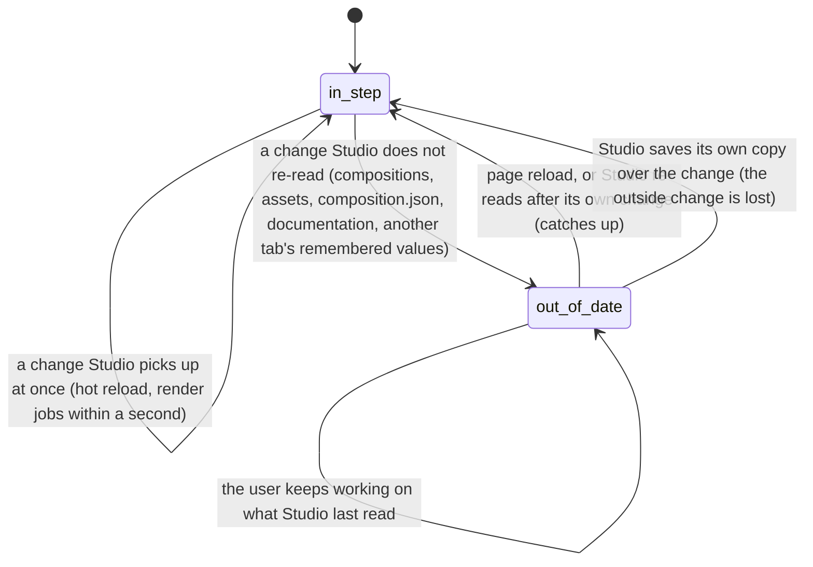

# Changes from outside Studio

## Summary

Studio is rarely the only thing touching a project. While the user has it open, their editor saves files, a file manager moves folders, an [agent](../glossary.md#compositions-and-files) writes code or calls Studio's MCP server, and a second Studio tab makes changes of its own. This document describes what the user sees in Studio meanwhile: which outside changes show up at once, which show up only after a reload, and which Studio silently writes over. It owns the experience across the whole page; the [project and compositions](../foundations/project-and-compositions.md#when-the-project-changes-underneath-studio) document owns the file-by-file rules, and [the preview player](../foundations/the-preview-player.md#hot-reload) owns hot reload.

Studio watches only two things: the files the composition's page uses (through [hot reload](../glossary.md#the-preview)) and the render jobs (asked for every second). Everything else it reads when the page loads and again only after some of its own changes. Nothing on the page ever announces an outside change.

## The simple case

The user has `simple-canvas-animation` open and edits its `composition.html` in their editor. On save, the composition reloads in place in the stage, back at the same frame and still playing if it was. The rest of Studio does not reload and no toast appears.

The user then copies a composition folder in their file manager. Nothing appears in the Compositions panel or the Omnibar. After reloading the page, the copy is listed.

An agent connected to Studio's MCP server starts a render of the composition. Within a second a new job appears at the top of the Renders panel, in every open Studio tab, and its progress advances. Nothing else tells the user that an agent did this.

## What Studio picks up, and when

| Outside change | What the user sees meanwhile | When Studio catches up |
| --- | --- | --- |
| A file the active composition's page uses (`composition.html`, its scripts, styles, imports) | The composition reloads in place, in every tab that has it open | At once ([hot reload](../foundations/the-preview-player.md#hot-reload)) |
| `composition.json` edited | Nothing. Composition Settings, the canvas size on opening, and the default props applied on opening are Studio's old copy | A page reload, or Studio's own create, duplicate, or "Set from Current Frame", which re-read every composition; until then a settings save or the Props Editor's auto-save writes the old copy back over the edit (the auto-save only for a composition that is paused and not [clock-bound](../foundations/the-preview-player.md#clock-bound-compositions); it never comes for a clock-bound one) |
| A composition folder added | Not listed | The same re-reads |
| A composition folder deleted or renamed | Still listed under its old ID and name; opening it ends in "Connection Failed..."; saving its settings or props fails with "Composition "{ID}" not found" | The same re-reads |
| An asset added, renamed, moved, or deleted | The Assets panel and the Omnibar show the old list | A page reload, or any asset change made in Studio |
| A render job started, cancelled, finished, or deleted by another tab or an agent | Shown, with its progress | Within a second |
| `renders/jobs.json` edited | Nothing | The next start of `helios studio` |
| A component installed, updated, or removed | The Components panel shows the old "installed" state | The next time the Components tab is shown |
| A README edited | The Helios Assistant's documentation is the old one | A page reload |
| Remembered values written by another tab | This tab keeps its own | A page reload, except for the timeline state of the composition this tab has open, which the reload writes over first; that is picked up only by opening the composition again from another one |

The Studio page itself never reloads because of a file change: only the composition inside the [player](../glossary.md#the-preview) does.

## A second Studio tab

Two tabs on the same Studio address share the server and the project, but nothing on the page:

- **Each tab has its own player and playback.** Each plays, pauses, and seeks its own copy of the composition. A file saved by either the user's editor or an agent hot-reloads the composition in both.
- **Lists are read per tab.** A composition created, duplicated, renamed, or deleted in one tab appears, moves, or disappears in the other only after the other reloads or re-reads; the same holds for assets. A composition deleted in one tab can still be open in the other; there, every save fails with an error toast.
- **Remembered values are shared but not followed.** Both tabs write the same [remembered](../glossary.md#persistence) values (layout, stage view, render settings, active composition, each composition's [timeline state](../glossary.md#the-preview)) and neither notices the other's writes while open. The last write wins, and is what the next reload of either tab reads, with one exception: a tab writes the timeline state of the composition it has open as the page closes, so reloading it puts back its own in point, out point, loop, and playhead position over the other tab's, and it picks up the other tab's only by opening that composition again from another one (see [the playback range](../playback/the-playback-range.md#interactions-with-other-systems)). See [what Studio remembers](../foundations/the-workspace.md#what-studio-remembers).
- **Saved files are last-write-wins.** Both tabs auto-save the input props of the composition they show into the same `composition.json`, each from its own copy, when that composition is paused and not clock-bound; neither tab sees the other's props until it reloads.
- **Render jobs are shared.** Both tabs poll the server, so a render started, cancelled, or deleted in one shows in the other within a second. Toasts appear only in the tab that acted.

## An agent and Studio's MCP server

An agent that edits files with its own tools is, to Studio, an editor: see [What Studio picks up, and when](#what-studio-picks-up-and-when). An agent connected to Studio's MCP server (the `/mcp` address on Studio's own port, open only to programs on the same computer) can also do the following. The Studio page shows nothing when an agent connects, and no toast for anything it does.

| What the agent asks | What changes | What the user sees |
| --- | --- | --- |
| List compositions; read the documentation, assets, components, or compositions; read a render's status or output | Nothing | Nothing |
| Create a composition | A new folder at the top level of the project, from the template the agent names, Vanilla JS if it names none, with `composition.json` (1920 by 1080, 30 frames per second, 5 seconds unless the agent says otherwise) | Nothing until Studio re-reads the compositions. Then it is listed like any other; a Vanilla JS one never connects (see [the project and compositions](../foundations/project-and-compositions.md#templates)) |
| Render a composition | A new render job and its output in the [renders folder](../glossary.md#compositions-and-files) | The job appears in every tab's Renders panel within a second, labeled with the composition's ID where Studio's own jobs show the composition's address. It covers the whole composition, ignoring the [playback range](../glossary.md#the-preview), at the width, height, frame rate, and duration in `composition.json` (or the agent's values), with the agent's input props rather than the Props Editor's. It runs at the same time as any render the user started |
| Cancel a render | Any job that is queued or rendering, including one the user started | The job's status badge becomes CANCELLED within a second |
| Install, update, or remove a component | Component files in the project's components folder, and the packages they need | The Components panel shows it the next time the tab is shown. A composition that imports a removed component fails the next time its page loads |

## The interaction, event by event

The interaction is one outside change, from the moment it lands until Studio is in step with it again.

### Starting

A change lands: a file is saved, a folder is created or removed, an agent's request is carried out, another tab acts. Studio is not told. What happens next depends only on what the change touched: a file the open composition's page uses, the render jobs, or something Studio read earlier and does not read again by itself.

### Ending at once

Two kinds of change end at once. A change to the composition's own files hot-reloads it within moments: the user sees the picture reload, and Studio puts back the frame, the playing state, and the input props it last saw. A change to the render jobs shows within a second. A change to something Studio never shows (a file with an extension the Assets panel does not list, a file under `node_modules` that the composition does not use) also ends here, with nothing to notice.

### Becoming ongoing

Studio's view goes out of date the moment a change lands on something it read and will not read again by itself: the list of compositions, each composition's metadata, the list of assets, the documentation, the remembered values. Nothing marks this on screen: no badge, no toast, no "changed on disk" warning.

### While ongoing

The user works on what Studio last read, and Studio acts on it:

- Opening a composition uses Studio's copy of its `composition.json`: the canvas size and the default props as they were.
- Acting on something that no longer exists fails with an error toast ("Composition "{ID}" not found", "Failed to rename asset"), or, for the requests that report success anyway (deleting an asset that is already gone), shows a success toast (see [the project and compositions](../foundations/project-and-compositions.md#when-a-request-fails)).
- Creating a composition whose folder an agent or the file manager has already made is refused with `Composition "{name}" (directory: {folder}) already exists`, although the list does not show it.
- Some of Studio's own actions re-read part of the project in passing: creating, duplicating, and "Set from Current Frame" re-read the compositions; any asset change re-reads the assets.

### Finishing

The view comes back in step in one of three ways:

1. **A page reload** re-reads everything Studio reads at load: the compositions and their metadata, the assets, the templates, the render jobs, and the remembered values, including those another tab wrote, except the timeline state of the composition this tab has open, which the closing page writes over first. The Helios Assistant re-reads the documentation on its next opening.
2. **A re-read after Studio's own change** catches up on the compositions or the assets only.
3. **Studio writes over the change.** Composition Settings' Save and the Props Editor's auto-save write Studio's copy of the size, time, and default props into `composition.json`, replacing what was edited outside, with a "Composition updated" toast. The outside edit is gone, and nothing says so. Read from the code, the auto-save never comes for a [clock-bound composition](../glossary.md#the-preview), which is what every template and nearly every example is, so for those only a Save writes over the edit. See [composition metadata](../foundations/project-and-compositions.md#composition-metadata).

## Modifiers

| Modifier | Set at the start | Changed while ongoing |
| --- | --- | --- |
| Shift | No effect; outside changes do not read keys. | No effect. |
| Ctrl/Cmd | No effect. | No effect. |
| Alt/Option | No effect. | No effect. |
| Keyboard focus | An outside change does not move focus. A hot reload replaces only the page inside the player, so, read from the code, the player keeps keyboard focus if it had it. | No effect. A rename or settings field typed against something that has gone fails only when committed. |
| Playback | A hot reload puts back the playing state: a playing composition resumes, at 1x (see [the transport controls](../playback/the-transport-controls.md#cancel-and-interrupt)). No other outside change touches playback. | No effect. |
| Player connection | A hot reload disconnects and reconnects the player; Studio restores its state on reconnection. Changes that do not touch the composition's files leave the connection alone. | A composition whose folder was deleted or renamed on disk cannot connect again once its page is loaded again; it stays on "Connection Failed..." until another composition is opened or the page reloads. |

No modifier changes how Studio notices or ignores an outside change.

## Cancel and interrupt

"Before it is ongoing" is a change Studio picks up at once (a hot reload, a render job); "while ongoing" is a change Studio has not picked up and is showing out of date.

| Event | Before it is ongoing | While ongoing |
| --- | --- | --- |
| Escape | No effect. | No effect. |
| Another shortcut, click, or command | A hot reload interrupts whatever the user was doing with the composition, as each document's "Hot reload" row says. | Studio's own create, duplicate, and "Set from Current Frame" catch up on the compositions; any asset change catches up on the assets. Composition Settings' Save and the Props Editor's auto-save write Studio's old copy over an outside edit to `composition.json`. Acting on something gone fails with a toast, or reports success anyway. |
| Composition switched | The new composition's files are read fresh as its page loads. A hot reload pending for the old one no longer matters. | Opening uses Studio's copy of the composition's metadata, which may be old. A composition deleted or renamed on disk shows "Connection Failed..." after 5 seconds. |
| Window loses focus | No effect. A hot reload or job update that happens while the tab is hidden is shown when it is visible again. | Studio does not re-check anything when the tab is shown again or regains focus. |
| Pointer leaves the window | No effect. | No effect. |
| Server request fails or server stops | While the server is stopped, nothing is picked up: no hot reload, no job updates. | The view stays out of date; the render jobs keep showing their last known state. When a server answers on the same address again, the jobs update from the history it read from `renders/jobs.json` (a job that was rendering comes back as failed); everything else needs a page reload. |
| Reload or tab closed | Nothing to catch up on. | A reload catches up on everything, and is the only way to catch up on the remembered values another tab wrote, except the timeline state of the composition open in this tab, which the closing page writes over first. |
| Hot reload | This is the change picked up at once; see [the preview player](../foundations/the-preview-player.md#hot-reload). | Catches up on the composition's code only; the lists and metadata stay out of date. |
| Project changed on disk | A further change to the composition's files hot-reloads it again. | Changes add up; each re-read catches up only on what it covers. |

After any of these the user stays where they were, with the same composition open, unless the change removed it. Nothing Studio shows is rolled back, and nothing outside is rolled back either.

## Interactions with other systems

**Files on disk.** Studio does not lock files, compare versions, or detect conflicts. Whoever writes last wins, whether that is the user's editor, an agent, another tab, or Studio itself. See [what is saved where](../foundations/project-and-compositions.md#what-is-saved-where).

**Browser storage.** Remembered values are shared by every tab on the same address and read once per page load; open tabs do not follow each other's writes. Another `helios studio` on another port has its own set. An agent cannot read or change them.

**Undo.** None. An outside edit that Studio writes over can be recovered only from the editor's own undo or version control.

**Playback range and loop.** Kept in the browser per [composition ID](../glossary.md#compositions-and-files), so they survive any outside change except a rename on disk, which gives the composition a new ID and forgets them (they return if the folder is renamed back). A hot reload re-applies them. An agent's render ignores them.

**Input props.** A hot reload puts back the input props Studio last saw, so a default value changed in the composition's code does not show after the reload; on a fresh open, the default props in `composition.json` win over the code's in the same way. Default props edited in `composition.json` are not seen until Studio re-reads the compositions. Two tabs' auto-saves overwrite each other. The auto-save never comes for a clock-bound composition (see [the Props Editor](../props/the-props-editor.md#while-ongoing)), so with one of those nothing the user changes in the Props Editor reaches the file. An agent's render uses the agent's props.

**Rendering and export.** Render jobs from any tab or agent show in every tab within a second, and run at the same time as each other. An agent's render differs from the Renders panel's in range, length, and props (see [An agent and Studio's MCP server](#an-agent-and-studios-mcp-server)).

**Notifications.** None for outside changes. Toasts appear only in the tab whose own action caused them.

**Other tabs and agents.** This document's subject: see [A second Studio tab](#a-second-studio-tab) and [An agent and Studio's MCP server](#an-agent-and-studios-mcp-server).

**Keyboard and accessibility.** Nothing announces an outside change. There is no "refresh" command; reloading the page (F5 or Ctrl/Cmd+R) is the way to catch up.

## Edge cases

- **Reloading switches the composition.** Tab A shows one composition, tab B opens another. Reloading tab A opens tab B's composition, because the active composition is remembered once for both.
- **Timeline state from the other tab.** With the same composition in two tabs, the record holds the in point, out point, loop, and playhead position of whichever tab last changed them, paused, or closed. A fresh page load (a new tab) restores that record, and so does reopening the composition from another one. Reloading one of the two tabs does not: the closing page writes its own values first, so the reloaded tab comes back with what it had.
- **An editor that saves on every keystroke** hot-reloads the composition on each save; each reload restores the frame and the playing state, but the playback rate goes back to 1x each time.
- **Two `helios studio` processes on one project.** Each has its own address, remembered values, and render jobs, and each writes its whole job list to `renders/jobs.json`, replacing the other's. After a restart only the jobs of whichever process wrote last come back. Neither shows the other's renders.
- **A render's output deleted on disk.** The job still shows as completed; its preview and download fail, because the file is gone.
- **A thumbnail replaced on disk** may keep showing the old picture until the page reloads, because the browser has it cached at the same address.
- **An agent's composition with the user's name.** If an agent has made `my-intro` and the user creates "My Intro" in Studio before reloading, Studio refuses, naming a folder the user cannot see in the list.
- **Renamed back.** A composition folder renamed on disk and then renamed back gets its remembered timeline state back after a reload.

## Open questions and verification

- What the user sees when the active composition's folder is deleted or renamed on disk while it is open: whether the project's development server reloads the page inside the player (which then cannot connect) or leaves the old page running until something reloads it. Not traced into the development server.
- Confirm that the Studio page itself never reloads because of a file change: it is served as built files without the development server's reload script, while the composition's page has it.
- Two `helios studio` processes on the same project overwrite each other's render history, because each writes its whole in-memory list to `renders/jobs.json` (`server/render-manager.ts:66-74`). This may be worth treating as a bug, or a product call: should a second process be refused?
- Open tabs never follow each other's remembered values, because Studio does not listen for storage changes from other tabs (`hooks/usePersistentState.ts:18-24`). Reloading one tab can therefore switch its composition. Product call.
- Two tabs showing one composition auto-save their own input props over each other's (`components/PropsEditor.tsx:48-71`), when it is paused and not clock-bound. Product call.
- Confirm that reloading a tab that shows a composition puts back its own timeline state rather than one another tab wrote meanwhile, because the closing page writes first (`context/StudioContext.tsx:669-678`).
- An agent's render uses the frame rate and duration in `composition.json` (`server/mcp.ts:157-160`), and 30 frames per second and 10 seconds when the file has none (`server/render-manager.ts:289-290`), while the Renders panel uses the composition's own frame rate and duration. The two can render different lengths of the same composition. This may be worth treating as a bug.
- An agent's composition defaults to the Vanilla JS template (`server/mcp.ts:111`), which never connects to the player (see [the project and compositions](../foundations/project-and-compositions.md#open-questions-and-verification)).
- An agent can cancel the user's own render with no notice in Studio beyond the status change. Product call.
- Confirm the labels in the Renders panel: an agent's job shows the composition ID, a job started in Studio shows the composition's address (`server/render-manager.ts:266`; Studio's own request carries no ID).
- Editing the project's `vite.config` while Studio runs makes the development server restart; what the user sees then was not traced.
- Confirm that the player keeps keyboard focus across a hot reload.
- Read from `context/StudioContext.tsx`, `hooks/usePersistentState.ts`, `components/PropsEditor.tsx`, `ComponentsPanel/ComponentsPanel.tsx`, `AssistantModal/AssistantModal.tsx`, `Stage/Stage.tsx`, `server/plugin.ts`, `server/mcp.ts`, `server/mcp-http.ts`, `server/discovery.ts`, `server/render-manager.ts`, `server/render-access.ts`, and `packages/cli/src/commands/studio.ts`; not yet confirmed by hand.

Verified against helios commit `c2bfddb`
