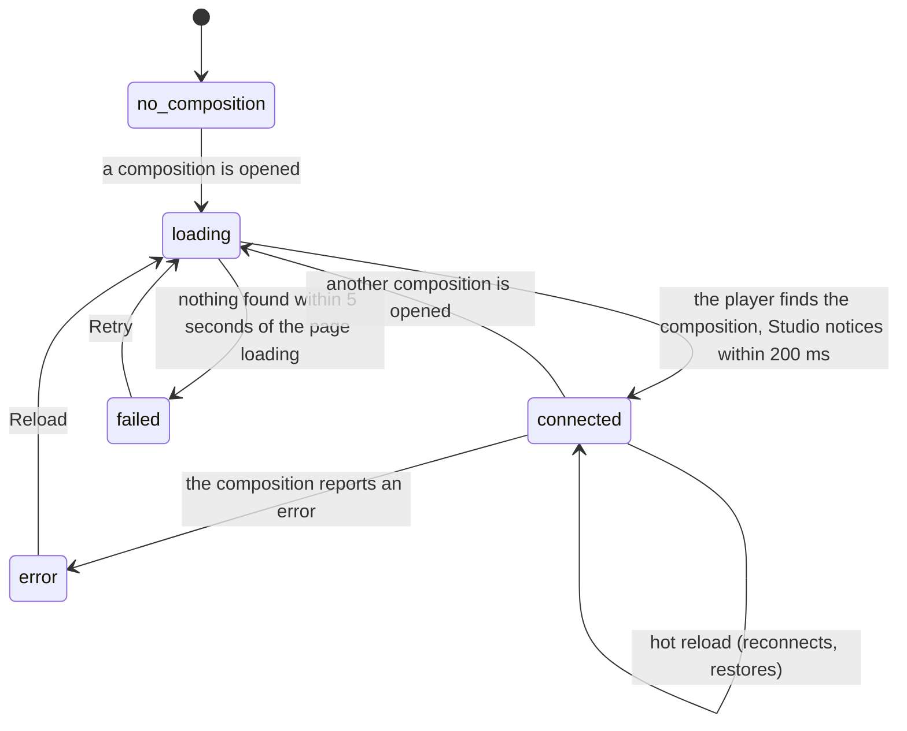

# The preview player

## Summary

The preview player is the part of the stage that loads the active composition's page and drives it: it plays, pauses, and seeks the composition, passes it input props, and reports back its frame, length, playing state, props, captions, markers, and audio tracks. Everything in the timeline panel and the inspector works through it. This document owns how a composition gets into the player and becomes [connected](../glossary.md#the-preview), what the player itself does when the user touches the composition, what [clock-bound compositions](../glossary.md#the-preview) do, what a [hot reload](../glossary.md#the-preview) restores, and what happens when the user switches to another composition.

The player is Helios's `<helios-player>` element. In Studio it has no controls bar, settings menu, or export menu of its own; Studio's [transport controls](../playback/the-transport-controls.md) and [timeline](../playback/the-timeline.md) replace them.

## The player inside the stage

The player is laid out at the [canvas size](../glossary.md#the-preview), one composition pixel to one screen pixel before the [stage view](../stage/the-stage-view.md)'s zoom, with a soft shadow around it. Inside it is the composition's own page. In front of the page lies a transparent layer that catches every mouse press on the composition, so the composition's own buttons and links cannot be clicked from Studio.

What the player does with the mouse and keyboard:

- **A click on the composition** gives the player keyboard focus and toggles playback: it pauses if playing and plays if paused. If the composition is within one frame of its last frame, the click goes to frame 0 and plays, regardless of the in point. A click arrives after any press and release on the composition, including the end of a pan that started and ended on it (see [the stage view](../stage/the-stage-view.md#finishing)). Before the player is connected, a click only gives it focus.
- **A double-click on the composition** toggles playback twice and puts the player into fullscreen: the composition fills the screen with nothing around it and no controls. Escape, or F while the player has focus, leaves fullscreen. Studio's keyboard shortcuts keep working in fullscreen.
- **Keys while the player has focus** go to the player first and then to Studio. The [input model](input-model.md#keys-the-player-adds-when-it-has-keyboard-focus) lists what each key does and what the user sees when both act.

The player covers the composition with a dark, blurred panel carrying a message while it has something to report:

| Message | When | Button |
| --- | --- | --- |
| "Loading..." | From the moment a composition is opened until the player finds it | None |
| "Connection Failed. Ensure window.helios is set or connectToParent() is called." | The composition's page loaded but the player found no composition in it within 5 seconds | Retry |
| "Error: {message}" | The connected composition reported an error | Reload |
| "Retrying..." | Briefly, after Retry or Reload is pressed, before "Loading..." | None |

Retry and Reload both load the composition's page again from scratch and start the 5-second wait again.

## Connecting

### Starting

A composition is opened when the page loads (the remembered one, or the first in the list), when the user picks one in the Compositions panel or the Omnibar, after creating or duplicating one (the new one opens), after renaming one (its address changes), and after deleting the active one (the next in the list opens).

At that moment Studio puts a new player in the stage with the new composition's page, and considers itself disconnected: the transport buttons are disabled, the Props Editor says "No active controller", and the timeline keeps showing the previous composition's numbers until the new ones arrive. The player shows "Loading...". At the same moment Studio restores the composition's remembered [timeline state](../glossary.md#the-preview) (the in and out readouts change at once) and sets the canvas size from the composition's metadata; a composition without metadata keeps the previous canvas size.

### Ending at once

The usual path is short. As soon as the composition's page has finished loading, the player looks for the composition's Helios instance. A composition that makes its instance available while its page loads is found on that first look; Studio notices within 200 milliseconds, the message disappears, and the composition is connected. Nothing is written anywhere.

### Becoming ongoing

If the first look finds nothing, the player keeps looking every 100 milliseconds. The wait becomes ongoing from that first unsuccessful look, and lasts at most 5 seconds.

### While ongoing

The composition's page is running inside the player, drawing whatever it draws, but Studio cannot control it: playback keys do nothing, the Props Editor is empty, and the timeline shows placeholder numbers. Studio's own state still changes: I, O, and Shift+L, the in and out markers, and the loop button change the in point, out point, and loop, which are applied to the composition when it connects.

### Finishing

**Connected.** Studio picks up the connection within 200 milliseconds and, for a freshly opened composition:

1. applies the composition's default props from `composition.json`, if it has any;
2. reads the composition's schema, once;
3. seeks to the remembered playhead position, if the composition has a remembered timeline state;
4. applies loop and the playback range (see [the playback range](../playback/the-playback-range.md));
5. starts showing the composition's frame, length, frame rate, playing state, playback rate, volume, input props, captions, markers, and audio tracks, and keeps them current from then on.

If the out point was 0, it is set to the composition's total frames. The composition is paused unless its own code starts it playing.

**Failed.** After 5 seconds with nothing found, the player shows "Connection Failed..." with Retry. Studio stays disconnected for as long as the composition is open, and would pick up a connection made later (after Retry).

**Which compositions connect.** The player finds a composition whose code assigns its Helios instance to `window.helios`, or calls the player's `connectToParent`, while its page loads. All the examples in `examples/` that animate do this. Of Studio's templates, Title explainer, Vue, Svelte, and Solid do; Vanilla JS, React, and Three.js never connect. The Vue, Svelte, and Solid templates also need the project to compile their framework, which the verification project does not, so there only Title explainer connects (see [the project and compositions](project-and-compositions.md#templates)).

### What works before the player is connected

| Works | Does nothing |
| --- | --- |
| The stage view, the stage toolbar's canvas size, guides, and grid; the layout and dividers; the Compositions, Assets, Components, and Renders panels; every dialog; starting a server-side render (it uses the length Studio last knew, which may be none); the loop button; I, O, Shift+L, and the in and out markers (they change Studio's state, applied on connection) | Play, pause, frame steps, rewind, J, K, L, Home, volume, mute, and speed (all disabled or ignored); scrubbing and the timecode field; the Props Editor; the Captions and Audio panels' edits; snapshots, thumbnails, and client-side export |

### Cancel and interrupt

The interaction here is opening a composition: "before it is ongoing" is while its page loads, "while ongoing" is the wait of up to 5 seconds for the player to find it.

| Event | Before it is ongoing | While ongoing |
| --- | --- | --- |
| Escape | No effect. | No effect. |
| Another shortcut, click, or command | Playback keys are ignored. I, O, Shift+L, and the markers change Studio's state, applied on connection. | Same. |
| Composition switched | The loading page is discarded and the new composition starts loading. | The wait is abandoned and the new composition starts loading. |
| Window loses focus | No effect; loading continues. | No effect; a hidden tab may check less often, so the connection can be noticed later. |
| Pointer leaves the window | No effect. | No effect. |
| Server request fails or server stops | The composition's page cannot load; after 5 seconds "Connection Failed..." appears. | No effect on the wait itself. A composition already connected keeps running if the server stops, but hot reload stops and nothing new can be loaded. |
| Reload or tab closed | Everything starts again from the page load. | Same. |
| Hot reload | The page starts loading again. | The page reloads and the player looks again from the start. |
| Project changed on disk | A composition deleted on disk loads as a missing page and fails after 5 seconds. | Same. |

## Clock-bound compositions

Every example in `examples/` and every Studio template binds itself to the browser's document clock, so that the Helios renderer can drive it frame by frame. The code says that, in an ordinary browser tab, such a composition sets its own current frame on every animation frame from the time since its page loaded, multiplied by its frame rate, and nothing stops that from overriding Studio. Read from the code, a clock-bound composition in Studio behaves like this:

- **It runs on its own.** From the moment it loads, its frame advances in real time whether Studio shows it as playing or paused, and it does not stop at its last frame. The timecode keeps counting past the composition's length; the playhead reaches the right end of the timeline and stays there.
- **Seeks do not hold.** Scrubbing, frame steps, Home, the timecode field, the in point on Play, and the remembered playhead position each move the frame for at most one animation frame, after which the clock puts it back.
- **Play and pause change only the button.** The playing state and the play button follow Studio's commands; the frame does not.
- **The playback range, loop, and playback rate have no effect** on what is shown.
- **What it draws depends on its code.** A composition that wraps time, like `simple-canvas-animation`, appears to loop forever; one that clamps, like Title explainer, holds its last frame.
- **Server-side renders are unaffected.** The renderer drives the composition's clock, which is what binding is for.

If this is confirmed, Studio's transport and timeline cannot control any example or any template composition, and this may be worth treating as a high-severity bug rather than documenting. The [playback](../playback/the-transport-controls.md) documents describe what Studio does when the player can drive the composition, which is the case for a composition that is connected and not clock-bound. To verify them, use a throwaway copy of a Title explainer composition with its `helios.bindToDocumentTimeline();` line removed.

## Hot reload

A hot reload happens when the user saves a file that the composition's page uses: `composition.html`, its scripts, its styles, or modules it imports. The project's development server reloads the composition's page inside the player; the rest of Studio does not reload. `composition.json` is not part of the page, so editing it does not cause a hot reload.

What the user sees:

1. The composition's picture reloads. Usually the player finds the reloaded composition as soon as its page has loaded, so no message appears.
2. Within 200 milliseconds Studio notices the new connection and puts back what it last saw from the composition: the playhead position, whether it was playing, and the input props (if it had any). It reads the schema again and applies loop and the playback range again.
3. Not restored: the playback rate (back to 1x), volume and mute (back to the composition's own defaults, which the transport now shows), the per-track audio mix, and caption edits made in the Captions panel.

In the Studio that `helios studio` serves, no toast announces the reload. When Studio itself runs in development mode, a "Composition reloaded" toast appears for 2 seconds.

If the edit breaks the composition so that its page no longer creates a Helios instance, the player does not find one, and Studio keeps showing the last state it saw from the old page (see [Open questions](#open-questions-and-verification)).

## Switching compositions

Switching is opening another composition (see [Connecting](#connecting)) while one is already open. The old composition's page is discarded at once: its playback and its sound stop, and nothing about it is written anywhere except its [timeline state](../glossary.md#the-preview), which was already remembered. The new composition then loads and connects as described above.

Read from the code, the first connection after a switch is not treated as a fresh open. Studio takes it for a hot reload of the new composition and:

- applies the **previous composition's input props** to the new one, instead of the new one's default props, if the previous one had any input props;
- seeks to the **previous composition's playhead position**, unless the new composition has a remembered position, which then wins;
- **starts playing** if the previous composition was playing.

Once the auto-save's wait is over (a second or more while the new composition is paused; see [the Props Editor](../props/the-props-editor.md#while-ongoing)), the Props Editor's auto-save writes the carried-over props into the new composition's `composition.json` as its default props. If confirmed, this is a high-severity bug: switching from a composition with props to another composition overwrites the second one's saved props.

> Technical note: Studio keeps a record of the last frame, playing state, and input props it saw, together with the address of the composition they came from, and treats a new connection for the same address as a hot reload. At the moment of a switch, the record is updated with the new composition's address while it still holds the old composition's values, because the old connection has not been dropped yet.

A second effect of the switch is described with the range: if the new composition has no remembered timeline state, its out point is set from the previous composition's length rather than its own (see [the playback range](../playback/the-playback-range.md#edge-cases)).

## Interactions with other systems

**Files on disk.** The player reads the composition's files and writes nothing. Opening a composition reads its `composition.json` for the canvas size and default props.

**Browser storage.** Opening a composition restores its timeline state; nothing else about the player is remembered.

**Undo.** None.

**Playback range and loop.** Applied to the composition on every connection, including after a hot reload.

**Input props.** Default props are applied on a fresh open; the props last seen are put back after a hot reload (and, read from the code, after a switch).

**Rendering and export.** Server-side renders load the composition themselves and do not need the player. Snapshots, thumbnails, and client-side export capture frames through the player and need it connected.

**Notifications.** None in the Studio that `helios studio` serves.

**Other tabs and agents.** Each Studio tab has its own player and its own connection. A file saved by an editor or an agent hot-reloads the composition in every tab that has it open.

**Keyboard and accessibility.** The player can be reached with Tab and takes keyboard focus when the composition is clicked; see [the input model](input-model.md#keyboard-focus-and-who-receives-a-key). Its messages are plain text over the composition.

## Edge cases

- **Restarting from frame 0.** A click on the composition at its end restarts from frame 0, while Studio's play button restarts from the in point. With an in point set, the two disagree.
- **A composition that connects late.** A composition that makes its instance available only after its page has loaded and more than 5 seconds have passed shows "Connection Failed..." even though it would work; Retry starts the wait again.
- **Interactive compositions.** A composition that expects clicks (a button inside it) cannot be clicked in Studio, because the player's click layer is in front of it.
- **Fullscreen from a pan.** A quick pan on the composition followed by another click within the double-click interval enters fullscreen.

## Open questions and verification

- **First to verify:** whether a clock-bound composition (every example, every template) runs on its own clock in Studio as described in [Clock-bound compositions](#clock-bound-compositions). Nearly every playback claim depends on the answer.
- Whether switching compositions carries the previous composition's input props, playhead position, and playing state into the next one, and whether the auto-save then writes those props into the next one's `composition.json`. Read from `Stage/Stage.tsx`; no test covers a switch.
- Whether "Loading..." or "Connecting..." is what the user sees while a composition loads.
- What happens after an edit that breaks the composition: whether the player shows "Error: ..." or "Connection Failed...", and whether Studio's transport stays enabled against the dead page.
- Whether a composition that makes its instance available only some time after its page has loaded is found again after a hot reload; the code suggests the player may stop looking because it still holds the old connection.
- Whether framework compositions that update modules in place (React fast refresh, Vue, Svelte) cause a hot reload in the sense described here, or keep the same connection.
- Whether client-side export and snapshots of a clock-bound composition capture the frames asked for, or the clock's frames.
- Read from `Stage/Stage.tsx`, `Stage/Stage.test.tsx`, `App.tsx`, `context/StudioContext.tsx`, `packages/player/src/index.ts`, `controllers.ts`, `bridge.ts`, and `packages/core/src/Helios.ts` with its tests in `packages/core/src/index.test.ts`; not yet confirmed by hand.

Verified against helios commit `c2bfddb`
