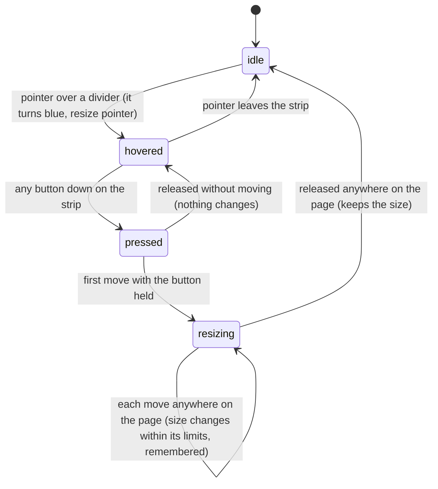

# The workspace

## Summary

This document owns the shape of the Studio page and the things every feature shares: the five areas of the layout and the dividers between them, the sidebar's tabs, the empty states, how dialogs open and close, how toasts behave, what happens when the page loads, and the complete list of what Studio [remembers](../glossary.md#persistence) in the browser. Feature documents say which area they live in, which dialog they open, which toasts they show, and what they remember, and link here for the rules.

The workspace is one page with no routes: the address never changes, there is no back or forward within Studio, and every panel, dialog, and toast appears over or inside the same page. It fills the browser window and never scrolls as a whole; each area scrolls on its own.

## The layout and its dividers

The page is a fixed grid:

- The **header** across the top, 40 pixels tall.
- The **sidebar** on the left, 250 pixels wide by default, from below the header to the bottom of the window.
- The **inspector** on the right, 300 pixels wide by default, from below the header to the bottom of the window.
- The **stage** in the middle, taking whatever space is left, but never less than its toolbar's width, about 938 pixels, so a window narrower than about 1500 pixels pushes the inspector past its right edge, where it cannot be reached (seen in the automated pass of 2026-10-07; [B-77](../bug-triage.md#b-77-the-stage-never-shrinks-below-about-938-pixels-pushing-the-inspector-off-a-narrow-window)).
- The **timeline panel** below the stage, between the sidebar and the inspector, 300 pixels tall by default.

Three [panel dividers](../glossary.md#the-workspace) resize the sidebar, the inspector, and the timeline panel. Each is an invisible strip 10 pixels wide, centered on the edge it moves; hovering it shows a resize pointer and turns it blue.

### Dragging a divider

| Divider | Moving the pointer | Limits |
| --- | --- | --- |
| Sidebar (right edge of the sidebar) | Right widens the sidebar | 150 to 600 pixels wide |
| Inspector (left edge of the inspector) | Left widens the inspector | 200 to 600 pixels wide |
| Timeline (top edge of the timeline panel) | Up makes the timeline panel taller | 100 to 800 pixels tall |

**Starting.** Any mouse button pressed on the strip starts a resize. The press does not move keyboard focus and does not start a text selection. The strip stays blue for the whole drag.

**Ending at once.** Releasing without moving changes nothing and remembers nothing new.

**Becoming ongoing.** The first mouse move with the button held, of any distance. There is no threshold.

**While ongoing.** Each move changes the size by exactly the distance the pointer moved since the previous move, within the limits; the stage absorbs the difference. The divider follows the pointer while the size is inside its limits. At a limit the size stops changing but the pointer can keep going; moving back then changes the size at once, so the divider and the pointer are no longer lined up. The resize follows the pointer anywhere on the page, including over the stage and the composition. Every change is remembered at once. Playback and everything else continue.

**Finishing.** Releasing the button anywhere on the page ends the resize. There is no undo, no double-click to restore the default size, and no keyboard way to resize.

| Event | Before it is ongoing | While ongoing |
| --- | --- | --- |
| Escape | No effect. | No effect; the resize continues. |
| Another shortcut, click, or command | Shortcuts act; the resize waits for a move. | Shortcuts act and the resize continues. A dialog opening does not end it, because the resize follows the pointer over the dialog's overlay too. |
| Composition switched | No effect. | No effect; the layout is the same for every composition. |
| Window loses focus | No effect. | Studio does not notice. If the button is released in another window, the resize continues when the pointer returns, with no button held, until the next release anywhere on the page. |
| Pointer leaves the window | No effect. | The resize continues while the browser keeps reporting the pointer, and ends when the release is seen. |
| Server request fails or server stops | No effect. | No effect; resizing makes no requests. |
| Reload or tab closed | Nothing to lose. | The size up to the last move is already remembered. |
| Hot reload | No effect. | No effect. |
| Project changed on disk | No effect. | No effect. |

Studio has no minimum window size, and the remembered sizes of the other areas are kept in a small window. Read from the code, the stage would shrink first, down to nothing; in the automated pass of 2026-10-07 it stopped at about 938 pixels instead, and the inspector went off the page ([B-77](../bug-triage.md#b-77-the-stage-never-shrinks-below-about-938-pixels-pushing-the-inspector-off-a-narrow-window)).

## The header

The header shows "Helios Studio", then the composition button, then a "+" button.

- **The composition button** shows the active composition's name, or "Select Composition..." when none is open, with "⌘K" at its right on every platform. Clicking it opens [the Omnibar](../compositions/the-omnibar.md).
- **The "+" button**, titled "New Composition", opens the New Composition dialog (see [creating and duplicating](../compositions/creating-and-duplicating.md)).

While any [dialog](#dialogs) is open, its overlay covers the header too, so neither button can be pressed: a click on either lands on the overlay and closes the dialog on top instead. With the Omnibar open, a click on the composition button closes the Omnibar.

## The sidebar

The sidebar has six tabs, in this order, with Compositions shown first by default. At the default width of 250 pixels the row of tabs is about 507 pixels wide: Components is cut off at the sidebar's edge, and Captions, Audio, and Renders lie under the stage, where a click lands on the composition, so they can be clicked only once the sidebar is widened to about 540 pixels (seen in the automated pass of 2026-10-07; [B-76](../bug-triage.md#b-76-at-the-default-sidebar-width-the-last-sidebar-tabs-lie-under-the-stage-and-cannot-be-clicked)).

| Tab | Shows | Described in |
| --- | --- | --- |
| Compositions | The project's compositions, in folders | [The Compositions panel](../compositions/the-compositions-panel.md) |
| Assets | The project's assets | [The Assets panel](../assets/the-assets-panel.md) |
| Components | The component registry | [The Components panel](../panels/the-components-panel.md) |
| Captions | The active composition's caption cues | [The Captions panel](../panels/the-captions-panel.md) |
| Audio | The active composition's audio tracks | [The audio mixer](../panels/the-audio-mixer.md) |
| Renders | Client-side export, server-side render settings, and render jobs | [Server-side renders](../output/server-renders.md), [client-side export](../output/client-side-export.md) |

Clicking a tab shows its panel and hides the previous one. The chosen tab is remembered. A hidden panel is discarded, not kept in the background: switching away from a tab forgets its search text, the folder the Assets panel was showing, its scroll position, and anything typed but not applied, and the Audio panel stops measuring levels.

The sidebar's footer has three buttons: ✨ opens [the Helios Assistant](../help/the-assistant.md), 🩺 opens System Diagnostics, and ? opens Keyboard Shortcuts (both in [shortcuts and diagnostics](../help/shortcuts-and-diagnostics.md)).

## The stage

The stage shows the active composition through the [player](the-preview-player.md), framed by the [stage view](../stage/the-stage-view.md), with [the stage toolbar](../stage/the-stage-toolbar.md) in its bottom-right corner. The checkerboard behind the composition is the transparency grid, on by default.

When no composition is open, the stage shows an empty state instead of the player:

- **The project has no compositions:** "Welcome to Helios Studio", "Get started by creating your first composition.", and a "+ Create Composition" button that opens the New Composition dialog.
- **The project has compositions but none is open:** "No Composition Selected", "Select a composition to start editing.", and a "Select Composition (⌘K)" button that opens the Omnibar.

The first appears whenever Studio's list of compositions is empty, including for a moment while the page loads and for good if the list failed to load. The second does not normally appear: whenever the list has compositions, Studio opens one (see [When the page loads](#when-the-page-loads)). Deleting the active composition would open the first remaining composition in the list if the delete reached the server, but from the page it never does (see [when a request fails](project-and-compositions.md#when-a-request-fails)), so in practice the second empty state cannot be reached.

## The inspector

The inspector is titled "Properties" and holds [the Props Editor](../props/the-props-editor.md). Before the player is connected it says "No active controller"; when the composition has no input props it says "No input props defined".

## The timeline panel

The timeline panel is titled "Timeline". It holds the [transport controls](../playback/the-transport-controls.md) on the left and the [timeline](../playback/the-timeline.md) on the right.

## Dialogs

Every [dialog](../glossary.md#the-workspace) appears over a dark overlay that covers the whole page, centered, except the Omnibar, which sits near the top.

| Dialog | Opened by | Closed by | Escape closes it |
| --- | --- | --- | --- |
| Omnibar | Ctrl/Cmd+K; the composition button; "Select Composition (⌘K)" | Choosing an item; the overlay; Escape | Yes |
| Keyboard Shortcuts | ?; the sidebar's ? button; the Omnibar's "Keyboard Shortcuts" | ×; the overlay; Escape | Yes |
| New Composition | The header's +; the Compositions panel's "+ New"; "+ Create Composition"; the Omnibar's "Create Composition" | Cancel; the overlay; creating successfully | No |
| Duplicate Composition | 📑 on a composition; "Duplicate" in Composition Settings; the Omnibar's "Duplicate Composition" | Cancel; the overlay; duplicating successfully | No |
| Composition Settings | ⚙️ on the stage toolbar; the Omnibar's "Composition Settings" | Cancel; the overlay; saving successfully; "Duplicate" (which opens Duplicate Composition instead) | No |
| System Diagnostics | 🩺; the Omnibar's "Diagnostics" | ×; the overlay | No |
| Helios Assistant | ✨; the Omnibar's "Helios Assistant" | ×; the overlay | No |
| Render Preview | "Preview" on a completed render job | ×; the overlay | No |
| Confirmations (Delete Composition, Delete Asset, Rename Asset, and the folder equivalents) | The delete or rename action in their panel | Cancel; the confirming button; the overlay; Escape | Yes |

Rules that hold for all of them:

- **The overlay closes.** A click on the dark overlay closes the dialog at once, even while it is waiting for the server. The request still finishes: a composition being created is still created and opened.
- **No focus trap and no blocked shortcuts.** Tab can move focus out of a dialog to the page behind it. Studio's shortcuts keep acting whenever focus is not in a text field (see [the input model](input-model.md#keyboard-focus-and-who-receives-a-key)).
- **No keyboard submit.** Enter in a dialog's field does not submit it, and neither Enter nor Space presses a dialog's buttons; every dialog is submitted or answered with the mouse, and Escape closes only the three marked above (see [keys Studio cancels everywhere](input-model.md#keys-studio-cancels-everywhere)).
- **Escape closes several at once.** The Omnibar, Keyboard Shortcuts, and a confirmation each close on Escape on their own, so one Escape closes every one of them that is open.
- **Dialogs stack in a fixed order, and the Omnibar is at the bottom.** A dialog can open while another is shown: from the hidden Omnibar, from a shortcut such as ? or Ctrl/Cmd+K (which work whenever focus is outside a text field, and Ctrl/Cmd+K inside one too), or from a create or duplicate request that finishes after its dialog was closed. Which one is drawn on top does not depend on which opened last. From the bottom up: the Omnibar; Composition Settings; the Helios Assistant; the confirmations; New Composition; Duplicate Composition; Keyboard Shortcuts; System Diagnostics; Render Preview. Toasts are drawn above all of them. A dialog opened beneath another is hidden behind that one's overlay until it closes, but still takes keyboard focus if it puts focus anywhere; the Omnibar always does, so Ctrl/Cmd+K over any other dialog opens it hidden, with focus in its search (see [the Omnibar](../compositions/the-omnibar.md#edge-cases)). A click lands on the topmost overlay and closes only that dialog. Opening a dialog from the Omnibar closes the Omnibar first.

> Technical note: every dialog is a fixed-position overlay on the page with its own stacking level: 1000 for the Omnibar, Composition Settings, and the Helios Assistant (later in the page wins among equals, and the Omnibar comes first), 1100 for the confirmations, 2000 for the other five, and 9999 for toasts (`Omnibar.css` line 12, `App.tsx` lines 122 to 129, and each dialog's stylesheet).
- **What is kept.** The Omnibar, New Composition, Duplicate Composition, and Composition Settings reset their fields every time they open, so what was typed before closing them is gone. The Helios Assistant keeps its question, its generated prompt, and its documentation search between openings, until the page is reloaded.

Three messages are not Studio dialogs but [browser prompts](../glossary.md#the-workspace), drawn by the browser: the Assets panel's "Enter folder name:" box, the Components panel's confirmation before Remove, and the Captions panel's "Failed to parse SRT file.". Each blocks the whole page, keys, clicks, and the composition's drawing included, until it is answered.

## Toasts

[Toasts](../glossary.md#the-workspace) appear at the bottom right, 24 pixels from the edges, each at least 300 pixels wide. A new toast appears below the ones already shown and slides in from the right. Each disappears by itself after 3 seconds, or when its × is clicked; clicking anywhere else on a toast does nothing. Nothing keeps a history of toasts.

Feature documents list the toasts they show. In the Studio that `helios studio` serves, no toast appears for a hot reload; the "Composition reloaded" toast exists only when Studio itself runs in development mode (see [the preview player](the-preview-player.md#hot-reload)).

## What Studio remembers

Studio keeps these values in the browser's local storage. Each is written as soon as it changes and read once, when the page loads or when the feature first appears.

| What | Default | Per composition? | Written when | Owner |
| --- | --- | --- | --- | --- |
| Sidebar width, inspector width, timeline panel height | 250, 300, 300 pixels | No | Every move of a divider drag | [The layout and its dividers](#the-layout-and-its-dividers) |
| Sidebar tab | Compositions | No | A tab is clicked | [The sidebar](#the-sidebar) |
| Stage zoom and pan | 100%, centered | No | Every change, including every move of a pan | [The stage view](../stage/the-stage-view.md) |
| Transparency grid | On | No | Toggled | [The stage toolbar](../stage/the-stage-toolbar.md) |
| Safe-area guides | Off | No | Toggled | [The stage toolbar](../stage/the-stage-toolbar.md) |
| Timeline zoom | Fit | No | The zoom slider moves | [The timeline](../playback/the-timeline.md) |
| Active composition | The first composition the server lists | No | A composition is opened | [When the page loads](#when-the-page-loads) |
| Timeline state: in point, out point, loop, playhead position | In 0, out at the total frames, loop off, frame 0 | Yes, by composition ID | The in or out point or loop changes; playback pauses; the page is closed or reloaded; at a switch, under the new composition's ID with the old one's values; and when the page loads, with the starting values, as the first composition opens | [The playback range](../playback/the-playback-range.md#how-the-range-is-remembered) |
| Render settings | Canvas mode, nothing else set | No | Any render setting changes | [Server-side renders](../output/server-renders.md#the-render-settings) |

Not remembered: the canvas size, the playback rate, volume, mute, the audio mix, the Omnibar's search text, the Compositions panel's search and open folders, the Assets panel's folder, search, and type filter, the client-side export format, the Props Editor's collapsed groups, the timeline's scroll position, and the contents of every dialog.

Remembered values belong to the browser profile and to the exact address Studio is served at. Every project served at `http://127.0.0.1:5173/` shares one set: the second project opens with the first one's layout and stage view, and a composition with the same ID in both shares one timeline state. Opening the same Studio at `http://localhost:5173/` instead uses a separate set. Clearing the site's data in the browser resets everything to the defaults above.

> Technical note: most values are stored under keys beginning `helios-studio:` (the timeline state under `helios-studio:timeline:{composition ID}`); the three layout sizes use `helios-layout-sidebar`, `helios-layout-inspector`, and `helios-layout-timeline`. A verification pass can read and clear them in the browser's developer tools.

## When the page loads

1. The layout appears at the remembered sizes, with the remembered sidebar tab, and the stage at the remembered view.
2. Studio asks the server for the templates, the compositions, the assets, and the render jobs, all at once. From then on it asks for the render jobs every second for as long as the page is open.
3. When the compositions arrive, Studio opens the remembered active composition if the list still has it, otherwise the first composition in the list as the server reported it, otherwise none, and the stage shows an empty state. The server's order is not the Compositions panel's: on macOS and Linux it sorts each folder's entries by character code (digits, then capitals, then lowercase) and goes folder by folder, depth first (see [how Studio finds compositions](project-and-compositions.md#how-studio-finds-compositions)). In the verification project the first is `audio-visualization`.
4. Opening the composition restores its [timeline state](../glossary.md#the-preview), sets the canvas size from its metadata, and starts loading it into the player (see [the preview player](the-preview-player.md#connecting)).

Until step 3 finishes the stage shows the "Welcome to Helios Studio" empty state for a moment, because the list of compositions is still empty.

## Edge cases

- **Composition Settings with nothing open.** Pressing ⚙️ when no composition is open shows nothing, but Studio now considers the dialog open: it appears by itself as soon as a composition is opened. See [composition settings](../compositions/composition-settings.md).
- **A dialog opened twice.** Pressing ? while Keyboard Shortcuts is open, or Ctrl/Cmd+K while the Omnibar is open, does nothing more; the dialog is not reset. The buttons that open a dialog cannot be pressed a second time: the open dialog's overlay covers the whole page, header and sidebar included, so a click on the composition button, +, ✨, 🩺, or the sidebar's ? closes the dialog on top instead.
- **A dialog hidden under another.** Ctrl/Cmd+K while any other dialog is open, and ? while System Diagnostics or Render Preview is open, open a dialog the user cannot see. The hidden Omnibar holds keyboard focus, so typing goes into it and Enter runs whatever it has highlighted, which is "Create Composition" if nothing was typed.
- **Panels lose their place.** Searching the Compositions panel, switching to Assets, and back, clears the search; the Assets panel always reopens at the top level.
- **Storage shared across projects.** Two different projects run one after the other on port 5173 share remembered state, including per-composition timeline state for compositions with the same ID.
- **Narrow windows.** With a remembered sidebar and inspector of 600 pixels each, a window narrower than about 1200 pixels leaves no stage at all.

## Open questions and verification

- Two values are written to local storage without the protection the others have: the render settings, written once as the page loads and again on every change (`context/StudioContext.tsx` lines 217 to 220), and the active composition, written whenever a composition opens, including the one opened at page load (lines 602 to 607). Read from the code, in a browser that refuses local storage the first of those writes breaks the whole page as soon as it loads, leaving it blank, rather than the values being forgotten quietly. Confirm in a profile with storage blocked. This may be worth treating as a bug.
- Confirm the order of the compositions list from the server and therefore which composition opens on a first visit. Node's directory listing sorts names by character code on macOS and Linux, so `audio-visualization` should open first in the verification project; Windows was not checked.
- Confirm the stacking order of the dialogs, starting with Ctrl/Cmd+K in the New Composition dialog's name field: the Omnibar should open hidden behind it, with keyboard focus in its search. If confirmed, the Omnibar opening beneath every other dialog may be worth treating as a bug.
- Confirm that Enter does not submit the New Composition, Duplicate Composition, or Composition Settings dialog, and that neither Enter nor Space presses a confirmation's buttons (the input model's first open question).
- Confirm that Tab can leave an open dialog and that Studio's shortcuts act behind the System Diagnostics, Helios Assistant, and Render Preview dialogs.
- Confirm the brief "Welcome to Helios Studio" flash on every page load before the compositions arrive.
- Confirm that the "Composition reloaded" toast never appears in the Studio served by `helios studio`.
- Read from `App.tsx`, every dialog's stylesheet, `Layout/StudioLayout.tsx`, `Layout/Resizer.tsx`, `Sidebar/Sidebar.tsx`, `Stage/EmptyState.tsx`, `context/ToastContext.tsx`, `Toast/`, `hooks/usePersistentState.ts`, `hooks/usePersistentState.test.ts`, and `context/StudioContext.tsx`; not yet confirmed by hand.

Verified against helios commit `c2bfddb`
