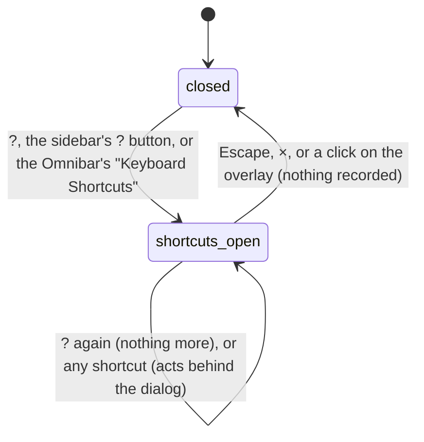
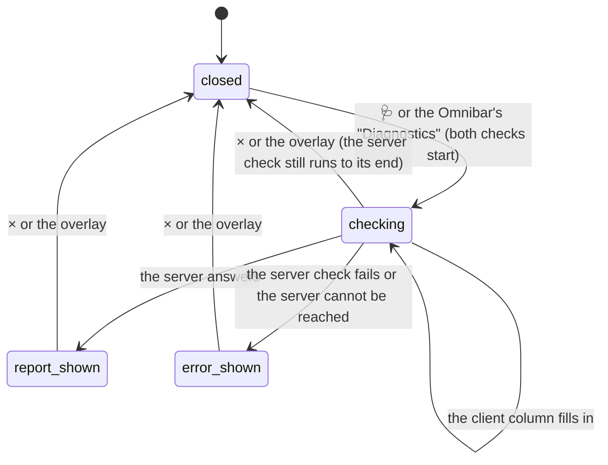

# The Keyboard Shortcuts and System Diagnostics dialogs

## Summary

Two read-only [dialogs](../glossary.md#the-workspace) that tell the user about Studio rather than change anything in it. **Keyboard Shortcuts** is a fixed list of Studio's keys, grouped under Playback, Navigation, Timeline, and General. **System Diagnostics** checks two browsers side by side: the one the Studio page runs in ("Studio Preview (Client)") and the headless browser the Studio server renders with ("Production Renderer (Server)"), and shows whether each supports WebCodecs, the Web Animations API, and OffscreenCanvas, with its user agent. Both open from the sidebar's footer (? and 🩺) and from the [Omnibar](../glossary.md#the-workspace) ("Keyboard Shortcuts", "Diagnostics"); Keyboard Shortcuts also opens with the ? key. Both work with no composition open and before the player is connected. Neither writes to the project or remembers anything.

The Keyboard Shortcuts dialog is not the authority on Studio's keys: the [input model](../foundations/input-model.md#the-shortcut-map) is, and the dialog disagrees with it in several places (see [What the Keyboard Shortcuts dialog lists](#what-the-keyboard-shortcuts-dialog-lists)).

## The simple case

The user presses ?. A dark, slightly blurred overlay covers the page and a box 600 pixels wide appears in the middle, titled "Keyboard Shortcuts", with four headed groups of rows, each a description on the left and one or more key caps on the right. Pressing Escape, clicking ×, or clicking the overlay closes it. Nothing has changed.

The user clicks 🩺. A wider box titled "System Diagnostics" appears with two columns. The left column fills in almost at once with three rows marked ✓ (green) or ✗ (red) and the browser's user agent. The right column says "Loading server diagnostics... (This launches a headless browser)" while the Studio server starts a headless browser, inspects it, and closes it, which takes a few seconds; then it shows the same three rows and a user agent box. × or the overlay closes the dialog; Escape does not. Read from the code, the right column then shows ✗ on all three rows and an empty user agent box even when the server's browser supports everything (see [Open questions](#open-questions-and-verification)).

## What the Keyboard Shortcuts dialog lists

The list is fixed text; it does not change with the platform, the keyboard layout, or the state of Studio. Group headings are shown in capitals.

| Group | Description | Key caps shown | What the key does in Studio |
| --- | --- | --- | --- |
| Playback | Play / Pause | Space, /, K | Space plays or pauses. "/" is drawn as a key cap but is no shortcut. K only pauses, wherever keyboard focus is: with the player focused the player toggles playback first, and Studio's K then pauses, so K never starts playback (see [the input model](../foundations/input-model.md#keys-the-player-adds-when-it-has-keyboard-focus)). |
| Playback | Play Reverse / Slower | J | Plays in reverse, then faster in reverse, up to 4x. It never slows down forward playback: during forward playback it switches to reverse at 1x. |
| Playback | Play Forward / Faster | L | Plays forward, then faster, up to 4x. |
| Playback | Restart / Rewind | Home | Goes to the in point. |
| Playback | Toggle Loop | Shift, L | Toggles loop. |
| Navigation | Previous Frame, Next Frame | ←, → | One frame back or forward. |
| Navigation | Back 10 Frames, Forward 10 Frames | Shift and ←, Shift and → | Ten frames back or forward. |
| Timeline | Set In Point, Set Out Point | I, O | Set the in or out point at the current frame. |
| General | Switch Composition | ⌘, K | Opens the Omnibar, which does more than switch compositions, and also pauses. The ⌘ cap is shown on every platform. Studio takes Control and Command alike on every platform, so Ctrl+K opens it on Windows and Linux, and on a Mac both Cmd+K and Control+K do. |
| General | Show Shortcuts | ? | Opens this dialog. |

Not listed: ' (safe-area guides, see [the stage toolbar](../stage/the-stage-toolbar.md)), Escape, the Omnibar's ↑, ↓, and Enter, and the keys the player adds when it has keyboard focus (see [the input model](../foundations/input-model.md#keys-the-player-adds-when-it-has-keyboard-focus)).

## What System Diagnostics shows

| Column | Rows | While waiting | On failure |
| --- | --- | --- | --- |
| 🖥️ Studio Preview (Client) | WebCodecs, WAAPI (Web Animations), OffscreenCanvas, each ✓ or ✗; User Agent in a dark box | "Loading client diagnostics..." | None in practice (see [Edge cases](#edge-cases)) |
| 🎬 Production Renderer (Server) | The same four rows, for the server's headless browser | "Loading server diagnostics... (This launches a headless browser)" | A red box: "Error: {message}", a blank line, then "Ensure you have installed browser binaries via \`npx playwright install chromium\`." with the backticks shown as typed |

The client column describes the browser showing the Studio page, not the composition and not the renderer. WebCodecs is what [client-side export](../output/client-side-export.md) needs; the server column is meant to predict whether [server-side renders](../output/server-renders.md) can start. Neither column says anything about FFmpeg, codecs, WebGL, or hardware acceleration, although the checks behind them collect some of that.

## The interaction, event by event

Each dialog is one interaction, from opening to closing.

### Starting

**Keyboard Shortcuts** opens on ? (ignored while keyboard focus is in a [text field](../glossary.md#interactions)), on the sidebar's ? button (tooltip "Keyboard Shortcuts (?)"), or on the Omnibar's "Keyboard Shortcuts" command, which closes the Omnibar first. Nothing is loaded and nothing is asked of the server. Keyboard focus does not move into the dialog: it stays on the ? button that was clicked, or wherever it was when ? was pressed.

**System Diagnostics** opens on 🩺 (tooltip "System Diagnostics") or the Omnibar's "Diagnostics" command. At that instant two checks start. The client check runs in the Studio page and finishes almost at once. The server check is a request to the Studio server, which launches a fresh headless Chromium, opens a blank page in it, reads its capabilities, inspects FFmpeg, and closes the browser. The right column is cleared to its loading message on every opening; the left column still shows the previous opening's result, if there was one, until the new client check replaces it. Focus does not move into the dialog.

Pressing the ? key, or running the Omnibar's command, for a dialog that is already open does nothing more: the dialog is not reset and no new check starts. The sidebar's ? and 🩺 buttons cannot be pressed while either dialog is open: the dialog's overlay covers the sidebar, so a click on them closes the dialog instead (see [the workspace](../foundations/the-workspace.md#edge-cases)).

### Ending at once

Keyboard Shortcuts always ends at once: it has nothing to edit, so the only way out is closing it, by Escape, ×, or a click on the overlay. Nothing is recorded, and the dialog opens the same way next time.

System Diagnostics ends at once if the server check fails at its first step, for example because the Studio server cannot be reached: the right column shows "Error: Failed to fetch" (the browser's wording) with the Playwright hint, at once. Closing it records nothing.

### Becoming ongoing

Keyboard Shortcuts never becomes ongoing. Holding ? repeats the shortcut, which does nothing more while the dialog is open.

System Diagnostics becomes ongoing as soon as the server accepts the request and starts launching its headless browser. From then on closing the dialog does not stop the check: the server finishes launching, inspecting, and closing the browser, and the answer is kept for nobody (the next opening clears it).

### While ongoing

The right column shows its loading message for as long as the server takes. There is no progress, no time limit, and no cancel button. Launching takes a few seconds on a machine where Chromium is installed. On a machine where Playwright has no Chromium at all, the server first downloads it, once, and, read from the code, the Studio server answers nothing else while it downloads: render progress stops updating, and other requests wait (see [Open questions](#open-questions-and-verification)).

Everything else stays live. Studio's shortcuts keep acting behind the dialog whenever focus is not in a text field (Space still toggles playback), playback continues, and render jobs keep updating.

### Finishing

When the server answers, the right column shows its four rows, or the red error box. The dialog stays open until the user closes it; nothing is written, no toast appears, and the result is not kept anywhere except on screen. Closing and reopening runs both checks again, and launches another headless browser.

## Modifiers

| Modifier | Set at the start | Changed while ongoing |
| --- | --- | --- |
| Shift | On most layouts ? is typed with Shift; Studio compares the character, so Shift is simply how the key is reached. No effect on the buttons. | No effect on the dialogs. Shift with a shortcut acts behind the dialog as usual (Shift+L toggles loop). |
| Ctrl/Cmd | Studio ignores Ctrl/Cmd with ?, so the combination still opens Keyboard Shortcuts, along with whatever the browser does with it. No effect on the buttons. Ctrl/Cmd+K with a dialog already open opens the Omnibar underneath it (see [Cancel and interrupt](#cancel-and-interrupt)). | Ctrl/Cmd+K opens the Omnibar behind the open dialog. No effect on a running server check. |
| Alt/Option | No effect on Windows and Linux. On a Mac, Option with Shift and / types another character, so ? does not open the dialog. | No effect. |
| Keyboard focus | In a text field, ? is ignored; the buttons and the Omnibar still open the dialogs. On the player, ? also shows the player's own shortcut list over the composition, also titled "Keyboard Shortcuts" (see [the input model](../foundations/input-model.md#keys-the-player-adds-when-it-has-keyboard-focus)). Opening does not move focus. | Keys go wherever focus is. With focus outside a text field, Studio's shortcuts act behind the dialog. |
| Playback | No effect; playback continues behind either dialog. | No effect. |
| Player connection | No effect. Both dialogs work with no composition open, before connection, and after "Connection Failed...". The client column reports the Studio page's browser either way. | No effect. |

Neither dialog reads a modifier while it is open. A modifier only changes which shortcut a key press is, as described in [the input model](../foundations/input-model.md#modifier-keys).

## Cancel and interrupt

In this table, "before it is ongoing" is a dialog open with nothing running: Keyboard Shortcuts at any time, or System Diagnostics once its server check has answered. "While ongoing" is System Diagnostics while its server check is still running.

| Event | Before it is ongoing | While ongoing |
| --- | --- | --- |
| Escape | Closes Keyboard Shortcuts, together with the Omnibar or a confirmation dialog if one is open too. If the player has focus and its own shortcut list is open, the first Escape closes only that list, and a second one closes the dialogs. Does not close System Diagnostics. | No effect on System Diagnostics or its check. It still closes Keyboard Shortcuts or the Omnibar if one is open underneath. |
| Another shortcut, click, or command | Shortcuts act behind the dialog. A click on the overlay closes the dialog and does not reach what is under it. ? with System Diagnostics open opens Keyboard Shortcuts underneath it, hidden until Diagnostics is closed. Ctrl/Cmd+K opens the Omnibar underneath either dialog: it takes keyboard focus while hidden, so typing filters it unseen and Enter runs its highlighted item. | Same. Closing the dialog leaves the check running on the server. |
| Composition switched | No effect; neither dialog depends on the composition. | No effect. |
| Window loses focus | No effect. | No effect; the check continues and its answer is shown when the user comes back. |
| Pointer leaves the window | No effect. | No effect. |
| Server request fails or server stops | Keyboard Shortcuts makes no requests. An answered Diagnostics report stays on screen. | The right column shows "Error: Failed to fetch" with the Playwright hint, which suggests installing browsers even though the cause was the server. If the server answers with an error (the browser could not be launched), the right column shows the server's message. |
| Reload or tab closed | The dialog is gone after the reload; dialogs are not remembered. | The page goes away; the server still finishes its check and its browser closes. |
| Hot reload | No effect. | No effect. |
| Project changed on disk | No effect. | No effect. |

After any of these the user is back in the workspace with no dialog open, or with the dialog still open and unchanged; neither dialog leaves anything behind.

## Interactions with other systems

**Files on disk.** None in the project. The first server check on a machine without Playwright's Chromium downloads it into Playwright's own cache, outside the project.

**Browser storage.** None. Whether a dialog is open, and the last diagnostics result, are not [remembered](../glossary.md#persistence).

**Undo.** Nothing to undo.

**Playback range and loop.** None. Keyboard Shortcuts lists Shift+L, I, and O, which change them.

**Input props.** None.

**Rendering and export.** System Diagnostics launches the same kind of headless browser that server-side renders use, so an error in the right column usually means a server-side render would fail too. The left column's WebCodecs row is what client-side export depends on. Running the check while a render is in progress starts a second browser alongside it.

**Notifications.** None. Neither dialog shows a [toast](../foundations/the-workspace.md#toasts).

**Other tabs and agents.** Each tab has its own dialogs. Two tabs opening System Diagnostics at the same time start two headless browsers on the server. An agent has no way to open either dialog.

**Keyboard and accessibility.** Keyboard Shortcuts opens and closes from the keyboard (? and Escape); System Diagnostics can be opened only by clicking or through the Omnibar, and closed only by clicking. Neither dialog takes focus, traps it, or is announced as a dialog; Tab moves through the page behind them. The close buttons are labeled only "×". Diagnostic results are a ✓ or ✗ in green or red. Both boxes scroll when taller than 80% of the window.

## Edge cases

- **Two lists titled "Keyboard Shortcuts".** With the player focused, ? opens Studio's dialog and the player's own list over the composition at once. Read from the code, the first Escape closes only the player's list, because the player stops that key from reaching Studio, and a second Escape closes Studio's dialog; pressing ? again instead closes the player's list and leaves Studio's dialog open. The player's list describes the player's keys (J and L jump 10 seconds, Home goes to frame 0), which disagree with Studio's.
- **Stacked dialogs.** System Diagnostics is drawn above every dialog that can open while it is open: Keyboard Shortcuts (from ?), the Omnibar (from Ctrl/Cmd+K), and anything run from that hidden Omnibar appear underneath it until it closes. Keyboard Shortcuts is drawn above every dialog except System Diagnostics and Render Preview.
- **A press inside, a release on the overlay.** Selecting the user agent text by dragging and releasing over the dark overlay is, in Chromium, a click on the overlay, and closes the dialog.
- **Opening Diagnostics repeatedly.** Each opening launches a new headless browser. Closing and reopening while a check is still running starts a second one; whichever answer arrives last is shown, except that an error from either stays on screen until the next opening.
- **The client check never failing.** If the client check failed, the left column would keep saying "Loading client diagnostics..." until the next opening; Studio does not handle that case. In Chromium it does not fail.
- **The ⌘ key cap.** On Windows and Linux the dialog shows ⌘ K, a key those keyboards do not have; Ctrl+K is meant. On a Mac, Control+K works as well as Cmd+K, because Studio accepts either key there too (read from the code: the shortcut checks for Control or Command, whatever the platform).
- **Keyboard layouts.** Where ? is on another key, that key opens the dialog; the dialog still shows "?".

## Open questions and verification

- The server column always shows ✗, ✗, ✗ and an empty user agent after a successful check. The dialog reads `webCodecs`, `waapi`, `offscreenCanvas`, and `userAgent` from the top level of the server's answer (`components/DiagnosticsModal.tsx:98-103`), but the renderer's diagnostics answer `{ browser: { videoEncoder, offscreenCanvas, userAgent, codecs }, ffmpeg: {...} }` (`packages/renderer/src/core/Diagnostics.ts:27-30`). The test mocks a flat answer, so it passes. This looks like a bug: the column reports a perfectly capable renderer as unable to do anything.
- Confirm that a first server check on a machine without Playwright's Chromium blocks the Studio server while it downloads: the download runs synchronously in the server process (`packages/renderer/src/core/launchBrowser.ts:56`). If confirmed, opening System Diagnostics (or starting a first render) on a fresh machine freezes render progress, the Studio server's other requests, and hot reload until the download ends. This may be worth treating as a bug.
- The error hint names `npx playwright install chromium` with literal backticks, whatever the error was, including "Failed to fetch" when the server is down (`components/DiagnosticsModal.tsx:94`). The renderer itself installs a different, pinned build (`chromium-headless-shell`).
- The Keyboard Shortcuts dialog does not match the [shortcut map](../foundations/input-model.md#the-shortcut-map): the "/" key cap, K described as play and pause, J described as "Slower", Home described as "Restart" (it goes to the in point), ⌘ on every platform, Ctrl/Cmd+K described as "Switch Composition", and ' missing (`components/KeyboardShortcutsModal.tsx:15-49`). This may be worth treating as a bug.
- Confirm the two Escapes needed with the player focused after ?: the first closes only the player's own list, the second Studio's dialog (the player stops the first Escape from reaching Studio, `packages/player/src/index.ts`, `handleKeydown`). This may be worth treating as a bug, or at least a product call: the two lists open together but do not close together.
- Confirm that a press inside either box with a release on the overlay closes the dialog in Chromium.
- Confirm how long the server check takes on a machine with Chromium installed, and that there is no time limit.
- Confirm that the Omnibar opened with Ctrl/Cmd+K while either dialog is open is hidden underneath it and still takes keyboard focus (the Omnibar's overlay is drawn at a lower level than these two dialogs).
- Read from `components/KeyboardShortcutsModal.tsx`, `KeyboardShortcutsModal.test.tsx`, `KeyboardShortcutsModal.css`, `DiagnosticsModal.tsx`, `DiagnosticsModal.test.tsx`, `DiagnosticsModal.css`, `Sidebar/Sidebar.tsx`, `Omnibar.tsx`, `GlobalShortcuts.tsx`, `App.tsx`, the `/api/diagnose` route in `server/plugin.ts`, `diagnoseServer` in `server/render-manager.ts`, `packages/renderer/src/core/Diagnostics.ts`, `launchBrowser.ts`, `strategies/CanvasStrategy.ts`, and `Helios.diagnose` in `packages/core/src/Helios.ts`; not yet confirmed by hand.

Verified against helios commit `c2bfddb`
