# The Helios Assistant

## Summary

The Helios Assistant is a [dialog](../glossary.md#the-workspace) that helps the user ask an outside AI chat about the active composition, and browse the documentation Studio can find. It has two tabs. **Ask AI** turns a question into a long prompt (a fixed introduction to Helios, the active composition's name and input-prop [schema](../glossary.md#the-preview), up to three documentation sections that share a word with the question, and the question itself) for the user to copy and paste into an AI chat of their choice. Despite its name, it asks no AI: the prompt is built in the page and sent nowhere. **Documentation** lists the sections of the README files the Studio server found, with a search box, each section expandable to its raw text. The dialog opens from ✨ in the sidebar's footer and from the [Omnibar](../glossary.md#the-workspace)'s "Helios Assistant" command; it has no keyboard shortcut and does not close on Escape. It works with no composition open and before the player is connected, and it writes nothing anywhere.

## The simple case

The user clicks ✨. A dark overlay covers the page and a box 800 pixels wide and 80% of the window tall appears, titled "✨ Helios Assistant", with the tabs "Ask AI" and "Documentation" below the title and Ask AI chosen. The user clicks into the box that says "How do I add audio?", types "make the title fade in slowly", and presses Enter (or clicks "Generate Prompt"). Under the question appears "Context-Aware Prompt (Copy to LLM)" and a read-only text area holding the prompt, and below it "Copy to Clipboard". The user clicks it, switches to their AI chat, and pastes. Nothing on the page confirms the copy.

The user clicks "Documentation". A search box ("Search documentation...") sits above a list of sections, each row a grey package tag, a title, and + at the right. Clicking a row shows its text below it, in monospace, and turns + into −. Typing in the search box narrows the list as each character is typed.

Clicking × or the overlay closes the dialog. Everything in it stays as it was (the question, the prompt, the chosen tab, the search, the open sections) and comes back on the next opening, until the page is reloaded.

## What the prompt contains

The prompt is built in the page, from these parts, in this order:

| Part | Content |
| --- | --- |
| Introduction | Fixed text, the same every time, after one empty line: "You are an expert Helios video engineer.", a one-line description of Helios, a "Core Philosophy" of three bullets (drive the browser, use CSS animations and the Web Animations API, use the Helios class to control time), an "API Summary" of three lines of code, and "Constraints" ("Do NOT use Remotion hooks.", "Use relative paths for imports."). |
| `## Current Composition` | "Name: " and the active composition's [name](../glossary.md#compositions-and-files), or "Name: undefined" when none is open. Then "Schema: " and the schema as indented JSON, only when Studio has one. Never the input props' values, the frame, or any file. |
| `## Relevant Documentation` | Only when at least one section matches (see below): for each, a heading of its package tag and title ("### root: Frameworks") and the section's whole text. |
| `## User Request` | The question exactly as typed. |
| Closing | "Please provide a solution or code snippet." |

**Which sections are "relevant".** The question is lowercased and split at spaces; every piece longer than three characters is a keyword, punctuation included. A section matches when its title or text contains any keyword anywhere, even inside a longer word. The first three matching sections in the Documentation tab's order are used; they are not ranked. So "how" and "add" are never keywords, and "audio?" (with its question mark) is one. A common word such as "with" or "that" matches every section that happens to contain it anywhere, so how many sections it matches depends on how much documentation there is: in long READMEs, most sections; in the verification project's eight short sections of `examples/README.md`, "with" matches only "Helios Examples", "that" only "Running an example", and "make" none.

**What the Documentation tab lists.** The Studio server reads README files and splits each at every line starting with `# ` or `## `; the heading becomes the section's title, the text before the first heading is titled "Introduction", and a heading with no text under it is skipped. It looks for, in this order, the README of the `core`, `studio`, `renderer`, and `player` packages and the project's own `README.md` (tagged `root`), then agent skill files (titled "Agent Skill: ..."). Read from the code, in a project like the verification project only the project's own `README.md` is found: with the repository's `examples/` folder as the project, the list is the eight sections of `examples/README.md`, all tagged `root`, from "Helios Examples" to "Running an example". See [Open questions](#open-questions-and-verification).

## The interaction, event by event

```mermaid
stateDiagram-v2
    [*] --> closed
    closed --> open : ✨ or the Omnibar's "Helios Assistant" (documentation requested if not yet loaded)
    open --> closed : × or the overlay (everything kept)
    open --> typing : first keystroke in the question box or the search box
    typing --> typing : each keystroke (the search narrows the list at once)
    typing --> prompt_shown : Enter or Generate Prompt with a question that is not blank
    prompt_shown --> prompt_shown : Copy to Clipboard; or a new question and Generate Prompt (replaces the prompt)
    typing --> closed : × or the overlay (text kept)
    prompt_shown --> closed : × or the overlay (prompt kept)
```

### Starting

The dialog opens on ✨ (tooltip "Helios Assistant") or the Omnibar's "Helios Assistant" command ("Ask AI for help"), which closes the Omnibar first. It opens on whichever tab was chosen last, with whatever was left in it; on the first opening after a page load that is Ask AI, empty.

If Studio has no documentation yet (the first opening after a page load, or every opening while the list is still empty), opening asks the server for it. The list fills in when the answer arrives; there is no loading message, and a failure leaves the list empty without a message.

Keyboard focus does not move into the dialog. It stays on ✨ (or wherever it was), so until the user clicks into a box, typed letters are Studio's shortcuts acting behind the dialog (see [Modifiers](#modifiers)).

### Ending at once

Closing with × or a click on the overlay before typing anything ends the opening. Nothing is recorded, and nothing was sent anywhere; the dialog keeps what it had from earlier openings. Escape does not close it.

### Becoming ongoing

The first keystroke in the question box or the search box. Nothing is decided at that moment; the dialog only holds text. Switching tabs, expanding a section, or pressing "Generate Prompt" with an empty box does not make it ongoing.

### While ongoing

**In the question box**, the text is only held; nothing is matched or built until the user asks for it. Studio's shortcuts are ignored while focus is in the box, except Ctrl/Cmd+K (see [Cancel and interrupt](#cancel-and-interrupt)).

**In the search box**, the list narrows on every keystroke to the sections whose title, text, or package tag contains the typed text, ignoring case. The text is matched as one piece, spaces included, unlike the question's keywords. When nothing matches the list is simply empty. Sections already expanded stay expanded when they reappear.

**Switching tabs** keeps both tabs' contents. Expanding and collapsing sections works with or without a search.

### Finishing

Pressing Enter in the question box, or clicking "Generate Prompt", builds the prompt from what Studio knows at that moment (the active composition's name, the schema, the documentation already loaded, the question) and shows it in the text area, replacing any earlier prompt. A question that is empty or only spaces does nothing, and an earlier prompt stays. Building is instant and needs neither the server nor a connection.

"Copy to Clipboard" puts the prompt's whole text on the clipboard. There is no toast, no "Copied" label, and no message if the copy fails. The prompt can also be selected in the text area and copied by hand; it cannot be edited there.

Nothing is written to the project or remembered in the browser. The dialog stays open, on the same tab, until the user closes it. The prompt is a snapshot: it does not change when the composition, its schema, or the question changes afterwards.

## Modifiers

| Modifier | Set at the start | Changed while ongoing |
| --- | --- | --- |
| Shift | No effect on opening. Shift+Enter in the question box builds the prompt like Enter. Capitals make no difference to matching. | Same. |
| Ctrl/Cmd | No effect on opening. Ctrl/Cmd+Enter builds the prompt like Enter. Ctrl/Cmd+K opens the Omnibar underneath the dialog, see [Cancel and interrupt](#cancel-and-interrupt). | Same. Ctrl/Cmd+A, C, V, and Z work in the boxes as in any text field. |
| Alt/Option | No effect. Alt/Option+Enter builds the prompt like Enter. | Same. |
| Keyboard focus | Opening does not move focus. Outside the boxes, keys act as Studio's shortcuts behind the dialog: I and O set the in and out points, L and J play, Space toggles playback, ? opens Keyboard Shortcuts on top of the dialog. After clicking a tab or a button, focus is on that button, but neither Enter nor Space presses it again: Studio cancels both, and Space toggles playback (see [keys Studio cancels everywhere](../foundations/input-model.md#keys-studio-cancels-everywhere)). | In the question or search box, every shortcut is ignored except Ctrl/Cmd+K. See [the input model](../foundations/input-model.md#keyboard-focus-and-who-receives-a-key). |
| Playback | No effect. Playback continues behind the dialog; the prompt does not mention the frame or the playing state. | No effect. |
| Player connection | The name line is there with or without a connection. The schema line needs a schema, which Studio reads when the player connects; before that there is none, except, read from the code, one left over from the previous composition (see [Open questions](#open-questions-and-verification)). The Documentation tab does not depend on the player. | The prompt uses whatever Studio knows at the moment it is built; a connection made after building does not update it. |

The dialog reads no modifier itself. Each modifier changes only which key press the question box or Studio sees, as described in [the input model](../foundations/input-model.md#modifier-keys).

## Cancel and interrupt

"Before it is ongoing" is the dialog open with nothing typed in this opening; "while ongoing" is from the first keystroke, including while a prompt is shown.

| Event | Before it is ongoing | While ongoing |
| --- | --- | --- |
| Escape | No effect; the dialog does not close on Escape. | No effect on the dialog or the text. It still closes the Omnibar or Keyboard Shortcuts if one is open too. |
| Another shortcut, click, or command | Shortcuts act behind the dialog. A click on the overlay closes the dialog and keeps its contents. ✨ cannot be clicked again while the dialog is open: it lies under the overlay, so the click closes the dialog instead. Ctrl/Cmd+K opens the Omnibar underneath the dialog, hidden but holding keyboard focus. | In a box, shortcuts are ignored except Ctrl/Cmd+K, which moves focus to the hidden Omnibar: further typing goes into its search, not the box, and Enter runs its highlighted item (for example "Create Composition", whose dialog then appears on top). Escape closes the hidden Omnibar; focus does not return to the box. |
| Composition switched | No effect on the dialog. The next prompt uses the new composition. | A prompt already shown keeps the old name and schema until it is built again. Switching while the dialog is open needs the hidden Omnibar, or happens as the side effect of creating a composition from it. |
| Window loses focus | No effect. | No effect; the text stays. |
| Pointer leaves the window | No effect. | No effect. A text selection that starts inside the box and is released over the overlay is, in Chromium, a click on the overlay, and closes the dialog; its contents are kept. |
| Server request fails or server stops | The documentation request fails silently: the Documentation tab stays empty with no message, and is asked for again on the next opening. | Building and copying work without the server. A prompt built without documentation has no "Relevant Documentation" part, with no warning. |
| Reload or tab closed | Nothing to lose. | The question, the prompt, the search, the open sections, and the chosen tab are lost, without a confirmation. Nothing was sent anywhere. |
| Hot reload | No effect. | No effect on the dialog. Studio reads the schema again when the composition reconnects, so the next prompt uses the edited schema. |
| Project changed on disk | No effect on the dialog. | The documentation is read once per page load: a README edited, added, or deleted on disk shows only after a reload. A composition renamed on disk keeps its old name in the prompt until the page reloads. |

After closing, the user is back in the workspace with keyboard focus on nothing in particular (the page itself), however focus was placed before. Both ways of closing are clicks, and a click on the overlay counts like a click inside the dialog here: the overlay cannot hold focus, so the press takes focus off whatever had it, as a press on any part of the page that cannot hold focus does; × takes focus and then disappears with the dialog. The dialog's contents wait for the next opening.

## Interactions with other systems

**Files on disk.** The server reads README files (and agent skill files, if it finds any) to answer the documentation request. Nothing is written.

**Browser storage.** Nothing is [remembered](../glossary.md#persistence). The dialog's contents last until the page is reloaded, as [the workspace](../foundations/the-workspace.md#dialogs) says.

**Undo.** None beyond the text boxes' own browser undo. A new prompt replaces the previous one, which cannot be brought back.

**Playback range and loop.** None; the prompt does not mention them.

**Input props.** The prompt carries the schema, which describes the composition's input props, but not their current values.

**Rendering and export.** None.

**Notifications.** None. No [toast](../foundations/the-workspace.md#toasts) appears for generating, copying, or a failed documentation request.

**Other tabs and agents.** Each tab has its own dialog and contents. An [agent](../glossary.md#compositions-and-files) connected to Studio's MCP server can read the same documentation sections, which the server offers it in the same form.

**Keyboard and accessibility.** The dialog can be opened only by clicking ✨ or through the Omnibar, and closed only with × or the overlay; it does not take focus, trap it, or announce itself. Enter in the question box builds the prompt, because the box handles Enter itself. The tabs and buttons can be reached with Tab but not pressed with Enter or Space, so switching tabs, "Generate Prompt", and "Copy to Clipboard" need the mouse; the question box's Enter is the only keyboard route to a prompt. The documentation rows cannot: they are not buttons, and open only with a click. The close button is labeled only "×".

## Edge cases

- **The placeholder question finds nothing.** "How do I add audio?" yields one keyword, "audio?" with its question mark, which matches only a section containing that exact text.
- **Short words never count.** Words of three letters or fewer ("fps", "svg", "css", "add") are ignored, so a question made only of them gets no documentation.
- **Common words pick the first sections.** A keyword such as "with" or "that" matches every section that contains it anywhere, which in long documentation is most of them, and the first three matches in the list are included whatever they are about. In the verification project, with eight short sections, such words match one or two sections each.
- **No composition open.** The prompt says "Name: undefined".
- **Odd names.** After the Props Editor's auto-save, a composition in a subfolder can be named "Scenes/intro Card" (see [the project and compositions](../foundations/project-and-compositions.md#edge-cases)); the prompt uses that name.
- **Very long prompts.** Each included section is copied whole, so the prompt can run to hundreds of lines; the text area scrolls.
- **Generating right after opening.** If the documentation has not arrived yet, the prompt has no documentation part, silently.
- **Headings inside code.** A line starting with `# ` inside a code block (a shell comment) starts a new section with that line as its title. `###` and deeper headings stay inside their section.
- **The search matches tags.** Searching "root" lists every section of the project's README, plus any section whose text contains "root".
- **No README.** In a project without a `README.md`, read from the code, the Documentation tab is empty, with no message, and Ask AI never includes documentation.
- **Run from the Helios repository.** Started from the root of the Helios repository itself, the server finds the README of each of the four packages and lists their sections before those of the repository's own `README.md`.

## Open questions and verification

- Read from the code, the package READMEs are never found in an ordinary project. The server looks them up through each package's `package.json` (`server/documentation.ts:58-68`), which every Helios package hides behind its `exports` field, so the lookup fails silently. Its other route only recognizes the Helios repository when the project is the repository root or two folders below it (`server/documentation.ts:16-22`), which misses `examples/`, one folder below. Confirm that the verification project lists only `examples/README.md`. This may be worth treating as a bug: the documentation the tab exists to show is missing.
- Read from the code, no "Agent Skill:" section ever appears at this commit. The server looks for `core`, `studio`, `renderer`, `player`, and `cli` skill files under `.agents/skills/helios` (`server/documentation.ts:117-138`), and the copy bundled with the CLI (`packages/cli/src/commands/studio.ts:46`) holds only `make-video`; the package skills live under `.agents/skills/helios-skills/skills/`. Confirm.
- Keyword matching splits only at spaces, keeps punctuation, drops words of three letters or fewer, and takes the first three matches in list order (`AssistantModal.tsx:39-43`). The dialog's own placeholder question gets no documentation. This may be worth treating as a bug, or a product call on how relevance should work.
- The prompt says "Name: undefined" with no composition open (`AssistantModal.tsx:49`).
- Read from the code, the schema in the prompt can belong to the previous composition: Studio never clears the schema it holds when the composition changes, and only replaces it when the new composition reports one (`App.tsx:39-43`, `context/StudioContext.tsx:232`). Confirm by switching from a composition that declares a schema to `simple-canvas-animation`, which declares none, and building a prompt. No example and no template declares a schema, so the first composition has to be made: a Title explainer copy with a `schema` added to its `new Helios({...})` options, such as the verification checklists' Verify Media. This may affect the Props Editor too.
- "Copy to Clipboard" gives no feedback and ignores a failure (`AssistantModal.tsx:140`). Confirm that the copy works at `http://127.0.0.1:5173/`.
- If the server answered the documentation request with an error object instead of a list, the dialog would keep it as the list (`AssistantModal.tsx:28-31`) and, read from the code, opening the Documentation tab would blank the whole Studio page, because nothing catches the failure. The server answers with an error only if reading the documentation throws, which it rarely can.
- Confirm that Ctrl/Cmd+K in the question box opens the Omnibar underneath the dialog and moves keyboard focus into it.
- Confirm that a text selection dragged from the prompt and released over the overlay closes the dialog.
- Read from `components/AssistantModal/AssistantModal.tsx`, `AssistantModal.test.tsx`, `AssistantModal.css`, `data/ai-context.ts`, `server/documentation.ts`, `server/documentation.test.ts`, the `/api/documentation` route in `server/plugin.ts`, the documentation resource in `server/mcp.ts`, `Sidebar/Sidebar.tsx`, `Omnibar.tsx`, `App.tsx`, and `packages/cli/src/commands/studio.ts`; not yet confirmed by hand.

Verified against helios commit `c2bfddb`
