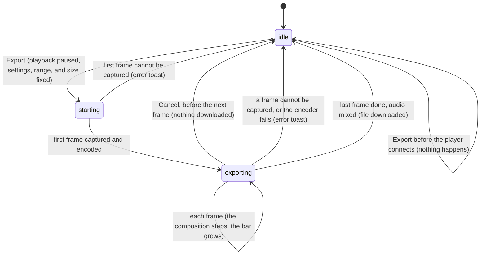

# Client-side export

## Summary

A client-side export turns the playback range into a video file inside the browser, without the Studio server, and hands it to the browser as a download. Studio pauses the composition, steps the player through every frame of the range, takes a picture of each one, encodes the pictures (and the composition's audio, if it has any) with the browser's own video encoder, and downloads the result as `video.mp4` or `video.webm`. It lives at the top of the Renders panel, the last of the sidebar's six tabs, under the heading "Client-Side Export": a format menu ("MP4 (H.264)" or "WebM (VP9)") and a blue Export button. While an export runs, the menu is disabled, the button turns into a red Cancel button, and a thin progress bar appears under them. The export uses three of the [render settings](server-renders.md#the-render-settings) shown further down the panel. It needs a composition that is open and [connected](../glossary.md#the-preview), and it lasts only as long as the page: a reload loses it.

## The simple case

The user opens the Renders tab, leaves the format at "MP4 (H.264)", and clicks Export. If the composition was playing, it pauses. The Export button becomes Cancel, the format menu greys out, and a thin blue bar appears beneath them. In the stage, the composition jumps to the in point and then steps through every frame of the range, faster or slower than real time depending on how quickly each frame can be captured; the playhead and the timecode follow it, and the bar grows by one frame's share at each step.

After the last frame, the browser downloads `video.mp4`. The bar disappears, Cancel turns back into Export, and the menu is enabled again. Studio shows no toast; the browser's own download indicator is the only sign the export finished. The composition is left paused on the last frame of the range, one frame before the out point.

The file covers the [playback range](../glossary.md#the-preview), from the in point up to but not including the out point, at the [canvas size](../glossary.md#the-preview) times the Resolution Scale setting, with the composition's audio. Clicking Cancel during the export stops it before the next frame, and nothing is downloaded.

## The interaction, event by event

### Starting

The export starts when the user clicks Export. The button is disabled and dimmed when no composition is open. When a composition is open but the player is not connected, the button looks enabled, and a click does nothing at all: no progress, no message.

At the click, Studio fixes everything the export will use:

- **The format**, from the menu: MP4 with H.264 video and AAC audio, or WebM with VP9 video and Opus audio.
- **The size.** The canvas size, as set by the composition's metadata or the [stage toolbar](../stage/the-stage-toolbar.md), multiplied by the Resolution Scale setting and rounded down to an even number of pixels in each direction, as for a [server-side render](server-renders.md#starting).
- **The mode.** The [render mode](../glossary.md#rendering-and-output): Canvas takes each picture from the composition's first `<canvas>` element, DOM takes a picture of its whole page.
- **The bitrate.** The Video Bitrate setting, if it is a whole number with an optional "k" (thousands) or "m" (millions), in either case: "5M" and "5000k" both mean 5 megabits per second. Anything else, including an empty field or "2.5M", means 5 megabits per second. The Video Codec, Concurrency, Hardware Acceleration, and WebCodecs Preference settings are ignored.
- **Which frames.** The playback range as it was last applied to the composition (see [the playback range](../playback/the-playback-range.md#how-the-range-limits-playback-renders-and-exports)): from the in point up to, but not including, the out point when a range is in effect, and from frame 0 for the composition's total frames when the range covers the whole composition.

At once the menu is disabled, Export becomes Cancel, and the progress bar appears empty. Then, before anything is captured, the composition is paused if it was playing, which also records its [timeline state](../glossary.md#the-preview).

### Ending at once

Next, the export captures the first frame of the range: the composition is sought to the in point (or frame 0), and the export waits for it to draw twice before taking the picture. If that picture cannot be taken, the export ends at once with a red toast:

- In Canvas mode, "Failed to capture first frame in mode: canvas" when the composition has no `<canvas>` element.
- In DOM mode, "Failed to capture first frame in mode: dom" when the page cannot be captured.

The progress bar disappears, Cancel turns back into Export, and nothing is downloaded. The composition stays paused at the in point.

### Becoming ongoing

Otherwise the export asks the composition for its audio tracks, fetches their files, prepares the encoder, and hands it the first picture. The export becomes ongoing at that moment. From then on the format, the size, the mode, the bitrate, the first frame, and the number of frames are fixed, and the bar shows the first frame's share of the whole.

### While ongoing

For each following frame, in order, the export seeks the composition to that frame, waits for it to draw twice, takes the picture, and hands it to the encoder; then the bar grows. The composition in the stage shows each frame as it is captured, and the playhead and the timecode follow it across the range. How long each frame takes depends on how quickly the composition draws and how large the pictures are; DOM mode is usually much slower than Canvas mode.

- **Size.** In Canvas mode, a canvas whose pixel size differs from the export size is stretched to the export size, without keeping its proportions. In DOM mode, the page is drawn at the export size.
- **Captions.** If the composition has caption cues showing at a frame, they are drawn onto that frame's picture: white text, centered near the bottom, on a 70% black box, with a font size of 5% of the picture's height (at least 16 pixels), several cues stacked upward. This always happens; there is no setting for it. See [the Captions panel](../panels/the-captions-panel.md).
- **Key frames.** One every two seconds' worth of frames.

Everything else in Studio stays live, and nothing protects the export from the user. Seeking, playing, frame steps, scrubbing, and changes to the input props act on the very composition the export is capturing (see [Cancel and interrupt](#cancel-and-interrupt)). Changing the format menu is not possible; changing the render settings, the in and out points, or the canvas size affects only the next export. A server-side render can be started and runs alongside.

**Cancel** has no confirmation. It takes effect when the export is about to capture the next frame: the export stops, nothing is encoded further, nothing is downloaded, and no toast appears. The bar disappears, Cancel turns back into Export, and the composition stays paused on the last frame captured.

### Finishing

After the last frame:

1. **Audio.** If the composition has audio tracks, the export mixes them for the length of the range, starting at the in point's time, at 48,000 samples per second in stereo, applying each track's volume and mute as set in the Audio panel (see [the audio mixer](../panels/the-audio-mixer.md)), and adds the mix to the file. The bar stays full meanwhile.
2. **The file.** The export finishes the file in the browser's memory and hands it to the browser as a download named `video.mp4` or `video.webm`, whatever the composition is called. The browser saves it to its downloads folder or asks where to save it, depending on its settings; a second export in the same folder is renamed by the browser ("video (1).mp4").
3. **Studio.** The bar disappears, Cancel turns back into Export, the format menu is enabled again with the format that was chosen, and no toast appears. The composition is left paused on the last frame of the range.

Nothing is written to the project, and nothing is recorded anywhere.

**Failure.** If a later frame cannot be captured, the export stops with a red toast, "Frame {n} missing during export.", where {n} is the frame number. If the browser's encoder refuses the format, the size, or the bitrate, the toast shows the encoder's message, or "Export failed" if there is none. Either way nothing is downloaded and the composition stays where the export left it.

## Modifiers

| Modifier | Set at the start | Changed while ongoing |
| --- | --- | --- |
| Shift | No effect. | No effect on the export. Shift+← and Shift+→ step the composition the export is capturing (see Keyboard focus). |
| Ctrl/Cmd | No effect on the click. | No effect on the export. Ctrl/Cmd+K opens the Omnibar and pauses playback, which is already paused. |
| Alt/Option | No effect. | No effect. |
| Keyboard focus | The format menu is a [text field](../glossary.md#interactions): after a format has been chosen with it, focus stays there, and Space and ← and → act on the menu instead of on playback until focus moves; ↑ and ↓ do nothing. After the click, the Export button keeps focus as it turns into Cancel, but neither Enter nor Space presses it: Studio cancels both, and Space toggles playback instead, which plays the composition under the export (see [keys Studio cancels everywhere](../foundations/input-model.md#keys-studio-cancels-everywhere)). So an export cannot be cancelled from the keyboard. | Shortcuts act wherever focus is. With focus anywhere but a text field, Space plays the composition and ←, →, Home, J, and L move it, all under the export's feet. |
| Playback | Playing is paused before the first frame is captured. Paused stays paused. | Playing during an export makes the composition advance between the export's seek and its picture, so frames may be captured late (read from the code). The export does not pause it again. |
| Player connection | Before connection, Export does nothing. | The export is tied to the connection it started with. A [hot reload](../glossary.md#the-preview) or a switch to another composition breaks it (see [Cancel and interrupt](#cancel-and-interrupt)). |

Nothing is read from the panel or the keyboard after the click, except Cancel.

## Cancel and interrupt

"Before it is ongoing" is from the click until the first frame has been encoded, a short moment; "while ongoing" is the rest of the export.

| Event | Before it is ongoing | While ongoing |
| --- | --- | --- |
| Escape | No effect; the export starts. | No effect. Escape does not stop the export; Cancel does. |
| Another shortcut, click, or command | Acts as usual. A seek or play in this moment is overridden by the export's pause and its seek to the in point, unless it lands between that seek and the first picture. | Acts as usual and the export continues. Anything that moves the composition's frame (Space, ←, →, Home, J, L, scrubbing, the timecode field, a marker) or changes its input props acts on the composition being captured, so the frames captured from then on can be wrong. A snapshot also seeks the composition. Changing the render settings, the range, or the canvas size has no effect on this export. |
| Composition switched | The export continues against the composition that was replaced; see the next cell. | The player is replaced, and the export keeps addressing the old one. Read from the code, the export then fails with "Frame {n} missing during export.", or, if Studio's own page has something to take a picture of, captures that instead (see [Open questions](#open-questions-and-verification)). Studio's buttons reset when the export ends either way. |
| Window loses focus | No effect while the tab is visible. In a hidden tab the composition stops drawing, and the export waits for it. | No effect while the tab is visible. In a hidden tab the export stalls, because each frame waits for the composition to draw, and resumes when the tab is shown again (read from the code). |
| Pointer leaves the window | No effect. | No effect. |
| Server request fails or server stops | The export asks Studio's server for nothing but the composition's audio files, fetched just after the first picture. A track whose file cannot be fetched is left out of the video without a message. | No effect on the frames: the composition is already loaded in the page. A composition that loads files while it plays may fail to draw them. |
| Reload or tab closed | The export is lost. Studio does not warn. | The export is lost: nothing is downloaded and nothing is kept. Studio does not warn. |
| Hot reload | The composition's page reloads before or just after the first picture; read from the code, the export then goes on as in the next cell. | The composition's page reloads under the export. Read from the code, the export keeps seeking the composition that was replaced while taking pictures of the reloaded page, so the rest of the video can show one frame over and over; Studio puts the reloaded composition on the frame it last saw. |
| Project changed on disk | An audio file deleted on disk is left out of the video without a message. | No effect, except through a hot reload when the composition's own files change. |

After any interrupt that ends the export, the Renders panel is back to the format menu and Export, and the composition is left paused wherever the export last put it.

## Interactions with other systems

**Files on disk.** None in the project. The video goes to the browser's downloads as `video.mp4` or `video.webm`. The whole file is built in the browser's memory before it is downloaded, so a long or large export uses a lot of memory.

**Browser storage.** The format is not remembered: it goes back to "MP4 (H.264)" when the page reloads and whenever the Renders tab is shown again, because a hidden panel is discarded (see [the sidebar](../foundations/the-workspace.md#the-sidebar)). An export keeps running while another tab of the sidebar is shown, and its Cancel button and progress bar are there again when the Renders tab comes back. The render settings it uses are remembered (see [The render settings](server-renders.md#the-render-settings)).

**Undo.** None, and nothing to undo: the export changes nothing in Studio except the playhead position and the paused state.

**Playback range and loop.** The export covers the range as last applied to the composition. When the player has keyboard focus, X clears the composition's copy of the range without changing Studio's in and out points, and an export then covers the whole composition while the timeline still shows a range (see [the playback range](../playback/the-playback-range.md#edge-cases)). Loop has no effect. Playback is paused at the start and stays paused.

**Input props.** The export takes pictures of the composition as it is, with its current input props. Changing a prop during the export changes every frame captured afterwards.

**Rendering and export.** The export shares the Mode, Video Bitrate, and Resolution Scale settings with [server-side renders](server-renders.md) and ignores the others. It can run at the same time as server-side renders. Only one export runs at a time per tab, because the button is Cancel while one runs. A [snapshot](../glossary.md#rendering-and-output) taken during an export moves the composition the export is capturing (see [snapshots and job specs](snapshots-and-job-specs.md)).

**Notifications.** Only failures show a toast (red), with the message described under [Finishing](#finishing). Success and Cancel show nothing.

**Other tabs and agents.** Each Studio tab exports on its own, with its own player. A file saved by an editor or an agent during an export hot-reloads the composition and spoils the rest of the export (see [Cancel and interrupt](#cancel-and-interrupt)).

**Keyboard and accessibility.** The format menu and the Export and Cancel button can be reached with Tab. The menu can be used from the keyboard; the button cannot be pressed with Enter or Space (see [keys Studio cancels everywhere](../foundations/input-model.md#keys-studio-cancels-everywhere)), so starting and cancelling an export need the mouse. The menu has no label. There is no keyboard shortcut and no Omnibar command for a client-side export. The progress bar has no text, percentage, or time estimate, and the end of an export is announced only by the browser's download.

## Edge cases

- **A one-frame range.** An out point one frame after the in point exports a single frame: the bar fills at once and the file downloads.
- **Clock-bound compositions.** Every template, and every example that connects, is [clock-bound](../glossary.md#the-preview). Read from the code, such a composition puts its own frame back on every draw, so the pictures the export takes would be whatever the composition's clock shows at that moment, not the frames of the range (see [the preview player](../foundations/the-preview-player.md#clock-bound-compositions)).
- **Captions a frame late.** Read from the code, each picture carries the captions that were showing before the composition was sought to it, so captions appear and disappear one frame late, and the first frame carries the captions of wherever the playhead was before the export.
- **Cancel at the end.** Cancel is acted on only before a frame is captured. Pressed while the audio is being mixed or the file is being finished, it has no effect: the file still downloads and the panel resets.
- **A stale range.** An out point beyond the composition's end with an in point above 0 exports frames past the end; what they show depends on the composition's code. With the in point at 0, the range is cleared instead and the export covers the composition's real length.
- **Canvas mode on an HTML composition.** A composition that draws with HTML elements and has no `<canvas>` fails at once in Canvas mode. One that has a small canvas for decoration exports only that canvas, stretched to the export size.
- **Stretched pictures.** In Canvas mode, a composition whose canvas has different proportions from the canvas size is distorted in the export, without a warning.
- **The transport's volume and mute.** The Audio panel's per-track volume and mute are applied. Whether the transport's volume and mute also reach the exported audio depends on how the composition applies them to its media elements (see [Open questions](#open-questions-and-verification)).
- **Very large sizes.** A canvas size times the scale beyond what the browser's encoder accepts fails with the encoder's message, after the first frame.
- **One file name.** Every export is called `video`, so several exports of different compositions are told apart only by the browser's numbering.

## Open questions and verification

- Export is enabled but does nothing before the player connects. This may be worth treating as a bug.
- No toast or message announces a finished export; only the browser's download shows it. This may be a product call.
- Captions are drawn one frame late (in the player, `DirectController.captureFrame` reads the active captions before seeking). This may be worth treating as a bug.
- Cancel is ignored once the last frame has been captured; confirm on a composition with audio, where mixing takes long enough to try.
- Nothing stops the user from playing, seeking, or editing props during an export. Confirm what a press of Space during an export does to the captured frames, and that it does not press the focused Cancel button (read from the code, Studio cancels Space's browser action outside text fields).
- Confirm what an export does after a switch to another composition: the code suggests "Frame {n} missing during export.", or, in Canvas mode with an audio track showing on the timeline, pictures of Studio's own waveform drawing, or, in DOM mode, pictures of Studio's own page.
- Confirm what an export does after a hot reload in the middle.
- Confirm that a hidden tab stalls the export and that it resumes when shown.
- Confirm what an export of a clock-bound composition (`simple-canvas-animation`) contains, and use a composition the player can drive for the rest of these checks.
- Confirm whether the transport's volume and mute reach the exported audio.
- The Video Codec setting is ignored and a bitrate with a decimal point silently becomes 5 megabits per second. This may be worth treating as a bug, or at least labeling the settings that apply.
- Confirm the browser's behavior on an encoder that does not support VP9 or H.264 at the export size, and the message shown.
- Read from `RendersPanel/RendersPanel.tsx`, `RendersPanel/RendersPanel.test.tsx`, `context/StudioContext.tsx`, `context/StudioContext.test.tsx`, `packages/player/src/features/exporter.ts`, `packages/player/src/features/exporter.test.ts`, `packages/player/src/features/audio-utils.ts`, and `packages/player/src/controllers.ts`; not yet confirmed by hand.

Verified against helios commit `c2bfddb`
