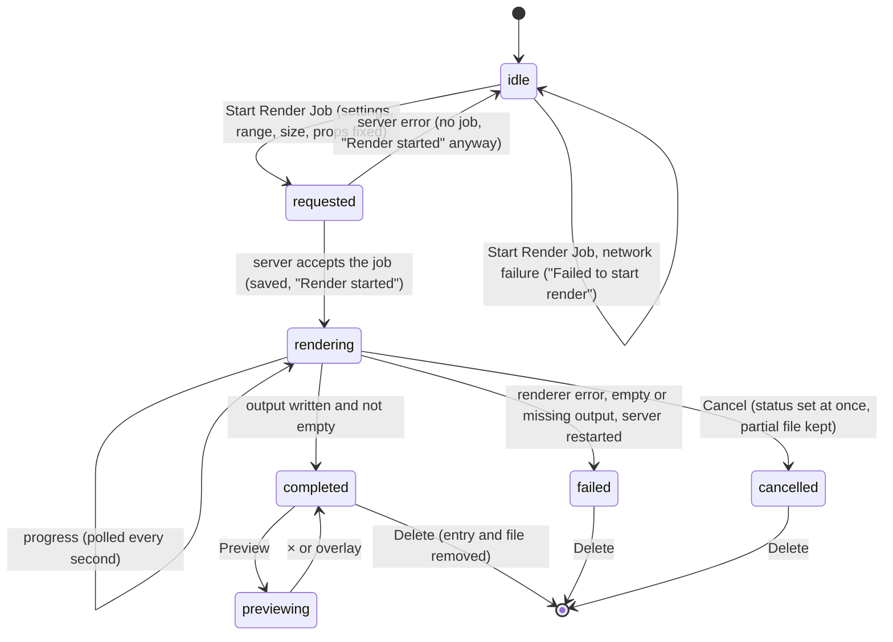

# Server-side renders

## Summary

A server-side render turns the active composition into an MP4 file on disk. The Studio server opens the composition in its own headless browser, steps it frame by frame, encodes the frames with FFmpeg, and writes the result into the project's [renders folder](../glossary.md#compositions-and-files), independently of the preview in the stage. It lives in the Renders panel, the last of the sidebar's six tabs, under the heading "Server-Side Render": the [render settings](../glossary.md#rendering-and-output), a "Start Render Job" button, an "Export Spec" button, a "Range: {in} - {out}" readout, and below them the list of [render jobs](../glossary.md#rendering-and-output), newest first. Each job shows its status, its progress while it renders, and, once it has finished, buttons to cancel, delete, preview, and download. The Omnibar's "Start Render" command starts a render too. Renders can be started before the player is [connected](../glossary.md#the-preview), and they keep running on the server when the page is reloaded or closed.

The Renders panel also holds the [client-side export](client-side-export.md) at its top and the "Export Spec" button that downloads a [job spec](../glossary.md#rendering-and-output) (see [snapshots and job specs](snapshots-and-job-specs.md)). This document owns the render settings, the job list, and the Render Preview dialog.

## The simple case

The user opens the Renders tab and, without changing the settings, clicks "Start Render Job". A green "Render started" toast appears, and at the same moment a new entry appears at the top of the list: the composition's address on the left, a blue RENDERING badge on the right, "ID: {six characters} (0-150)" below it, a red Cancel button, and a thin blue progress bar that fills as the server renders. The bar moves about once a second.

When the render is done the badge turns green and reads COMPLETED, the progress bar is replaced by "Done" in green with a blue Preview button and an outlined Download link, and the Cancel button becomes Delete. Preview opens the Render Preview dialog, which plays the video at once with the browser's own video controls. Download saves the file as `render-{id}.mp4`. The same file is in `renders/` in the project.

The render covers the [playback range](../glossary.md#the-preview), from the in point up to but not including the out point, at the [canvas size](../glossary.md#the-preview). Studio sends the input props the composition has at the moment of the click, but the video does not show them: the automated pass of 2026-10-07 found that the renderer hands them to the page in a way nothing in Helios reads, so the composition renders with its own props ([B-81](../bug-triage.md#b-81-server-side-renders-ignore-the-input-props)). The settings stay as they were for the next render, and the panel stays open; the user can keep working while the server renders.

## The interaction, event by event

### Starting

A render starts when the user clicks "Start Render Job". The button is disabled when no composition is open; it then looks the same as when it is enabled, but does nothing. The Omnibar's "Start Render" command starts a render in the same way, with the differences listed under [Finishing](#finishing).

At the click, Studio fixes everything the render will use and sends it to the server in one request. Nothing about the render changes afterwards:

- **What.** The active composition's page, by its address. The render loads the composition itself; it does not use the player or its connection.
- **Which frames.** The in and out points as the panel shows them in "Range: {in} - {out}" (see [the playback range](../playback/the-playback-range.md#how-the-range-limits-playback-renders-and-exports)). The server renders from the in point for (out minus in) frames.
- **At what size.** The canvas size, as set by the composition's metadata or the [stage toolbar](../stage/the-stage-toolbar.md), multiplied by the Resolution Scale setting and rounded down to an even number of pixels in each direction. A 1920 by 1080 canvas at 75% renders at 1440 by 810.
- **At what frame rate and length.** The frame rate Studio last read from the composition. The length Studio knows is used only when no range is given (the Omnibar's command).
- **With which props.** Studio sends the [input props](../glossary.md#the-preview) as it last saw them in the composition, including changes the [auto-save](../glossary.md#the-preview) has not yet written; the video, however, shows the composition's own props ([B-81](../bug-triage.md#b-81-server-side-renders-ignore-the-input-props)).
- **How.** Every render setting (see [The render settings](#the-render-settings)).

The button does not change while the request is in flight and can be clicked again; each click starts another render.

### Ending at once

The start can end before any job exists in two ways:

- **The request does not reach the server** (the server is stopped or unreachable). An error toast, "Failed to start render", appears and nothing else changes.
- **The server answers with an error.** Studio does not look at the answer, so the green "Render started" toast appears anyway, but no new entry appears in the list (see [when a request fails](../foundations/project-and-compositions.md#when-a-request-fails)).

A job can also be over on its first step: if the server cannot start the headless browser or FFmpeg, or cannot load the composition, the new entry appears and turns to FAILED within a second or two, with the reason under "Show Error".

### Becoming ongoing

The render becomes ongoing when the server accepts it. At that instant the server gives the job a long random identifier, creates the `renders/` folder if it does not exist, records the job in `renders/jobs.json`, and starts rendering at once. Studio then shows the green "Render started" toast and asks for the job list, so the toast and the new entry appear together.

The server marks a new job QUEUED and switches it to RENDERING in the same moment, before it answers, so the panel shows RENDERING from the start; QUEUED can be seen only by chance, in another tab, during the few milliseconds it takes to save the history. There is no queue: every job renders as soon as it is accepted, and several jobs started one after another all render at the same time, each in its own headless browser.

### While ongoing

The server renders the frames in order and reports its progress as a fraction. Studio asks for the whole job list every second and redraws it, so the progress bar moves in steps about a second apart, each step animated over a third of a second. There is no percentage, frame count, or time estimate.

With Concurrency (Workers) above 1, the server splits the frames into that many consecutive parts of equal size, renders them in parallel, each in its own headless browser, and shows the combined progress. When every part is done the bar is full, but the job stays RENDERING while the parts are joined and the composition's audio is mixed in; this can take a noticeable time on a long render.

Everything else in Studio stays live. Changing the render settings, the in and out points, the input props, the canvas size, or the active composition changes only the next render. Playback, the preview, and every other panel are unaffected, because the render does not use the player.

The only action on a rendering job is Cancel. It has no confirmation. The server marks the job CANCELLED at once and tells the renderer to stop; Studio shows a blue "Render cancelled" toast and redraws the list, so the badge reads CANCELLED, an orange "Cancelled" line replaces the progress bar, and Delete replaces Cancel. Whatever part of the video was already written stays in `renders/` until the job is deleted; with more than one worker, the temporary part files are removed. In the automated pass of 2026-10-07, though, Cancel stopped the `helios studio` process about a second later, both from the panel and from an agent ([B-78](../bug-triage.md#b-78-cancelling-a-server-side-render-stops-the-helios-studio-process)): the job had been saved as CANCELLED, no partial file was left, and every open tab lost its server until it was started again.

### Finishing

A job ends in one of three states, and Studio shows no toast for any of them; the entry changes at the next poll.

- **Completed.** The server checks that the output file exists and is not empty, then marks the job COMPLETED (green badge). The entry shows "Done" in green, a blue Preview button, an outlined Download link, and Delete.
- **Failed.** The renderer stopped with an error, the output was missing ("Render output file not found."), or it was empty ("Render produced an empty file."). The entry shows a red FAILED badge, "Failed" in red, and a "Show Error" line that opens to show the reason in a small red box, up to 100 pixels tall and scrollable. The reason is the renderer's own message, often FFmpeg's.
- **Cancelled.** As described above.

Each change of status is saved in `renders/jobs.json`; the progress is not. Finished jobs stay in the list, for every composition, until they are deleted, and come back after the server restarts.

**The Omnibar's "Start Render".** It renders the whole composition, ignoring the playback range: from frame 0 for the composition's length as Studio last read it, or for 10 seconds if Studio has not read a length. Its entry shows no "({in}-{out})". Everything else is the same as "Start Render Job". See [the Omnibar](../compositions/the-omnibar.md).

## The render settings

The settings sit in a box under the "Server-Side Render" heading, one labeled field per row. They are [remembered](../glossary.md#persistence) for all compositions, written on every change (every keystroke in the text fields), and shared by every project served at the same address (see [what Studio remembers](../foundations/the-workspace.md#what-studio-remembers)). Three of them also shape the [client-side export](client-side-export.md); the [render mode](../glossary.md#rendering-and-output) also shapes snapshots and thumbnails.

| Setting | Choices | Shown by default | What it does to a server-side render | Client-side export |
| --- | --- | --- | --- | --- |
| Preset | Custom, Draft, HD (1080p), 4K (High Quality), Transparent (WebM) | Custom | Sets several of the fields below at once | Through the fields it sets |
| Mode | Canvas, DOM | Canvas | The [render mode](../glossary.md#rendering-and-output) | Used |
| Video Bitrate | Free text, placeholder "e.g. 5M, 1000k" | Empty | Passed to the encoder as typed; empty leaves the encoder's default | Used if it is a whole number with an optional k or m; otherwise 5 Mbps |
| Video Codec | Free text, placeholder "e.g. libx264" | Empty | Passed to FFmpeg as typed; empty leaves the renderer's default | Ignored |
| Concurrency (Workers) | A number from 1 to 32 | 1 | How many parts the frames are split into and rendered in parallel | Ignored |
| Hardware Acceleration | Auto, NVIDIA CUDA, VAAPI (Linux/Intel), Intel QSV, Apple VideoToolbox, None (CPU) | Auto | Passed to FFmpeg | Ignored |
| WebCodecs Preference | Hardware (Default), Software Only, Disabled | Hardware (Default) | Passed to the renderer | Ignored |
| Resolution Scale | 100% (Original), 75%, 50%, 25% | 100% (Original) | The output size is the canvas size times the scale, rounded down to even numbers | Used the same way |

Nothing is checked as it is typed. A Video Bitrate or Video Codec FFmpeg does not accept fails the render, with FFmpeg's message under "Show Error". Concurrency is limited as it is typed: any value that is not a number becomes 1, anything below 1 becomes 1, anything above 32 becomes 32.

**Presets.** Choosing a preset sets only the fields it names and leaves the others as they were:

| Preset | Sets |
| --- | --- |
| Custom | Nothing |
| Draft | Mode Canvas, Concurrency 4 |
| HD (1080p) | Mode Canvas, Video Bitrate 5000k, Video Codec libx264 |
| 4K (High Quality) | Mode Canvas, Video Bitrate 20000k, Video Codec libx264 |
| Transparent (WebM) | Mode DOM, Video Codec libvpx-vp9 |

The presets do not change the size: "HD (1080p)" and "4K (High Quality)" set the bitrate and codec, and the output is still the canvas size times the scale. "Transparent (WebM)" does not produce a WebM file; every render is written as `render-{id}.mp4` (see [Open questions](#open-questions-and-verification)).

The Preset menu is not a stored choice. It shows the first preset, in the order of the table, whose fields all match the current settings, and "Custom" when none does. With nothing set, it shows "Custom". Editing a field a preset set (typing a different bitrate) turns it back to "Custom".

## The job list

The list shows every render job the server knows about, for every composition in the project, newest first, below the "Range" readout. With no jobs it says "No render jobs." It is the server's list, not the page's: it is the same in every tab, it includes renders started by an agent through Studio's MCP server, and it survives a reload and a server restart. The panel scrolls when the list is long; there is no limit and no paging.

Each job is a dark box:

| Part | What it shows |
| --- | --- |
| Top left | What is rendered. For a render started in Studio, the composition page's address: `/@fs/` followed by the absolute path of its `composition.html`. For a render started by an agent, the composition ID. |
| Top right | The status badge, in capitals: QUEUED (grey), RENDERING (blue), COMPLETED (green), FAILED (red), CANCELLED (no background). |
| Second line | "ID:" and the last six characters of the job's identifier, then "({in}-{out})" if the job was given a range. |
| Buttons | Cancel (red) while the job is queued or rendering; Delete (outlined, tooltip "Delete Job") otherwise. |
| Bottom | RENDERING: the progress bar. COMPLETED: "Done", Preview, Download. CANCELLED: "Cancelled". FAILED: "Failed" and "Show Error". |

**Preview** opens the Render Preview [dialog](../glossary.md#the-workspace): a dark box titled "Render Preview" with a × in its header, over a dark, slightly blurred overlay, holding the video at its own size (at most 90% of the window) with the browser's video controls. The video starts playing at once, with sound. The × or a click on the overlay closes it and stops the video; Escape does not (see [dialogs](../foundations/the-workspace.md#dialogs)). Nothing about the preview is remembered.

**Download** is a link to the same file with the browser's download behavior: the browser saves `render-{id}.mp4` (the full identifier) to its downloads folder, or asks where to save it, depending on its settings.

The server serves a render only while its job is COMPLETED and its file is a non-empty file in the project's `renders/` folder. A file that has been deleted or moved on disk cannot be previewed or downloaded: the dialog shows an empty player that does not play, and the download fails in the browser's download list. Studio shows no message.

**Delete** removes the job from the list and deletes its output file from `renders/` at once. There is no confirmation and no undo. Studio shows a green "Render job deleted" toast, whether or not the server agreed (see [when a request fails](../foundations/project-and-compositions.md#when-a-request-fails)).

## Modifiers

| Modifier | Set at the start | Changed while ongoing |
| --- | --- | --- |
| Shift | No effect on Start Render Job, Cancel, Delete, or Preview. On the Download link the browser's own Shift+click applies, which may open the file in a new window instead of saving it. | No effect. |
| Ctrl/Cmd | No effect on Studio's buttons. Ctrl/Cmd+click on the Download link may open the file in a new tab instead of saving it. Ctrl/Cmd+K opens the Omnibar, from which "Start Render" renders the full length. | No effect. |
| Alt/Option | No effect. Alt/Option+click on the Download link saves the file, as a plain click does. | No effect. |
| Keyboard focus | Shortcuts are ignored while typing in Video Bitrate, Video Codec, or Concurrency, and while a settings menu has focus, where Space opens the menu and ← and → change its choice (on Windows and Linux); ↑ and ↓ do nothing, so Concurrency cannot be stepped from the keyboard. After a click, Start Render Job keeps keyboard focus, but neither Enter nor Space presses it again: Studio cancels both, and Space toggles playback instead (see [keys Studio cancels everywhere](../foundations/input-model.md#keys-studio-cancels-everywhere)). | No effect; the render runs on the server. |
| Playback | No effect. The render does not use the playhead, and playback continues. | No effect. Playing, pausing, and seeking do not touch the render. |
| Player connection | Works before the player is connected, but uses what Studio last read from a composition: on a first open, a frame rate of 30, no input props, and, for a composition with no remembered timeline state, an out point of 0 until the length is known; right after a switch, the previous composition's frame rate and input props (see [Edge cases](#edge-cases)). | No effect. A connection, a failed connection, or a hot reload in the player does not reach the render. |

Changing a setting while a render is running changes the next render only. Nothing is read from the keyboard or the panel after the click.

## Cancel and interrupt

"Before it is ongoing" is the moment between the click and the server's answer; "while ongoing" is a job that is rendering.

| Event | Before it is ongoing | While ongoing |
| --- | --- | --- |
| Escape | No effect; the request is sent. | No effect. Escape does not cancel a render, and does not close the Render Preview dialog. |
| Another shortcut, click, or command | Acts as usual. A second click on Start Render Job sends a second request, and both jobs render. | Acts as usual and the render continues. Settings, range, props, canvas size, and composition changes apply to the next render only. Another render started now runs at the same time. |
| Composition switched | The request already sent renders the composition that was active at the click. The "Range" readout and the next render follow the new composition. | No effect. The job keeps rendering and stays in the list, which shows every composition's jobs. |
| Window loses focus | No effect. | No effect on the render. Studio keeps asking for the job list every second while the tab is visible; a hidden tab may be asked less often by the browser, so the list can lag. |
| Pointer leaves the window | No effect. | No effect. |
| Server request fails or server stops | "Failed to start render" if the request cannot be sent; "Render started" with no new job if the server answers with an error. | The list stops updating without a message and keeps showing the last status and progress it received. If the server process stops, the render stops with it; Cancel and Delete show "Failed to cancel render" and "Failed to delete render". Stopped with Ctrl+C, the shutdown itself fails the job (with an error such as "page.evaluate: Target page, context or browser has been closed" or "browserContext.close: Protocol error (Target.disposeBrowserContext): Failed to find context with id ...", depending on the step the render was at), and when the server is started again the job is FAILED with that error and no partial file. Only if the process dies without shutting down (killed, or crashed) is the job still recorded as rendering, so that after a restart it is FAILED with "Server restarted during render" and its partial file stays in `renders/` (both seen in the automated pass of 2026-10-07). |
| Reload or tab closed | If the request was sent, the server still starts the job; the toast is lost. | The render continues on the server. After the reload the job is in the list, at its current progress, as soon as the page has loaded. An open Render Preview dialog is closed. |
| Hot reload | No effect. | No effect on Studio's side: the render loads the composition in its own headless browser, not in the player. Whether a file saved during a render reloads the renderer's page too is an open question. |
| Project changed on disk | A composition deleted or renamed on disk is still listed; rendering it fails once the server cannot load its page. | Deleting the job's output file or the `renders/` folder makes the render fail or leaves a COMPLETED job that cannot be previewed or downloaded. `renders/jobs.json` edited on disk is not re-read, and is overwritten at the next change of any job's status. A render started by another tab or an agent appears in the list within a second. |

After any of these, the user stays in the Renders panel with whatever jobs the server holds. A cancelled or failed job's partial output stays on disk until the job is deleted.

## Interactions with other systems

**Files on disk.** The first render creates `renders/` at the project root. Each job writes `renders/render-{id}.mp4`, where the identifier is long and random, and `renders/jobs.json` is rewritten at every change of any job's status, never for progress. A render with more than one worker also writes temporary part files (`temp_…_part_{n}.mov` and `temp_concat_….mov`) into `renders/` and removes them when it ends. Delete removes the output file. In a project without `public/`, the finished renders and any leftover partial files appear in the Assets panel as videos after its next refresh. See [renders](../foundations/project-and-compositions.md#renders).

**Browser storage.** The render settings are remembered (see [The render settings](#the-render-settings)). The job list is not stored in the browser; it comes from the server every second. The Render Preview dialog is not remembered.

**Undo.** None. A started render can only be cancelled; a deleted job and its file are gone.

**Playback range and loop.** "Start Render Job" renders from the in point up to, but not including, the out point; the Omnibar's "Start Render" ignores the range. The [playback range](../playback/the-playback-range.md#how-the-range-limits-playback-renders-and-exports) owns the rule. Loop has no effect on a render.

**Input props.** The render request carries the input props as they are at the click, whether or not they have been auto-saved into the composition's default props, and changing them afterwards does not change the request. The renderer does not apply them, though: a title changed to "RENDER PROPS" rendered as the composition's default title in the automated pass of 2026-10-07 ([B-81](../bug-triage.md#b-81-server-side-renders-ignore-the-input-props)).

**Rendering and export.** This document owns server-side renders and the render settings. The [client-side export](client-side-export.md) uses the mode, the bitrate, and the scale. The job spec, downloaded with "Export Spec", uses the same settings, size, and range (see [snapshots and job specs](snapshots-and-job-specs.md)). A server-side render, a client-side export, and other server-side renders can all run at once.

**Notifications.** Toasts: "Render started" (green), even if the server refused the job; "Failed to start render" (red), only when the request could not be sent; "Render cancelled" (blue), whether or not the job was still running; "Failed to cancel render" (red); "Render job deleted" (green), whether or not the server deleted it; "Failed to delete render" (red). No toast announces that a render completed or failed; the entry changes in the list, which may not be visible if another tab is shown.

**Other tabs and agents.** Every tab shows the same job list within a second, and any tab can cancel or delete any job, including one started by an agent through Studio's MCP server. Each tab reads the remembered render settings when it loads and writes all of them on every change, so the last tab to change a setting decides what the others see after a reload. See [changes from outside Studio](../cross-cutting/changes-from-outside-studio.md).

**Keyboard and accessibility.** Every button, field, and menu in the panel can be reached with Tab, and the fields and menus can be used from the keyboard, but none of the buttons (Start Render Job, Export Spec, Cancel, Delete, Preview, Show Error) or the Download link can be pressed with Enter or Space (see [keys Studio cancels everywhere](../foundations/input-model.md#keys-studio-cancels-everywhere)). Each setting has a visible label. There is no keyboard shortcut for starting a render; the Omnibar's "Start Render" is the only keyboard route, and it renders the full length. The progress bar has no text, the status is plain text, and the Render Preview dialog's × has no label and Escape does not close it.

## Edge cases

- **Before the player connects.** On a first open of a composition with no remembered timeline state, before its length is known, the out point is 0 and the readout says "Range: 0 - 0"; a render started then asks for zero frames (see [Open questions](#open-questions-and-verification)). After a switch, before the new composition connects, the render uses the previous composition's frame rate and input props, and the out point may be the previous composition's length (see [the playback range](../playback/the-playback-range.md#edge-cases)).
- **A stale out point.** An out point beyond the composition's end, left by a switch or by a change of the composition's length, makes the render longer than the composition; what the extra frames show depends on the composition's code.
- **Many renders at once.** Each click starts a render immediately, each with its own headless browser, or several with Concurrency above 1. Nothing limits how many run together; a machine can run out of memory or slow to a crawl.
- **The address, not the name.** Renders started in Studio show the full path of `composition.html` in their entry, which is long enough to crowd the sidebar; renders started by an agent show the composition ID. Two compositions' jobs are told apart only by that path.
- **Status colors.** CANCELLED is the only status badge with no background color; it reads as plain capitals.
- **Cancel just after completion.** If the render finishes between the poll and the click, the server leaves the job COMPLETED, but Studio still shows "Render cancelled".
- **Delete right after Cancel.** Delete is offered as soon as a job is CANCELLED, which can be before the renderer has actually stopped writing. Deleting then removes the entry and the file, and the renderer may write part of the file again afterwards, leaving an orphan file in `renders/`.
- **The Preset menu after two presets.** Choosing Draft and then HD (1080p) leaves Concurrency at 4, so all of Draft's fields still match, and the menu shows "Draft".
- **Typing a concurrency.** Deleting the digit in the Concurrency field puts 1 back at once, so deleting "1" and typing "6" gives 16. Select the digit and type over it instead.
- **No canvas in Canvas mode.** A composition that draws with HTML elements and has no `<canvas>`, rendered in Canvas mode, fails with "Canvas not found matching selector: canvas". DOM mode is needed for it.
- **A composition at the project root** (empty ID) can be rendered; the render does not use the ID.
- **The project folder moved.** Jobs remember their output's absolute path. After the project folder is moved or renamed and the server restarted, earlier COMPLETED jobs can no longer be previewed or downloaded, and deleting them does not delete their files.
- **Start Render Job looks enabled when it is not.** With no composition open it keeps its color and hover effect; only Export and Export Spec are dimmed.

## Open questions and verification

- The Renders panel sends the composition's `/@fs/` address to the renderer. Studio's MCP render tool deliberately avoids that address, with a comment that it "serves raw HTML and leaves bare module imports unresolved". Confirm that a render started from the Renders panel succeeds for `simple-canvas-animation` and for a Title explainer composition; if it fails where an agent's render succeeds, this is a high-severity bug. In the automated pass of 2026-10-07 both succeeded: `simple-canvas-animation` and a Title explainer copy whose script is in its own file each rendered every frame of the range.
- Start, cancel, and delete report success without checking the server's answer (already listed in [when a request fails](../foundations/project-and-compositions.md#when-a-request-fails)); this may be worth treating as a bug.
- A render started before the composition's length is known asks for zero frames. Confirm what the job shows (FAILED with "Render produced an empty file." or an FFmpeg message, or COMPLETED with an empty video).
- A render started right after a switch, before the new composition connects, uses the previous composition's frame rate and input props. This may be worth treating as a bug, together with the stale out point. The automated pass of 2026-10-07 confirmed the frame rate and range; the props did not show in the video because server-side renders never apply props ([B-81](../bug-triage.md#b-81-server-side-renders-ignore-the-input-props)).
- "Transparent (WebM)" writes VP9 into an `.mp4` file with no transparent pixel format. Confirm whether the output has an alpha channel at all; if not, the preset's name is misleading and this may be worth treating as a bug.
- Delete has no confirmation, unlike deleting a composition or an asset, and removes the file at once. This may be a product call.
- The job entry shows the composition page's address instead of the composition's name or ID, because Studio does not send the ID with the render. This may be worth treating as a bug.
- There is no queue, so QUEUED is practically never shown and every render runs at once. Confirm, and decide whether that is intended.
- Confirm what the Download link does with `target="_blank"` in Chromium: save directly, or open a tab first.
- Confirm that a file saved during a render does not reload the renderer's own page through the development server.
- Confirm how often a hidden tab polls the job list.
- Read from `RendersPanel/RendersPanel.tsx`, `RendersPanel/RenderConfig.tsx`, `RendersPanel/RendersPanel.css`, `RendersPanel/RendersPanel.test.tsx`, `RendersPanel/RenderConfig.test.tsx`, `RenderPreviewModal.tsx`, `RenderPreviewModal.css`, `Omnibar.tsx`, `context/StudioContext.tsx`, `server/render-manager.ts`, `server/render-manager.test.ts`, `server/render-lifecycle.test.ts`, `server/render-access.ts`, `server/render-access.test.ts`, `server/plugin.ts`, `server/mcp.ts`, and `packages/renderer/src/Orchestrator.ts`; not yet confirmed by hand.

Verified against helios commit `c2bfddb`
