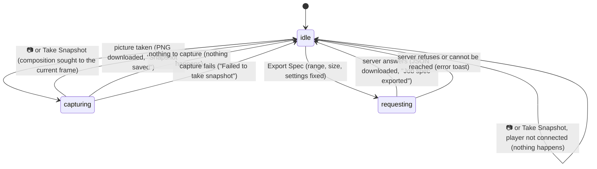

# Snapshots and job specs

## Summary

Snapshots and job specs are the two ways to take something out of Studio as a file without rendering a video in Studio. A [snapshot](../glossary.md#rendering-and-output) saves the current frame as a PNG image; a [job spec](../glossary.md#rendering-and-output) saves a JSON file that describes how to render the [playback range](../glossary.md#the-preview) in [chunks](../glossary.md#rendering-and-output) with the `helios` command-line tool. Both are single clicks that end in a browser download, write nothing in the project, and leave Studio as it was. A snapshot is taken with 📷 on the [stage toolbar](../stage/the-stage-toolbar.md) or the Omnibar's "Take Snapshot" command, needs the player to be [connected](../glossary.md#the-preview), and ends with a "Snapshot saved" [toast](../glossary.md#the-workspace). A job spec is downloaded with the "Export Spec" button in the Renders panel, next to "Start Render Job"; it needs only an open composition, asks the Studio server to plan the job, and ends with a "Job spec exported" toast. Running a job spec is outside Studio and outside the scope of these documents.

The snapshot part describes a composition the player can drive. A [clock-bound composition](../foundations/the-preview-player.md#clock-bound-compositions), which is what every template and every example that connects is, may be captured at its clock's frame rather than the one Studio shows; read that section first when verifying.

## The simple case

The composition is paused at frame 45. The user clicks 📷. A moment later the browser downloads `snapshot-Simple Canvas Animation-45.png`, a picture of frame 45 without the stage's checkerboard or guides, and a green "Snapshot saved" toast appears at the bottom right. The playhead is still on frame 45 and nothing else has changed.

The user sets the in point to 30 and the out point to 90, opens the Renders panel, and clicks "Export Spec". The browser downloads `job-{time}.json`, and a green "Job spec exported" toast appears. The file describes frames 30 to 89 at the canvas size and the composition's frame rate, as one chunk with its `helios render` command, and a `helios merge` command for the final video. Nothing is rendered, nothing is written in the project, and no entry appears in the render job list.

## The interaction, event by event

Both follow the README's pattern for a long-running state, although they usually last a fraction of a second: a command starts them, they run without any visible sign of progress for as long as the capture or the server takes, and they finish with a download and a toast, or with a failure.



### Starting

**A snapshot** starts with a click on 📷 (tooltip "Take Snapshot") on the stage toolbar, or with the Omnibar's "Take Snapshot" command ("Save current frame as PNG"), chosen with a click or with Enter; the Omnibar closes at once. The Omnibar shows "S" beside the command, but S does nothing outside the Omnibar and types into its search inside it (see [the input model](../foundations/input-model.md#the-shortcut-map)). At the start Studio takes:

- the [current frame](../glossary.md#the-preview) as Studio last saw it, which can be fractional after playback;
- the [render mode](../glossary.md#rendering-and-output) from the Renders panel, Canvas unless it has been changed;
- the [composition name](../glossary.md#compositions-and-files), for the file name.

A click on 📷 is also a press in the stage, so it starts a stage pan like any other press there (see [the stage view](../stage/the-stage-view.md#starting)).

**A job spec** starts with a click on "Export Spec" in the Renders panel's "Server-Side Render" section. The button is grey, the same width as "Start Render Job" beside it, and dimmed and disabled while no composition is open. It has no shortcut and no Omnibar command. At the click Studio fixes everything the job spec will describe and sends it to the server in one request:

- **What.** The active composition's page, by its address.
- **Which frames.** The in point and the out point exactly as the Renders panel's "Range: {in} - {out}" shows them (see [the playback range](../playback/the-playback-range.md#how-the-range-limits-playback-renders-and-exports)).
- **At what size.** The [canvas size](../glossary.md#the-preview) times the Resolution Scale setting, rounded down to an even number of pixels in each direction, as for a server-side render (see [server-side renders](server-renders.md#starting)).
- **At what frame rate.** The frame rate Studio last read from the composition.
- **With which settings.** Every [render setting](server-renders.md#the-render-settings).
- **With which props.** The input props as Studio last saw them; the server does not put them in the file (see [While ongoing](#while-ongoing)).

The job spec does not use the player, so it can be started before the player is connected, with whatever numbers Studio holds at that moment (see [Modifiers](#modifiers)).

### Ending at once

**A snapshot** ends at once, with nothing at all happening, when the player is not connected: before the composition has connected, after "Connection Failed...", and with no composition open. There is no toast and no download. The Omnibar command is still offered in these states and simply closes the Omnibar.

**A job spec** ends at once only when no composition is open, because the button is then disabled. Otherwise every click sends a request.

Neither changes the playhead, playback, the range, the input props, or anything remembered.

### Becoming ongoing

**A snapshot** becomes ongoing when Studio asks the composition for the frame. The composition is sought to the frame Studio last saw, which is normally the frame it already shows, and Studio waits for two screen refreshes so that the composition has drawn it. Nothing visible changes: there is no spinner, and 📷 stays enabled.

**A job spec** becomes ongoing when the request leaves for the server. "Export Spec" stays enabled and shows nothing.

### While ongoing

**A snapshot** takes its picture after the two screen refreshes, according to the render mode:

- **Canvas.** The first `<canvas>` element in the composition's page is copied at its own drawing size. A composition that sizes its canvas to its window, like `simple-canvas-animation`, has the canvas size; one whose drawing size is fixed in its code, like a Title explainer composition, has that size whatever the canvas size is. Anything the composition shows outside that canvas is left out. A page with no canvas has nothing to capture.
- **DOM.** A copy of the composition's page is drawn into an image at the page's laid-out size, normally the canvas size. This is slower, and shows only what the page itself contains.

In both modes the picture leaves out everything Studio and the player draw around or over the composition: the transparency grid, the safe-area guides, the player's caption overlay, and the stage view's zoom and pan.

Everything else stays live. Playback continues during the capture, so a snapshot taken while playing shows the frame two screen refreshes after the one in its name. The user can click, type, and take another snapshot; each capture ends in its own download.

**A job spec** is planned by the server:

- **Frames.** From the in point, for out point minus in point frames; the out point itself is not included, as for a server-side render from the Renders panel.
- **Chunks.** The frames are split into consecutive chunks, one per worker in the Concurrency (Workers) setting (1 by default, up to 32). Each chunk has the number of frames divided by the number of workers, rounded up; the last has what is left. Some combinations give fewer chunks than workers: 5 frames with 4 workers make chunks of 2, 2, and 1 frames.
- **Each chunk** has an ID from 0, its start frame, its frame count, an output file `renders/temp_{time}_{random}_part_{n}.mov`, and a command: `helios render {composition folder}/composition.html -o {that file} --start-frame {start} --frame-count {count} --width {w} --height {h} --fps {fps} --mode {canvas or dom} --audio-codec pcm_s16le`, followed by `--video-codec {codec}` if Video Codec is set and `--webcodecs-preference {choice}` if a WebCodecs Preference has been chosen.
- **The merge command** is `helios merge renders/render-{time}.mp4` followed by the chunk files in order.
- **The metadata** gives `totalFrames`, the frame rate, the width, the height, and `duration`. Despite its name, `totalFrames` is the number of frames in the range, the out point minus the in point, not the composition's [total frames](../glossary.md#the-preview); `duration` is that count divided by the frame rate, in seconds. The metadata does not say where the range starts; only the chunks do. With the range 30 to 90 of a 150-frame composition at 30 frames per second, `totalFrames` is 60 and `duration` is 2, and the one chunk starts at frame 30 with 60 frames. Only for the default range, which covers the whole composition, does `totalFrames` equal the composition's total frames, as in the example below.

Every path is relative to the [project root](../glossary.md#compositions-and-files), with forward slashes. The file does not record the input props, the Video Bitrate, the Hardware Acceleration setting, or the composition's name or ID (see [Open questions](#open-questions-and-verification)).

For the default range of a 5-second composition at 30 frames per second, with default settings, the file (written on a single line) reads:

```json
{
  "metadata": { "totalFrames": 150, "fps": 30, "width": 1920, "height": 1080, "duration": 5 },
  "chunks": [
    {
      "id": 0,
      "startFrame": 0,
      "frameCount": 150,
      "outputFile": "renders/temp_{time}_{random}_part_0.mov",
      "command": "helios render simple-canvas-animation/composition.html -o renders/temp_{time}_{random}_part_0.mov --start-frame 0 --frame-count 150 --width 1920 --height 1080 --fps 30 --mode canvas --audio-codec pcm_s16le"
    }
  ],
  "mergeCommand": "helios merge renders/render-{time}.mp4 renders/temp_{time}_{random}_part_0.mov"
}
```

### Finishing

**A snapshot that captured a picture** is downloaded as `snapshot-{composition name}-{frame}.png`: the composition name as Studio shows it, spaces included, and the frame number exactly as Studio held it, which is a whole number after a seek or a step and can carry many decimal places after playback (`snapshot-Simple Canvas Animation-45.733333333333334.png`). The browser saves it to its download folder, or asks where, according to its settings. A green "Snapshot saved" toast appears as the download starts. Nothing is written in the project, the composition's [thumbnail](../glossary.md#compositions-and-files) is not changed, and the composition stays on the frame it was sought to.

**A snapshot with nothing to capture** (Canvas mode and no canvas in the page, or a DOM capture that failed) ends with nothing happening: no download, no toast. **A snapshot whose capture fails with an error** shows a red "Failed to take snapshot" toast and downloads nothing.

**A job spec the server answered** is downloaded as `job-{time}.json`, where the time is the browser's clock in milliseconds. A green "Job spec exported" toast appears. Nothing is written in the project and nothing is rendered: `renders/` is not created, no chunk file or video exists, and no entry appears in the render job list. The time in the file's name and the times inside it are taken separately and need not match.

**A job spec the server refused**, or one whose request did not reach the server, shows a red toast with the server's message, or with the browser's own message ("Failed to fetch") when the server cannot be reached, and downloads nothing (see [when a request fails](../foundations/project-and-compositions.md#when-a-request-fails)).

## Modifiers

| Modifier | Set at the start | Changed while ongoing |
| --- | --- | --- |
| Shift | No effect on 📷, "Take Snapshot", or "Export Spec". Shift+S does nothing, like S. | No effect. |
| Ctrl/Cmd | No effect on Windows and Linux. On a Mac, Control+click is a right click and does not press either button. | No effect. |
| Alt/Option | No effect. | No effect. |
| Keyboard focus | No effect on what is captured or planned. Both buttons can be reached with Tab, but neither can be pressed with Enter or Space: Studio cancels both keys, and Space toggles playback instead (see [keys Studio cancels everywhere](../foundations/input-model.md#keys-studio-cancels-everywhere)). After a click the button keeps keyboard focus, and pressing Enter then does nothing. | No effect. |
| Playback | Snapshot: works while playing; playback does not pause, and the picture is the frame two screen refreshes after the one in the file name. Job spec: no effect; it does not use the playhead. | No effect. Pausing or seeking during a snapshot's capture changes what it captures (see [Cancel and interrupt](#cancel-and-interrupt)). |
| Player connection | Snapshot: nothing happens until the player is connected. With a [clock-bound composition](../foundations/the-preview-player.md#clock-bound-compositions), the seek does not hold, and the file name carries the clock's frame at the click, not the frame sought: in the automated pass of 2026-10-07, `simple-canvas-animation` sought to 45 saved `snapshot-Simple Canvas Animation-33.968999999999994.png`. Job spec: works before connection, with the numbers Studio holds then: on a first open, a frame rate of 30 and an out point of 0 until the length is known, which gives a job spec with no frames and no chunks; right after a switch, the previous composition's frame rate and possibly its length as the out point. | A snapshot in progress when the composition reloads or is switched may never finish (see [Cancel and interrupt](#cancel-and-interrupt)). No effect on a job spec. |

Neither reads a modifier after the click; the Omnibar command is chosen with Enter or a click and reads none.

## Cancel and interrupt

"Before it is ongoing" is the click or the command itself; "while ongoing" is a capture in progress or a job spec request waiting for the server. Both usually last a fraction of a second.

| Event | Before it is ongoing | While ongoing |
| --- | --- | --- |
| Escape | No effect. | No effect; neither can be cancelled. |
| Another shortcut, click, or command | Acts as usual. | Acts as usual, and the snapshot or job spec continues. Another 📷 starts another capture, another "Export Spec" another request; each ends in its own download. A seek or frame step during a capture changes the frame captured, while the file name keeps the frame taken at the start. |
| Composition switched | The next snapshot is of the new composition, once it has connected; the next job spec describes the new composition. | Snapshot: the old composition's page is discarded mid-capture. Read from the code, the capture then either never finishes (no download, no toast) or, if the page goes between the two screen refreshes, ends with "Failed to take snapshot". Job spec: the request already sent describes the old composition, and its file is downloaded. |
| Window loses focus | No effect. | Snapshot: another window taking focus changes nothing, but a hidden tab stops drawing, so a capture waits until the tab is shown again and then finishes. Job spec: no effect; the download happens in the background. |
| Pointer leaves the window | No effect. | No effect. |
| Server request fails or server stops | Snapshot: no effect; it never uses the server, and works for as long as the composition is loaded in the player. Job spec: the request fails with a red toast. | Snapshot: no effect. Job spec: if the server stops before it answers, a red toast with the server's message, or "Failed to fetch", and nothing is downloaded. An answer the server has already sent still downloads: in the automated pass of 2026-10-07, with the network throttled in the browser, the spec downloaded with "Job spec exported" although the server was stopped 0.2 seconds after the click. |
| Reload or tab closed | Nothing to lose. | The capture or the request is abandoned and nothing is left anywhere, but only once the page is actually replaced: a page being reloaded stays until the reloaded page arrives, so a job spec whose answer comes back first still downloads (seen in the automated pass of 2026-10-07 with the network throttled). |
| Hot reload | Snapshot: works again as soon as the reloaded composition reconnects, which is normally at once. Job spec: no effect. | Snapshot: read from the code, a capture waiting on the page being replaced never finishes; one that reaches its second screen refresh on the reloaded page captures that page instead. Job spec: no effect. |
| Project changed on disk | Snapshot: no effect. Job spec: the composition's path comes from Studio's list, so a composition moved or renamed on disk is described at its old path. | No effect. |

After any of these the user is where they were. Nothing needs to be cleaned up: neither leaves a file in the project, and a download either completed or never started.

## Interactions with other systems

**Files on disk.** None in the project. Both files go to the browser's download folder. A job spec names files in `renders/` that would be written when it is run; Studio does not create them or the folder.

**Browser storage.** Nothing is remembered. Both read the remembered render settings: the snapshot its render mode, the job spec all of them.

**Undo.** Nothing to undo; the downloads are outside Studio, and nothing in Studio changes.

**Playback range and loop.** A snapshot ignores the range: it captures the current frame, inside or outside the range. A job spec covers the range from the in point up to, but not including, the out point, as a render from the Renders panel does; a stale out point left by a switch (see [the playback range](../playback/the-playback-range.md#edge-cases)) is described too. Loop affects neither.

**Input props.** A snapshot shows the composition drawn with its current input props, whether or not they have been auto-saved. A job spec does not carry them: Studio sends them, but the commands in the file have no way to pass them, so running it renders the composition with whatever props it gets by itself.

**Rendering and export.** A snapshot uses the same capture as [client-side export](client-side-export.md) and thumbnails, in the same render mode, but at the composition's own drawing size rather than the canvas size. Because it seeks the composition, a snapshot taken while a client-side export runs moves the composition the export is capturing, and the export's frames from then on can be wrong (see [client-side export](client-side-export.md#cancel-and-interrupt)). A job spec describes the same frames, size, frame rate, and mode as "Start Render Job" with the same settings (see [server-side renders](server-renders.md)), but renders nothing; where a server-side render with Concurrency (Workers) above 1 splits the work by itself, the job spec leaves it to whoever runs the commands.

**Notifications.** "Snapshot saved" (green) when the download starts; "Failed to take snapshot" (red) when the capture fails with an error; no toast when there is nothing to capture or the player is not connected. "Job spec exported" (green); a red toast with the server's or the browser's message when the request fails. See [toasts](../foundations/the-workspace.md#toasts).

**Other tabs and agents.** Each tab captures from its own player and plans from its own range and canvas size. Neither leaves any trace on the server, so nothing shows in another tab.

**Keyboard and accessibility.** Neither has a working shortcut. The keyboard route to a snapshot is the Omnibar (Ctrl/Cmd+K, type "snap", Enter). There is no keyboard route to a job spec: "Export Spec" can be reached with Tab but not pressed with Enter or Space, and the Omnibar has no command for it. Neither shows progress, and the toasts are the only feedback; a snapshot that has nothing to capture gives no feedback at all.

## Edge cases

- **No canvas, no snapshot.** A composition drawn with HTML elements and no `<canvas>`, in Canvas mode (the default), cannot be captured, and Studio says nothing. Switching the Renders panel's Mode to DOM makes it work.
- **Only the first canvas.** A composition with several canvases, or a canvas with HTML text over it, is captured in Canvas mode as its first canvas only.
- **Not the canvas size.** In Canvas mode the PNG has the canvas element's own drawing size. A Title explainer composition created at 1920 by 1080 gives a 1920 by 1080 PNG even with the stage toolbar set to 1280 by 720.
- **Transparent pixels.** Read from the code, transparent pixels of the canvas stay transparent in the PNG, although they show light grey in the stage (see [the stage toolbar](../stage/the-stage-toolbar.md#edge-cases)).
- **File names.** The composition name keeps its spaces, and after playback the frame number can be long and fractional. A composition in a subfolder whose name Studio has rebuilt after an auto-save ("Scenes/intro Card", see [the project and compositions](../foundations/project-and-compositions.md#edge-cases)) puts a slash into the name, which the browser has to replace.
- **Many snapshots.** Each click downloads another file. Chromium may ask the user to allow the site to download multiple files, and the "Snapshot saved" toast appears whether or not it does.
- **A job spec with no frames.** Exported before the composition's length is known (the out point still 0), the job spec has a total of 0 frames, no chunks, and a merge command with nothing to merge, and Studio still says "Job spec exported".
- **More workers than frames.** With Concurrency (Workers) at 32 and 10 frames, the job spec has 10 chunks of one frame each.
- **Paths relative to the project.** The commands name the composition and the output files relative to the project root, while the file lands in the browser's download folder.
- **A composition at the project root** (empty ID) can be snapshotted and described in a job spec; neither uses the ID. Its job spec names `composition.html` with no folder.
- **The frame rate is the composition's.** The job spec's frame rate is the one the composition's code reports; `fps` in `composition.json` is ignored, as everywhere else (see [composition metadata](../foundations/project-and-compositions.md#composition-metadata)).

## Open questions and verification

- A job spec leaves out the input props: the server builds each chunk's command from the size, frame rate, mode, and codecs only, and `helios render` has no option for props. Running it renders the composition without the props shown in the Props Editor, unlike "Start Render Job". This may be worth treating as a bug.
- A job spec made after a WebCodecs Preference has been chosen adds `--webcodecs-preference` to every chunk's command, an option `helios render` does not define; read from the code, every chunk would then stop with an unknown-option error. This may be worth treating as a bug.
- The Video Bitrate and Hardware Acceleration settings are not in the job spec, although "Start Render Job" uses them. Confirm, and decide whether that is intended.
- A job spec exported before the composition's length is known describes zero frames and is still reported as exported. Confirm, and decide whether it should be refused.
- A snapshot in Canvas mode of a composition with no canvas does nothing and shows nothing. This may be worth treating as a bug, or at least deserves a message.
- Read from the code, a snapshot started just before a switch or a hot reload may never finish, because it waits for screen refreshes of a page that is being replaced. Confirm that nothing is downloaded and no toast appears.
- Whether a snapshot of a clock-bound composition shows the frame in its name or the clock's frame (the preview player's open question). The automated pass of 2026-10-07 found that the name itself carries the clock's frame at the click (`-33.968999999999994` after a seek to 45), so the name cannot show the difference; whether the picture matches the name needs a human eye.
- Confirm the PNG's pixel size for `simple-canvas-animation` (the canvas size) and for a Title explainer composition (its own size), and that transparent pixels stay transparent.
- Confirm the file name for a fractional frame, and what Chromium does with a slash in the composition name.
- Confirm whether Chromium asks to allow multiple downloads after a few snapshots, and whether the job spec download completes although Studio releases the file's address immediately after starting it.
- What a tester sees for "Failed to take snapshot" is hard to provoke; a canvas that cannot be read (for example, one that has drawn an image from another site) may produce it. Confirm.
- Running a job spec is out of scope. For a reader who does: the paths are relative to the project root, and `helios job run` resolves them relative to the folder the job file is in, so the file has to be moved into the project root first. Not confirmed.
- Read from `context/StudioContext.tsx` (`takeSnapshot`, `exportJobSpec`), `context/StudioContext.test.tsx`, `Stage/StageToolbar.tsx`, `Omnibar.tsx`, `Omnibar.test.tsx`, `RendersPanel/RendersPanel.tsx`, `RendersPanel/RendersPanel.test.tsx`, `RendersPanel/RenderConfig.tsx`, `server/plugin.ts`, `server/render-manager.ts`, `server/render-manager.test.ts`, `packages/renderer/src/Orchestrator.ts`, `packages/player/src/controllers.ts`, `controllers.test.ts`, `bridge.ts`, `features/dom-capture.ts`, `packages/cli/src/commands/render.ts`, and `packages/cli/src/commands/job.ts`; not yet confirmed by hand.

Verified against helios commit `c2bfddb`
