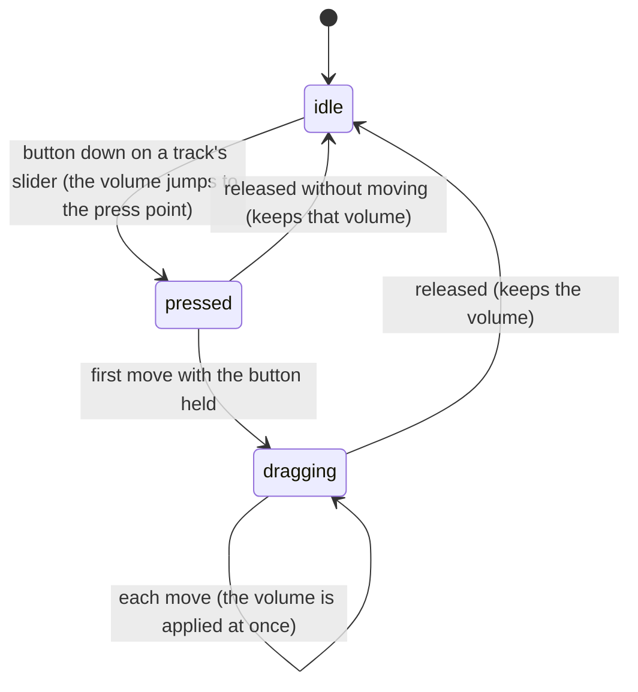
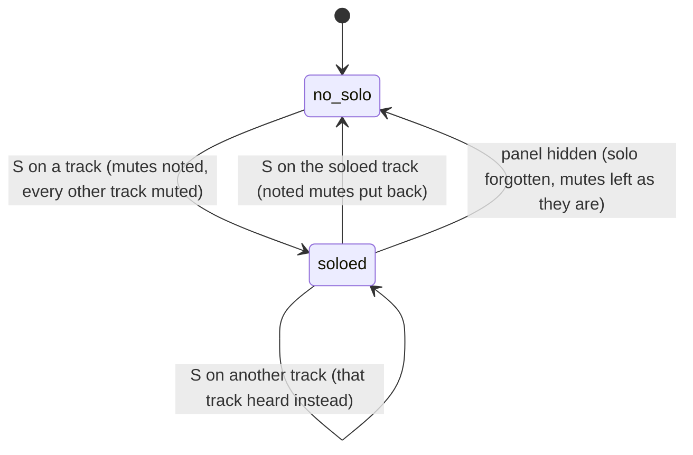

# The audio mixer

## Summary

The audio mixer sets how loud each of the active composition's [audio tracks](../glossary.md#the-preview) plays: a volume slider, a mute button, and a [solo](../glossary.md#the-preview) button for each track, and a small [level meter](../glossary.md#the-preview) showing the sound the composition is making. It is the panel under the Audio tab of the [sidebar](../glossary.md#the-workspace), the fifth of six, titled "Audio Mixer"; the workspace calls it the Audio panel. Changes apply to the running composition at once, playing or paused, and together make up its [audio mix](../glossary.md#the-preview), which is never [saved](../glossary.md#persistence) or [remembered](../glossary.md#persistence): a reload, a [hot reload](../glossary.md#the-preview), or a switch puts every track back at the composition's own levels. The mix works per track, on top of the transport's volume and mute (see [the transport controls](../playback/the-transport-controls.md)). The panel needs the player [connected](../glossary.md#the-preview).

## What the panel shows

- **A header.** "Audio Mixer", the level meter right after it, and at the right a ↻ button (tooltip "Refresh Tracks") that reads "..." and is disabled while the list is being read.
- **The list of tracks**, one card each; or "Connect to player..." before the player has connected; or "No audio tracks found." when the composition has none, which also shows for a moment while the list is first read. The list scrolls on its own.

Each card shows the track's name (cut short with an ellipsis past 150 pixels; its tooltip is the full name) with its volume as a percentage at the right, and below them an "S" button (tooltip "Solo"; amber while soloed), a 🔊 button (tooltip "Mute"; 🔇 in red, tooltip "Unmute", while muted), and a volume slider from 0 to 100% in steps of 1%.

**Which tracks are listed.** Every audio and video element in the composition's page, and every track the composition reports itself, each name once. A track is named by its element's `data-helios-track-id` attribute, else its `id`, else `track-0`, `track-1`, and so on by its position among the page's audio and video elements. The timeline draws lanes only for the tracks the composition reports ([timeline tracks](../playback/timeline-tracks.md)), so the panel can list tracks the timeline does not show. No example and no template has audio or video elements, so in the verification project the panel says "No audio tracks found."

**When the list is read.** When the panel appears with the player connected, every time the composition connects (after opening, switching, or a hot reload), and when ↻ is pressed; at no other time. A track the composition adds while it plays appears only after ↻. Reading the list downloads every track's media file in full from the Studio server, so it can take a while with large videos.

**What a track's volume does.** The track's volume multiplies the element's own volume and the transport's volume: a track at 50% with the transport at 50% plays at a quarter. A track muted here is silent whatever its volume. Read from the code, only a track whose element carries `data-helios-track-id`, in a composition that lets Helios manage its media, actually changes what is heard. For a track named by its `id` or its position, the slider, mute, and solo change what the panel shows and what a client-side export mixes, but not the sound (see [Open questions](#open-questions-and-verification)). An element the composition itself mutes stays silent even when the panel shows it unmuted.

**The level meter.** A black box 12 pixels wide and 16 tall with a bar for the left channel and one for the right, tooltip "Master Levels". While the panel is shown, both bars are updated on every frame the Studio page draws. A bar's height is the strength (the RMS) of the last few milliseconds of sound on that channel, as a share of full scale, drawn linearly: green normally, amber above 80%, red when a peak in that moment is above 95%. Read from the code, it measures the sound coming out of the composition's audio and video elements after the composition's own fades but before Studio's volume, mute, and mix, so muting a track does not lower the meter. Sound the composition makes in other ways, as `audio-visualization` does with the Web Audio API, is not measured. When nothing plays, both bars are empty.

> Technical note: to measure, Studio routes the sound of every audio and video element in the composition through the Studio page's own audio processing, starting the first time the panel is shown with the composition connected, and leaves it routed until the composition reloads. The browser's rules for a page's audio can then affect the composition's sound (see [Open questions](#open-questions-and-verification)).

## The simple case

A composition plays music from one element and narration from another, named `music` and `voice`. The user opens the Audio tab: two cards, both at 100%. Dragging `music`'s slider to 30% makes the music quieter at once, and the card reads 30%. Pressing S on `voice` mutes `music`: only the narration is heard, `music` shows 🔇, and its mute button is greyed out. Pressing S on `voice` again brings `music` back, still at 30%.

While the composition plays, the meter's bars rise and fall with the sound. Nothing the user did is kept: after a reload, both tracks play at full volume again.

## The interaction, event by event

Two things here last: dragging a track's volume slider, narrated in full below, and solo, a state that lasts until it is turned off. Mute and ↻ end at once.

### Starting

The left mouse button goes down on a track's slider. A press on the slider's bar away from its handle moves the handle there and applies that volume at once; a press on the handle itself changes nothing yet. The slider takes keyboard focus, which takes it out of any text field (applying that field) and means Studio's shortcuts are ignored until focus moves on (see [the input model](../foundations/input-model.md#keyboard-focus-and-who-receives-a-key)). With the slider focused, the arrow keys change this track's volume by 1%, and Home and End set it to 0 and 100%.

### Ending at once

Releasing without moving keeps whatever volume the press set. Nothing else is recorded.

The buttons end at once:

- **🔊 / 🔇** mutes or unmutes that track. It is disabled and faded while another track is soloed.
- **S, with no track soloed.** Studio notes every track's current mute, mutes every other track, and unmutes this one. Its S turns amber; every other track shows 🔇 and its mute button is disabled. All the sliders stay usable.
- **S on another track while one is soloed.** That track is heard instead and the first is muted. The mutes noted when solo began are kept.
- **S on the soloed track.** Solo ends: every track's mute goes back to what was noted when solo began. Volume changes made meanwhile are kept.
- **↻** reads the list again (see [What the panel shows](#what-the-panel-shows)). Volumes and mutes are taken from the composition; solo stays as it was.

The soloed track's own mute button stays enabled: pressing it mutes the soloed track as well, so nothing is heard. Ending solo then puts back the noted mutes.

### Becoming ongoing

The first mouse move with the button held, of any distance. From here the browser's own slider handles the drag; Studio only applies each new value.

### While ongoing

The handle follows the pointer between 0 and 100%, in steps of 1%. On every change Studio sends the new volume to the composition and updates the card's percentage, and the sound changes at once. The level meter does not follow, because it measures before the volume. The drag follows the pointer outside the slider and the panel while the button is held; beyond either end of the slider the volume stays at 0 or 100%. Playback, the timeline, and everything else continue.

### Finishing

Releasing the button ends the drag at the last volume. Nothing is saved or remembered, and there is no undo. The slider keeps keyboard focus, so Space and the arrow keys go on acting on it rather than on playback until something else is focused.

## Modifiers

| Modifier | Set at the start | Changed while ongoing |
| --- | --- | --- |
| Shift | No effect. Shift+click on a button is a click. | No effect. |
| Ctrl/Cmd | No effect. | No effect. |
| Alt/Option | No effect. | No effect. |
| Keyboard focus | The press moves focus to the slider, out of any text field (which applies that field). While the slider has focus, Studio's shortcuts are ignored except Ctrl/Cmd+K, and the arrow keys, Home, and End change the volume. | No effect. |
| Playback | Volume, mute, and solo apply at once, playing or paused. The level meter moves only while sound plays. | Same. |
| Player connection | Before connection the panel says "Connect to player...", or, after a switch, keeps showing the previous composition's tracks; their controls move but do nothing until the new composition connects and the list is replaced. The meter stays empty. | If the composition reconnects during a drag (a hot reload), the next move applies to the reloaded composition. |

## Cancel and interrupt

The columns are for a slider drag: "before it is ongoing" is the press, "while ongoing" is after the first move. Mute, S, and ↻ end at once and are unaffected; how solo fares is described after the table.

| Event | Before it is ongoing | While ongoing |
| --- | --- | --- |
| Escape | No effect; the volume set by the press stays. | No effect; the drag continues and the volume is not put back. |
| Another shortcut, click, or command | Studio's shortcuts are ignored while the slider has focus, except Ctrl/Cmd+K. | Same; the drag continues. |
| Composition switched | The old composition's mix is gone with it. The panel keeps the old tracks until the new composition connects, then lists the new one's. | Only possible from the keyboard (Ctrl/Cmd+K, then Enter). The handle keeps moving, but nothing is applied until the new composition connects. |
| Window loses focus | No effect. | Studio does nothing; the browser's own slider decides whether the drag ends. |
| Pointer leaves the window | No effect. | The browser's slider keeps following the pointer while the button is held, pinned at 0 or 100% past the ends, and the release ends the drag. |
| Server request fails or server stops | No effect; volume, mute, and solo make no requests to the Studio server. ↻ downloads each track's file: a track whose file cannot be downloaded is still listed, at 100% and unmuted whatever its real state. | No effect. |
| Reload or tab closed | The whole mix is lost; after the reload the composition plays at its own levels. | Same. |
| Hot reload | The mix is lost: every track plays at the composition's own levels again, and the panel reads the list again once the composition reconnects. | The drag continues, and its next move applies to the reloaded composition. |
| Project changed on disk | No effect, except through a hot reload when the composition's own files change. | Same. |

**Solo across interrupts.** Solo belongs to the panel, not to the composition, and the two can come apart. Hiding the panel (choosing another sidebar tab) forgets the solo but leaves the other tracks muted: back on the Audio tab no S is lit, and each track has to be unmuted by hand. A hot reload does the opposite: the composition's mutes are reset, but S stays lit and the other tracks' mute buttons stay disabled, although every track is heard; pressing the lit S clears it. After a switch to a composition that has no track of the soloed track's name, no S is lit but every mute button is disabled; pressing S on any track twice clears it. See [Open questions](#open-questions-and-verification).

## Interactions with other systems

**Files on disk.** None written. Reading the list downloads every track's media file from the Studio server.

**Browser storage.** None. The mix, solo, and the list are not remembered (see [what Studio remembers](../foundations/the-workspace.md#what-studio-remembers)).

**Undo.** None. Ending solo puts back the mutes noted when it began; that is the only way back.

**Playback range and loop.** No interaction.

**Input props.** None. The mix is not an input prop, and the Props Editor's auto-save does not write it.

**Rendering and export.** A client-side export mixes each track at the volume and mute last set here, solo included, so an export made while a track is soloed contains only that track (see [client-side export](../output/client-side-export.md#finishing)). Server-side renders load the composition afresh and ignore the mix (see [server-side renders](../output/server-renders.md)).

**Notifications.** None. A failure to read the list shows nothing in Studio; the panel keeps what it showed before.

**Other tabs and agents.** Each tab has its own copy of the composition and its own mix. Studio's MCP server has no way to read or change the mix.

**Keyboard and accessibility.** Every button and slider can be reached with Tab. The buttons are labeled only by tooltips and symbols (S, 🔊, 🔇, ↻); the sliders have no label of their own, only the track name and percentage beside them. The level meter has only colors and a tooltip, no numbers. There are no shortcuts for the mixer; M with the player focused mutes the whole composition, not a track.

## Edge cases

- **Same name, one card.** Two elements with the same `data-helios-track-id` or `id` are listed once, and changing that card changes both.
- **Silent videos are tracks.** Every video element is listed, whether or not it has sound.
- **Elements without a `src`.** An element that picks its file from `<source>` children is listed at 100% and unmuted whatever its state (read from the code).
- **First percentages.** A track named by `id` or position first shows the element's current playing volume, which already includes the transport's volume and any fade in progress, not 100%.
- **Solo with one track** changes nothing audible.
- **Tracks that appear during solo.** A track that first appears on ↻ while another is soloed is not muted, and ending solo leaves it as it is.
- **Mono sound** lights only the left bar of the meter (read from the code: a one-channel source fills only the first of the meter's two channels).
- **Sound from another site.** Read from how browsers treat measured audio, a track whose file comes from another site without permission headers goes silent once the panel has been shown, until the composition reloads.
- **A hidden Studio tab** stops drawing, so the meter freezes until the tab is shown again.
- **Transport muted.** With the transport muted or at 0, the meter still moves while the composition plays.

## Open questions and verification

- The verification project has no composition with audio or video elements. Verification needs one with `<audio>` elements carrying `data-helios-track-id`, in a composition created with `autoSyncAnimations: true`, and one element named only by `id`.
- Which tracks actually change sound: read from the code, the composition applies a track's volume and mute only to elements carrying `data-helios-track-id`, and only when Helios manages its media (`packages/core/src/drivers/DomDriver.ts:408-414`), while the panel lists and controls tracks named by `id` or position too (`packages/player/src/features/audio-utils.ts:47`). For those, the controls change nothing audible but do change a client-side export. This may be worth treating as a bug.
- Solo is kept in the panel and is neither ended when the composition reloads or is switched nor carried when the panel is hidden (`packages/studio/src/components/AudioMixerPanel/AudioMixerPanel.tsx:11-12`, `29-33`), so solo and the real mutes come apart as described above. This may be worth treating as a bug.
- Measuring routes the composition's media through the Studio page's audio processing. If the Audio tab is the remembered tab when the page loads, this happens before any click, while Chromium keeps a page's audio suspended; read from the code, nothing resumes it after the first click, so the composition's media may stay silent until the panel is shown again (`packages/player/src/features/audio-metering.ts:41-44`, `audio-context-manager.ts:69-72`). Confirm.
- Confirm whether, in Chromium, an element's own volume and mute already apply before the page's audio processing. If they do, the meter follows the volume and mute after all, and once the panel has been shown every element's volume is applied twice, so a track at 50% plays at a quarter (`packages/player/src/features/audio-context-manager.ts:37-40`).
- Confirm the meter's scale and colors by eye; the bars are linear, so ordinary program material fills only a few of the 16 pixels.
- Confirm that ↻ downloads every media file in full, and how long that takes with a large video.
- Confirm what the browser's slider does when the window loses focus mid-drag and when the button is released outside the window.
- Read from `AudioMixerPanel/AudioMixerPanel.tsx`, `AudioMixerPanel.css`, `AudioMixerPanel.test.tsx`, `AudioMeter.tsx`, `AudioMeter.test.tsx`, `packages/player/src/controllers.ts`, `packages/player/src/features/audio-metering.ts`, `audio-context-manager.ts`, `audio-utils.ts`, and `packages/core/src/Helios.ts` and `drivers/DomDriver.ts`; not yet confirmed by hand.

Verified against helios commit `c2bfddb`
