# The Captions panel

## Summary

The Captions panel shows the active composition's [captions](../glossary.md#the-preview) as a list of cues and lets the user change them: edit a cue's start, end, and text; add a cue at the playhead; delete one cue or all of them; replace them all from an [SRT file](../glossary.md#the-preview); and download them as one. It is the Captions tab of the [sidebar](../glossary.md#the-workspace), the fourth of six. Every change goes straight to the running composition and shows at once as green bars on the timeline's composition track (see [timeline tracks](../playback/timeline-tracks.md)). Nothing is [saved](../glossary.md#persistence) or [remembered](../glossary.md#persistence): every edit is lost when the page reloads, when the composition [hot-reloads](../glossary.md#the-preview), and when another composition is opened. The panel needs the player [connected](../glossary.md#the-preview); before that, nothing done in it reaches the composition.

## What the panel shows

From top to bottom:

- **A header row.** "Captions" on the left. On the right, a blue "+ Add" button and, only while there is at least one cue, "Export SRT" (tooltip "Download SRT") and "Clear".
- **"Import SRT"** above the browser's own file chooser button ("Choose File" and "No file chosen" in Chromium), which offers `.srt` files.
- **The list of cues**, sorted by start time, or "No captions loaded" in grey italics when there are none. The list scrolls on its own; the header and the chooser stay put.

Each cue is a dark card with a blue stripe at its left: two time fields side by side, separated by "-", for its start and its end; under them a two-line text box for its text, which can be made taller by dragging its corner; and a grey × at the right of the text box (red on hover, tooltip "Delete caption"). Cue numbers are not shown.

A time shows as minutes, seconds, and milliseconds, `MM:SS.mmm`, or from one hour on as `HH:MM:SS.mmm`. A cue from 1.5 to 3 seconds shows `00:01.500` and `00:03.000`. Caption cues count milliseconds (see [units](../glossary.md#units)), so they need not fall on frames.

The panel shows what the composition has now. Every example and every template starts with no captions, so the panel usually opens on "No captions loaded".

Where captions show: on the timeline, always, as green bars; on the picture only if the composition draws them itself, or if the user turns on the player's own caption display with C while the player has keyboard focus (see [the input model](../foundations/input-model.md#keys-the-player-adds-when-it-has-keyboard-focus)), which is off whenever a composition opens; and in every [client-side export](../output/client-side-export.md#while-ongoing), burned into the picture.

## The simple case

The user plays to two seconds, pauses, and presses "+ Add". A cue "New Caption" from `00:02.000` to `00:04.000` appears in the list and as a green bar on the timeline from two to four seconds. The user clicks its text box, types "Hello", and clicks anywhere else: the cue's text is now "Hello". The user selects the end time, types `00:05`, and presses Tab: the field shows `00:05.000` and the bar now ends at five seconds.

"Export SRT" downloads `captions.srt` holding that cue. Choosing an SRT file under "Import SRT" replaces every cue with the file's. "Clear" removes all the cues and × removes one. None of these asks for confirmation, and none can be undone. The panel stays as it is after each; there is no selection and no mode to leave.

## The interaction, event by event

```mermaid
stateDiagram-v2
    [*] --> viewing
    viewing --> focused : a cue's time field or text box takes focus
    focused --> viewing : focus leaves without typing (the same value is applied again)
    focused --> typing : first keystroke
    typing --> typing : each keystroke (nothing applied yet)
    typing --> viewing : focus leaves (applied, list sorted)
    viewing --> viewing : + Add, ×, Clear, Import SRT (applied at once); Export SRT (downloaded)
```

Editing a cue's field is narrated in full. The buttons and the file chooser end at once.

### Starting

A cue's start field, end field, or text box takes keyboard focus, by a click or by Tab. The field's border turns blue; nothing else changes and nothing is applied. While focus is in the field it is a [text field](../glossary.md#interactions): Studio's shortcuts are ignored, so Space types a space and ← and → move the caret (see [the input model](../foundations/input-model.md#keyboard-focus-and-who-receives-a-key)).

### Ending at once

**Focus leaving a field without any typing** still applies the field: Studio reads it, gives the composition the whole list of cues with that value, and sorts the list by start time. Normally nothing visible changes. A time the field cannot show faithfully does change (see [Edge cases](#edge-cases)).

The buttons end at once, each applying to the composition immediately:

- **+ Add** adds a cue from the [current frame](../glossary.md#the-preview), converted to milliseconds, to two seconds later, with the text "New Caption". It takes its place in the list by start time. The playhead does not move. A cue at the same time as an existing one is added beside it, not merged.
- **×** deletes that cue.
- **Clear** deletes every cue. The list shows "No captions loaded", and Export SRT and Clear disappear.
- **Export SRT** has the browser download the cues as `captions.srt`, by default straight into the Downloads folder. Each cue is written as its number, its `HH:MM:SS,mmm --> HH:MM:SS,mmm` line, and its text. The cues are not changed.
- **Import SRT** opens the operating system's file chooser. Cancelling it changes nothing. Choosing a file reads it in the browser: if it parses, its cues replace every cue the composition had, sorted by start time; if it does not, a [browser prompt](../glossary.md#the-workspace) says "Failed to parse SRT file." and the cues stay as they were. A file of zero bytes does nothing. Either way the chooser goes back to "No file chosen", so the same file can be chosen again.

The SRT reader is strict. Every time line must be exactly `HH:MM:SS,mmm --> HH:MM:SS,mmm`, with two-digit hours, a comma before the milliseconds, and single spaces around the arrow; each block must start with its number (digits only) or with its time line; blocks are separated by blank lines. A file that breaks any of these anywhere is refused as a whole. WebVTT files are refused, although compositions themselves accept WebVTT captions.

### Becoming ongoing

The edit becomes ongoing at the first keystroke that changes the field. Nothing is applied yet: the composition, the timeline, and the rest of the list still show the old value.

### While ongoing

The field takes keys as any text box does. Enter does not apply anything: in a time field it does nothing, and in the text box it starts a new line, which becomes part of the cue's text. Escape does nothing, so there is no way to put the field back except retyping it. Ctrl/Cmd+Z undoes typing inside the field, as in any text box.

Everything else continues: playback, the timeline, and the cues already applied. A press on the timeline's track area does not take focus from the field (see [the input model](../foundations/input-model.md#presses-and-keyboard-focus)), so the user can scrub to check a time and go on typing.

### Finishing

Focus leaving the field applies it: a click on anything that takes focus (another field, a button, the stage, a sidebar tab), Tab or Shift+Tab, Ctrl/Cmd+K (the Omnibar's search box takes focus), or the window losing focus. Studio then:

1. **Reads the field.** Text is taken as typed. A time with two colons is read as hours, minutes, and seconds (`1:02:03.5`), with one colon as minutes and seconds (`2:03.456`), and otherwise as a number of seconds (`90`, `1.5`). Text with no colon that is not a number becomes 0.
2. **Applies it.** It replaces that cue's value, sorts all the cues by start time, and gives the whole list to the composition.
3. **Redraws the list.** A cue whose start moved past another's moves to its new place. A time field shows the parsed value formatted again, so `1:5` becomes `01:05.000`.

The timeline's bars move at once. Nothing is checked: an end can be before its start, cues can overlap, and a cue can lie outside the composition. A cue whose end is before its start never shows on the picture; on the timeline it is a thin bar at its start.

Nothing is written anywhere. The cues live in the running composition until it reloads or another composition is opened.

> Technical note: Studio gives the cues to the composition's Helios instance directly, which is how every example and template is connected. For a composition connected through `connectToParent` without `window.helios`, the panel instead sets an input prop named `captions` holding the cues. Read from the code, the composition's captions then do not change, the panel's list stays as it was, and the Props Editor's [auto-save](../glossary.md#the-preview) writes the cues into `composition.json` (see [Open questions](#open-questions-and-verification)).

## Modifiers

| Modifier | Set at the start | Changed while ongoing |
| --- | --- | --- |
| Shift | No effect on a click. Shift+Tab into a field starts editing it as a click does. Shift+click on a button is a click. | Shift+Tab leaves the field and applies it. Shift with a key types the shifted character. |
| Ctrl/Cmd | No effect on a click. Ctrl/Cmd+K opens the Omnibar and applies the unchanged field. | Ctrl/Cmd+K opens the Omnibar, whose search box takes focus, so the field is applied. Ctrl/Cmd+Z undoes typing inside the field only. Other combinations do what the browser does in a text box. |
| Alt/Option | No effect. | No effect beyond the character it types. |
| Keyboard focus | Focus is in the field, so Studio's shortcuts are ignored until it leaves. Pressing a button takes focus out of any field, applying it, and leaves focus on the button. | Focus leaving the field is what applies it. |
| Playback | Playback continues. + Add uses the frame at the moment of the click. The list neither follows the playhead nor marks the cue being shown. | Playback continues. An applied change shows when playback reaches it. |
| Player connection | Before connection the panel shows "No captions loaded", or, after a switch, the previous composition's cues. + Add, ×, Clear, Import SRT, and leaving a field do nothing, without a message; Export SRT still downloads whatever list is shown. | If the composition reloads while a field is being typed in, see the Hot reload row below. |

The modifiers are read from each key press; holding or releasing one between keystrokes changes only the next character.

## Cancel and interrupt

The columns are for editing a field: "before it is ongoing" is while the field has focus and nothing has been typed, "while ongoing" is after the first keystroke. The buttons end at once and are unaffected by every row. The Import SRT file chooser is the operating system's: Escape or Cancel closes it without a change.

| Event | Before it is ongoing | While ongoing |
| --- | --- | --- |
| Escape | No effect; the field keeps focus. | No effect. The typed text stays and is applied when the field is left. |
| Another shortcut, click, or command | Shortcuts are ignored while the field has focus, except Ctrl/Cmd+K, which opens the Omnibar and applies the unchanged field. A click elsewhere applies it. | A click on anything that takes focus applies the edit, then does what it does. A press on the timeline's track area does not take focus, so the edit continues. Ctrl/Cmd+K applies the edit and opens the Omnibar. |
| Composition switched | Switching needs the Omnibar or the Compositions tab, and reaching either takes focus from the field, so the field is applied to the old composition first. The new composition's cues appear when it connects. | Same: the edit is applied to the old composition and then lost with it, since nothing is saved. |
| Window loses focus | The browser takes focus out of the field, which applies the unchanged value. The field gets focus back when the window does. | The edit is applied as the window loses focus. The field gets focus back when the window does, and further typing is applied when it is left again. |
| Pointer leaves the window | No effect. | No effect. |
| Server request fails or server stops | No effect; the panel makes no requests to the Studio server. | No effect. A composition already loaded keeps running if the server stops, so edits still apply. |
| Reload or tab closed | Every caption edit is lost, applied or not. After the reload the composition has its own captions again. | Same; the text being typed is lost too. |
| Hot reload | Every caption edit made in the panel is lost. Once the composition reconnects, the panel shows the reloaded composition's own captions. | If the reloaded composition's cue at that place differs from what the field started with, the field is replaced and its typed text and focus are lost. Otherwise it keeps its text, and leaving it applies it to the reloaded composition. |
| Project changed on disk | No effect, except through a hot reload when the composition's own files change. | Same. |

After every interrupt the user is in the panel with no field being edited, except after the window loses focus, when focus comes back to the field. Nothing is kept as a draft anywhere.

## Interactions with other systems

**Files on disk.** None. The panel never writes into the project: edits live only in the running composition, Export SRT saves through the browser's downloads, and Import SRT only reads the file chosen. Captions that should last have to be in the composition's own code. The exception in the technical note above would write the cues into `composition.json`.

**Browser storage.** None. Only the sidebar tab is remembered (see [what Studio remembers](../foundations/the-workspace.md#what-studio-remembers)); the cues, the list's scroll position, and anything typed are not.

**Undo.** None. Clear, ×, and Import SRT replace the cues at once without confirmation, and an applied field cannot be put back. Ctrl/Cmd+Z works only inside a field while it is being typed in.

**Playback range and loop.** No effect on the range. Caption starts and ends are [snap points](../playback/the-timeline.md#snapping) for scrubbing and for the in and out markers, so every change in the panel changes where those snap. + Add uses the current frame whether or not it is inside the range.

**Input props.** None for a composition connected through `window.helios`, which includes every example and template. See the technical note for the exception.

**Rendering and export.** Server-side renders load the composition afresh and use its own captions, never the panel's edits (see [server-side renders](../output/server-renders.md)). Client-side exports draw the cues showing at each frame onto the picture, always, whether or not the player shows captions; read from the code they are drawn one frame late (see [client-side export](../output/client-side-export.md#edge-cases)). Snapshots do not include captions.

**Notifications.** No toasts. A file that cannot be parsed shows the browser prompt "Failed to parse SRT file.", which must be dismissed before the page responds again.

**Other tabs and agents.** Each Studio tab has its own copy of the composition, so edits in one tab are not seen in another. Studio's MCP server offers no way to read or change captions.

**Keyboard and accessibility.** Every field and button can be reached with Tab. The time fields have no label or tooltip; only their order says which is the start and which the end. The words "Import SRT" are not tied to the file chooser, so clicking them does nothing. Enter does not apply a time field; leaving it does. The panel has no shortcut, and nothing announces a change.

## Edge cases

- **Negative times.** `-1` is accepted as minus one second but shows as `23:59:59.000`; leaving that field again, even unchanged, makes the cue start 23 hours, 59 minutes, and 59 seconds in.
- **A day or more.** Times of 24 hours or more show without the days (25 hours shows as `01:00:00.000`), and leaving the field again makes the time one hour.
- **Unreadable times.** Text with a colon that is not made of numbers (`ab:cd`) gives a time that is not a number: the field shows `NaN:NaN:NaN.NaN`, the cue never shows, the list's order around it is unpredictable, and Export SRT writes `NaN` into the file, which Import SRT then refuses.
- **Other time formats.** Studio's own [timecode](../glossary.md#the-preview), `HH:MM:SS:FF`, has four parts and is read as a plain number of seconds, so `00:00:05:00` becomes 0. An SRT-style comma (`00:00:01,500`) loses the milliseconds after it.
- **Reordering and Tab.** Changing a start time so that the cue moves in the list, then pressing Tab, can leave keyboard focus nowhere: the field Tab went to is redrawn in the cue's new place.
- **Two adds in a row** at the same playhead position give two identical, overlapping cues.
- **Export numbering.** Each cue is exported with its own number: imported cues keep their file's numbers, and cues added in Studio get a long number taken from the clock (such as 1759830000000), so after sorting the numbers need not run 1, 2, 3. Cue text containing a blank line is exported as it is, and the file then cannot be imported again.
- **A file of blank lines.** Importing a file that contains only spaces or blank lines removes every cue, without a message.
- **Stale cues after a switch.** Until the new composition connects, the panel shows the previous composition's cues. Typing into them looks as if it works but changes nothing, and Export SRT downloads them.
- **Compositions that never connect** (every template except Title explainer; see [the preview player](../foundations/the-preview-player.md#connecting)) leave the panel unusable for them.
- **Clock-bound compositions.** + Add uses whatever frame the composition's own clock has reached at the click (see [the preview player](../foundations/the-preview-player.md#clock-bound-compositions)).
- **A focused button.** After a click, + Add keeps keyboard focus, so Enter adds another cue; Space may too (see [the input model](../foundations/input-model.md#open-questions-and-verification)).
- **Long lists.** Every cue is drawn as fields. There is no search, no paging, and no way to jump to the cue at the playhead.

## Open questions and verification

- The verification project has no composition with captions and no template adds any. Use + Add on a Title explainer composition, and an SRT file written by hand, for most checks.
- Confirm that leaving a field always applies it, even unchanged, and that the window losing focus applies a field being edited (read from how Chromium reports focus leaving a field; the panel listens only for that).
- Confirm the negative-time and `NaN` displays, and what the timeline draws for a cue whose time is not a number.
- Confirm that edits never appear on the picture unless the composition draws captions itself or C has turned on the player's caption display.
- For a composition connected through `connectToParent` without `window.helios`, the panel writes the cues into an input prop named `captions` instead of the composition's captions (`packages/studio/src/components/CaptionsPanel/CaptionsPanel.tsx:50-57`), although the connection offers a way to set captions directly. The list would then not change and the auto-save would write the cues into `composition.json`. This may be worth treating as a bug.
- Import SRT accepts only a strict form of SRT and refuses WebVTT (`CaptionsPanel.tsx:70` uses the SRT reader, not the general one in `packages/core/src/captions.ts:172`). Files with one-digit hours or periods before the milliseconds are common; this may be worth a product call.
- Confirm the file chooser's appearance in Chromium, and that it offers `.srt` files only by default.
- Read from `CaptionsPanel/CaptionsPanel.tsx`, `CaptionsPanel/CaptionsPanel.css`, `CaptionsPanel/CaptionsPanel.test.tsx`, `packages/core/src/captions.ts`, `packages/core/src/Helios.ts`, `Timeline.tsx`, `App.tsx`, and `packages/player/src/controllers.ts` and `index.ts`; not yet confirmed by hand.

Verified against helios commit `c2bfddb`
