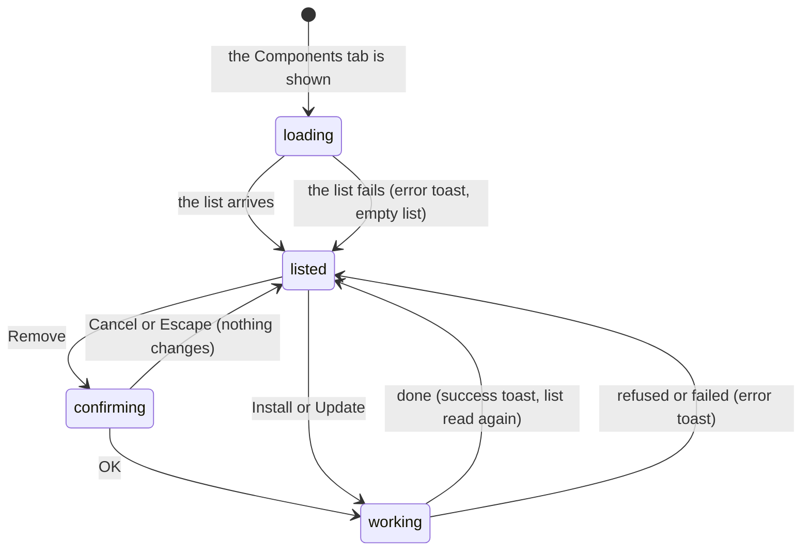

# The Components panel

## Summary

The Components panel lists the [component registry](../glossary.md#compositions-and-files) and lets the user copy a [component](../glossary.md#compositions-and-files) into the project, overwrite it with the registry's copy, or delete it again. It is the Components tab of the [sidebar](../glossary.md#the-workspace), the third of six, headed "Component Registry". Each action is carried out by the Studio server in the [project](../glossary.md#compositions-and-files), can take as long as a package install, and ends with a [toast](../glossary.md#the-workspace). Nothing here touches the active composition or the player: the panel works the same with no composition open and before the player connects, and a component does nothing until a composition's own code imports it. Installing needs a [project configuration](../glossary.md#compositions-and-files); the verification project has none, so there every install fails.

## What the panel shows

While the list is being read the panel shows only "Loading registry...", every time the tab is opened. Then it shows "Component Registry" and one card per component, in the registry's order, or "No components found in registry." when there are none.

Each card shows the component's name in bold, a green "Installed" badge if it is installed, its type in capitals at the right ("REACT"), its description, "Deps: " followed by the npm packages it needs (or "No dependencies"), and its buttons: "Install" for a component that is not installed, or "Update" (grey) and "Remove" (red outline) for one that is. The components it needs from the registry itself are not shown.

**Installed** means that every file of the component exists in the project's components folder (`src/components/helios`, unless the project configuration names another). It is checked again every time the list is read, and it does not look at the project configuration's list of installed components.

**What the registry holds.** In the default configuration, the four React components built into the `helios` command, in this order: `use-video-frame` ("React hook for synchronizing with the video frame."), `timer` ("Displays a countdown or stopwatch synchronized with the video frame."), `progress-bar` ("Visualizes playback progress."), and `watermark` ("Overlay text or image logo."). The first three need `react` and `@helios-project/core`, `watermark` needs `react`, and `timer` and `progress-bar` also need `use-video-frame`. The registry is read once, when `helios studio` starts, and does not change until it is restarted; whether each component is installed is checked every time the panel appears.

**Layout.** Each card is at least 250 pixels wide. At the default sidebar width of 250 pixels the cards do not fit, and the panel scrolls sideways by about 30 pixels; widening the sidebar fits them, and from about 550 pixels two cards sit side by side. The panel scrolls down on its own.

**Colors.** Read from the code, the panel's styles refer to color settings that Studio never defines, so the cards have no background and no border, the type has no background, and the Install button has no background or border and reads as plain white text. The grey Update button, the red Remove button, and the green badge have colors of their own.

## The simple case

In a project that has a project configuration, the user opens the Components tab and presses Install on `timer`. The button reads "Installing..." and every button in the panel fades and stops responding. The server writes `useVideoFrame.ts` and `Timer.tsx` into `src/components/helios`, adds `react` and `@helios-project/core` with the project's package manager if `package.json` does not list them, and records `use-video-frame` and `timer` in the project configuration. A toast says `Component "timer" installed`, the list is read again, and both `timer` and `use-video-frame` now show "Installed", with Update and Remove.

Update writes the registry's files over the installed ones. Remove asks for confirmation in a [browser prompt](../glossary.md#the-workspace); read from the code, the request then never reaches the removal and an error toast appears (see [Finishing](#finishing)). After each action the user stays in the panel, which shows the list as it now is.

## The interaction, event by event

Install, Update, and Remove are each one interaction of the long-running kind: the click starts it, the server's answer finishes it.

### Starting

A click on Install, Update, or Remove on a card. Install and Update send their request at once. Remove first shows the browser prompt `Are you sure you want to remove "{name}"? This will delete component files.` with Cancel and OK; while it is open, the whole Studio page waits for an answer.

### Ending at once

- **Cancel on the Remove prompt**, or Escape: nothing is sent and nothing changes.
- **A second action while one is in progress** cannot be started: every action button in the panel is disabled until the first one's answer arrives.

There is no other way to stop an action once it is sent. A request the server refuses arrives quickly and ends as described in [Finishing](#finishing).

### Becoming ongoing

As soon as the request is sent: the pressed button reads "Installing...", "Updating...", or "Removing...", and every Install, Update, and Remove button in the panel is disabled and faded. From here the action cannot be cancelled from Studio.

### While ongoing

The server works in the project folder; the panel shows no progress beyond the button's label. What the server does goes to the terminal running `helios studio`: each file written or skipped, the packages needed, and the package manager's own output. Everything else in Studio keeps working: playback, the other tabs, and dialogs. Switching to another tab discards the panel, but the server carries on and the toast still appears when the action ends.

Install does these things in order:

1. **Reads the project configuration.** Without one it stops with `Configuration file not found. Run "helios init" first.`
2. **Finds the component** and, before it, every component it needs from the registry (`timer` brings `use-video-frame`). A name the registry does not have stops it with `Component "{name}" not found in registry.`
3. **Writes the files.** It creates the components folder if needed and writes each file there. A file that already exists is left as it is.
4. **Adds npm packages.** For the packages the components need that the project's `package.json` does not list, it runs the project's package manager (Yarn, pnpm, or Bun if that one's lockfile is at the project root, otherwise npm) to add them. This can take a long time. If it fails, the failure is printed in the terminal and the install carries on.
5. **Records the components** it installed in the project configuration's list of components.

Update does the same, except that in step 3 it overwrites every existing file, the component's and those of the components it needs.

### Finishing

**Success.** A green toast: `Component "{name}" installed`, `Component "{name}" updated`, or `Component "{name}" removed`. The button's label comes back, every button is enabled again, and the list is read again, so the "Installed" badge and the buttons change. An install whose package step failed still reports success.

**Failure.** A red toast with the server's message (in the verification project, `Configuration file not found. Run "helios init" first.`), or "Installation failed", "Update failed", or "Removal failed" if the server gave none. The buttons come back; the list is not read again. Files written before the failure stay where they are.

**Remove, as the code stands.** The panel names the component in the request's address, and the server's handler for the panel answers only an address with nothing after it, so the request never reaches the removal. Read from the code, the server answers with an empty "not found", and the panel shows a red toast carrying the browser's complaint that the answer is not readable (in Chromium, a message ending "Unexpected end of JSON input"). Nothing is deleted. See [Open questions](#open-questions-and-verification).

What removal does when it is reached, as it is by the MCP server's `uninstall_component` tool: it refuses a component the project configuration does not list (`Component "{name}" is not installed.`); otherwise it drops the component from that list, deletes its files from the components folder along with any folders left empty, and leaves in place the components it needed, its npm packages, and the configuration's other records of it.

## Modifiers

| Modifier | Set at the start | Changed while ongoing |
| --- | --- | --- |
| Shift | No effect; Shift+click on a button is a click. | No effect. |
| Ctrl/Cmd | No effect. | No effect. |
| Alt/Option | No effect. | No effect. |
| Keyboard focus | The buttons can be reached with Tab and pressed with Enter; Space may also toggle playback (see [the input model](../foundations/input-model.md#open-questions-and-verification)). While the Remove prompt is open, it takes every key. | No effect; keys go wherever focus is. |
| Playback | No effect; playback continues while the server works. While the Remove prompt is open the whole page waits, the composition included. | No effect, unless the action rewrites a file the composition imports, which hot-reloads it (see [the preview player](../foundations/the-preview-player.md#hot-reload)). |
| Player connection | No effect; the panel works with no composition open and before the player connects. | No effect. |

## Cancel and interrupt

"Before it is ongoing" is while the Remove prompt is open; Install and Update are ongoing from the click. "While ongoing" is while the request is with the server.

| Event | Before it is ongoing | While ongoing |
| --- | --- | --- |
| Escape | Answers the Remove prompt as Cancel; nothing changes. | No effect; the server carries on. |
| Another shortcut, click, or command | Nothing reaches Studio until the prompt is answered. | The panel's action buttons are disabled; everything else in Studio works. Another sidebar tab discards the panel while the server carries on, and the result's toast still appears. Coming back reads the list again with the buttons enabled even if the action is still running, so a second action can be started beside it. |
| Composition switched | Not possible while the prompt is open. | No effect. |
| Window loses focus | No effect; the prompt waits. | No effect. |
| Pointer leaves the window | No effect. | No effect. |
| Server request fails or server stops | If reading the list fails, a red toast "Failed to load components" appears and the panel shows "No components found in registry." | If the server stops, a red toast carries the browser's network error ("Failed to fetch" in Chromium). Whatever the server had written stays, possibly half done. |
| Reload or tab closed | Nothing was sent. | The server carries the action through; nothing reports it. After the reload the panel shows the result once its tab is opened. |
| Hot reload | No effect. | No effect on the action. Rewriting a file the composition imports causes one. |
| Project changed on disk | The "Installed" badge is worked out from the files each time the list is read, so files added or deleted on disk show after the tab is opened again. | Files changed while the server works are overwritten or skipped as in step 3 of Install. |

After every interrupt the user is in the panel with nothing in progress, and the list reflects the files on disk the next time it is read. The registry itself never changes while `helios studio` runs.

## Interactions with other systems

**Files on disk.** Install writes the component's files, and those of the components it needs, into the components folder (creating it), changes `package.json`, its lockfile, and `node_modules` through the package manager, and writes the project configuration. Update overwrites those files without asking, losing any local changes to them. In a project without `public/`, the new folders and `helios.config.json` appear in the Assets panel the next time its list is read (see [the project and compositions](../foundations/project-and-compositions.md#assets)); the component files themselves are not assets.

**Browser storage.** None, apart from the sidebar tab (see [what Studio remembers](../foundations/the-workspace.md#what-studio-remembers)).

**Undo.** None. Update overwrites files and removal deletes them, both for good; nothing is kept to go back to.

**Playback range and loop.** No interaction.

**Input props.** No interaction.

**Rendering and export.** None directly. A composition that imports an installed component renders it like any of its own code.

**Notifications.** Green toasts `Component "{name}" installed`, `updated`, and `removed`; red toasts with the server's message or "Installation failed", "Update failed", "Removal failed"; and "Failed to load components" when the list cannot be read. The Remove confirmation is a browser prompt, not a Studio [dialog](../glossary.md#the-workspace).

**Other tabs and agents.** Each tab reads the list when its panel appears and does not notice changes made elsewhere until then. Two tabs can run actions on the same files at the same time. An [agent](../glossary.md#compositions-and-files) connected to Studio's MCP server can install, update, and remove components, and its removal does reach the server; the panel shows the result the next time it appears. See `cross-cutting/changes-from-outside-studio.md`.

**Keyboard and accessibility.** Every button can be reached with Tab and is labeled with words. Progress shows only as the button's label, and the result only as a toast. The panel has no shortcut.

## Edge cases

- **No project configuration**, as in the verification project: every component shows Install, and every Install and Update fails with `Configuration file not found. Run "helios init" first.` Studio offers no way to create the configuration.
- **Frameworks other than React.** The built-in registry has only React components, so a project configuration that names Vue, Svelte, Solid, or vanilla leaves the panel showing "No components found in registry."
- **Installed by dependency.** Installing `timer` also installs `use-video-frame`, which then shows "Installed" too. Removing `use-video-frame` would delete a file that `timer` imports; nothing warns.
- **Installed but not listed.** A component whose files were copied in by hand shows "Installed", but the project configuration does not list it, so removal refuses it as not installed.
- **Remote registries.** With a registry address set, a registry in the newer index format lists its components without their files until they are installed, and read from the code every one of them then shows "Installed" at once, so Install is never offered (see [Open questions](#open-questions-and-verification)).
- **A slow registry.** A registry address that does not answer within 5 seconds is passed over for the built-in list, and `helios studio` takes up to 5 seconds longer to start.
- **A configuration that becomes unreadable** while Studio runs: read from the code, reading the list then never gets an answer, and the panel stays on "Loading registry...".
- **Update and local edits.** Update rewrites every file of the component and of the components it needs, with no confirmation and no comparison.
- **Repeated presses.** An action cannot be started twice from one panel, because the buttons are disabled from the first click until the answer; it can from a second tab, or after leaving and reopening the tab.

## Open questions and verification

- Remove never reaches the server: the panel sends the name as `/api/components?name=...` (`packages/studio/src/components/ComponentsPanel/ComponentsPanel.tsx:94`), and the server's handler answers only when the rest of the address is exactly `/` (`packages/studio/src/server/plugin.ts:120`), which a query string breaks, unlike the assets handler that strips it. Confirm the toast's wording. This looks like a bug.
- With a remote registry in the index format, components are listed with no files, and "Installed" is "every file exists", which is true of an empty list (`packages/cli/src/commands/studio.ts:88`), so every component shows "Installed". This looks like a bug.
- An install whose package manager fails still reports success (`packages/cli/src/utils/install.ts:128-133`). This may be worth treating as a bug.
- If the package manager cannot be started at all, nothing handles the error (`packages/cli/src/utils/package-manager.ts:51-62`); confirm whether `helios studio` stops.
- If the project configuration becomes unreadable while Studio runs, the list request throws outside any error handling (`packages/studio/src/server/plugin.ts:121-128`); confirm that the panel waits forever and whether the server survives.
- The color settings the panel's styles refer to are defined nowhere in Studio (`ComponentsPanel.css` lines 3, 16, 17, 38, 41, 47, 53, 57, 68, and 99), which would leave the cards, the type, and the Install button unstyled and the Update button without its border. Confirm by eye.
- Verification needs a project configuration. Add a `helios.config.json` to a copy of the verification project, for example `{"version": "1.0.0", "directories": {"components": "src/components/helios", "lib": "src/lib"}, "components": []}`, and expect `npm install` to run in it.
- Confirm whether installing packages or writing component files makes the development server reload the Studio page or the composition.
- Confirm that the Remove prompt freezes the composition's playback while it is open.
- Read from `ComponentsPanel/ComponentsPanel.tsx`, `ComponentsPanel.css`, `ComponentsPanel.test.tsx`, `packages/studio/src/server/plugin.ts`, `server/mcp.ts`, `packages/cli/src/commands/studio.ts`, `utils/install.ts`, `utils/uninstall.ts`, `utils/config.ts`, `utils/package-manager.ts`, `registry/client.ts`, and `registry/manifest.ts`; not yet confirmed by hand.

Verified against helios commit `c2bfddb`
