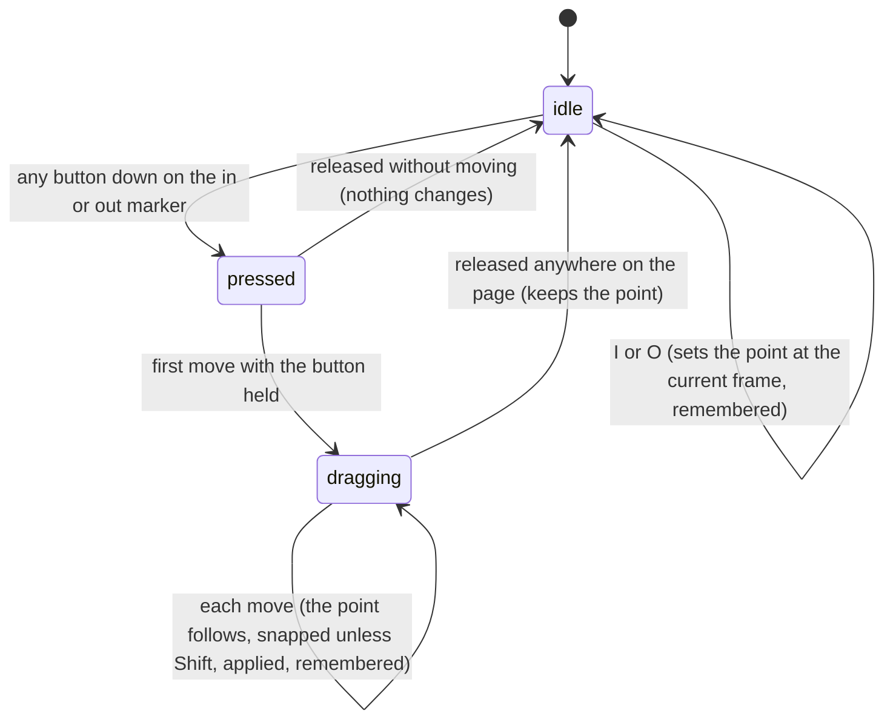

# The playback range

## Summary

The playback range is the span of frames between the in point and the out point. It decides where playback stops or loops, and it is what a server-side render started from the Renders panel, a client-side export, and a downloaded job spec cover. It shows on the timeline's composition track as two thin blue markers with faint blue shading between them, and in the timeline's header as "In: {frame}" and "Out: {frame}". It is set with I and O at the current frame, or by dragging the markers. It is [remembered](../glossary.md#persistence) for each composition, together with loop and the playhead position. It can be changed before the player is [connected](../glossary.md#the-preview), against the timeline's placeholder length.

## The simple case

The user plays to one second (frame 30 at 30 frames per second) and presses I, then plays to three seconds and presses O. The in marker moves to frame 30, the out marker to frame 90, and the shading now covers that span; the header reads "In: 30" and "Out: 90". With loop on, playback now cycles from frame 30 to frame 90. Home goes to frame 30. The Renders panel shows "Range: 30 - 90", and a render started there covers frames 30 to 89.

To fine-tune, the user drags the out marker; it follows the pointer and clicks onto nearby markers, caption edges, and the playhead's snap points. To go back to the full length, the in marker is dragged to the start and the out marker to the end, or I is pressed at frame 0 and O at the last position.

A new composition starts with the in point at 0 and the out point at its total frames: the range is the whole composition, and the faint shading covers the whole composition track.

## The interaction, event by event

### Starting

**I** sets the in point to the current frame rounded to the nearest whole frame, but never below 0 and never above the out point minus 1. **O** sets the out point to the current frame rounded to the nearest whole frame, but never below the in point plus 1 and never above the total frames. The playhead does not move.

**A marker drag** starts when any mouse button goes down on the in or out marker. Each marker is a 1-pixel blue line the height of the composition track with a small blue triangle, 8 pixels wide, at its top; it turns lighter blue under the pointer, shows a sideways-resize pointer, and has the tooltip "In Point (I)" or "Out Point (O)". The line and the triangle are the only places that grab it. The press does not change the point, does not seek, and does not move keyboard focus. The markers lie above the composition and time-prop markers, so where they overlap the in or out marker gets the press; where the in and out markers overlap each other, the out marker does.

### Ending at once

I and O always end at once. The marker, the shading, and the readout move; the new range is applied to the composition (see [How the range limits playback, renders, and exports](#how-the-range-limits-playback-renders-and-exports)); and the composition's timeline state is remembered.

A marker pressed and released without moving changes nothing.

### Becoming ongoing

A marker drag becomes ongoing at the first mouse move with the button held, of any distance, anywhere on the page.

### While ongoing

On every mouse move anywhere on the page, the frame under the pointer is worked out from the pointer's horizontal position, rounded to a whole frame, and [snapped](the-timeline.md#snapping) unless Shift is held at that moment. The other marker is one of the snap points. The result is then limited: the in point stays between 0 and the out point minus 1, the out point between the in point plus 1 and the total frames. The markers cannot pass each other; dragging the in marker past the out marker leaves it pinned one frame before it.

Because the dragged point's own current position is also a snap point, the marker does not follow small movements: it stays put until the pointer is more than 10 pixels from it, then jumps to the pointer, so it trails the pointer in steps of about 10 pixels. Holding Shift makes it follow exactly.

The marker, the shading, and the readout follow each change. Each change is applied to the composition at once, so playback that is running respects the new range on its next frame, and each change is remembered. The playhead does not move and the composition is not sought. The hover guide stays where the drag began.

### Finishing

Releasing the button anywhere on the page ends the drag with the point where the last move put it. It is already applied and remembered. There is no undo.

## How the range limits playback, renders, and exports

Studio applies the range to the composition whenever the in point, the out point, or the composition's length changes, and again every time the player connects (including after a hot reload). If the in point is 0 and the out point is at or beyond the composition's total frames, Studio clears the composition's range, and the composition plays its full length. Otherwise the composition's range is set to the in and out points exactly, even when the out point lies beyond the composition's end (see [Edge cases](#edge-cases)). Loop is applied the same way: on every change and on every connection.

| What | How the range applies |
| --- | --- |
| Playback | Stops at, or with loop on wraps between, the in and out points. See [the transport controls](the-transport-controls.md#finishing). |
| Seeking (scrubbing, frame steps, the timecode field, markers) | Not limited: the playhead can be put anywhere from 0 to the total frames, inside or outside the range. |
| ⏮, Home, and ▶ at the end of the range | Go to the in point. |
| Server-side render from the Renders panel | Frames from the in point up to, but not including, the out point. The panel shows "Range: {in} - {out}" above the job list, and each job made this way shows "({in}-{out})". See [server-side renders](../output/server-renders.md). |
| Server-side render from the Omnibar's "Start Render" | Ignores the range and renders the full length. |
| Client-side export | Frames from the in point up to, but not including, the out point when a range is in effect; the full length when it covers the whole composition. See [client-side export](../output/client-side-export.md). |
| Job spec | The in and out points, the same frames as a server-side render. See [snapshots and job specs](../output/snapshots-and-job-specs.md). |

Because the out point is excluded from renders and exports, the default range (0 to the total frames) renders exactly the composition's frames: 150 frames, 0 to 149, for 5 seconds at 30 frames per second.

## How the range is remembered

The in point, the out point, loop, and the playhead position are remembered together as the composition's [timeline state](../glossary.md#the-preview), under its composition ID, in the browser (see [what Studio remembers](../foundations/the-workspace.md#what-studio-remembers)).

- **Written** whenever the in point, the out point, or loop changes (including every move of a marker drag that changes a point), whenever playback pauses (by the user or at the end of the range), and when the page is closed or reloaded.
- **Restored** whenever the composition is opened: the in point, the out point, and loop at once (the readouts change immediately), the playhead position as soon as the player connects.
- **A composition with no remembered state** starts with the in point at 0, loop off, and the out point at 0 until its length is known; then the out point becomes the total frames.
- **Not followed afterwards:** the out point is set from the length only while it is 0. If the composition's length changes later (its code is edited and it hot-reloads with a new duration), the out point stays where it was.
- **Not written on a switch, for the composition being left:** switching to another composition does not record where the playhead of the one being left was; reopening it later returns to the position at its last pause.
- **Written under the wrong ID on a switch, for the composition being opened.** Read from the code, at the moment of a switch Studio writes a timeline state for the composition being opened made of the values it still holds for the one being left: its in point, out point, loop, and playhead position. A moment later, once the new composition's own in point, out point, and loop are restored, Studio writes those over them, but with the playhead position still that of the composition being left, because the player has not reported the new composition's frame yet. The new composition is still sought to its own remembered position when it connects, because Studio read that before overwriting it; the record is put right at the next write after the connection (a change of in, out, or loop, a pause, or the page closing). Until then, and for good if the new composition never connects, a reload reopens it at the previous composition's frame. A composition with no remembered state gets in point 0, loop off, and an out point taken from the previous composition's length (see [Edge cases](#edge-cases)).
- **Written with Studio's starting values on a page load.** Read from the code, the same early write happens when the page loads; with no composition open before, what it writes is Studio's starting values. The moment the remembered (or first) composition opens, Studio reads its record and then writes in point 0, out point 0, loop off, and frame 0 over it; a moment later it writes the restored in point, out point, and loop back, still with frame 0. The playhead is still sought to the remembered position when the player connects, because Studio read that first, and the record is put right at the next write after the connection. A composition that never connects therefore loses its remembered playhead position at every page load. Only the playhead position is at risk here: the in point, the out point, and loop come back as they were.

Renaming a composition gives it a new ID, so its timeline state is forgotten. Another composition with the same ID, in this project or another project served at the same address, shares it.

## Modifiers

| Modifier | Set at the start | Changed while ongoing |
| --- | --- | --- |
| Shift | I and O set the points as without Shift. A marker press is not affected. | Read on every move of a marker drag: Shift turns snapping off from the next move. |
| Ctrl/Cmd | Ctrl/Cmd+I and Ctrl/Cmd+O still set the points, alongside whatever the browser does with the combination. No effect on a marker press. | No effect. |
| Alt/Option | No effect on Windows and Linux. On a Mac, Option+I and Option+O type other characters, so nothing happens. | No effect. |
| Keyboard focus | I and O are ignored while a text field has focus. With the player focused, the player also sets its own copy of the range; Studio's range replaces it as soon as Studio's point changes, but if the point does not change (I pressed at the current in point), the player's copy stays in effect. The marker press does not move focus. | No effect; keys go wherever focus is. |
| Playback | While playing, I and O take the frame the playhead has reached at the key press. | Dragging a marker while playing changes the range under the moving playhead; if the playhead ends up outside the range, playback behaves as described in [playing from outside the range](the-transport-controls.md#finishing). |
| Player connection | Before connection, I and O use the frame Studio last knew (0 on a first open) and the placeholder length of 100 frames: I leaves the in point at 0, and O sets the out point to 1. The markers can be dragged within the placeholder length. Whatever is set is applied on connection, and an out point set this way is not replaced by the real length. | A marker drag continues across a connection or a hot reload; the range is applied again when the player reconnects. |

## Cancel and interrupt

I and O end at once, so the left column also covers them; the right column is a marker drag in progress.

| Event | Before it is ongoing | While ongoing |
| --- | --- | --- |
| Escape | No effect. | No effect; the drag continues, and Escape does not put the point back. |
| Another shortcut, click, or command | Acts as usual. | Shortcuts act and the drag continues. I or O pressed during a drag set the points at the current frame; the next move of the drag then overrides the point being dragged. |
| Composition switched | The new composition's own range is restored. | Only possible from the keyboard (Ctrl/Cmd+K, then Enter) while the button is held. The new composition's range is restored, and the next move sets the dragged point on the new composition and remembers it for that composition. |
| Window loses focus | No effect. | Studio does not notice. If the button is released in another window, the drag continues when the pointer comes back, with no button held, until the next release anywhere on the page. |
| Pointer leaves the window | No effect. | The drag continues while the browser keeps reporting the pointer, pinned at frame 0 or the total frames beyond the timeline's ends, and then by the other point. |
| Server request fails or server stops | No effect; the range makes no requests. | No effect. |
| Reload or tab closed | The range is already remembered and comes back on reload. | The point up to the last move is remembered and comes back on reload. |
| Hot reload | The range is applied again when the composition reconnects. | The drag continues; the range is applied again when the composition reconnects. |
| Project changed on disk | No effect. A composition renamed on disk loses its remembered state when it is next listed under its new ID. | No effect. |

## Interactions with other systems

**Files on disk.** None directly. Renders and exports that use the range write their own files (see their documents).

**Browser storage.** As described in [How the range is remembered](#how-the-range-is-remembered).

**Undo.** None. A point that has been moved cannot be put back except by moving it again.

**Playback range and loop.** This document owns the range. Loop is turned on and off in [the transport controls](the-transport-controls.md) and is remembered with the range.

**Input props.** None, except that time props are snap points while dragging a marker.

**Rendering and export.** As described in [How the range limits playback, renders, and exports](#how-the-range-limits-playback-renders-and-exports).

**Notifications.** None.

**Other tabs and agents.** Each tab has its own range while open. All tabs write the same remembered record for a composition, so the last write wins. Another tab picks up the change only when it reopens the composition from another one, or when the composition is opened on a fresh page load (a new tab, for example). Reloading a tab that already shows the composition does not pick it up: the reloading tab writes its own in point, out point, loop, and playhead position as the page closes, over the other tab's change, and the reloaded page reads back its own values. Closing that tab writes them in the same way. An agent cannot read or change the range.

**Keyboard and accessibility.** I and O set the points from the keyboard; there is no keyboard way to move a point by a frame or to clear the range. The markers are mouse-only and have a 1-pixel hit area. The readouts are plain numbers in frames.

## Edge cases

- **The out point after a switch.** Read from the code: when a composition with no remembered state is opened, its out point is set from the length Studio still holds for the previous composition, before the new one connects, and is then never corrected. Switching from a 10-second composition to a 5-second one leaves the out point at 300 for a 150-frame composition (the range is cleared because the out point is beyond the end, but "Out: 300" shows and a render from the Renders panel covers 300 frames); switching the other way leaves the range cut short at 150 frames. This may be worth treating as a bug.
- **A length that changes.** If the composition's code changes its duration, the out point stays at the old length: shorter than the new length, it cuts playback and renders short; longer, it is ignored for playback while the in point is 0 (the range is cleared) but still used by renders.
- **An out point past the end.** With the in point above 0, an out point beyond the composition's total frames (left by a switch or a shorter duration) is applied as it is, not cleared. Read from the code, playback then does not stop at the composition's end: the current frame goes on past the total frames, the timecode and "Fr:" count beyond the length while the playhead stays pinned at the right edge of the timeline, and playback stops or wraps only at the out point. What the composition draws past its end depends on its code. Setting I at frame 30 after the switch described above is enough to get here.
- **O before the player connects** sets the out point to 1, giving a one-frame range that stays after connection.
- **A sticky marker.** Dragging a marker slowly, it lags behind the pointer and moves in jumps of about 10 pixels, because it snaps to its own position (see [While ongoing](#while-ongoing)). Shift avoids this.
- **Hard to grab.** The markers are 1 pixel wide plus their small triangle, and the out marker covers the in marker when they are close. Pressing next to a marker starts a scrub instead.
- **No clear.** Studio has no command to clear the range. When the player has focus, X clears the composition's copy of the range but not Studio's in and out points, so the markers still show a range that playback ignores until a point changes.
- **The last frame.** The out point at its maximum is the total frames, which is one past the last frame a render draws. The shading reaches the end of the track.
- **I past the out point.** Pressing I at a frame at or after the out point puts the in point one frame before the out point, not at the playhead; O at or before the in point puts the out point one frame after it.
- **Range in frames, not time.** The readouts and the Renders panel show frame numbers; at a different frame rate the same numbers mean different times.

## Open questions and verification

- Confirm the stale out point after switching to a composition with no remembered state, in both directions, and what a render from the Renders panel then produces when the out point is beyond the composition's end.
- Confirm the write under the new ID at a switch: pause a connected composition at frame 40, switch to a Vanilla JS composition (which never connects), and check in the browser's storage that `helios-studio:timeline:{ID}` for the Vanilla JS composition now holds frame 40; then switch to a composition remembered at another frame and check that it is still sought to its own frame. Read from `context/StudioContext.tsx` lines 649 to 667, where the save effects run with the new ID before the restored values and the new composition's frame have arrived. This may be worth treating as a bug.
- Confirm the write of Studio's starting values on a page load: open No Connect (a Vanilla JS composition, which never connects) by a page load, and check that its `helios-studio:timeline:{ID}` record holds frame 0 afterwards, whatever frame it held before the load. The same effects run when the page's first composition opens (`context/StudioContext.tsx` lines 649 to 667, with the starting values at lines 230, 231, 610, and 76).
- Confirm that reloading a tab does not pick up another tab's change to the same composition's range: the closing page writes its own values first (`context/StudioContext.tsx` lines 669 to 678).
- Confirm that the out point does not follow a change to the composition's length after a hot reload.
- Confirm that, with the in point above 0 and the out point beyond the end, playback runs past the composition's last frame up to the out point (`context/StudioContext.tsx`, the range effect, clears the range only when the in point is 0; `onTick` in `packages/core/src/Helios.ts` does not stop at the composition's length while a range is set). This may be worth treating as a bug, together with the stale out point.
- Confirm O before the player connects, and the resulting one-frame range.
- Confirm the mismatch after I, O, or X with the player focused.
- Confirm that the in and out markers can only be grabbed on their line and triangle, and that they stick to their own position during a slow drag unless Shift is held.
- With a clock-bound composition the range has no visible effect on playback (see [the preview player](../foundations/the-preview-player.md#clock-bound-compositions)); verify with a composition the player can drive.
- Read from `Timeline.tsx`, `Timeline.css`, `GlobalShortcuts.tsx`, `GlobalShortcuts.test.tsx`, `context/StudioContext.tsx`, `context/StudioContext.test.tsx`, `RendersPanel/RendersPanel.tsx`, `server/render-manager.ts`, and `packages/player/src/features/exporter.ts`; not yet confirmed by hand.

Verified against helios commit `c2bfddb`
