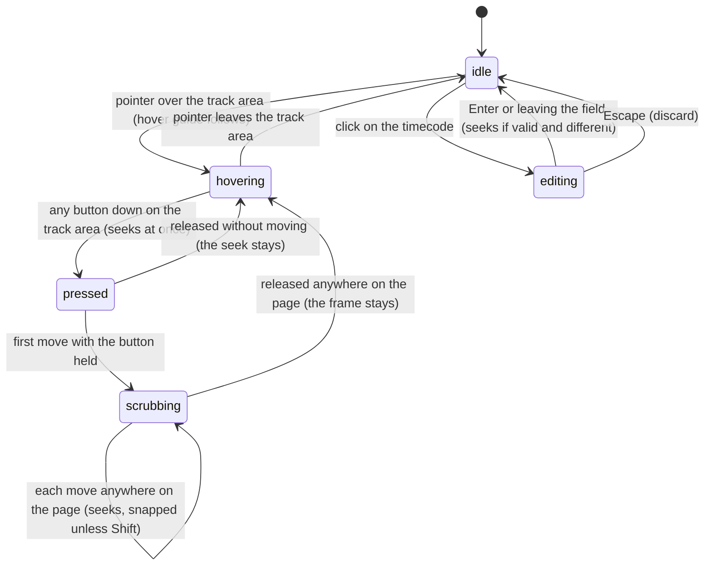

# The timeline

## Summary

The timeline shows the active composition's length as a horizontal track and lets the user move through it: pressing anywhere on it jumps there, dragging scrubs, and the timecode field above it takes a typed position. It also shows where the playhead is, where the in and out points are, and the composition's captions, markers, time props, and audio, and it can be zoomed so that single frames are wide enough to hit. It fills the right part of the [timeline panel](../glossary.md#the-workspace). Scrubbing and the timecode field need the player to be [connected](../glossary.md#the-preview); the timeline is drawn with placeholder numbers until then.

This document owns scrubbing, snapping, the hover guide, the ruler, the timeline zoom, and the timecode field. The in and out markers are owned by [the playback range](the-playback-range.md); the caption bars, composition markers, time-prop markers, audio waveforms, and dropping assets are owned by [timeline tracks](timeline-tracks.md). Like every playback document, this one describes a composition the player can drive (see [clock-bound compositions](../foundations/the-preview-player.md#clock-bound-compositions)).

## What the timeline shows

**The header row**, in a small monospace font. On the left: the timecode field (the current frame as `HH:MM:SS:FF`), a slash, and the composition's length as a timecode; then the zoom control, a slider between the words "Fit" and "Zoom". On the right: "In: {in point}", "Out: {out point}", and "Fr: {current frame}", all in frames, the last rounded to the nearest frame.

**The track area**, below it, which scrolls inside the panel when it is larger than the panel. From top to bottom:

- **The ruler**, 24 pixels tall: short tick marks at regular intervals, each labeled with its timecode. It stays at the top when the track area is scrolled vertically.
- **The composition track**, a dark bar 24 pixels tall (tooltip "Composition Track"), on which sit the shaded playback range (blue, faint), the caption bars, the composition markers, the time-prop markers, and the in and out markers.
- **One lane per audio track**, 24 pixels tall each, with a waveform.
- **A margin** of 24 pixels below the last lane.

Across the track area run:

- **The playhead**: a red vertical line with a small red triangle at its top, at the current frame, from the ruler to the bottom of the margin. It cannot be grabbed; pressing anywhere on the track area moves it.
- **The hover guide**: a faint dashed vertical line at the pointer, with a small label of the timecode above it (see [The hover guide](#the-hover-guide)).

Below the track area the panel shows **empty background** down to its bottom. The track area takes only as much height as it needs (76 pixels with no audio track, 28 more for each audio track), so in a timeline panel of the default height most of the space under the header is this empty background, which does nothing (see [Edge cases](#edge-cases)).

Positions are linear: the left edge of the track area is frame 0 and the right edge of its content is the composition's [total frames](../glossary.md#the-preview). Before the player is connected the total frames is a placeholder of 100 (at 30 frames per second the length reads `00:00:03:10`); after a switch it keeps the previous composition's length until the new one connects.

**The ruler's ticks** are spaced at the shortest of 1, 2, 5, 10, 15, or 30 seconds, or 1, 5, 10, or 30 minutes, or 1 hour, that keeps them at least 80 pixels apart at the current width. On a timeline wider than 1000 pixels showing a composition shorter than two seconds, half-second, tenth-of-a-second, or single-frame ticks are used if they fit.

## The simple case

The user presses on the timeline a third of the way along. The playhead jumps there, the composition shows that frame, and the timecode updates. Dragging left and right moves the playhead with the pointer and the composition follows, frame by frame. When the pointer passes close to the in point, the out point, a marker, or the start or end, the playhead clicks onto it; holding Shift stops that. Releasing leaves the playhead where it is. If the composition was playing, it keeps playing from wherever the playhead was left.

To go to an exact position, the user clicks the timecode, types `00:00:02:15` or a frame number such as `75`, and presses Enter.

## The interaction, event by event

The interaction narrated here is the scrub. The timecode field has its own section below.

### Starting

A scrub starts when any mouse button goes down anywhere on the track area that is not an in or out marker, a time-prop marker, or a composition marker (those are owned by [the playback range](the-playback-range.md) and [timeline tracks](timeline-tracks.md)). That includes the ruler, the composition track, the shaded range, the caption bars, the audio lanes, and the margin below the last lane. It does not include the empty background below the track area, where a press does nothing at all.

At the press, Studio works out the frame under the pointer, [snaps](#snapping) it unless Shift is held, and seeks there at once. The playhead jumps and the composition shows that frame as soon as it answers. The press does not move keyboard focus and does not start a text selection, so a text field that had focus keeps it, and so does the player.

A right-button press does the same and also opens the browser's context menu (see [Edge cases](#edge-cases)). Before the player is connected the press seeks nothing.

### Ending at once

Releasing without moving ends the scrub: it was a click to jump. The playhead stays on the frame it jumped to. If the composition was playing, it plays on from there. Nothing is written or [remembered](../glossary.md#persistence) at this moment; the position is remembered the next time playback pauses or the page closes.

### Becoming ongoing

The scrub becomes ongoing at the first mouse move with the button held, of any distance, anywhere on the page. Nothing is fixed at this moment: each move is computed afresh.

### While ongoing

On every mouse move, anywhere on the Studio page, Studio takes the pointer's horizontal position against the timeline's full width, works out the frame (rounded to a whole frame), snaps it unless Shift is held at that moment, and seeks there. The vertical position does not matter: dragging over the stage, the sidebar, or a dialog's overlay keeps scrubbing. Left of the timeline's start the frame is 0; right of its end it is the total frames.

The timeline does not scroll to follow the pointer. When it is zoomed wider than the panel, dragging past the visible edge keeps seeking into the part that is scrolled out of view, and the playhead disappears from view.

The hover guide stays where it was when the button went down, and its label keeps showing that position, while the playhead moves with the pointer.

If the composition is playing, playback continues between moves: each move puts the playhead under the pointer, and while the pointer is still, playback carries the playhead away from it. Scrubbing never pauses.

Keyboard shortcuts keep working during a scrub; each acts on the frame the scrub has reached.

### Finishing

Releasing the button anywhere on the page ends the scrub. The playhead stays where the last move put it. Nothing is written to the project, there is no undo step, and nothing is remembered until playback next pauses or the page closes. If the pointer is over the track area, the hover guide resumes following it.

## Snapping

While seeking with the mouse (the press, every scrub move, and the marker drags owned by [the playback range](the-playback-range.md) and [timeline tracks](timeline-tracks.md)), the frame under the pointer is pulled onto the nearest of these points if one is within 10 screen pixels:

- frame 0 and the total frames;
- the in point and the out point;
- every composition marker;
- the start and end of every caption cue;
- the value of every time prop.

The snapped frame is rounded to a whole frame. When the thing being dragged is itself one of these points (the in or out marker, a time-prop marker), its own current position counts too, so it sticks where it is until the pointer is more than 10 pixels away; [the playback range](the-playback-range.md#while-ongoing) and [timeline tracks](timeline-tracks.md#while-ongoing) describe the effect. A scrub has no such point of its own and follows the pointer. How many frames 10 pixels covers depends on the zoom: at Fit, on a timeline 1000 pixels wide showing 150 frames, about 1.5 frames; at the highest zoom, less than half a frame. Holding Shift turns snapping off; Studio reads Shift at the press and again on every move, so pressing or releasing Shift mid-drag takes effect at the next move. Nothing shows that a snap happened except the playhead's position.

## Zooming the timeline

The zoom slider runs from "Fit" (all the way left) to "Zoom" (all the way right), in 100 steps.

- **Fit** makes the whole composition exactly as wide as the panel. The last tick's label still overflows the right edge by a few pixels, so at Fit the track area shows a horizontal scrollbar and that label is out of view (seen in the automated pass of 2026-10-07 on a 20-second composition).
- **Any other step** gives each frame a fixed width: about half a pixel at the first step, 3.6 pixels at the middle, and 25 pixels at the far right, growing by 4% per step. The timeline is never narrower than the panel, so for a short composition the first steps change nothing.

The track area is built to scroll horizontally, with its scrollbar, the wheel (Shift and the wheel, or a sideways trackpad gesture), or the trackpad, when the timeline is wider than the panel. In practice it never gets the chance: a timeline wider than the panel widens the panel itself, and with it the stage, the whole middle column of the [workspace](../foundations/the-workspace.md), so the inspector and the header's In, Out, and Fr readouts are pushed off the right of the window and the page does not scroll to them; nothing scrolls the later part of the timeline into view ([B-84](../bug-triage.md#b-84-zooming-the-timeline-in-widens-the-whole-middle-column-instead-of-scrolling-the-track-area); seen in the automated pass of 2026-10-07, from about zoom step 18 on a 20-second composition in a 1600-pixel window). Moving the slider back toward Fit restores the layout. The code keeps the scroll position in pixels when the slider moves, so the visible part of the timeline would shift; the zoom does not center on the playhead or the pointer, and nothing scrolls the playhead into view during playback or scrubbing.

The zoom is remembered for every composition (see [what Studio remembers](../foundations/the-workspace.md#what-studio-remembers)). The slider is a text field in the [input model](../foundations/input-model.md#keyboard-focus-and-who-receives-a-key)'s sense: once it has focus, ← and → move it instead of stepping frames, and ↑ and ↓ do nothing at all.

## The hover guide

While the pointer is over the track area and no scrub or marker drag is in progress, a faint dashed vertical line follows it, with a small label above it showing the timecode at the pointer, rounded to a whole frame and not snapped. It disappears when the pointer leaves the track area, including when it moves down into the empty background below it. During a drag it stays where the drag began (see [While ongoing](#while-ongoing)).

## The timecode field

The timecode at the left of the header row shows the current frame as `HH:MM:SS:FF`, rounded down, or `00:00:00:00` while the frame rate is unknown. Its tooltip is "Click to edit (Timecode or Frame #)". It follows playback and scrubbing.

**Starting.** A click turns it into a text box holding the current timecode, all selected.

**Ending at once.** Escape closes the box and changes nothing. So does emptying it and pressing Enter or leaving it. Pressing Enter or leaving the box (clicking elsewhere, or Tab) without typing is not a no-op: it commits the timecode it showed, which is the current frame rounded down, so after playback has left the playhead on frame 45.73, the playhead moves to 45.

**Becoming ongoing.** The first keystroke. While the box is open it does not follow playback, and Studio's shortcuts are ignored because focus is in a text field.

**Finishing.** Enter, or leaving the box, commits what was typed:

- Text containing a colon must be exactly two digits, colon, two digits, colon, two digits, colon, two digits (`00:01:02:15`). Anything else with a colon (`1:02:15`, `00:00:02`) closes the box and changes nothing, silently. The frames part is not checked against the frame rate: `00:00:01:45` at 30 frames per second is frame 75.
- Text without a colon is read as a frame number from its leading digits: `120` is frame 120, `12abc` is frame 12, `1.5` is frame 1. Text that starts with no digit changes nothing.
- The result is limited to 0 through the total frames, and Studio seeks there if it differs from the current frame. Playing continues from there.

Before the player is connected, a commit seeks nothing.

For the timecode field, "before it is ongoing" means the box is open and nothing has been typed, and "while ongoing" means the user is typing.

| Event | Before it is ongoing | While ongoing |
| --- | --- | --- |
| Escape | Closes the box; nothing changes. | Closes the box; what was typed is discarded. |
| Another shortcut, click, or command | Shortcuts are ignored except Ctrl/Cmd+K, which opens the Omnibar and takes focus, committing the box. A click anywhere that takes focus commits it. A press on the timeline's track area does not take focus, so the box stays open while the user scrubs; when it is committed later, the typed or shown value overrides the scrub. A press on a composition marker does take focus: the marker seeks first, then the box commits, so the box's value wins here too and the playhead goes back to the frame the box shows (see [timeline tracks](timeline-tracks.md#starting)). | Same, committing what was typed, which wins over a composition marker's seek. |
| Composition switched | Switching takes focus (the Omnibar, a click in the sidebar), which commits the box against the composition being left. | Same. |
| Window loses focus | The browser reports the box as left, so it commits the timecode it shows and closes (Chromium's usual behavior, to confirm; see [the input model](../foundations/input-model.md#the-interrupt-rows)). | The same, committing what was typed; text that is not a valid timecode or frame number closes the box and changes nothing. |
| Pointer leaves the window | No effect. | No effect. |
| Server request fails or server stops | No effect; no request is made. | No effect. |
| Reload or tab closed | The box is lost; nothing changes. | What was typed is lost. |
| Hot reload | The box stays open; a later commit seeks the reloaded composition. | Same. |
| Project changed on disk | No effect. | No effect. |

## Modifiers

| Modifier | Set at the start | Changed while ongoing |
| --- | --- | --- |
| Shift | The press's seek is not snapped. | Read again on every move: holding Shift turns snapping off from the next move, releasing it turns snapping back on. |
| Ctrl/Cmd | No effect. | No effect. |
| Alt/Option | No effect. | No effect. |
| Keyboard focus | No effect on the scrub, and the press leaves focus where it was: a text field keeps it (so Space still types into it), the player keeps it. | No effect; keys go wherever focus is. |
| Playback | Pressing seeks and playback continues from there. | Playback continues between moves and carries the playhead away from a still pointer. |
| Player connection | Before connection the press and moves seek nothing; the timeline shows the placeholder length. | If the composition reconnects during a scrub (a hot reload), the next move seeks the reloaded composition. |

## Cancel and interrupt

These are the rows for the scrub; the timecode field's are in [its section](#the-timecode-field).

| Event | Before it is ongoing | While ongoing |
| --- | --- | --- |
| Escape | No effect; the jump has already happened. | No effect; the scrub continues and there is no way back to the frame it started from. |
| Another shortcut, click, or command | Shortcuts act. | Shortcuts act on the frame the scrub has reached (I and O set points there, Space toggles playback) and the scrub continues. Ctrl/Cmd+K opens the Omnibar; the scrub continues over its overlay. |
| Composition switched | The new composition opens; the jump applied to the old one. | Only possible from the keyboard (Ctrl/Cmd+K, then Enter) while the button is held. The scrub continues, and once the new composition connects, moves seek it. |
| Window loses focus | No effect. | Studio does not notice. If the button is released in another window, the scrub continues when the pointer comes back, with no button held, until the next release anywhere on the page. |
| Pointer leaves the window | No effect. | The scrub continues while the browser keeps reporting the pointer, pinned at frame 0 or the total frames beyond the timeline's ends. |
| Server request fails or server stops | No effect; seeking makes no requests. | No effect. |
| Reload or tab closed | The page remembers the playhead position as it closes, so the jump is restored on reload. | The same: the position the scrub had reached is remembered and restored on reload. |
| Hot reload | No effect beyond the reload itself, which puts back the frame. | The composition reloads and Studio puts back the last frame it saw; the next move seeks the reloaded composition. |
| Project changed on disk | No effect. | No effect. |

## Interactions with other systems

**Files on disk.** None.

**Browser storage.** The timeline zoom is remembered for every composition. The playhead position is remembered per composition, but only when playback pauses or the page closes, not when a scrub ends.

**Undo.** None. A scrub or a jump cannot be undone; the previous position is not kept.

**Playback range and loop.** Scrubbing and the timecode field ignore the range: the playhead can be put anywhere from 0 to the total frames. The in and out points are snap points. The shaded region on the composition track shows the range.

**Input props.** Time props appear as markers on the composition track and are snap points (see [timeline tracks](timeline-tracks.md)). Changing a time prop elsewhere moves its marker and snap point at once.

**Rendering and export.** None.

**Notifications.** None.

**Other tabs and agents.** Each tab has its own playhead.

**Keyboard and accessibility.** There is no keyboard scrubbing beyond the frame steps and Home of the [transport controls](the-transport-controls.md) and typing into the timecode field. The zoom slider can be reached with Tab and moved with ← and →. The ruler labels, the hover label, and the readouts are plain text; the playhead and markers have no text equivalent except their tooltips.

## Edge cases

- **Placeholder length.** Before the player connects, the length reads `00:00:03:10` (100 frames at 30 per second), and pressing on the timeline does nothing.
- **Two roundings.** The timecode rounds the current frame down and "Fr:" rounds it to the nearest frame, so after playback they can disagree by one (timecode frame 45, "Fr: 46").
- **The very end.** The right edge of the timeline, and the snap point there, is the total frames, which is one past the last frame a render draws.
- **Dead space below the track area.** With no audio track, the track area is 76 pixels tall, and the timeline panel is 300 pixels tall by default, so most of the space under the header is empty background. A press there does not seek or start a scrub, the hover guide goes away, the playhead line stops above it, and an asset dropped there is not taken (see [timeline tracks](timeline-tracks.md#edge-cases)). Making the timeline panel shorter, or adding audio tracks, shrinks it. Read from the code: the track area is a box of fixed height inside a scrolling container that fills the panel, and only that box listens for presses, moves, and drops.
- **Right-click.** A right-button press seeks and starts a scrub, and the browser's context menu opens. Studio may never see that button's release, which then goes to the menu; the scrub keeps following the pointer until the next release anywhere on the page.
- **A frozen hover guide.** During a scrub the hover guide stays where the press happened. If the release happens outside the track area, the guide stays there until the pointer next enters and leaves the track area.
- **Snapping at low zoom.** At the first few zoom steps the timeline is stretched to the panel's width, but snapping still measures 10 pixels at the narrower width the step would give, so it reaches further than 10 pixels on screen.
- **The playhead off-screen.** When zoomed, playback and scrubbing can carry the playhead out of view; the user has to scroll to it.
- **Very short and very long compositions.** A composition shorter than two seconds on a wide timeline gets sub-second ticks. A composition so long that even one tick per hour would be closer than 80 pixels falls back to one tick per second, and the labels overlap.
- **The timecode field and fractional frames.** Opening the field and leaving it unchanged moves a fractional playhead to the whole frame shown.

## Open questions and verification

- Everything here assumes a composition the player can drive. With a clock-bound composition, seeks may hold for only one animation frame (see [the preview player](../foundations/the-preview-player.md#clock-bound-compositions)).
- Confirm that the hover guide's timecode label is visible at all. It is drawn above the top of the track area, which is the top of the scrolling container, and that container clips what falls outside it, so read from the stylesheet it is probably never visible (`Timeline.css`, `.timeline-hover-tooltip` at `bottom: 100%`). If so, the label may be worth treating as a bug.
- Confirm that a press in the empty background below the track area does nothing, and how much of the default timeline panel that background takes.
- Confirm that Escape discards what was typed in the timecode field. Escape closes the box by removing it while it still has keyboard focus, and Chromium has been known to report a focused field as left when it is removed, which here would run the commit with the typed text (`Controls/TimecodeDisplay.tsx` commits on leaving). If that happens, Escape commits instead of cancelling. In the automated pass of 2026-10-07 (Chromium 141) it did not happen: Escape after typing closed the box and changed nothing.
- Confirm the right-click behavior: whether the release after the context menu reaches the page, and whether the scrub keeps following the pointer.
- Confirm that a scrub continues, and ends correctly, when the button is released outside the browser window.
- Confirm that leaving the timecode field unchanged moves a fractional playhead to the whole frame shown.
- Confirm that a composition marker pressed while the box is open ends with the box's value, not the marker's time: read from the code, the marker seeks on the press and the box commits afterwards, as it loses focus (see [timeline tracks](timeline-tracks.md#open-questions-and-verification)).
- Confirm that switching to another window while the timecode field is open commits it and closes the box, as Chromium reports the field as left (the input model's open question).
- Confirm that seeking on every mouse move keeps up with fast scrubbing on a heavy composition, and whether frames are skipped.
- Read from `Timeline.tsx`, `Timeline.css`, `Timeline.test.tsx`, `Controls/TimecodeDisplay.tsx`, `Controls/TimecodeDisplay.test.tsx`, and `packages/core/src/timecode.ts`; not yet confirmed by hand.

Verified against helios commit `c2bfddb`
