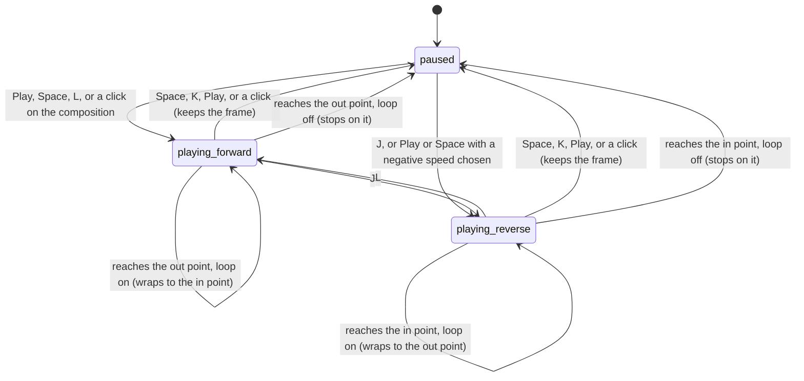

# The transport controls

## Summary

The transport controls start, stop, and steer playback of the active composition: play and pause, play in reverse, change speed, step frame by frame, jump back to the in point, loop, and set the volume. They are a row of buttons, a slider, and a menu at the left of the [timeline panel](../glossary.md#the-workspace), and the keyboard shortcuts Space, K, J, L, Shift+L, ←, →, and Home. Playback itself (the composition's frame advancing on its own) is the long-running state this document owns: how it starts, how fast and in which direction it runs, and how it ends at the edges of the [playback range](../glossary.md#the-preview). Every control except Loop is disabled until the player is [connected](../glossary.md#the-preview).

This document describes a composition the player can drive. A [clock-bound composition](../foundations/the-preview-player.md#clock-bound-compositions), which is what every template and every example that connects is, takes its frame from its own clock instead; read that section first when verifying.

## The controls

From left to right:

| Control | Tooltip | What it does |
| --- | --- | --- |
| ⏮ | "Rewind / Restart (Home)" | Goes to the in point. Playing continues from there; paused stays paused. |
| < | "Previous Frame (Left Arrow)" | Goes back one frame, not below frame 0. |
| ▶ or ❚❚ | "Play / Pause (Space)" | Plays if paused, pauses if playing. Shows ❚❚ on a lighter background while playing. At the end of the range, goes to the in point first and then plays. |
| > | "Next Frame (Right Arrow)" | Goes forward one frame, not past the composition's total frames. |
| 🔁 | "Toggle Loop" | Turns [loop](../glossary.md#the-preview) on or off. Blue while on. Works before the player is connected. |
| 🔊 or 🔇 | "Mute" or "Unmute" | Mutes or unmutes the composition. Shows 🔇 while muted or while the volume is 0. |
| Volume slider | "Volume: N%" | Sets the composition's volume from 0 to 100% in steps of 5%. |
| Speed menu | "Playback Speed" | Sets the [playback rate](../glossary.md#the-preview): ⏪ -4x, ⏪ -2x, ⏪ -1x, 0.25x, 0.5x, 1x, 2x, 4x. Does not start playback. |

Disabled controls show a not-allowed pointer but, read from the code, are not dimmed: their colors are set directly on each control, which overrides the browser's grey look for disabled buttons, so before connection the row looks exactly as it does after, apart from the volume slider, which the browser draws greyed (see [Open questions](#open-questions-and-verification)). The keyboard equivalents are owned by the [input model](../foundations/input-model.md#the-shortcut-map); what they do is described below.

## The simple case

The user presses Space. The composition starts playing forward at normal speed, the ▶ button becomes ❚❚, the playhead moves across the [timeline](the-timeline.md), and the timecode counts up. When the playhead reaches the out point (by default, the end of the composition) playback stops there, and the button shows ▶ again. Pressing ⏮ or Home goes back to the in point; pressing ▶ at the end does the same and plays again.

Pressing L plays forward too; pressing L again while it plays doubles the speed, up to 4x. J does the same in reverse. K pauses. With loop on, playback runs from the in point to the out point and wraps around until it is paused.

## The interaction, event by event

### Starting

Playback starts with:

- **The ▶ button.** If the current frame is at or within one frame of the end of the range (the out point, or the composition's total frames if there is no out point yet), it first goes to the in point. Then it plays at the current playback rate, which may be negative.
- **Space.** Plays at the current playback rate from wherever the playhead is. It never goes back to the in point first.
- **L.** Sets the rate to 1x and plays, unless playback is already running forward at 0.25x or faster (see [While ongoing](#while-ongoing)).
- **J.** Sets the rate to -1x and plays in reverse, unless playback is already running in reverse (see [While ongoing](#while-ongoing)).
- **A click on the composition.** The player's own toggle: plays at the current rate, or, within one frame of the composition's last frame, goes to frame 0 (not the in point) and plays. See [the preview player](../foundations/the-preview-player.md#the-player-inside-the-stage).

What is captured: nothing. Playback reads the current frame, the rate, the range, and loop afresh on every animation frame, so any of them can change while it runs. The button switches to ❚❚ at once. Before the player is connected, the buttons are disabled and the keys do nothing.

### Ending at once

Playback that is started where it cannot go anywhere ends on its first step:

- Space or L at the out point (or beyond it) with loop off: the composition starts, finds itself at the end, and stops on the out point (moving back to it from beyond). Read from the code, that first step is taken inside the play command itself, with no time elapsed, so for a composition connected through `window.helios` the button most likely never visibly changes; for one connected through `connectToParent`, whose state arrives by messages, ❚❚ may flash for a moment. The ▶ button does not have this problem, because it goes to the in point first.
- A click on the composition at the out point (with the out point before the end of the composition): the player's toggle looks only at the composition's end, not at the range, so it plays, and playback stops again at once on the out point, as with Space.
- J at the in point (or before it) with loop off: the same, stopping on the in point.
- A negative rate chosen in the speed menu, then ▶ at the in point: the same.

The other controls always end at once and never start playback:

- **⏮ and Home** go to the in point. Playing continues from there.
- **< and ←** go back one frame from the current frame, not below 0; **Shift+←** goes back ten. **> and →** go forward one, **Shift+→** ten, not past the composition's total frames. The playback range does not limit them: they step straight past the in and out points. If the current frame is fractional (it usually is after playback), the step keeps the fraction: from 45.73, → goes to 46.73.
- **K** pauses, or does nothing if already paused.
- **Mute and the volume slider** change the sound at once, playing or not.
- **The speed menu** changes the rate at once, playing or not, without starting playback.
- **Loop** turns on or off at once.

Each of these is a request to the composition; the playhead, the timecode, and the button states change when the composition answers, which is immediate for a connected composition.

### Becoming ongoing

Playback becomes ongoing at the first animation frame after it starts, when the current frame first advances. From then on the composition advances by the time that has passed since the previous animation frame, multiplied by the frame rate and the playback rate. Nothing is fixed at this moment: the rate, the range, and loop are all read again on the next frame.

### While ongoing

On every animation frame the current frame moves by the elapsed time times the frame rate times the rate. It moves in fractions of a frame; at 30 frames per second on a 60 Hz display it advances about half a frame per screen refresh. The playhead, the timecode, and the "Fr:" readout follow. The composition draws each new frame.

What can change while playing, and how:

- **The rate.** The speed menu applies its rate on the next animation frame. **L** while playing forward at 0.25x or faster steps the speed up: 0.25x to 0.5x, 0.5x to 1x, then doubling, up to 4x; at 4x it stays at 4x. L while playing in reverse switches to 1x forward. **J** while playing in reverse steps the reverse speed up the same way, from -1x to -2x to -4x; J while playing forward switches to -1x. Holding J or L repeats the step at the keyboard's repeat rate.
- **The position.** Every seek (a frame step, Home, ⏮, scrubbing, the timecode field, clicking a composition marker) moves the playhead, and playback continues from the new frame without pausing.
- **The range and loop.** A new in or out point, or loop turned on or off, takes effect on the next animation frame.
- **The sound.** The volume and mute apply at once.

Everything else in Studio stays usable: dialogs, panels, dragging on the stage or timeline, editing props (each change redraws the playing composition).

### Finishing

Playback ends in one of these ways:

- **Paused by the user**: Space, K, the ❚❚ button, or a click on the composition. The composition stops on the frame it had reached, which may be fractional. The playhead position is [remembered](../glossary.md#persistence) for the composition at that moment (see [the playback range](the-playback-range.md#how-the-range-is-remembered)).
- **Reaching the end with loop off.** Playing forward, when the next frame would reach the out point (or, with no range in effect, the composition's total frames), the composition stops exactly on the out point and pauses. Playing in reverse, it stops exactly on the in point (or frame 0). The out point is one past the last frame drawn by a render, so playback ends showing the moment the composition finishes. This also counts as a pause and is remembered.
- **Reaching the end with loop on.** Playback does not end: it wraps. Playing forward past the out point continues from the in point, carrying over the fraction it overshot; playing in reverse past the in point continues from the out point.
- **The composition goes away**: another composition is opened, the page is reloaded, or the composition errors. See [Cancel and interrupt](#cancel-and-interrupt).

Nothing is written to the project, and nothing can be undone. Pausing leaves the rate as it was: the next Space plays at the same rate, in the same direction.

**Playing from outside the range.** The range only stops or wraps playback at its edges; it does not move the playhead into it until playback reaches an edge. Playing forward from before the in point runs normally until the out point. Playing forward from after the out point jumps back at once to the out point and stops (loop off), or jumps into the range (loop on) at a place that depends on how far past the in point the playhead was: as far into the range as that distance leaves over after whole range lengths are taken away, so from frame 140 with a range of 30 to 90 it lands on frame 80. Playing in reverse from before the in point jumps forward at once to the in point and stops (loop off), or, with loop on, wraps into the range from its out end. Playing in reverse from after the out point runs normally down into the range. ▶ is the exception: anywhere from one frame before the out point onwards, including beyond it, it first goes to the in point.

## Modifiers

| Modifier | Set at the start | Changed while ongoing |
| --- | --- | --- |
| Shift | ← and → step ten frames instead of one. Shift+L toggles loop instead of playing. Space, J, K, and Home act as without Shift. No effect on the buttons. | Same: Shift+L toggles loop without changing the rate; Shift+→ jumps ten frames and playback continues from there. |
| Ctrl/Cmd | No effect on the buttons. With a letter, the letter's shortcut still fires: Ctrl/Cmd+K pauses (and opens the Omnibar), Ctrl/Cmd+L and Ctrl/Cmd+J play, alongside whatever the browser does with the combination. | Same. |
| Alt/Option | No effect on Windows and Linux. On a Mac, Option with J, K, or L types another character, so nothing happens; Option with an arrow still steps. | Same. |
| Keyboard focus | In a text field the keys are ignored (the field gets them). The speed menu and the volume slider are text fields: once focused, ← and → change them instead of stepping frames (the menu on Windows and Linux), Space opens the menu or does nothing on the slider instead of playing, and ↑ and ↓ do nothing (see [the input model](../foundations/input-model.md#keys-inside-fields-and-dialogs)). On a focused transport button, Space plays or pauses and Enter does nothing; neither presses the button. On the player, the player acts first: J and L also jump 10 seconds, Space at the end restarts from frame 0, K from paused does nothing. See [the input model](../foundations/input-model.md#keys-the-player-adds-when-it-has-keyboard-focus). | Same. |
| Playback | Space, J, and L behave differently when already playing, as described above. The ▶ button pauses when playing and plays when paused. | Not applicable: this document's interaction is playback itself. |
| Player connection | Before connection every control except Loop is disabled and the keys do nothing. Loop can be toggled and is applied on connection. | If the composition reloads while playing, Studio resumes playback after it reconnects, at 1x (see [Cancel and interrupt](#cancel-and-interrupt)). |

## Cancel and interrupt

| Event | Before it is ongoing | While ongoing |
| --- | --- | --- |
| Escape | No effect. | No effect; playback continues. |
| Another shortcut, click, or command | Acts as usual. | Seeks move the playhead and playback continues from there. Rate keys change the speed. I and O set points at the moving frame. Opening a dialog does not pause. Starting a client-side export pauses playback. |
| Composition switched | The new composition opens paused. | The old composition's playback and sound stop with it. Read from the code, the new composition starts playing once it connects, at 1x, because Studio carries over the playing state (see [the preview player](../foundations/the-preview-player.md#switching-compositions)). |
| Window loses focus | No effect. | Playback continues while the tab is visible. In a hidden tab the browser stops drawing, so the composition stops advancing; when the tab is shown again, the first step covers all the time that passed, so the playhead jumps forward by that much and then stops at the out point or wraps, as if the time had been played. |
| Pointer leaves the window | No effect. | No effect. |
| Server request fails or server stops | No effect. | No effect: the composition is already loaded. Media the composition loads later may fail. |
| Reload or tab closed | Nothing to lose. | Playback stops. The playhead position at that moment is remembered, and after the reload the composition opens paused there, at 1x. |
| Hot reload | No effect. | The composition reloads and Studio, once it reconnects, puts back the playhead position and resumes playing, but at 1x forward: a reverse or fast playback comes back as normal forward playback. Volume and mute go back to the composition's defaults. |
| Project changed on disk | No effect. | No effect unless the composition's own files change (a hot reload). |

After every interrupt except a hot reload and (read from the code) a switch, the composition is left paused. The rate, volume, and mute are never remembered: after a reload, a hot reload, or a switch they are the composition's defaults (normally 1x, 100%, unmuted).

## Interactions with other systems

**Files on disk.** None. Nothing here writes to the project.

**Browser storage.** Loop and the playhead position are part of the composition's remembered timeline state; the playhead position is written when playback pauses (by the user or at the end) and when the page closes. The rate, volume, and mute are not remembered.

**Undo.** None. Pausing keeps the frame; there is no way back to where playback started except ⏮ or Home (the in point).

**Playback range and loop.** Playback stops or wraps at the edges of the range. ⏮, Home, and ▶ at the end go to the in point. Frame steps ignore the range. With the range covering the whole composition (the default), the edges are frame 0 and the total frames. See [the playback range](the-playback-range.md).

**Input props.** Not affected. Props changed while playing redraw the composition on its next frame.

**Rendering and export.** The playback rate, volume, and mute affect only the preview. Server-side renders always render at normal speed. A client-side export pauses playback before it starts.

**Notifications.** None.

**Other tabs and agents.** Each Studio tab plays its own copy of the composition independently.

**Keyboard and accessibility.** Every button has a keyboard shortcut except mute (M works only when the player has focus); the buttons themselves can be reached with Tab but not pressed from the keyboard, because Studio cancels Enter and Space on them (see [keys Studio cancels everywhere](../foundations/input-model.md#keys-studio-cancels-everywhere)). The volume slider and the speed menu can be reached with Tab and changed with ← and → (the menu on Windows and Linux, or by opening it with Space); ↑ and ↓ do nothing in them. The buttons are labeled only by tooltips and by symbols (⏮, <, ▶, ❚❚, >, 🔁, 🔊, 🔇); the volume's tooltip states the percentage. The play state shows only as the ▶ or ❚❚ symbol and the button's background.

## Edge cases

- **Two "restart" rules.** ▶ at the end goes to the in point. Space at the end does nothing visible. A click on the composition at the end goes to frame 0. With an in point set, the three disagree.
- **A click in the last frame.** The player's toggle restarts from frame 0 whenever the composition is within one frame of its end, playing or not. A click meant to pause during the last frame of playback therefore restarts playback from the beginning instead.
- **A rate the menu does not list.** The speed menu shows the composition's current rate by matching it against its eight choices. A rate set some other way (by the composition's own code, for example 1.5) matches none, and the menu then shows no choice at all (read from the code).
- **Reverse with the ▶ button.** After choosing a negative speed in the menu, ▶ plays in reverse. At the in point it stops at once; ▶'s "go back to the in point" check looks only at the end of the range, not the direction.
- **The slow speeds.** 0.25x and 0.5x are reachable only from the speed menu; L from paused always starts at 1x, and J never produces a slow reverse speed.
- **Fractional frames.** After playback the current frame is usually fractional. The timecode shows it rounded down, "Fr:" rounded to nearest, and frame steps keep the fraction, so → from 45.73 shows timecode frame 46 and "Fr: 47".
- **Stepping at the edges.** < at frame 0 stays at 0. > at the composition's total frames stays there. The total frames is one past the last frame a render draws.
- **Volume 0 versus mute.** Dragging the volume to 0 shows 🔇 but does not mute; pressing the button then mutes, and the icon stays 🔇. Unmuting at volume 0 is still silent.
- **Holding a step key.** Holding → steps once per key repeat; holding Shift+→ jumps ten frames per repeat.
- **Rate shown in the menu.** The speed menu always shows the current rate, including after J and L change it.

## Open questions and verification

- All of this assumes a composition the player can drive. Verify first whether the examples and templates, which are clock-bound, respond to the transport at all (see [the preview player](../foundations/the-preview-player.md#clock-bound-compositions)).
- Confirm that a hot reload during reverse or fast playback resumes at 1x forward; the code restores only the playing state, not the rate. This may be worth treating as a bug.
- Confirm the jump after a hidden tab is shown again; the composition's clock measures real elapsed time between animation frames.
- Confirm whether ❚❚ flashes at all when Space or L is pressed at the out point with loop off; the code takes the first step inside the play command with no time elapsed.
- Confirm that disabled transport buttons and the speed menu look the same as enabled ones before the player connects (inline colors on every control in `Controls/PlaybackControls.tsx` override the browser's disabled look). If confirmed, this may be worth treating as a bug: nothing but the pointer says the controls are off.
- Confirm where loop puts the playhead when playback starts beyond the out point (read from the wrap in `onTick`, `packages/core/src/Helios.ts`: the overshoot past the in point modulo the range length), and that reverse playback from before the in point jumps forward to it.
- Confirm that a click on the composition during the last frame of playback restarts from frame 0 instead of pausing (the player's `togglePlayPause` checks the end before the playing state). This may be worth treating as a bug.
- Confirm what the composition's audio does at negative rates and at 0.25x; the code passes the rate to the composition's media but this was not traced further.
- Read from `Controls/PlaybackControls.tsx`, `Controls/PlaybackControls.test.tsx`, `GlobalShortcuts.tsx`, `GlobalShortcuts.test.tsx`, `context/StudioContext.tsx`, and `play`, `pause`, `seek`, and the per-frame step in `packages/core/src/Helios.ts`; not yet confirmed by hand.

Verified against helios commit `c2bfddb`
