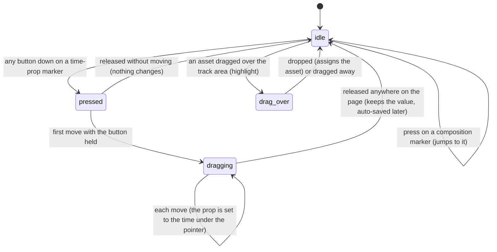

# Timeline tracks

## Summary

The timeline's composition track and audio lanes show what the active composition declares over time: its [captions](../glossary.md#the-preview), its [markers](../glossary.md#the-preview), the input props it marks as times, and its audio tracks. Three of these can be acted on from the timeline: pressing a composition marker jumps to it, dragging a time-prop marker changes that prop, and dropping a video or audio asset from the Assets panel onto the timeline assigns it to the composition. Everything here comes from the connected composition, so nothing is shown or accepted until the player is [connected](../glossary.md#the-preview).

The in and out markers on the same track are owned by [the playback range](the-playback-range.md); scrubbing, snapping, and zoom by [the timeline](the-timeline.md).

## What the tracks show

| Item | Where | Looks like | Pointing at it |
| --- | --- | --- | --- |
| Caption cue | Composition track | A green bar, 18 pixels tall and 70% opaque, from the cue's start to its end, at least 0.5% of the timeline wide | Nothing: no tooltip, and a press goes through it to the timeline (a scrub) |
| Composition marker | Composition track | An 8-pixel diamond at the marker's time, in the marker's own color or orange if it has none | Grows and gets a white edge; tooltip "{label} ({id})"; a press jumps to it |
| Time-prop marker | Composition track | A cyan 8-pixel diamond at the prop's value | Grows and gets a white edge; sideways-resize pointer; tooltip "{label} ({timecode})"; a press starts a drag |
| Audio track | Its own lane below the composition track, one lane per track, 24 pixels tall | A pink bar, 70% opaque, from the track's start for its duration, with a dark waveform inside | Nothing: no tooltip, and a press goes through to the timeline (a scrub) |

A **time prop** is an input prop that the composition's [schema](../glossary.md#the-preview) declares as a number with the format "time", and whose current value is a number; its value is in seconds. Its tooltip label is the schema's label for it, or its name.

The **waveform** is drawn from the audio file's first channel, at 200 peaks per second, fitted to the bar's width at the current timeline zoom. It appears once the file has been downloaded and decoded; until then, or if that fails, the bar is plain pink. A file's waveform is kept for as long as the page is open.

Items are stacked: the in and out markers above time-prop markers, above composition markers, above caption bars, above audio bars. An item before frame 0 or after the total frames is drawn at the nearest end of the timeline.

## The simple case

A composition's schema declares a time prop "Title In", currently 1.0 second. A cyan diamond sits at one second on the composition track. The user drags it to two seconds: the composition redraws with the title coming in later, the diamond's tooltip reads "Title In (00:00:02:00)", and the Props Editor's field for it shows the new time. Once the composition is paused and a second passes with nothing else changing in Studio, the [auto-save](../glossary.md#the-preview) writes the change into the composition's default props.

Pressing an orange diamond moves the playhead to that marker. Dragging a song from the Assets panel and dropping it on the timeline at three seconds gives the composition's audio prop the song's address, and its matching time prop the value 3.

## The interaction, event by event

The time-prop drag is narrated in full. Pressing a composition marker and dropping an asset both end at once.

### Starting

**A time-prop marker** is pressed with any mouse button. The press does not change the prop, does not seek, and does not move keyboard focus.

**A composition marker** is pressed with any mouse button. Studio seeks at once to the marker's time, without snapping and without rounding, so a marker at 1.23 seconds at 30 frames per second puts the playhead between frames, at 36.9 (the timecode shows frame 36, "Fr:" 37). This press, unlike others on the timeline, moves keyboard focus as on any web page, so a text field that had focus loses it. It does not start a scrub.

**An asset drag** enters the track area. The timeline's scrolling area gets a dashed blue outline and a faint blue tint while anything is dragged over the track area, including a desktop file or an image that will not be accepted. Only the track area takes the drop: over the empty background below it (see [the timeline](the-timeline.md#edge-cases)) the highlight goes out and the drop is refused, and read from the code the highlight can blink off and on as the pointer crosses from one lane or marker to another.

### Ending at once

- **A time-prop marker pressed and released without moving** changes nothing.
- **A composition marker** is done once pressed: the playhead is on the marker, and playing continues from there.
- **An asset dropped** on the track area is assigned if all of these hold: the player is connected; the item came from the Assets panel; it is a video or an audio asset; and the composition's schema has a prop of that type. Studio then sets the first such prop, in the schema's order, to the asset's address, and, if the schema also has a prop with the same name plus "Time" (`backgroundVideo` and `backgroundVideoTime`) or a prop named exactly `time`, sets that one to the drop position in seconds (rounded to a whole frame, not snapped); when it has both, whichever comes first in the schema gets it. Every other prop keeps its value. The composition checks the result like any other change, so the whole drop is refused, and nothing changes, if the address does not fit the prop (an extension its schema does not accept) or the time prop is not a number in the schema. In any other case nothing happens. A desktop file dropped here is taken from the browser, so it is not opened in place of Studio, but it is not uploaded either. Either way the highlight disappears, and no toast appears. The playhead does not move.

### Becoming ongoing

The time-prop drag becomes ongoing at the first mouse move with the button held, of any distance, anywhere on the page.

### While ongoing

On every mouse move anywhere on the page, the frame under the pointer is worked out from its horizontal position, [snapped](the-timeline.md#snapping) unless Shift is held, and turned into seconds; Studio sends the composition that one prop with that value. The diamond, its tooltip, and the Props Editor's field follow, and the composition redraws. The playhead does not move.

Two things follow from how the value is sent and snapped, both read from the code:

- **Other props are dropped.** Studio sends the composition only the dragged prop, and the composition replaces its whole set of input props with what it is sent. Every other prop is lost on the first move: a prop the schema gives a default goes back to that default, a prop outside the schema disappears, and a required prop without a default makes every move fail, so the drag does nothing. The Props Editor then shows the reduced set. This is a suspected high-severity bug (see [Open questions](#open-questions-and-verification)).
- **The marker sticks to itself.** The prop's own current value is one of the snap points, so the diamond does not follow small movements: it stays put until the pointer is more than 10 pixels from it, then jumps to the pointer. It trails the pointer in steps of about 10 pixels. Holding Shift makes it follow exactly.

### Finishing

Releasing the button anywhere on the page ends the drag with the prop at its last value. The Props Editor's auto-save later writes all the current input props into the composition's `composition.json` as its default props and shows a "Composition updated" toast: read from the code, one to a few seconds after the last move while the composition is paused, not at all while it plays, and never for a clock-bound composition while its tab is visible (see [the Props Editor](../props/the-props-editor.md#while-ongoing)). There is no undo.

## Modifiers

| Modifier | Set at the start | Changed while ongoing |
| --- | --- | --- |
| Shift | Time-prop drag: no effect on the press. Composition marker: no effect. Asset drop: no effect. | Time-prop drag: read on every move; Shift turns snapping off from the next move, which also stops the marker sticking to itself. |
| Ctrl/Cmd | No effect. | No effect. |
| Alt/Option | No effect. | No effect. |
| Keyboard focus | A time-prop press leaves focus where it was. A composition-marker press takes focus out of a text field. A drop does not change focus. | No effect; keys go wherever focus is. |
| Playback | A drag or drop while playing changes the prop live; the composition plays on with each new value. A marker press while playing jumps and playing continues. | Same. |
| Player connection | Before connection none of these items is drawn for the composition being opened, and a drop does nothing. Right after a switch, the previous composition's items stay on the timeline until the new one connects. | If the composition reloads during a drag, Studio restores the last props it saw, and the next move sets the prop on the reloaded composition. |

## Cancel and interrupt

The columns are for the time-prop drag. A composition-marker press and an asset drop end at once; for them every row is "no effect" except as noted after the table.

| Event | Before it is ongoing | While ongoing |
| --- | --- | --- |
| Escape | No effect. | No effect; the drag continues and the prop is not put back. |
| Another shortcut, click, or command | Acts as usual. | Shortcuts act and the drag continues. |
| Composition switched | No effect on the prop. | Only possible from the keyboard (Ctrl/Cmd+K, then Enter) while the button is held. The old diamond disappears when the new composition connects, but the drag continues: each move sends the same prop name to the new composition, which replaces the new composition's props in the same way. |
| Window loses focus | No effect. | Studio does not notice. If the button is released in another window, the drag continues when the pointer comes back, with no button held, until the next release anywhere on the page. |
| Pointer leaves the window | No effect. | The drag continues while the browser keeps reporting the pointer, pinned at frame 0 or the total frames beyond the timeline's ends. |
| Server request fails or server stops | No effect. | No effect on the drag. The auto-save after it fails, with an error toast. |
| Reload or tab closed | Nothing to lose. | The value is lost unless the auto-save has already written it, which needs the composition paused and a second or more since the last move. |
| Hot reload | No effect. | The composition reloads with the last props Studio saw, including the dragged value; the drag continues. |
| Project changed on disk | No effect. | No effect. |

A **composition-marker press** is unaffected by every row: it has already jumped. An **asset drag over the timeline** is cancelled by Escape, as every browser drag is; otherwise it is unaffected until it is dropped, and a drop during a hot reload or before connection does nothing.

## Interactions with other systems

**Files on disk.** A time-prop drag and an asset drop change input props, which the Props Editor's auto-save writes into the composition's `composition.json` once its wait is over. See [the project and compositions](../foundations/project-and-compositions.md#composition-metadata).

**Browser storage.** None. Waveforms are kept in memory for the page's life only.

**Undo.** None. A dragged or dropped prop can only be changed back by hand, in the Props Editor or by another drag.

**Playback range and loop.** Composition markers, caption starts and ends, and time props are snap points for scrubbing and for dragging the in and out markers. Pressing a composition marker jumps to it whether or not it is inside the range.

**Input props.** A time-prop drag and an asset drop change them, and the drag (read from the code) drops the others. The Props Editor shows each change at once.

**Rendering and export.** Renders and exports started afterwards use the props as they are then, including what a drag or drop set.

**Notifications.** None directly. The auto-save that follows a drag or drop shows "Composition updated".

**Other tabs and agents.** Each tab has its own copy of the props. Auto-saves from different tabs write the same file; the last one wins.

**Keyboard and accessibility.** None of these can be reached or operated from the keyboard. Time props can be typed in the Props Editor instead. Caption cues and audio tracks have no tooltip or text equivalent on the timeline.

## Edge cases

- **Two video props.** A dropped video always goes to the first video prop in the schema's order; there is no way to choose another by dropping.
- **The `time` fallback.** A schema prop named exactly `time` receives the drop position for any dropped video or audio, whether or not it belongs to that asset, and wins over a matching `{name}Time` prop that comes after it in the schema.
- **Stale markers do nothing.** After a switch, the previous composition's composition markers stay on the timeline until the new composition connects; pressing one then seeks nothing, because no composition is connected, although it still takes focus out of a text field.
- **A marker between frames.** A composition marker whose time does not fall on a frame leaves the playhead between frames, and the timecode and "Fr:" then disagree (see [the timeline](the-timeline.md#edge-cases)).
- **Items outside the composition.** A marker, cue, or time prop before frame 0 or after the end is drawn at the nearest end of the timeline. Dragging a time-prop marker drawn at the end brings it back within the composition.
- **Stale items.** After a switch, the previous composition's captions, markers, time props, and audio lanes stay on the timeline until the new composition connects; a new one that never connects keeps showing them.
- **A replaced audio file.** The waveform of a file that changes on disk keeps its old shape until the page is reloaded.
- **Overlapping diamonds.** A time-prop marker covers a composition marker at the same time; the in and out markers cover both.
- **Focus from a marker press.** Pressing a composition marker takes focus out of a text field, while pressing anywhere else on the timeline does not.

## Open questions and verification

- Confirm that dragging a time-prop marker drops every other input prop (or resets it to its schema default), and that the auto-save then writes the reduced props into `composition.json`. `Timeline.test.tsx` confirms that only the dragged prop is sent; the composition replacing its props with what it is sent is read from `packages/core/src/Helios.ts` and `schema.ts`. If confirmed, this is a high-severity bug.
- Confirm that time-prop markers, and the in and out markers in [the playback range](the-playback-range.md#while-ongoing), stick to their own position and move in steps of about 10 pixels unless Shift is held.
- Confirm that caption bars and audio bars show no tooltip, although each is given one in the code.
- Confirm that the previous composition's items stay on the timeline after a switch until the new composition connects.
- Confirm the drop rules with a schema that has a video prop and a matching time prop, and with one that has neither. Confirm also that a schema with both `time` and `{name}Time` gives the drop position to whichever comes first (`Timeline.tsx`, `handleDrop`, finds the first key matching either name), and that a drop whose time prop is declared as text, or whose address the video prop's accepted extensions refuse, changes nothing at all.
- Confirm that a drop on the empty background below the track area is refused (only the track area listens for drops) and whether the highlight blinks while dragging across lanes and markers (the area's drag-leave fires for every element the pointer leaves). The blinking and the dead background may be worth treating as bugs.
- Read from `Timeline.tsx`, `Timeline.css`, `Timeline.test.tsx`, `TimelineAudioTrack.tsx`, `TimelineAudioTrack.test.tsx`, and `hooks/useAudioWaveform.ts`; not yet confirmed by hand.

Verified against helios commit `c2bfddb`
