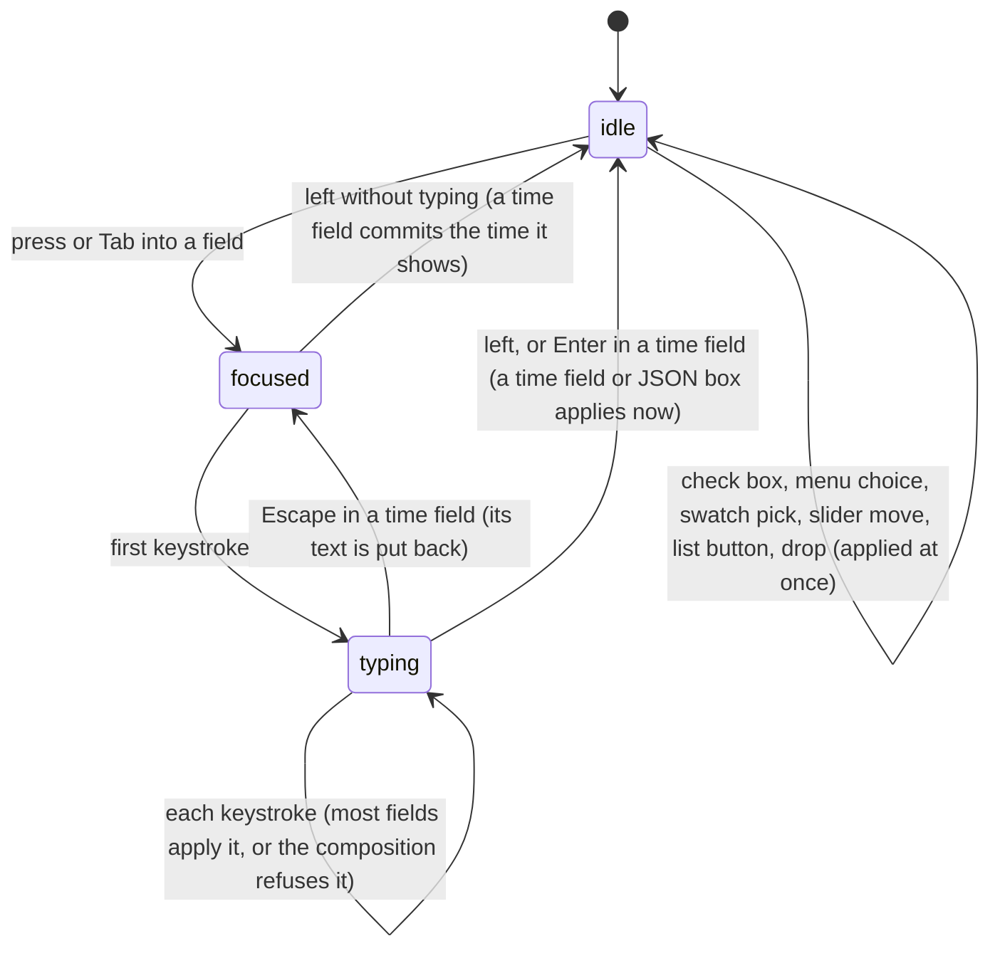

# Prop fields

## Summary

A [prop field](../glossary.md#the-preview) is the control in a row of [the Props Editor](the-props-editor.md) that shows one input prop and changes it. Which field a prop gets is decided by the composition's [schema](../glossary.md#the-preview) when the schema lists the prop, and otherwise by the kind of value the prop holds. Most fields apply each change to the composition as it happens, keystroke by keystroke; the time field and the JSON box wait until the user leaves them. The composition checks every change against its schema and refuses a value that does not fit. Studio marks some of those values with a red outline and a tooltip, snaps some fields back, and otherwise says nothing. Fields exist only while the player is [connected](../glossary.md#the-preview).

This document owns each kind of field, how a value is checked, and what dropping something onto a field does. The rows, groups, Copy JSON, Reset, and the auto-save that writes changes to disk are owned by [the Props Editor](the-props-editor.md).

## The simple case

A composition's schema declares `opacity` as a number from 0 to 1, `headline` as a string, `accent` as a color, and `titleIn` as a number with the format "time". The Props Editor shows a slider with a small number box for opacity, a text box for headline, a color swatch beside a text box for accent, and a dark timecode box reading `00:00:01:00` and "30fps" for titleIn.

Dragging the opacity slider redraws the composition continuously. Typing in the headline box redraws it on every keystroke. Clicking the swatch opens the browser's color picker, and every color picked redraws it. Clicking into the timecode box, typing `00:00:02:15`, and pressing Enter sets titleIn to 2.5 seconds; the cyan diamond for it on the timeline moves to match (see [timeline tracks](../playback/timeline-tracks.md#what-the-tracks-show)). Each change is then [auto-saved](../glossary.md#the-preview) as [the Props Editor](the-props-editor.md#while-ongoing) describes.

## Which field a prop gets

### When the schema lists the prop

The schema's declared type decides, except that any prop with a list of allowed values (`enum`) gets a drop-down menu whatever its type.

| The schema declares | Field | Applied |
| --- | --- | --- |
| A list of allowed values (`enum`) | Drop-down menu of the values | On choosing |
| `string` | Text box. With a format: `date` a date picker, `time` a clock-time picker (hours and minutes, not a timecode), `date-time` a date-and-time picker, `email` an email box, `uri` or `url` an address box, `color` a color swatch alone | Each keystroke or pick |
| `number` | Number box. With both a minimum and a maximum, a slider with a 60-pixel number box beside it | Each keystroke, arrow step, or slider move |
| `number` with the format `time` (a [time prop](../glossary.md#the-preview)) | [Time field](#the-time-field) | On Enter or leaving |
| `boolean` | Check box with "True" or "False" beside it | On click |
| `color` | Color swatch, 30 pixels square, beside a text box | Each pick or keystroke |
| `image`, `video`, `audio`, `font`, `model`, `json`, `shader` | [Asset field](#asset-fields) | Each keystroke, suggestion, or drop |
| `object` with `properties` | [Nested rows](#lists-and-nested-objects), one per property | As each nested field |
| `array` with `items` | [A list](#lists-and-nested-objects), one field per item | As each item's field; the buttons at once |
| `object` without `properties`, `array` without `items` | [JSON box](#json-boxes) | On leaving |
| `int8array`, `uint8array`, `uint8clampedarray`, `int16array`, `uint16array`, `int32array`, `uint32array`, `float32array`, `float64array` | JSON box holding a plain list of numbers | On leaving |
| Any other type | "Unsupported schema type: {type}", which cannot be edited | Never |

A number box and a slider use the schema's `step`; without one the slider moves in hundredths of its range and the number box in steps of 1 (typed decimals are still accepted). A text box with a maximum length stops accepting characters at that length.

### When the schema does not list the prop

A prop the schema does not list, and every prop of a composition without a schema, gets an inferred field, chosen from its current value:

| The value is | Field | Applied |
| --- | --- | --- |
| A number | Number box, with no slider, limits, or step | Each keystroke or arrow step |
| `true` or `false` | Check box with "True" or "False" | On click |
| Text of exactly 4 or 7 characters starting with `#` | Color swatch beside a text box | Each pick or keystroke |
| Any other text | Text box that accepts dropped text | Each keystroke or drop |
| `null`, an object, a list, or a typed array | JSON box | On leaving |
| Anything else (a function, `undefined`) | "Unsupported type: {type} ({value})", which cannot be edited | Never |

The choice is made again on every change, so an inferred field changes kind when its value does: a number put into a JSON box turns the row into a number box, and text that comes to look like a color turns a text box into a color field (see [Edge cases](#edge-cases)).

## How a value is checked

A value meets two checks, independently.

**Studio's own check**, in the fields the schema makes for `string` props (text boxes, pickers, email and address boxes) and for `number` props other than time props (number boxes), including nested ones and list items, and nowhere else. Text shorter than the schema's minimum length shows "Too short", longer than its maximum "Too long", and not matching its pattern "Pattern mismatch"; a number below the minimum shows "Value too low" and above the maximum "Value too high". The box turns red (a red border and a pale red background) and the message becomes its tooltip. A text box with a pattern otherwise has the tooltip "Must match pattern: {pattern}". This check only marks the box; it does not stop the value from being sent.

**The composition's check.** Every change is sent as the whole set of input props with one value replaced, and the composition checks the whole set against its schema: each listed prop's type (colors and assets must be text), length, pattern, accepted extensions, color format (`#rgb`, `#rgba`, `#rrggbb`, `#rrggbbaa`, `rgb(...)`, `rgba(...)`, `hsl(...)`, or `hsla(...)`), allowed values, minimum and maximum, number of items, and nested properties. If anything fails, the whole change is refused: the composition keeps the last set it accepted, the preview does not change, nothing is saved, and nothing tells the user (the browser's console has the error). Props the schema does not list are never checked, so an inferred field is never refused. A number box that is emptied sends "not a number", which passes every check, limits included.

What the field shows after a refused change depends on the field:

| Field | After a refused change |
| --- | --- |
| Text box, number box, date and clock-time pickers, email and address boxes | Keeps what was typed, red if Studio's own check also fails. The preview goes on showing the last accepted value until the typed one is accepted. |
| Asset field, color field's text box and swatch, check box, drop-down menu | Snaps back to the accepted value at once; the keystroke or choice seems to be ignored. |
| Time field | Goes back to the accepted time when it is left, with no error shown. |
| JSON box | Turns red and keeps the text. |
| List and object buttons ("+ Add Item", ↑, ↓, Remove) | Nothing happens. |

Three consequences are easy to run into:

- **An asset field that accepts only some extensions cannot be typed into.** Every partly typed address lacks the extension, so each keystroke is refused and the field snaps back. Only a suggestion, a pasted complete address, or a drop works.
- **A color field's text box takes only edits that leave a complete color.** Deleting or adding a character usually makes an invalid color and is refused. Pasting a complete color, overtyping a digit with a digit, and the swatch work.
- **A number box applies the numbers on the way.** Typing 150 into a box limited to 0 to 100 applies 1, then 15, and then refuses 150, leaving the box red at 150 and the composition at 15.

## The interaction, event by event

The interaction narrated here is typing into a field. Check boxes, drop-down menus, the swatch, the slider, list buttons, and drops end at once.

### Starting

A field starts being edited when it is pressed or reached with Tab. It takes keyboard focus and a blue outline (the time field's dark box gets a blue edge), and Studio's shortcuts stop acting, except Ctrl/Cmd+K, until it is left; check boxes, sliders, swatches, and menus count as text fields for this (see [the input model](../foundations/input-model.md#keyboard-focus-and-who-receives-a-key)). From this moment a time field stops following its prop: if the prop changes elsewhere while the field has focus, the field keeps showing what it showed. Nothing else is captured.

### Ending at once

Leaving a field without typing applies nothing in most fields. Two exceptions:

- **A time field commits the time it shows**, which is the prop rounded to the nearest whole frame. A prop of 1.01 seconds at 30 frames per second shows `00:00:01:00`, and leaving the field sets it to exactly 1 second.
- **A JSON box re-formats** its text with two-space indentation; the value is unchanged.

The controls that act in one step end at once:

- **A check box** toggles and applies; the word beside it changes to "True" or "False". Clicking the word toggles it too.
- **A drop-down menu** applies the chosen value. When the menu's first value is a number, every choice is applied as a number; otherwise as text.
- **The swatch** opens the browser's color picker; every color picked in it applies at once as `#rrggbb`.
- **The slider** applies its value on the press and on every move while it is dragged, under the browser's own rules for range sliders.
- **The list buttons** apply their change at once (see [Lists and nested objects](#lists-and-nested-objects)).
- **A drop** applies at once (see [Dropping onto a field](#dropping-onto-a-field)).

### Becoming ongoing

The first keystroke. In a field that applies as it goes, that keystroke's value is sent at once and the composition redraws, or refuses it. In a time field or a JSON box only the text changes; nothing is sent yet.

### While ongoing

In a field that applies as it goes, every keystroke sends the field's whole new value. The browser's own editing keys work: ← and → move the caret, paste replaces the selection, and undo puts back earlier text, each change being sent like a keystroke. ↑ and ↓ do nothing, not even in a number box, a date or clock-time picker, or a slider, because Studio cancels them everywhere (see [keys Studio cancels everywhere](../foundations/input-model.md#keys-studio-cancels-everywhere)); a number box still steps with the small arrows that appear in it under the pointer. If the prop is changed from elsewhere while the user types (a hot reload putting the props back, for instance), a text or number box takes the new value; a time field does not.

In a time field and a JSON box, typing changes only the text. Nothing is checked until the field is left.

### Finishing

A field that applies as it goes has nothing left to do when it is left: the composition already has the last accepted value.

A time field commits on Enter or on leaving it (a click elsewhere, Tab); see [the time field](#the-time-field). Enter also takes focus out of it, so Studio's shortcuts act again at once. A JSON box commits on leaving; see [JSON boxes](#json-boxes).

Every applied change is then saved by the Props Editor's [auto-save](the-props-editor.md#finishing).

## The time field

A time prop's field is a dark box showing the prop as a [timecode](../glossary.md#the-preview), `HH:MM:SS:FF`, at the composition's frame rate (30 while it is unknown), with the frame rate in small gray type at its right ("30fps"). It shows the prop rounded to the nearest whole frame, unlike the timeline's [timecode field](../playback/the-timeline.md#the-timecode-field), which rounds the current frame down. It is a different field from that one and accepts different input.

**What it accepts.** On Enter or leaving, the text must be either exactly two digits, colon, two digits, colon, two digits, colon, two digits (`00:00:02:15`), or digits only, read as a number of frames (`90` is 3 seconds at 30 frames per second). The prop is set to that many frames divided by the frame rate, in seconds. The parts are not checked against their usual ranges: `00:00:01:45` at 30 frames per second is 2.5 seconds, and `00:00:99:00` is 99 seconds. Anything else (`2:15`, `00:00:02`, `2.5`, `-5`, empty text) changes nothing, and the field goes back to the time it showed.

**Refused times.** A time the composition refuses (below the schema's minimum, above its maximum) also changes nothing and the field goes back to the time it showed. Neither case shows an error: the field has a red style for invalid input, but read from the code it is cleared in the same moment it is set (see [Open questions](#open-questions-and-verification)).

**Escape** puts back the time the field showed and discards what was typed, but leaves keyboard focus in the field; leaving it afterwards commits that time, which rounds the prop to the nearest whole frame.

**Every commit applies.** Leaving the field always sends a value, even an unchanged one, so a prop that was not on a whole frame is moved onto one.

**The timeline.** A time prop with a number value also shows as a cyan diamond on the timeline, which can be dragged; [timeline tracks](../playback/timeline-tracks.md#while-ongoing) owns that drag. The time field follows the drag unless it has keyboard focus (see [Cancel and interrupt](#cancel-and-interrupt)).

## JSON boxes

A JSON box is a text area in a monospace font, at least 80 pixels tall, that can be made taller by dragging its bottom-right corner. Long lines do not wrap; the box scrolls sideways. It holds the prop as JSON indented with two spaces.

Typing changes only the text. Enter does not start a new line, because Studio cancels Enter everywhere (see [keys Studio cancels everywhere](../foundations/input-model.md#keys-studio-cancels-everywhere)), and ↑ and ↓ do not move between lines; a multi-line value has to be pasted or typed on one line, and the box re-formats it when it is left. On leaving the box:

- **Text that is not valid JSON** turns the box red (border and background). The text is kept, nothing is applied, and the box stays red until it is left with valid JSON.
- **Valid JSON equal to the current value** is only re-formatted.
- **Valid JSON with a new value** is applied and re-formatted. If the composition refuses it (a list typed into the box of a prop declared as an object, a list with fewer items than the schema's minimum), the box turns red as for invalid JSON.

A **typed-array box** shows the typed array as a plain list (`[1, 2, 3]`). On leaving, valid JSON that is not a list is ignored without an error. A list is turned into a typed array of the declared kind, the way such arrays always convert: fractions are dropped for whole-number kinds, values out of range wrap round (300 in an `int8array` becomes 44), a `uint8clampedarray` clamps to 0 to 255, and an item that is not a number is converted the way JavaScript converts it to one (`"5"` becomes 5, `true` becomes 1, `"a"` becomes 0 in a whole-number kind and "not a number" in `float32array` and `float64array`).

**When the prop changes elsewhere.** A JSON box for a prop the schema lists replaces its text with the prop's value whenever the composition's value changes, even mid-typing. A JSON box for a prop the schema does not list does so only when the value's content changes, and clears its red state when it does. Read from the code, a typed-array box replaces its text every time the Props Editor is redrawn, which is about every second while paused and on every frame while playing or for a clock-bound composition, so typing into it is undone almost at once (see [Open questions](#open-questions-and-verification)).

## Asset fields

An asset field is a text box with the placeholder "Select {type} or enter URL..." (`Select image or enter URL...`). It holds an address. Typing into it applies on every keystroke, as in a text box.

**Suggestions.** The browser offers the project's [assets](../foundations/project-and-compositions.md#assets) of the field's type as suggestions, each showing the asset's address and file name, filtered by what has been typed; in Chromium the list opens on clicking into the box; ↓, which would normally open it, is cancelled by Studio (see [keys Studio cancels everywhere](../foundations/input-model.md#keys-studio-cancels-everywhere)). When the schema lists accepted extensions (`accept`), only assets whose address ends in one of them are offered. The suggestions come from the same asset list as [the Assets panel](../assets/the-assets-panel.md), from every folder at once, read when the page loads and after every asset change made in Studio, so a file added on disk is not offered until then. Choosing a suggestion applies its address.

**What is stored** is the asset's address as Studio serves it: `/logo.png` for `public/logo.png` in a project with a `public/` folder, otherwise `/@fs/` followed by the file's absolute path on disk. An address typed by hand is accepted whether or not the file exists.

**Dropping.** See [Dropping onto a field](#dropping-onto-a-field).

## Lists and nested objects

**A list** shows each item in a light gray box: the item's own field, chosen from the schema's item type, with no name, and three buttons to its right:

- **↑** (tooltip "Move Up") swaps the item with the one above; disabled on the first item.
- **↓** (tooltip "Move Down") swaps it with the one below; disabled on the last item.
- **Remove** (tooltip "Remove Item") deletes it; disabled on every item while the list has no more items than the schema's minimum.

Under the items, "+ Add Item" adds an item at the end, holding the schema's default for items, or an empty value of the item type: empty text, 0, false, an empty object, an empty list, `#000000` for a color, empty text for an asset. The button is not shown while the list has as many items as the schema's maximum. Each button applies its change at once. If the composition refuses the result (an empty text item where items need a minimum length, an empty item in a list of drop-down menus), the button does nothing.

**A nested object** shows one row per property the schema lists, in the schema's order, indented, with a gray line down its left. Each row has the property's label or name (without a description tooltip) and its own field, chosen the same way as a top-level prop's, so objects and lists can nest. A property with no value shows the schema's default, or an empty value, but that value is not part of the prop until one of the object's fields is changed. Changing a nested field sends the whole object with that property replaced; properties the object holds that the schema does not list are kept, though not shown.

A time prop inside an object or a list gets a time field but no diamond on the timeline, which shows only top-level time props.

## Dropping onto a field

Three kinds of field are [drop targets](../glossary.md#interactions) for the browser's drag and drop (see [the input model](../foundations/input-model.md#drag-and-drop); dragging from the Assets panel is described in [asset actions](../assets/asset-actions.md)). While something is dragged over one, it gets a blue border and a faint blue tint.

| Field | An asset from the Assets panel | A folder from the Assets panel | Text dragged from outside Studio | A file from the desktop |
| --- | --- | --- | --- | --- |
| Asset field | Of the field's type: the field is set to its address. Of another type: nothing. | Nothing | The field is set to the text | Nothing |
| A text box the schema lists, of any format, including the date and clock-time pickers and the swatch of a `string` with the format `color` | The field is set to its address, whatever its type | Nothing | The field is set to the text | Nothing |
| An inferred text box | The field is set to its address, whatever its type | Nothing | The field is set to the text | Nothing |

A drop replaces the whole value; it does not insert at the point of the drop. It applies at once, like a keystroke, and can be refused like one: an asset whose extension the schema does not accept snaps the asset field back, and dropped text longer than a text box's maximum length is kept in the box, red, and refused. A file from the desktop dropped on one of these fields does nothing, and the browser does not open it.

Other fields (number boxes, the time field, JSON boxes, the color field's text box, check boxes, menus) are not drop targets; what the browser does with a drop on them, typically inserting dragged text into a box that takes text, is left to the browser.

## Modifiers

| Modifier | Set at the start | Changed while ongoing |
| --- | --- | --- |
| Shift | No effect from Studio. Shift+Tab moves to the previous field; Shift with ← and → selects text in a text box. | No effect from Studio. |
| Ctrl/Cmd | Ctrl/Cmd+K opens the Omnibar from any field, which takes focus and so leaves the field: a time field commits the time it shows. Paste (Ctrl/Cmd+V) is the way to enter a complete color or address in one change. | Ctrl/Cmd+K leaves the field the same way, committing what was typed in a time field or JSON box. The browser's editing keys act on the text. |
| Alt/Option | No effect. | No effect. |
| Keyboard focus | Every field counts as a text field, so Studio's shortcuts are ignored while it has focus, except Ctrl/Cmd+K. Space toggles a focused check box and opens a focused menu or swatch instead of playing; ← and → move a focused slider or the caret, or change a closed menu's choice on Windows and Linux, instead of stepping frames; ↑ and ↓ do nothing. The list buttons ("+ Add Item", ↑, ↓, Remove) are buttons, not fields: Enter and Space do not press them, and Space plays or pauses. | Leaving the field (Tab, a click elsewhere, Enter in a time field) gives the shortcuts back. |
| Playback | Fields work the same while playing; a change shows on the next frame drawn. A time field shows its prop, not the playhead. | No effect. |
| Player connection | No field exists before connection; the Props Editor shows "No active controller". | A hot reload keeps the field, its focus, and its text; Studio puts back the props it last saw (see [the preview player](../foundations/the-preview-player.md#hot-reload)). |

## Cancel and interrupt

"Before it is ongoing" means a field has focus and nothing has been typed; "while ongoing" means the user is typing in it.

| Event | Before it is ongoing | While ongoing |
| --- | --- | --- |
| Escape | No effect; the field keeps focus. | In a time field, puts back the time it showed and discards what was typed; focus stays, and leaving later commits that time. In any other field, no effect: what was typed has already been applied (or, in a JSON box, waits for leaving). |
| Another shortcut, click, or command | Shortcuts are ignored except Ctrl/Cmd+K. A click anywhere that takes focus leaves the field; a time field commits the time it shows. A press on the timeline's track area or on a time-prop marker does not take focus. | Same, committing what was typed in a time field or JSON box. If a time-prop marker is dragged on the timeline while that prop's time field has focus, the field keeps its old text, and leaving it afterwards puts the old time back over the drag (suspected bug). |
| Composition switched | Switching takes focus (the Omnibar, a click in the sidebar), so the field is left first: a time field commits to the composition being left. The fields then disappear until the new composition connects. | Same; a time field or JSON box commits what was typed to the composition being left, if that composition accepts it. What happens to the pending save is in [the Props Editor](the-props-editor.md#cancel-and-interrupt). |
| Window loses focus | Studio does not notice, but the browser reports the field as left, so a time field commits the time it shows (Chromium's usual behavior, to confirm; see [the input model](../foundations/input-model.md#the-interrupt-rows)). | Same; a time field or JSON box commits what was typed. |
| Pointer leaves the window | No effect. | No effect. A slider being dragged follows the browser's own rules. |
| Server request fails or server stops | No effect; fields talk only to the composition. | No effect on the field. Only the auto-save fails. |
| Reload or tab closed | Nothing to lose. | Text typed in a time field or JSON box is lost; changes already applied are lost too unless the auto-save had run. |
| Hot reload | The field keeps focus; its prop is put back. | The field keeps its text; leaving a time field or JSON box commits it to the reloaded composition. |
| Project changed on disk | No effect. An asset field does not offer files added on disk until Studio re-reads its asset list. | No effect. |

After any interrupt the field shows the prop as the composition holds it, except a time field that still has focus, which shows what it showed when it took focus.

## Interactions with other systems

**Files on disk.** None directly; applied changes reach `composition.json` through the Props Editor's auto-save. Asset fields store an address and neither copy nor check the file; a deleted or misspelled file's address is accepted.

**Browser storage.** None.

**Undo.** None beyond the browser's own undo of typing inside a box, each step of which is applied as a change, and Escape in a time field before it is left.

**Playback range and loop.** No interaction. A time field accepts any time, inside or outside the playback range or the composition's length, unless the schema's limits refuse it.

**Input props.** Every field changes one prop by sending the whole set with that prop replaced, and shows the prop as the composition holds it, except a focused time field and a JSON box being typed in.

**Rendering and export.** None directly. Renders and exports started afterwards use the props as they are then (see [the Props Editor](the-props-editor.md#interactions-with-other-systems)).

**Notifications.** None. No toast or message appears for a refused value; Studio's own check shows only as a red field and a tooltip.

**Other tabs and agents.** Each tab's fields show that tab's copy of the props.

**Keyboard and accessibility.** Every field, swatch, menu, and list button can be reached with Tab and used with the browser's usual keys, except that ↑ and ↓ do nothing, Enter adds no line break, and the list buttons cannot be pressed from the keyboard (see [keys Studio cancels everywhere](../foundations/input-model.md#keys-studio-cancels-everywhere)). A drop has no keyboard equivalent other than pasting the address. Errors are shown only as a red color and a tooltip, never as text; the time field shows no error at all. Field names are not tied to their fields (see [the Props Editor](the-props-editor.md#interactions-with-other-systems)).

## Edge cases

- **An inferred field that changes kind loses focus.** A text prop holding `#ff0000` is a color field; deleting one character from its text box (`#ff000`) turns the row into a plain text box, which replaces the box being typed in, so keyboard focus is lost and the next keystrokes go to the page, where I, O, J, K, and L act as shortcuts. Typing `#ff0000` into an inferred text box turns it into a color field after `#ff0`, with the same loss of focus. Any text of 4 or 7 characters starting with `#` counts, such as `#tag`.
- **Swatches show only six-digit colors.** A color held as `#abc`, `rgb(...)`, or `hsl(...)`, or text that is not a color, shows as black in the swatch; picking a color replaces it with `#rrggbb`.
- **Clock time is not a time prop.** A `string` with the format `time` gets the browser's clock-time picker and holds text such as `14:30`; only a `number` with the format `time` gets a time field.
- **Menus with mixed values.** A drop-down menu whose values mix numbers and text reads every choice as the kind of its first value, so choices of the other kind are refused and the menu snaps back. A prop whose value is not among the menu's values shows the first value, and choosing that first value does nothing because the menu sees no change.
- **An emptied number box** sends "not a number", which the composition accepts and the auto-save stores as `null` (see [the Props Editor](the-props-editor.md#edge-cases)). So does a lone minus sign while a negative number is being typed.
- **Text at its maximum length.** Typing stops at the schema's maximum length, so "Too long" appears only after a drop.
- **Accepted extensions on a plain text prop.** A `string` with accepted extensions gets a text box, not an asset field; every partly typed value is refused without any red, and the box keeps the text.
- **Unshown nested defaults.** A nested object's empty property shows its default, but the composition does not have that value until a field of the object is changed.
- **The red time field.** The only way to see a time field's red text, read from the code, is to press Escape in it, type something it does not accept, and leave it: the field goes back to its time, in red, until it is typed in again.

## Open questions and verification

- The time field's red "invalid" style is cleared in the same update that sets it, so an invalid or refused time is never shown as an error (`Controls/TimecodeInput.tsx` lines 17 to 27 clear it when editing ends, which `commitChange` at lines 47 to 62 does at the same time as setting it). Confirm; this may be worth treating as a bug.
- Confirm that a time field with focus does not follow a drag of its marker on the timeline, and that leaving it then puts the old time back (`TimecodeInput.tsx` lines 16 to 27 skip updates while editing; pressing the timeline does not take focus). This looks like a bug.
- Confirm that an inferred color field becomes a text box, and a text box a color field, mid-typing, and that keyboard focus is lost when it does (`PropsEditor.tsx` line 245). This looks like a bug.
- Confirm that typing into a typed-array box is undone at the next redraw (`SchemaInputs.tsx` line 563 builds a new list on every redraw and line 516 replaces the text whenever it changes). This looks like a bug.
- Confirm that an asset field with accepted extensions refuses every keystroke, and that a color field's text box refuses edits that leave an incomplete color, both snapping back. These follow from fields that show only the composition's accepted value (`SchemaInputs.tsx` lines 320 to 332 and 424 to 441) combined with the composition refusing the whole change (`packages/core/src/schema.ts`); they may be worth treating as bugs.
- Confirm that a refused change shows nothing to the user, and in particular that the player does not show "Error: ..." for it. For a composition connected through `connectToParent` the refusal happens inside the composition's page, which might reach the player's error panel.
- Confirm how Chromium shows an asset field's suggestions (on click, on ↓, filtered by address and file name) and what it does with text dropped on a number box, the time field, or a JSON box.
- Confirm that the slider moves in hundredths of the range without a `step`, and that the number box beside it steps by 1.
- Confirm that Chromium reports a field as left when the window loses focus, which commits a time field or JSON box (the input model's open question).
- Confirm that ↑ and ↓ do not step a number box or move a slider, and that Enter adds no line break to a JSON box (the input model's first open question). If confirmed, a JSON box can only be edited on one line or by pasting.
- No example in `examples/` declares a schema; every schema-driven field needs a throwaway composition with one. Read from `SchemaInputs.tsx`, `SchemaInputs.test.tsx`, `PropsEditor.tsx`, `PropsEditor.css`, `PropsEditor.test.tsx`, `Controls/TimecodeInput.tsx`, `Controls/TimecodeInput.test.tsx`, `Controls/TimecodeInput.css`, `AssetsPanel/AssetItem.tsx`, `AssetsPanel/FolderItem.tsx`, `packages/core/src/schema.ts`, `color.ts`, `timecode.ts`, and `setInputProps` in `Helios.ts`; not yet confirmed by hand.

Verified against helios commit `c2bfddb`
