# The Props Editor

## Summary

The Props Editor is where the user sees and changes the active composition's [input props](../glossary.md#the-preview): one row per prop, each with the prop's name and a [prop field](../glossary.md#the-preview), the rows the composition's [schema](../glossary.md#the-preview) puts in a group gathered into collapsible boxes, and two buttons, "Copy JSON" and "Reset". Every change applies to the preview at once, and the editor [auto-saves](../glossary.md#the-preview) the props into the composition's default props in `composition.json`, so the composition opens with them next time. It fills the [inspector](../glossary.md#the-workspace) under the title "Properties" and cannot be opened, closed, or moved. It needs the player to be [connected](../glossary.md#the-preview): until then it says "No active controller", and a connected composition that has no input props shows "No input props defined".

This document owns the editor as a whole: which props are listed and in what order, groups, Copy JSON, Reset, and the auto-save. What each kind of field looks like, when it applies a change, and what happens when the composition refuses a value are owned by [prop fields](prop-fields.md).

## The simple case

The user opens a composition made from the Title explainer template. As soon as it is connected, the inspector lists two rows, "title" and "subtitle", each with a text box holding the current text. The user clicks into "subtitle" and types. Every keystroke redraws the composition with the new subtitle. About a second after the user stops typing, a green "Composition updated" toast appears at the bottom right: the props have been written into the composition's `composition.json` as its default props, and the composition will open with the new subtitle from now on. That is the path the code intends; read from the code, an unmodified Title explainer composition is [clock-bound](../foundations/the-preview-player.md#clock-bound-compositions) and is never saved this way (see [While ongoing](#while-ongoing)), so verifying it needs the throwaway copy with its document-clock binding removed that the preview player describes.

"Copy JSON" puts the props on the clipboard as formatted JSON and reads "Copied!" for 2 seconds. "Reset" puts every prop the schema declares back to the schema's default; the Title explainer has no schema, so for it Reset does nothing.

The editor keeps showing the active composition's props for as long as it is open. Nothing about the editor is [remembered](../glossary.md#persistence) in the browser.

## What the editor shows

From top to bottom:

- **The toolbar.** "Copy JSON" (tooltip "Copy JSON") and "Reset" in red (tooltip "Reset to Defaults"), above a thin line.
- **The rows without a group**, one per prop.
- **The groups.** Each is a bordered box with a light gray header holding ▼ and the group's name, and the rows of the props that name that group beneath it. Clicking the header collapses the box to its header and turns the arrow to point right; clicking again expands it. Every group starts expanded. The collapsed state lasts only while the editor stays on screen: it is forgotten whenever the editor shows a message (on every switch of composition) and is never remembered (see [what Studio remembers](../foundations/the-workspace.md#what-studio-remembers)).

Each row is the prop's name above its field. The name is the label the schema gives the prop, or else the prop's own name exactly as the composition spells it (`subtitle`, `backgroundVideo`); the schema's description, if any, is its tooltip. The fields themselves are described in [prop fields](prop-fields.md#which-field-a-prop-gets).

**Which props are listed.** Every prop the composition holds at the moment, whether or not the schema lists it. A prop the schema declares as optional, with no default and no value, is not listed and cannot be set from the editor.

**In what order.** With a schema, the props the schema lists come first, in the schema's order, then any others in the composition's order. Without a schema, the composition's order. The groups follow all the ungrouped rows, in the order of each group's first prop.

**Colors.** The editor's fields are white boxes with light gray borders that turn blue while focused, inside the inspector's near-black panel. Read from the stylesheet, the names of rows outside a group are drawn in dark gray on that near-black background and are hard to read, while inside a group's white box they are readable; a check box's "True" or "False" inside a group is drawn in the inspector's light text color on white (see [Open questions](#open-questions-and-verification)).

**Messages.** "No active controller" whenever the player is not connected: with no composition open, while one loads, after "Connection Failed...", and for good for a composition that never connects (see [the preview player](../foundations/the-preview-player.md#connecting)). "No input props defined" when the connected composition has none, as for `simple-canvas-animation`. Both are small gray text centered at the top of the inspector.

The inspector scrolls on its own when the rows are taller than it.

## The interaction, event by event

The interaction narrated here is an edit and its auto-save: from the moment the user takes hold of a field until the changed props are written to disk.

```mermaid
stateDiagram-v2
    [*] --> not_connected
    not_connected --> showing : the composition connects ("No input props defined" if it has none)
    showing --> holding : a field is pressed or reached with Tab
    holding --> showing : left without a change (nothing applied, nothing saved)
    holding --> unsaved : first change (applied to the preview at once)
    showing --> unsaved : Reset, a check box, a menu choice, a drop (applied at once)
    unsaved --> unsaved : each further change (the one-second wait starts again)
    unsaved --> saving : one second with nothing changing in Studio
    saving --> showing : written to composition.json ("Composition updated")
    saving --> unsaved : the request fails (error toast; tried again)
    showing --> not_connected : composition switched
```

### Starting

An edit starts when the user presses a field or reaches it with Tab. The field takes keyboard focus, which turns off Studio's shortcuts except Ctrl/Cmd+K for as long as it keeps it; check boxes, color swatches, sliders, and drop-down menus count as text fields for this (see [the input model](../foundations/input-model.md#keyboard-focus-and-who-receives-a-key)). Nothing is applied and nothing is captured: Studio does not record the value the field held, so there is no way back to it other than typing it again.

Some controls start and end in one step: a check box, a choice in a drop-down menu, a pick in the color picker, a slider press, the buttons of a list, a drop onto a field, and Reset. Each applies its change the moment it happens, which makes the edit [ongoing](#becoming-ongoing) at once.

What Studio will compare against at the end is its own copy of the composition's default props, as it read them when the compositions were listed or as it last saved them.

### Ending at once

Leaving a field without changing it applies nothing and saves nothing. Two kinds of field are exceptions, because they apply what they show when they are left: a time field commits the time it shows, which is the prop rounded to the nearest whole frame, and a JSON box re-formats its text. If that changes the value, it counts as a change (see [prop fields](prop-fields.md#ending-at-once)).

A change that is put back before the save (typing a character and deleting it again within a second) also ends with nothing saved, because the props are once more equal to the saved default props.

Copy JSON always ends at once and changes nothing. Reset ends at once with nothing applied when the composition has no schema, or when the composition refuses the reset values (see [Reset](#reset)).

### Becoming ongoing

The edit becomes ongoing at the first change that the composition accepts: a keystroke in a field that applies as you type, leaving a time field or JSON box with a new value, a click on a check box, a menu choice, a drop, or Reset. The change is applied at once; the composition draws the new value on its next frame, whether it is playing or paused. From this moment the props differ from the saved default props, and a save is due. Nothing on screen marks that there is an unsaved change.

An edit can also become ongoing without the user touching anything. When a composition opens with props that differ from its saved default props, the editor saves them, with a "Composition updated" toast, once the wait described below is over. This is the case for a new Title explainer composition, whose `composition.json` has no default props yet, and for the others listed under [Edge cases](#edge-cases).

### While ongoing

Each further change is sent to the composition as the whole set of props with one value replaced. The composition checks the whole set against its schema; a change it refuses is not applied, and the preview keeps the last value it accepted. What the field shows then is described in [prop fields](prop-fields.md#how-a-value-is-checked).

The save waits until the props have stopped changing for one second, and each change starts the wait again. Read from the code, the wait also starts again whenever anything else Studio shows changes, not only the props: the list of render jobs that Studio re-reads every second, the current frame while the composition plays, a toast appearing or disappearing. So, read from the code:

- **Paused**, the save comes one to a few seconds after the last change, whenever a second passes between two re-reads of the render jobs.
- **Playing**, the save does not come until playback is paused.
- **A [clock-bound composition](../foundations/the-preview-player.md#clock-bound-compositions)**, whose frame changes on every animation frame whether or not it is shown as playing, is never saved while its tab is visible. That includes every Title explainer composition.

This is a suspected bug (see [Open questions](#open-questions-and-verification)).

> Technical note: the one-second wait is a timer the editor starts again every time it is redrawn, and it is redrawn whenever any of Studio's shared state changes, because the function that saves is created anew on every change and is one of the things the timer waits on.

Meanwhile everything else keeps working: playback, the timeline, the panels, and Studio's shortcuts whenever focus is not in a field.

### Finishing

When the wait is over, and the props still differ from Studio's copy of the default props, Studio asks the server to save them. The server writes the props as `defaultProps` into the composition's `composition.json`, together with the width, height, frame rate, and duration as Studio last read them; a composition without `composition.json` gets one that says 1920 by 1080, 30 frames per second, and 10 seconds (see [the project and compositions](../foundations/project-and-compositions.md#composition-metadata)). A green "Composition updated" toast appears for 3 seconds. One save covers every change made since the last one; there is no undo.

Studio's copy of the composition is then replaced by the server's answer, which has two visible effects: the [canvas size](../glossary.md#the-preview) goes back to the width and height in `composition.json`, undoing a size chosen on the stage toolbar, and a composition in a subfolder is shown under a name built from its whole ID until the page is reloaded (see [the project and compositions](../foundations/project-and-compositions.md#edge-cases)).

If the save fails, a red toast shows the server's message (`Composition "{id}" not found`, "ID is required") or the browser's "Failed to fetch" when the server cannot be reached. The change stays in the preview but is not on disk. Studio tries again one second after the next change anywhere in Studio, and the error toast is itself such a change, so a failing save repeats with a new error toast about every second until it succeeds or the composition is closed.

## Copy JSON

Pressing "Copy JSON" puts the composition's current input props on the clipboard as JSON indented with two spaces, saved or not, and the button reads "Copied!" for 2 seconds. It says "Copied!" whether or not the browser actually let it write to the clipboard. A second press within the 2 seconds copies again; the label goes back 2 seconds after the first press.

What is copied is what JSON can hold: a typed array (a list of numbers of a fixed kind, such as `Float32Array`) is copied as an object keyed by position (`{"0": 1, "1": 2}`), a number that is not a number (an emptied number box) as `null`, and a prop whose value is a function or undefined is left out.

Copy JSON changes nothing and is not auto-saved.

## Reset

Pressing "Reset" (tooltip "Reset to Defaults") replaces the composition's input props, at once and without confirmation, with a new set made only of the props the schema lists, each at the schema's default, or, where the schema gives none, at an empty value for its type: empty text, 0, false, an empty object, an empty list, `#000000` for a color, empty text for an asset, an empty typed array. The new set is applied to the preview and auto-saved like any other change. There is no undo.

What follows from that:

- **Without a schema, Reset does nothing.** No toast, no change. This is the case for the Title explainer.
- **Props the schema does not list are removed.** They disappear from the editor, from the composition, and, after the save, from `composition.json` (see [Open questions](#open-questions-and-verification)).
- **Optional props without a value appear** with their empty value.
- **A refused empty value cancels the whole reset.** If any empty value is one the composition refuses (empty text where the schema sets a minimum length or a pattern, an empty choice for a drop-down menu, 0 below the schema's minimum, empty text for an asset field that accepts only some extensions), nothing is applied and nothing is shown.
- **Reset does not go back to the saved default props**, nor to the props the composition starts with in its own code. It goes to the schema's defaults.

## Modifiers

| Modifier | Set at the start | Changed while ongoing |
| --- | --- | --- |
| Shift | No effect on the editor. Shift+Tab moves focus backward through the fields and buttons, as on any page. | No effect. |
| Ctrl/Cmd | No effect on the editor. Ctrl/Cmd+K opens the Omnibar even from a field, and the Omnibar takes focus, which leaves the field: a time field or JSON box commits at that moment. The browser's own editing keys (copy, paste, select all, undo typing) work inside a field, and a change they make is applied like a typed one. | Same. The pending save is not affected. |
| Alt/Option | No effect. | No effect. |
| Keyboard focus | In a field (including check boxes, swatches, sliders, and menus), Studio's shortcuts are ignored except Ctrl/Cmd+K. On Copy JSON, Reset, or a list button, neither Enter nor Space presses the button: Studio cancels both, and Space plays or pauses instead (see [keys Studio cancels everywhere](../foundations/input-model.md#keys-studio-cancels-everywhere)). Group headers cannot take focus. | Moving focus out of a field gives the shortcuts back; the pending save is not affected. |
| Playback | Changes apply while playing; the composition draws the new value on its next frame. | Read from the code, the save waits while the composition plays and comes after it is paused (see [While ongoing](#while-ongoing)). |
| Player connection | Before connection the editor shows "No active controller" and there is nothing to edit. | A hot reload during an edit keeps the rows on screen and the focused field focused; Studio puts back the props it last saw, so the unsaved change survives and is saved as usual (see [the preview player](../foundations/the-preview-player.md#hot-reload)). |

Modifier keys are read by the browser's fields, not by the editor; holding or releasing one between two changes changes nothing about the save.

## Cancel and interrupt

"Before it is ongoing" means a field has focus and nothing has changed; "while ongoing" means a change has been applied and not yet saved.

| Event | Before it is ongoing | While ongoing |
| --- | --- | --- |
| Escape | No effect, and the field keeps focus. In a time field, Escape puts back the time it showed. | No effect on the change already applied or on the pending save. In a time field, Escape discards what was typed and not yet committed. |
| Another shortcut, click, or command | A click anywhere that takes focus leaves the field (a time field commits the time it shows). Shortcuts act once focus is out of the field. A press on the timeline's track area does not take focus, so the field stays focused. | Same. Nothing cancels the pending save. A shortcut that starts playback (Space, L, J) postpones the save until playback is paused. Opening a dialog has no effect on it. |
| Composition switched | The editor shows "No active controller" until the new composition connects, then that composition's props. A time field or JSON box with focus commits as it loses focus, to the composition being left. | Read from the code, the pending save is not made for the composition being left, so its last changes are lost. Instead the wait starts again and the props being edited are saved into the composition being opened: once a second passes with nothing changing before it connects (always, for a composition that never connects), or after the switch carries them over to it when it connects (see [the preview player](../foundations/the-preview-player.md#switching-compositions)). A suspected high-severity bug. |
| Window loses focus | Studio does not notice, but the browser reports the field as left, so a time field or JSON box commits (Chromium's usual behavior, to confirm; see [the input model](../foundations/input-model.md#the-interrupt-rows)). | Studio does not notice; the save goes ahead when the wait is over. A hidden tab stops drawing frames, which may let a save postponed by playback or by a clock-bound composition happen (to confirm). |
| Pointer leaves the window | No effect. | No effect. |
| Server request fails or server stops | No effect; nothing has been sent. Editing makes no request to the server. | The save fails with a red toast and the change stays only in the preview. Studio tries again about every second, with a new toast each time, until a save succeeds (see [when a request fails](../foundations/project-and-compositions.md#when-a-request-fails)). |
| Reload or tab closed | Nothing to lose. | A change not yet saved is lost, without a warning; the composition reopens with its saved default props. |
| Hot reload | The rows stay and the focused field keeps focus. Studio puts back the props it last saw. | Studio puts back the props it last saw, including the unsaved change, and the save goes ahead. If the reloaded composition refuses them (its schema changed), it keeps its own props, and the save then writes those over the saved default props. |
| Project changed on disk | No effect. A `composition.json` edited on disk is not re-read. | The save compares against Studio's copy of the default props and writes Studio's copy of the size and time fields, overwriting any edit made to `composition.json` on disk (see [when the project changes underneath Studio](../foundations/project-and-compositions.md#when-the-project-changes-underneath-studio)). If the composition's folder was deleted or renamed on disk, every save fails with `Composition "{id}" not found`, repeating. |

After any interrupt the user is still in the editor, looking at whatever props the composition holds at that moment. No draft is kept apart from the composition itself.

## Interactions with other systems

**Files on disk.** The auto-save writes the input props as `defaultProps` into the composition's `composition.json`, with the size and time fields as Studio last read them, creating the file if it is missing (see [the project and compositions](../foundations/project-and-compositions.md#composition-metadata)). Opening the composition applies them (see [the preview player](../foundations/the-preview-player.md#connecting)). Values JSON cannot hold are written changed: a typed array as an object keyed by position, a number that is not a number as `null`.

**Browser storage.** None. The collapsed groups are not remembered.

**Undo.** None. Reset is not an undo, and a saved change can only be changed back by hand. The browser's own undo inside a text box works on the text, and each step it takes is applied as a change.

**Playback range and loop.** No interaction. Time props are not limited to the playback range.

**Input props.** This editor is where the user changes them, and it shows every change made elsewhere: dragging a time-prop marker or dropping a video or audio asset on the timeline (see [timeline tracks](../playback/timeline-tracks.md); the marker drag, read from the code, replaces all the other props), a hot reload putting the props back, and a switch carrying the previous composition's props over. For a composition connected through `connectToParent` rather than `window.helios`, the Captions panel's edits are sent as an input prop named `captions`, which then appears here as a JSON box and is auto-saved (read from the code; see [the Captions panel](../panels/the-captions-panel.md)). Every change, wherever it came from, is auto-saved the same way.

**Rendering and export.** A [server-side render](../output/server-renders.md) is given the input props as they are when it is started, saved or not, as JSON (so typed arrays and numbers that are not numbers change as above), and keeps them while it runs. A downloaded job spec leaves the input props out (see [snapshots and job specs](../output/snapshots-and-job-specs.md)). A [client-side export](../output/client-side-export.md), a snapshot, and a thumbnail capture the composition as it is drawn, so a change made during a client-side export changes every frame captured after it. The auto-save puts the canvas size, which renders and exports use, back to the size in `composition.json`.

**Notifications.** "Composition updated" (green) after each successful save; a red toast with the server's message after each failed one, repeating while the save keeps failing. "Copied!" on the Copy JSON button. A refused change and a Reset that does nothing show nothing. See [toasts](../foundations/the-workspace.md#toasts).

**Other tabs and agents.** Each tab has its own copy of the props and of the saved default props. Saves from different tabs write the same file and the last one wins; a tab does not see another tab's save until it is reloaded. An agent that changes `composition.json` through Studio's MCP server is not seen either, and the next auto-save writes over its change. An agent that edits the composition's code causes a hot reload, which puts the props back.

**Keyboard and accessibility.** Tab reaches Copy JSON, Reset, and every field and list button in order, but the buttons cannot be pressed from the keyboard (Enter and Space are cancelled; see [the input model](../foundations/input-model.md#keys-studio-cancels-everywhere)), and ↑ and ↓ do nothing in the fields. Group headers cannot be reached or toggled from the keyboard. The names above the fields are not tied to them, except for check boxes: clicking a name does not focus its field, and a screen reader does not announce the name with the field. A prop's description is available only as the name's tooltip. "Copied!" and the toasts are plain text.

## Edge cases

- **Opening saves.** A composition whose props differ from its saved default props when it connects is saved shortly afterwards, with "Composition updated", although the user changed nothing: a new Title explainer composition (no default props yet), a composition whose schema adds defaults for props the file lacks, and a composition whose file lists its props in a different order from its schema (the comparison is of the JSON text, so order matters).
- **Saved props the composition refuses.** If the saved default props no longer fit the schema (a typed array saved as an object, a number saved as `null`, a prop the code now requires), applying them on open fails quietly, the composition keeps its own props, and the auto-save then writes those over the saved ones once its wait is over.
- **New props in the code.** A prop added to the composition's code after its default props were saved does not appear in the editor, because opening replaces the composition's props with the saved set; only a schema default brings it in.
- **Optional props without a value** are not listed and cannot be set, until Reset adds them with an empty value.
- **An emptied number box** sends a number that is not a number, which the composition accepts; if a second passes, it is saved as `null`, and the next time the composition opens the prop is `null` (an inferred field becomes a JSON box; a schema number is refused, as above).
- **Stale schema after a switch.** Read from the code, Studio reads a composition's schema only if it has one and never clears the previous one. After switching from a composition with a schema to one without, the editor goes on using the old schema for labels, groups, fields, and Reset (which would replace the new composition's props with the old schema's defaults), and the timeline goes on showing time-prop markers for props of the same name.
- **A composition at the project root** has an empty ID; every save fails with "ID is required", repeating about every second while it is open (see [the project and compositions](../foundations/project-and-compositions.md#open-questions-and-verification)).
- **Several quick edits** in different fields within a second are saved once, with one toast.

## Open questions and verification

- The auto-save's one-second wait starts again whenever Studio redraws, not only when the props change (`PropsEditor.tsx` lines 48 to 71 depend on `updateCompositionMetadata`, which `StudioContext.tsx` line 431 creates anew on every render, and the render jobs are re-read every second at lines 704 to 714). Confirm that, while paused, a save comes one to a few seconds after the last change; that nothing is saved while playing; and that a clock-bound composition (every Title explainer composition, and so the verification project) is never saved. If confirmed, this is a high-severity bug: the established "about a second" holds only while nothing else in Studio changes.
- Confirm that a pending save is redirected by a switch: change a prop, switch within a second to a composition that never connects (a Vanilla JS one), and check that the first composition's change is not saved and that its props are written into the second one's `composition.json`. The editor's auto-save keeps running while it shows "No active controller", and Studio does not clear the props it last saw when the composition changes. Likely a high-severity bug, separate from the switch bug owned by [the preview player](../foundations/the-preview-player.md#switching-compositions).
- Confirm that the previous composition's schema stays in use after switching to a composition without one (`App.tsx` lines 39 to 43 set the schema only when there is one). This may be worth treating as a bug.
- Reset removes every prop the schema does not list, and does nothing at all, silently, when any schema prop's empty value is refused (`PropsEditor.tsx` lines 112 to 120). Both may be worth treating as bugs. Confirm also that Reset gives no feedback without a schema.
- Confirm the colors: row names outside a group dark gray (`#333`, `PropsEditor.css` line 17) on the inspector's `#1e1e1e`, and a check box's "True" or "False" in light text on a group's white box.
- Confirm that a failing save repeats its error toast about every second, for example with the server stopped.
- Confirm that "Copied!" appears even when the clipboard write is refused.
- Confirm that Chromium reports a field as left when the window loses focus, which commits a time field or JSON box, as it does the [timeline's timecode field](../playback/the-timeline.md#the-timecode-field) (the input model's open question).
- Confirm that a composition that opens with props differing from its saved default props is saved without any edit, and that the canvas size changes back to `composition.json`'s size after each save.
- No example in `examples/` declares a schema, so groups, Reset, and schema-driven fields need a throwaway composition with a schema. Read from `PropsEditor.tsx`, `PropsEditor.css`, `PropsEditor.test.tsx`, `SchemaInputs.tsx`, `App.tsx`, `Stage/Stage.tsx`, `context/StudioContext.tsx`, `context/ToastContext.tsx`, `server/plugin.ts`, `server/discovery.ts`, and `packages/core/src/schema.ts` and `Helios.ts`; not yet confirmed by hand.

Verified against helios commit `c2bfddb`
