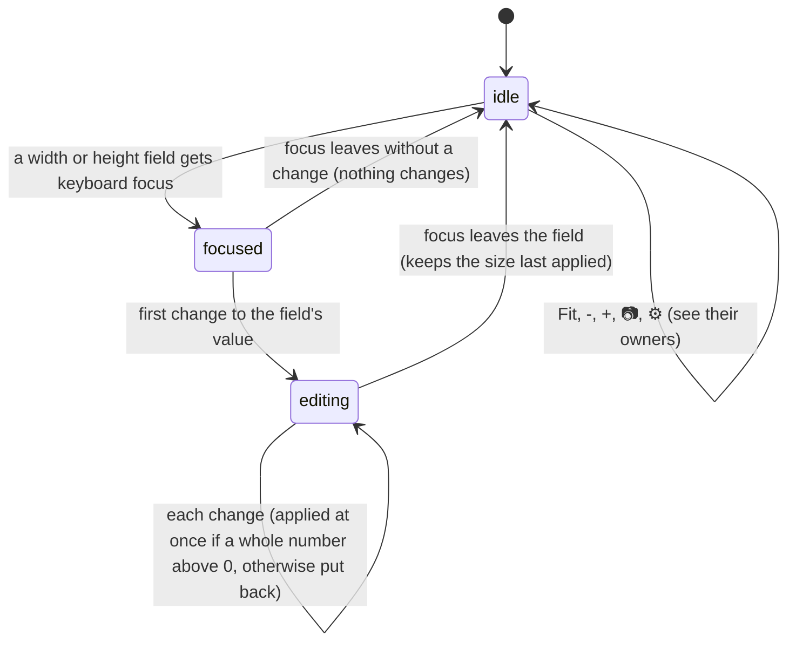

# The stage toolbar

## Summary

The stage toolbar is the small bar of controls that act on how the composition is shown in the stage rather than on what it plays: the [canvas size](../glossary.md#the-preview) (a preset menu and width and height fields), the [stage view](the-stage-view.md)'s Fit and zoom buttons, the snapshot button, the [transparency grid](../glossary.md#the-stage-view) and [safe-area guides](../glossary.md#the-stage-view) toggles, and the button that opens Composition Settings. It sits in the bottom-right corner of the [stage](../glossary.md#the-workspace), 16 pixels from its edges, on a dark grey strip with rounded corners, and stays there while the composition is panned and zoomed. It is always shown, whether or not a composition is open or [connected](../glossary.md#the-preview). Its one shortcut is ', which toggles the safe-area guides. This document owns the canvas size controls, the grid and guide toggles, and the toolbar as a whole; Fit and zoom belong to [the stage view](the-stage-view.md), the snapshot to [snapshots and job specs](../output/snapshots-and-job-specs.md), and the dialog behind ⚙️ to [composition settings](../compositions/composition-settings.md). The canvas size is not [remembered](../glossary.md#persistence); the grid and the guides are.

## The controls

From left to right, with thin vertical separators between the groups:

| Control | Tooltip | What it does |
| --- | --- | --- |
| Preset menu | None | Sets the canvas size to one of five presets: "1080p (1920x1080)", "Portrait (1080x1920)", "Square (1080x1080)", "4K (3840x2160)", "720p (1280x720)". Shows the matching preset, or "Presets" when the size matches none. |
| Width field, "x", height field | "Width", "Height" | The canvas width and height in composition pixels, 50 pixels wide each. Every change that leaves a whole number above zero applies at once. |
| Fit | "Fit to Screen" | Zoom 100%, centered. See [the stage view](the-stage-view.md#ending-at-once). |
| - | "Zoom Out" | Divides the zoom by 1.25. See [the stage view](the-stage-view.md#ending-at-once). |
| The zoom percentage | None | The stage zoom, rounded to a whole percent. Plain text. |
| + | "Zoom In" | Multiplies the zoom by 1.25. See [the stage view](the-stage-view.md#ending-at-once). |
| 📷 | "Take Snapshot" | Downloads the current frame as a PNG. See [snapshots and job specs](../output/snapshots-and-job-specs.md). |
| 🏁 | "Toggle Transparency Grid" | Shows or hides the checkerboard behind the composition. On by default. Lighter background while on. |
| # | "Toggle Safe Area Guides (')" | Shows or hides the safe-area guides over the composition. Off by default. Lighter background while on. |
| ⚙️ | "Composition Settings" | Opens the Composition Settings [dialog](../foundations/the-workspace.md#dialogs). |

The buttons are white symbols with no border and no hover highlight; the pointer becomes a hand over them. The two toggles show their state only by their background: a lighter grey while on, none while off.

## The simple case

The user opens the preset menu and chooses "Portrait (1080x1920)". The player becomes 1080 pixels wide and 1920 tall at once, the width and height fields show 1080 and 1920, and the composition lays itself out at the new size: one that sizes itself to its window, like `simple-canvas-animation`, redraws to fill it; one drawn at a fixed size, like a Title explainer composition, is stretched to fit. Playback, the playhead, and the input props do not change. Server-side renders, client-side exports, and job specs started from now on are made at 1080 by 1920 (see [Rendering and export](#interactions-with-other-systems)). Nothing is saved: opening a composition, or reloading the page, puts the canvas size back to the width and height in the composition's metadata.

The user presses ' (or clicks #). Dashed frames and a crosshair appear over the composition; pressing ' again hides them. Clicking 🏁 replaces the checkerboard around the composition with plain dark grey; clicking it again brings the checkerboard back. Both choices are remembered for every composition and survive a reload.

## The interaction, event by event

The toolbar holds three kinds of control. The buttons and ' are complete interactions on their own and always end at once. The preset menu ends at once when an item is chosen. The width and height fields are inline fields: they become ongoing at the first change and apply every change as it is typed, so there is nothing left to commit when they are left.

### Starting

**A button** acts on a left click. The press also starts a stage pan, as a press anywhere in the stage does, and moves keyboard focus onto the button (see [the stage view](the-stage-view.md#starting) and [the input model](../foundations/input-model.md#presses-and-keyboard-focus)).

**The preset menu** opens the browser's own drop-down list on a click. The list shows "Presets" (dimmed, not choosable), the five presets, and, only when the current size matches no preset, "Custom" at the bottom. The menu takes keyboard focus, so Studio's shortcuts are ignored until focus moves elsewhere (see [the input model](../foundations/input-model.md#keyboard-focus-and-who-receives-a-key)).

**A width or height field** takes keyboard focus on a click or with Tab. It shows the canvas size in effect at that moment, and keeps following it: if the canvas size changes from elsewhere while the field has focus (a composition opens, the Props Editor auto-saves), the field shows the new number at once. Nothing is recorded when the field is focused, so there is no earlier value for Studio to go back to.

**The ' key** acts when the key goes down, anywhere on the page, unless a text field has focus. It is listed in [the shortcut map](../foundations/input-model.md#the-shortcut-map).

### Ending at once

**🏁** turns the transparency grid on or off. On, the stage's background behind and around the composition is a checkerboard of 10-pixel squares in two dark greys; off, it is plain dark grey. The checkerboard belongs to the stage, not to the composition: it does not move or scale when the composition is panned or zoomed. The choice is remembered at once.

**# and '** show or hide the safe-area guides, and the choice is remembered at once. The guides are drawn at the canvas size and pan and zoom with the composition:

- an action-safe frame inset 5% from each edge, a dashed cyan line at half opacity;
- a title-safe frame inset 10% from each edge, a dashed yellow line at half opacity;
- a crosshair of two dashed white lines through the middle, one across and one down.

The lines are one composition pixel wide, so they thin out as the zoom goes down. They let every press through to the composition beneath. With no composition open, the setting changes but nothing is drawn. Read from the code, the guides are placed from the top-left corner of the stage rather than from the composition's own corner, so they line up with the composition only when the canvas size equals the stage's size (see [Open questions](#open-questions-and-verification)).

**Choosing a preset** sets the canvas size to that preset's width and height at once: the player resizes around its center, the fields show the new numbers, and the menu shows the preset. Choosing the preset already shown does nothing. Choosing "Custom" does nothing: the menu goes back to showing "Presets" and the size stays as it was.

**Fit, -, and +** change the stage view; see [the stage view](the-stage-view.md#ending-at-once). **📷** starts a snapshot; see [snapshots and job specs](../output/snapshots-and-job-specs.md). **⚙️** opens Composition Settings; with no composition open nothing appears, but the dialog then opens by itself as soon as a composition is opened (see [the workspace](../foundations/the-workspace.md#edge-cases)).

**A size field left without a change** changes nothing.

None of these can be undone except by doing them again.

### Becoming ongoing

A width or height field becomes ongoing at the first change to its value: a typed or deleted digit, a paste, or a click on the small step arrows Chromium shows in the field. ↑ and ↓ do not step it, because Studio cancels their browser action everywhere (see [keys Studio cancels everywhere](../foundations/input-model.md#keys-studio-cancels-everywhere)). There is no threshold and nothing is fixed at this moment; the other dimension stays as it is, because width and height are not linked.

### While ongoing

On every change, Studio reads the field as a whole number. If it is a whole number above zero, it becomes the canvas width (or height) at once: the player resizes, the composition lays itself out again, the guides follow, and the preset menu shows the matching preset or "Presets". Anything else is refused and the field puts back the size in effect at once. An empty field, 0, and a minus sign are refused, so the field can never be emptied; read from the code, a decimal point is removed as soon as it is typed.

Because every accepted change applies at once, typing a new size goes through every number on the way. Selecting 1920 and typing 1280 makes the composition 1, then 12, then 128, then 1280 pixels wide, each for as long as the next keystroke takes. Deleting digits from 1920 with Backspace gives 192, then 19, then 1, and the last Backspace is refused. The step arrows change the size by one pixel per click. There is no upper limit.

Everything else keeps running: playback continues, the composition is resized under the playhead without being reloaded, and the timeline keeps updating. Studio's shortcuts are ignored while the field has focus (except Ctrl/Cmd+K), so Space types nothing and does not play.

### Finishing

Leaving the field, with Tab or a press anywhere else, ends the edit with the size last applied. Enter does nothing, and Escape does not put the old size back. Nothing is written to the project and nothing is remembered: the canvas size lasts until Studio's copy of the composition changes or the page reloads, and is then replaced by the width and height in the composition's metadata.

Studio's copy changes when a composition is opened (from the Compositions panel, the Omnibar, or by creating, duplicating, or renaming one; deleting the active one would too, if a delete from the page ever reached the server), when Composition Settings is saved, when the Props Editor auto-saves the input props, and when a thumbnail is set from the current frame. A composition without metadata keeps whatever canvas size was in effect, so a size typed for one composition carries over to the next one opened if that one has no `composition.json` (see [the project and compositions](../foundations/project-and-compositions.md#composition-metadata)).

## Modifiers

| Modifier | Set at the start | Changed while ongoing |
| --- | --- | --- |
| Shift | Buttons and the preset menu: no effect. Shift+' types " on a US layout, so it does not toggle the guides; on a layout where ' needs Shift, Shift+' is the shortcut. In a size field, no effect beyond what the browser does with the key. | No effect. |
| Ctrl/Cmd | Buttons: no effect on Windows and Linux; on a Mac, Control+click is a right click and does not press the button. Ctrl/Cmd+' toggles the guides, because Studio ignores modifiers on this key. Ctrl/Cmd and the wheel over the toolbar zoom the stage (see [the stage view](the-stage-view.md#ending-at-once)). In a size field, Ctrl/Cmd+A selects the number and Ctrl/Cmd+V pastes, which applies if the pasted text is a whole number above zero. | No effect. |
| Alt/Option | Buttons and the menu: no effect. Alt+' toggles the guides on Windows and Linux; on a Mac, Option+' types another character and does nothing. | No effect. |
| Keyboard focus | ' is ignored while a text field has focus, including the toolbar's own preset menu and size fields. With the player focused, ' toggles the guides; the player does nothing with it. The buttons can be reached with Tab. After the preset menu or a size field has been used, focus stays in it, so Space and ← and → act on that control (opening the menu, changing its choice on Windows and Linux, moving the caret) instead of playback, and ↑ and ↓ do nothing (see [the input model](../foundations/input-model.md#keys-inside-fields-and-dialogs)). | Focus leaving a size field ends the edit. |
| Playback | No effect. Every control works while playing; a canvas size change resizes the composition without pausing it. | No effect; the composition keeps playing while it is resized. |
| Player connection | Everything except 📷 works before the player is connected; the player is resized while it loads. With no composition open, the size fields change Studio's canvas size, which the next composition opened keeps only if it has no metadata; the guides setting changes with nothing drawn; and the grid makes no visible difference, because the [empty state](../glossary.md#the-workspace) covers the whole stage with its own dark background. | No effect. A composition connecting while a size field is being edited changes nothing; a composition being opened does (see [Cancel and interrupt](#cancel-and-interrupt)). |

Studio reads no modifier during a size edit; each keystroke is read on its own.

## Cancel and interrupt

The buttons, the preset menu, and ' end at once, so the left column covers them and a size field that has focus but no change yet; the right column is a size field being edited.

| Event | Before it is ongoing | While ongoing |
| --- | --- | --- |
| Escape | No effect on the toolbar. Escape in an open preset menu closes the list without choosing, as the browser always does. | No effect. The size already applied stays, and the field keeps focus. |
| Another shortcut, click, or command | For the buttons, ', and a chosen preset, acts as usual. While a size field (or the preset menu) has focus, Studio's shortcuts are ignored except Ctrl/Cmd+K, which opens the Omnibar and takes focus, leaving the field unchanged; a click anywhere else leaves it unchanged too. | Shortcuts are ignored while the field has focus, except Ctrl/Cmd+K, which opens the Omnibar and moves focus into it, ending the edit. A click anywhere else ends the edit with the size last applied. |
| Composition switched | The canvas size becomes the new composition's metadata size, or stays as it is if it has none. The grid and the guides stay as they are; they are the same for every composition. | Switching needs the Omnibar or the sidebar, so focus leaves the field and the edit ends first; the canvas size then becomes the new composition's. |
| Window loses focus | No effect. | No effect. When the window comes back, the field still has focus and the size applied so far stays. |
| Pointer leaves the window | No effect. | No effect; typing does not depend on the pointer. |
| Server request fails or server stops | No effect; the canvas size, the grid, and the guides make no requests. ⚙️ opens its dialog without the server; saving it needs the server. | No effect. |
| Reload or tab closed | The grid and the guides are remembered and come back. The canvas size is not; it comes back as the composition's metadata size, or 1920 by 1080 if it has none. | The edited size is lost, as above. |
| Hot reload | No effect. The reloaded composition lays itself out at the current canvas size, with the same grid and guides. | No effect; the edit continues and applies to the reloaded composition. |
| Project changed on disk | No effect. A `composition.json` edited on disk is not read again, so its new width and height reach the canvas size only after a reload (see [the project and compositions](../foundations/project-and-compositions.md#when-the-project-changes-underneath-studio)). | No effect. |

After any interrupt the toolbar is idle again; there is never anything to recover, because every change applied as it was made.

## Interactions with other systems

**Files on disk.** None. The canvas size is never written to `composition.json`: changing it does not change the width and height shown in Composition Settings, and saving Composition Settings replaces it with the saved width and height. ⚙️ opens the dialog that writes the file, and 📷 writes its PNG to the browser's download folder, not the project.

**Browser storage.** The transparency grid (default on) and the safe-area guides (default off) are remembered as two values shared by every composition and every project served at the same address, written when toggled and read when the page loads. The zoom and pan are remembered as described in [the stage view](the-stage-view.md#interactions-with-other-systems). The canvas size is not remembered. See [what Studio remembers](../foundations/the-workspace.md#what-studio-remembers).

**Undo.** None. A toggle is undone by toggling again; a canvas size by typing or choosing the old one, or by reopening the composition, which goes back to its metadata size.

**Playback range and loop.** No interaction. The canvas size changes the picture, not the frames.

**Input props.** When the Props Editor's auto-save writes changed input props (a second or more after they change, while the composition is paused; never for a [clock-bound](../glossary.md#the-preview) composition), it rewrites the composition's metadata, and the canvas size goes back to the metadata's width and height, even if the user typed another one (see [the Props Editor](../props/the-props-editor.md#finishing)). A composition with input props and no `composition.json` gets one written at 1920 by 1080 by its first auto-save, and from then on opens at that size.

**Rendering and export.** The canvas size, multiplied by the Resolution Scale [render setting](../output/server-renders.md#the-render-settings) and rounded down to even numbers, is the width and height that server-side renders, client-side exports, and job specs started afterwards are made at (see [server-side renders](../output/server-renders.md), [client-side export](../output/client-side-export.md), and [snapshots and job specs](../output/snapshots-and-job-specs.md)). A snapshot is not sized by it directly: it has the size of what the [render mode](../glossary.md#rendering-and-output) captures (see [snapshots and job specs](../output/snapshots-and-job-specs.md#while-ongoing)). The grid, the guides, the zoom, and the pan never appear in anything rendered, exported, or captured.

**Notifications.** The canvas size controls and the two toggles show no toasts. 📷 shows "Snapshot saved" or "Failed to take snapshot"; the Composition Settings dialog shows its own.

**Other tabs and agents.** Each tab has its own canvas size. The grid and guides are shared remembered values: a toggle in one tab shows in another only after that tab reloads. An editor or an agent changing `composition.json` changes the canvas size only after Studio reads the file again.

**Keyboard and accessibility.** ' is the only shortcut. Every control can be reached with Tab, but read from the code the buttons cannot be pressed from the keyboard: Studio cancels Enter's and Space's browser action, and Space toggles playback instead (see [keys Studio cancels everywhere](../foundations/input-model.md#keys-studio-cancels-everywhere)). The preset menu answers Space and, on Windows and Linux, ← and →; the size fields answer typing only, not ↑ and ↓. The buttons are labeled only by their tooltips and their symbols; the preset menu has no label or tooltip. The toggles' state is shown only by a background color, and is not exposed as pressed or not pressed to assistive technology.

## Edge cases

- **The toolbar covers the composition.** It lies above the composition and the guides. The bottom-right corner of a large composition, or of one panned there, is hidden behind it, and the toolbar cannot be moved or hidden.
- **Narrow stage.** The toolbar does not wrap or shrink. In a stage narrower than the toolbar, its left end, starting with the preset menu, is cut off by the stage's left edge; when the stage shrinks to nothing (see [the workspace](../foundations/the-workspace.md#the-layout-and-its-dividers)), the toolbar goes with it.
- **The toolbar is part of the stage.** A press on any of its controls starts a pan, and the wheel over it pans the composition. Selecting the number in a size field by dragging pans the composition at the same time (see [the stage view](the-stage-view.md#edge-cases)).
- **"Custom" never shows.** When the size matches no preset, the closed menu reads "Presets", the dimmed first item, rather than "Custom". "Custom" appears only at the bottom of the open list, and choosing it does nothing.
- **Every digit is a resize.** A composition that does heavy work when its window is resized may stutter while a size is typed, and briefly draws at sizes such as 1 or 12 pixels.
- **No upper limit.** Any whole number is accepted. A size beyond what the browser can draw into a canvas may leave a canvas composition blank (see [Open questions](#open-questions-and-verification)).
- **Fixed-size compositions are stretched.** Studio only resizes the player; it does not tell the composition its new size. A composition whose drawing size is fixed in its code is stretched or squeezed to the canvas size, and keeps drawing at its own size.
- **The size snaps back.** When the auto-save writes changed input props, after Composition Settings is saved, after a thumbnail is set, and whenever a composition is opened, a size typed in the toolbar is replaced by the metadata's. If this happens while a size field has focus, the number changes under the caret.
- **The size carries over.** A composition without `composition.json` opens at whatever canvas size the previous composition left, including one typed in the toolbar.
- **No orientation swap.** There is no button to swap width and height; the Portrait preset or typing both numbers is the way.
- **Holding '.** The key repeats, so the guides flicker on and off and end in whichever state the last repeat left (see [the input model](../foundations/input-model.md#key-repeat)).
- **Faint guides.** At low zoom the one-pixel guide lines are thinner than a screen pixel and may disappear.
- **The grid does not show through the composition.** The checkerboard is drawn behind the player, and the player paints its own light grey background behind the composition's page. A composition with a transparent background therefore shows light grey, not the checkerboard; the grid is only visible around the composition (see [Open questions](#open-questions-and-verification)).

## Open questions and verification

- The safe-area guides are placed from the top-left corner of the stage, not from the composition's corner: the guide layer is positioned at the top left of the area that pans and zooms, which is as large as the stage, while the player is centered in it. Read from the code, the guides are offset from the composition by half the difference between the stage size and the canvas size, horizontally and vertically, and line up only when the two are equal. Confirm at several canvas sizes and window sizes. This may be worth treating as a bug.
- How a composition larger than the stage is laid out (cropped at the stage's edges or squeezed, the stage view's open question) also decides where the guides fall relative to it.
- The player's own light grey background sits between the transparency grid and the composition, so the grid may never show through a transparent composition. Confirm with a composition whose page has no background. If confirmed, the grid does not do what its name says, and this may be worth treating as a bug.
- Confirm that the size fields refuse an empty value, 0, a minus sign, and a decimal point and put the size back at once, and that every accepted digit resizes the composition as it is typed.
- Confirm that the closed preset menu reads "Presets" for a size that matches no preset, and that choosing "Custom" does nothing.
- Confirm that the canvas size goes back to the metadata's after the Props Editor's auto-save and after "Set from Current Frame" in Composition Settings. Whether a size typed in the toolbar should survive these is a product call.
- Confirm the toolbar is cut off on the left in a narrow stage.
- Confirm what Chromium's wheel does over a focused size field: it may step the number while the stage pans.
- Confirm what happens at very large canvas sizes (above 16384 or 32767 pixels on a side) with `simple-canvas-animation`, which sizes its canvas to its window.
- Confirm that Space on a toolbar button that has keyboard focus toggles playback and does not press the button, that Enter does nothing, and that ↑ and ↓ do not step a size field (the input model's first open question).
- Read from `Stage/StageToolbar.tsx`, `Stage/Stage.tsx`, `Stage/Stage.css`, `Stage/EmptyState.css`, `Stage/Stage.test.tsx` (the mocked toolbar's Fit, grid, guides, and settings buttons, and the ' shortcut), `hooks/useKeyboardShortcut.ts`, `hooks/usePersistentState.ts`, `context/StudioContext.tsx`, `PropsEditor.tsx`, `CompositionSettingsModal.tsx`, the player's host styles in `packages/player/src/index.ts`, `examples/simple-canvas-animation`, and `server/templates/title-explainer.ts`. No test covers the real toolbar component; not yet confirmed by hand.

Verified against helios commit `c2bfddb`
