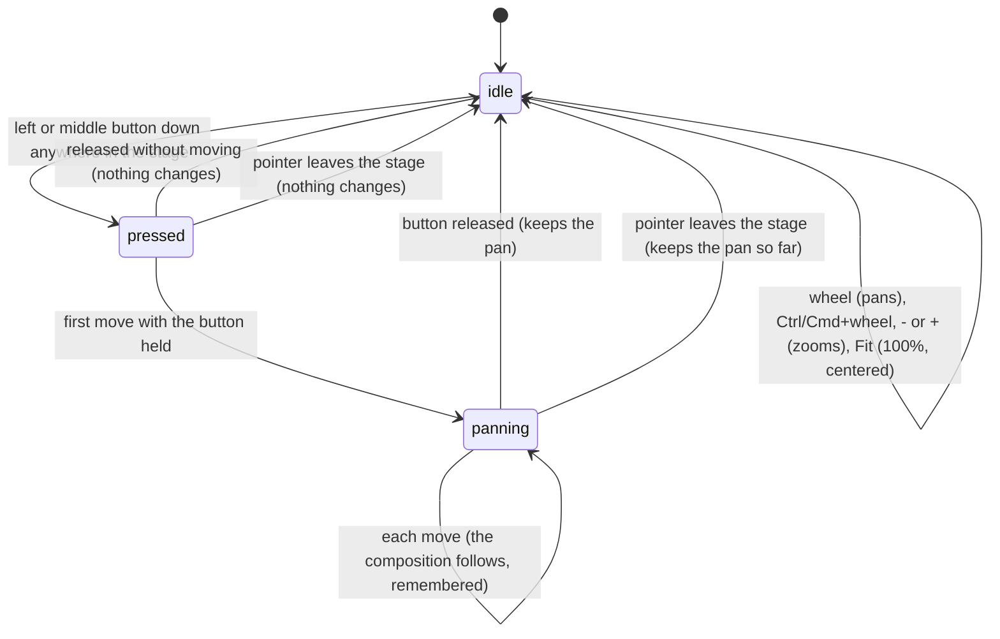

# The stage view

## Summary

The stage view is how the composition is framed in the stage: how large it is drawn (the zoom) and where it sits (the pan). It lets the user look closely at one region of a frame, or step back to see all of it, without changing the composition, the frame it shows, or anything that is rendered. It lives in the [stage](../glossary.md#the-workspace) and is reached by dragging with the left or middle mouse button anywhere in the stage, by the mouse wheel (which pans), by Ctrl/Cmd and the wheel (which zooms), and by three buttons on the stage toolbar: Fit, zoom out (-), and zoom in (+). The zoom shows as a percentage between those buttons, 100% by default. The stage view works whether or not a composition is open or connected, and it is [remembered](../glossary.md#persistence) in the browser and shared by every composition.

## The simple case

The user presses the left mouse button on the checkerboard around the composition and drags 100 pixels to the right. The composition moves with the pointer, exactly, for as long as the button is held, and stays 100 pixels right of center when the button is released. Nothing else changes: the composition keeps playing or stays paused, and the frame it shows is the same.

Turning the mouse wheel moves the composition the opposite way, as if scrolling a page: wheeling down moves it up. Holding Ctrl (Cmd on a Mac) and wheeling up makes it larger; each 100 units of wheel movement (a typical mouse notch in Chromium) adds 10 percentage points. The toolbar's + and - buttons zoom in and out by a factor of 1.25. Fit puts the composition back at 100% in the center of the stage.

The view applies to every composition: switching to another composition shows it at the same zoom and pan. After a reload the view comes back as it was left.

## The interaction, event by event

### Starting

A pan starts when the left or middle mouse button goes down anywhere inside the stage: on the checkerboard, on the composition, on the safe-area guides, on the empty state, and on the stage toolbar itself, including its buttons, its preset menu, and its width and height fields. The right button, and any other button, does nothing to the view.

At the press, Studio records where the pointer is relative to the current pan, so that the composition will keep the same offset from the pointer for the whole drag. Nothing visible changes on the press: the pointer keeps the ordinary arrow cursor, nothing is highlighted, and the composition does not move.

The press also does what a press does in the browser, because Studio does not prevent it. Keyboard focus moves: a press on the composition gives the [player](../foundations/the-preview-player.md#the-player-inside-the-stage) keyboard focus, so the player's own keys start to apply (see [the input model](../foundations/input-model.md#keyboard-focus-and-who-receives-a-key)); a press anywhere else in the stage takes focus out of any text field that had it, which commits a field that commits when left (the [timecode field](../playback/the-timeline.md#the-timecode-field), a Props Editor text box). Text in the stage cannot be selected by dragging.

The wheel, Ctrl/Cmd and the wheel, and the three toolbar buttons do not start a pan. Each of them is a complete interaction on its own (see [Ending at once](#ending-at-once)).

### Ending at once

If the button comes up before the mouse has moved, the pan does not change and nothing is remembered, because the view is only recomputed on a move. What the release does depends on where the press and release happened:

- On the checkerboard or the empty state: nothing.
- On the composition: the browser counts it as a click on the player, and the player toggles playback (or, if the composition is within one frame of its end, restarts it from frame 0 and plays). A double-click toggles playback twice and puts the player into fullscreen. See [the preview player](../foundations/the-preview-player.md#the-player-inside-the-stage).
- On a toolbar button: that button acts (Fit, zoom, snapshot, guides, transparency grid, Composition Settings).

The wheel and the toolbar buttons always end at once:

- **Wheel without Ctrl/Cmd.** The composition moves by the wheel's movement in the opposite direction, horizontally and vertically. There is no limit.
- **Ctrl/Cmd and the wheel.** The zoom changes by one thousandth of the wheel's vertical movement: wheeling up (away from the user) zooms in, down zooms out. A notch of 100 units changes the zoom by 10 percentage points. The zoom stays between 10% and 500%.
- **- and +.** The zoom is divided or multiplied by 1.25, between 10% and 500%. From 100%, + gives 125%, then 156% (shown rounded), then 195%.
- **Fit.** The zoom becomes 100% and the pan zero. This does not scale the composition to the stage's size; at 100% one composition pixel is one screen pixel, so a 1920 by 1080 composition is wider than a typical stage (see [Edge cases](#edge-cases)).

Zoom changes grow or shrink the composition around its own center, wherever the composition has been panned to. The point under the pointer is not kept still. Each change is remembered at once.

### Becoming ongoing

The pan becomes ongoing at the first mouse move inside the stage while the button is held. There is no distance threshold: a one-pixel move counts. From this moment the offset recorded at the press is fixed for the rest of the drag. Because that offset was taken from the composition's position at the press, the composition does not jump; it starts following the pointer from where it was.

### While ongoing

On each mouse move the pan is recomputed from scratch as the pointer's position minus the offset recorded at the press, so the composition stays under the same point of the pointer however fast it moves. The pan is in screen pixels and does not depend on the zoom: at 200% a 50-pixel drag still moves the composition 50 pixels. There are no bounds; the composition can be dragged entirely out of the stage, and Fit brings it back.

Every move is remembered at once, not only the final position.

Everything else keeps running: playback continues, the timeline keeps updating, and keyboard shortcuts act on wherever keyboard focus is. Moving over the stage toolbar continues the pan. Moving out of the stage, even into the timeline panel or the inspector, ends it (see [Cancel and interrupt](#cancel-and-interrupt)).

### Finishing

Releasing the button inside the stage ends the pan where it is. Nothing is written to the project, and there is no undo step; the final pan is already remembered. The view stays as it is for every composition until the user changes it.

If the press and the release were both on the composition, the release is also a click on the player, and playback toggles even though the user was panning. If the release is on a different element from the press, there is no click.

If the pointer leaves the stage while the button is held, the pan ends at its last position. Coming back into the stage with the button still held does not resume it; a new press is needed.

## Modifiers

| Modifier | Set at the start | Changed while ongoing |
| --- | --- | --- |
| Shift | Drag: no effect. Wheel: no effect in Studio itself, but Chromium turns Shift and a vertical wheel into horizontal scrolling, so the composition moves sideways. | No effect on the drag. A Shift+wheel during a drag pans sideways as well. |
| Ctrl/Cmd | Drag: no effect; the drag pans. Wheel: zooms instead of panning. The browser may also zoom the whole page (see [Open questions](#open-questions-and-verification)). | No effect on the drag. A Ctrl/Cmd+wheel during a drag zooms while the pan continues. |
| Alt/Option | No effect. | No effect. |
| Keyboard focus | No effect on the pan or zoom. The press itself moves focus: onto the player if it lands on the composition, out of any text field otherwise. | No effect. Keys go wherever focus is. |
| Playback | No effect on the view. Playing continues during a pan; a click on the composition toggles it. | No effect. |
| Player connection | Panning and zooming work with no composition open and before the player connects. With no composition open the view changes and is remembered, but nothing visible moves, because the empty state stays centered. Before connection a click on the composition does nothing to playback. | No effect. |

Studio reads the modifier keys only from the wheel event itself, so pressing or releasing a key between two wheel movements simply changes what the next movement does. Modifiers are never read during a drag.

## Cancel and interrupt

| Event | Before it is ongoing | While ongoing |
| --- | --- | --- |
| Escape | No effect. | No effect. The pan continues; Escape does not put the composition back where it was. |
| Another shortcut, click, or command | Shortcuts act as usual (Space toggles playback, ' toggles the safe-area guides). | Shortcuts act and the pan continues. A shortcut that opens a dialog (Ctrl/Cmd+K, ?) covers the stage with the dialog's overlay, and the next move ends the pan where it is. |
| Composition switched | The new composition appears at the same zoom and pan. | Switching needs the Omnibar or the sidebar, both outside the stage or over it, so the pan ends first; the new composition appears at the same zoom and pan. |
| Window loses focus | No effect. | Studio does not notice. If the button is released in another window, the stage never sees the release, and when the pointer comes back over the stage the composition follows it with no button held, until the next click or until the pointer leaves the stage. |
| Pointer leaves the window | Leaving the stage ends the press; nothing changes. | Leaving the stage, whether into another Studio panel or out of the window, ends the pan at its last position. It does not resume on re-entry. |
| Server request fails or server stops | No effect; the view makes no requests. | No effect. |
| Reload or tab closed | Nothing to lose. | The pan up to the last move is already remembered; after the reload the composition appears there, at the same zoom. |
| Hot reload | No effect. The player reloads in place at the same zoom and pan. | No effect. The pan continues while the composition reloads. |
| Project changed on disk | No effect. | No effect. |

After any interrupt the user is back in the ordinary stage with no pan in progress, except after the window loses focus mid-drag, where the composition can follow the pointer until the next click.

## Interactions with other systems

**Files on disk.** None. The view is never written to the project.

**Browser storage.** The zoom (default 1, shown as 100%) and the pan (default zero) are remembered as two values shared by every composition and by every project served at the same address. They are written on every change, including every mouse move of a pan, and read once when the page loads. See [what Studio remembers](../foundations/the-workspace.md#what-studio-remembers).

**Undo.** There is none. Fit is the only way back, and it goes to 100% and centered, not to the previous view.

**Playback range and loop.** No interaction.

**Input props.** No interaction.

**Rendering and export.** None. Server-side renders, client-side exports, snapshots, and thumbnails are made from the composition at the canvas size, whatever the zoom and pan, and do not include the safe-area guides or the transparency grid.

**Notifications.** None.

**Other tabs and agents.** Each Studio tab keeps its own view while it is open. Every change writes the shared remembered values, so a tab that is reloaded picks up the view last changed in any tab.

**Keyboard and accessibility.** There is no keyboard way to pan, and no shortcut for zoom or Fit. The toolbar buttons can be reached with Tab and pressed with Enter; they are labeled only by their tooltips ("Fit to Screen", "Zoom Out", "Zoom In"). The zoom percentage is plain text. There is no grab cursor while panning.

## Edge cases

- **Fit is not "fit to stage".** It means 100% and centered. A composition larger than the stage at 100% does not fit; how it is shown then (cropped at the stage's edges, or squeezed) depends on how the player is laid out and has to be confirmed by hand.
- **Mixed zoom steps.** The wheel adds a fixed amount and the buttons multiply, so mixing them gives uneven percentages: 110% from the wheel, then + gives 137.5%, shown as 138%.
- **The limits.** At 10% the - button and Ctrl/Cmd+wheel down do nothing more; at 500% the + button and Ctrl/Cmd+wheel up do nothing more. The pan has no limits.
- **Dragging from a toolbar control.** A press on a toolbar button, the preset menu, or a size field starts a pan like a press anywhere else. Pressing + and dragging pans; releasing back on + also zooms in, because press and release were on the same button. Selecting text in a size field by dragging pans the composition at the same time.
- **Nothing visible to pan.** With no composition open, dragging and wheeling change the remembered view without any visible effect; the next composition opened appears wherever that left it, possibly off-screen.
- **Lost composition.** A large wheel movement or a long drag can leave the composition entirely outside the stage. Only Fit (or panning back) recovers it.
- **Resizing the stage.** The pan is measured from the stage's center, so when the window or a [panel divider](../foundations/the-workspace.md#the-layout-and-its-dividers) changes the stage's size, the composition stays at the same offset from the new center.
- **Soft pictures at high zoom.** Zoom enlarges the picture on screen; the composition is not redrawn at a higher resolution. A composition drawn on a canvas looks soft above 100%.
- **Trackpads.** A two-finger scroll pans in both directions at once. A pinch arrives in Chromium as Ctrl and the wheel, so it zooms the stage.
- **Wheel units in other browsers.** Studio uses the wheel's raw movement. Chromium reports about 100 units per mouse notch; a browser that reports lines instead would pan and zoom far less per notch. This description covers Chromium only.
- **Same view everywhere.** A portrait composition and a landscape one share one zoom and pan, so switching between compositions of very different sizes can leave the second one too large or too small.

## Open questions and verification

- Ctrl/Cmd and the wheel: Studio tries to stop the browser from also handling the wheel, but the code registers its wheel handler in a way that cannot stop the browser (React attaches wheel listeners as passive). On Windows and Linux, Ctrl and the wheel is likely to zoom the whole Studio page as well as the stage; a pinch on a Mac may zoom the page too. This may be worth treating as a bug rather than documenting.
- A drag that starts and ends on the composition toggles playback when it ends, because the player's click layer sees a click. A user panning by grabbing the picture will start or stop playback by accident. This looks like a bug, or at least a product call (should a pan suppress the click?).
- Fit does not fit. Confirm what a 1920 by 1080 composition looks like at 100% in a stage narrower than 1920 pixels: cropped, squeezed, or letterboxed.
- Confirm that pressing on the composition gives the player keyboard focus (the player element is focusable), so that keys such as F, M, and the digits start acting on the player after a pan.
- Confirm the "sticky pan" after the window loses focus mid-drag and the button is released elsewhere.
- Confirm whether a middle-button press also starts the browser's autoscroll on Windows, since Studio does not prevent it.
- Confirm that a canvas-drawn composition looks soft above 100%.
- Confirm that Shift and a vertical wheel pans sideways in Chromium on each platform; Studio itself does nothing special with Shift.
- Read from code and `Stage.test.tsx` (zoom with Ctrl and the wheel, pan by drag, pan with the middle button, right button ignored, pan with the wheel, the ' shortcut) and not yet confirmed by hand: the exact zoom steps, the 10% and 500% limits, and that every move is remembered.

Verified against helios commit `c2bfddb`
